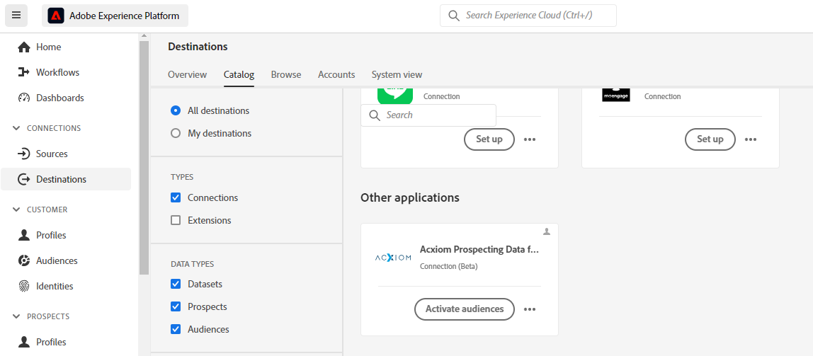
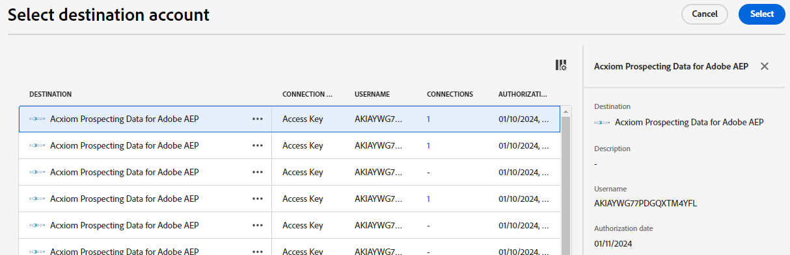
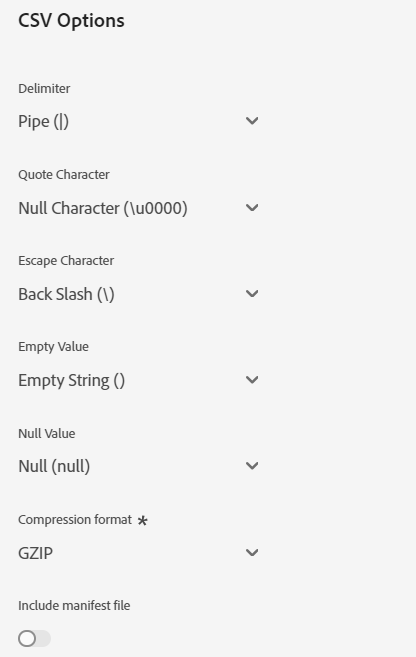
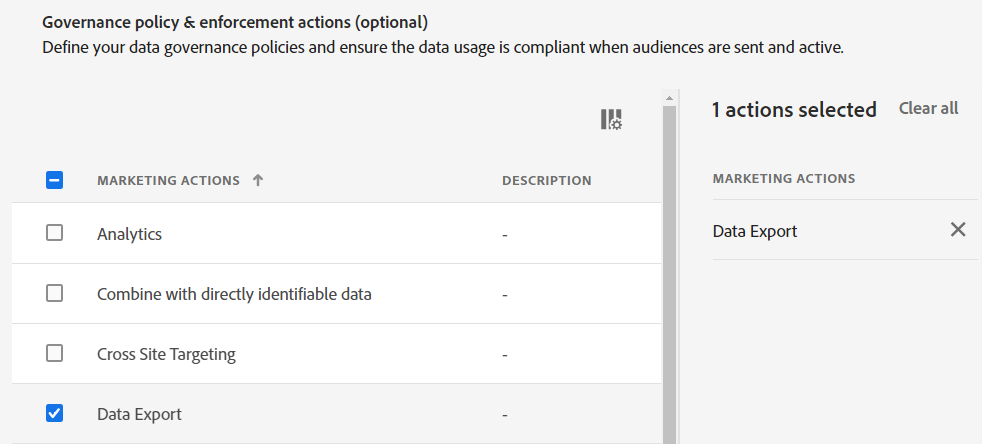
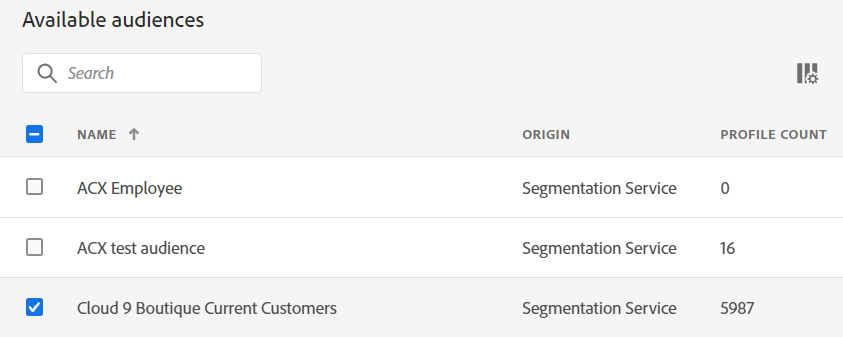
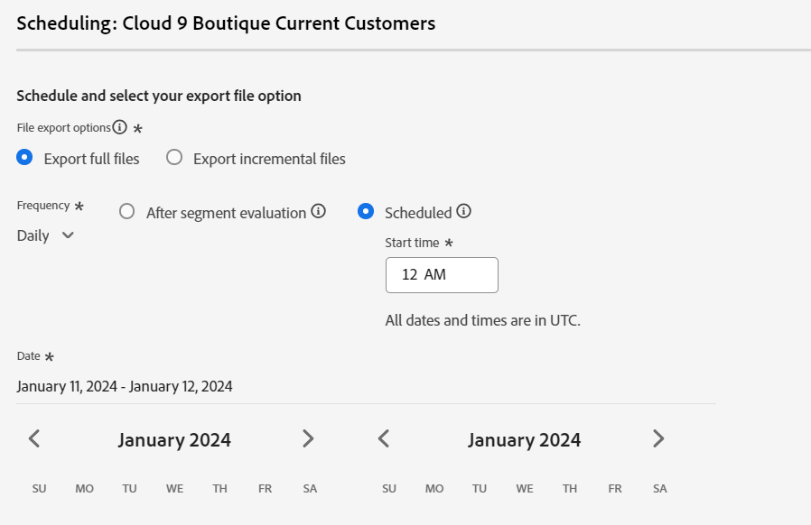
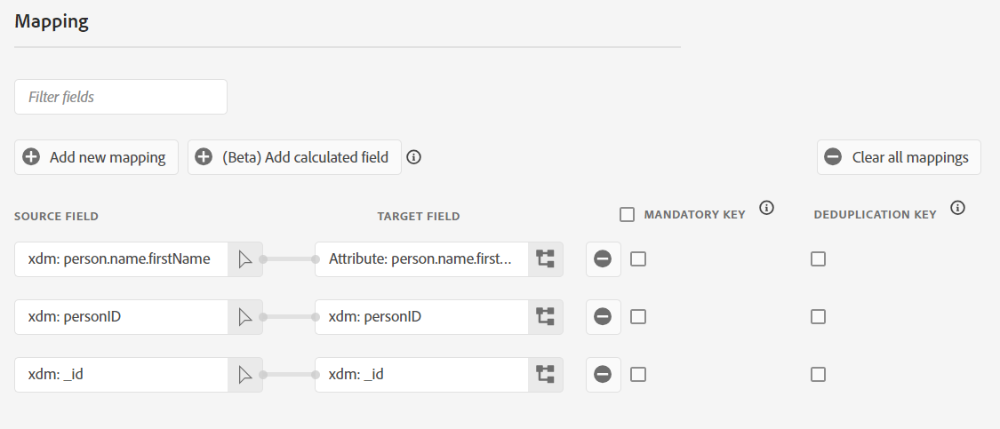

# Create a [!DNL Acxiom Prospect-Suppression Data Enhancement] destination connection and dataflow in the UI

>[!NOTE]
>
>The [!DNL Acxiom Prospect-Suppression Data Enhancement] destination is in beta.

This tutorial provides steps to create a [!DNL Acxiom Prospect-Suppression Data Enhancement] destination connection and dataflow using the Adobe Experience Platform user interface.  This Connector is used to retrieve and map response from Acxiom prospect service using S3 as a drop point.

## Get started

Connector used to send data to the Acxiom prospect service using S3 as an drop point.  This is available as a destination connector, currently listed under the "Other Applications" heading.  Initial runs will provide a "Set up" option as the default behavior.  After the initial destination is defined this will default to "Activate audiences" which will provide a list of existing dataflow to add audiences or “configure new destination” button to create a new destination dataflow.  Additional accounts can be created using the "..." to expand the allowed actions, we can add new destination, view the existing dataflows and existing account, and view the documentation.

>[!IMPORTANT]
>
>To connect to the destination, you need the **[!UICONTROL View Destinations]** and **[!UICONTROL Manage Destinations]** [access control permissions](/help/access-control/home.md#permissions). Read the [access control overview](/help/access-control/ui/overview.md) or contact your product administrator to obtain the required permissions.

## Configuring a new destination

* **Existing Account** -  Accounts already defined using the Prospecting Data for Adobe AEP card will appear here for reuse.  These will appear in a list pop-up and when selected provides details on the account
   

* **New Account** - Define a new Acxiom Managed S3 location
  * **Connection type**
    * **Enter Acxiom authentication key (Required)** - Acxiom provided value used for account approval.  This will be a must match the proper value before connection to the database can be made.  The value must be 24 characters and can only include characters A-Z, a-z, 0-9.
    * **S3 access key (Required)** - Reference to Amazon S3 location, provided by admin when S3 role permissions are defined.  Must be equal to 20 characters and can only include characters A-Z and numbers 2-7.
    * **S3 secret key (Required)** - Reference to Amazon S3 location, provided by admin when S3 role permissions are defined.  Must be equal to 40 characters and can only include characters A-Z, a-z, 0-9, +, \ and / .
    * **Connect to destination** - Will use the provided authorization keys to connect to the S3 service to validate access.  Success will allow configuration of the destination details while failure will be indicated on the UI.

## Destination Details ##
Overview of target file location

   
* **Name (Required)** - The name the destination will be saved under
* **Description** -  Short explanation of the destination's purpose
* **Bucket Name (Required)** - Name of the S3 bucket set up on S3
* **Folder Path (Required)** - If subdirectories in a bucket are used a path must be defined, or '/' to reference the root path.
* **File Type** - Currently the only file type Acxiom processing will be expecting is CSV
* **CSV Options**
  * **Delimiter** - Field delimiter used for the file.  Options include:
    * **Pipe** (|)
    * **Semicolon** (;)
    * **Tab** (\t)
    * **Colon** (:)
    * **Comma** (,) (Default)
  * **Quote Character** - Includes the selected quote value around all columns in the resulting file.  Options include:
    * **Null Character** (\u0000) (Default)
    * **Double Quotes** (")
  * **Escape Character** - When fields include characters that may interfere with the delimiters or quotes such as double quotes or commas, an escape character would need to be provided so they can be properly evaluated during import.  This value indicates what that escape character should be.  Values include:
    * **Single Quote** (')
    * **Back Slach** (\) (Default)
  * **Empty Value** - If the value does not exist on the source this indicates the value that should stand in for that missing value.  Options include:
    * **Empty String** () (Default)
    * **Null** (null)
    * **Empty String in Double Quotes** ("")
  * **Null Value** - If the value does exist, but the value is a null value this indicate how that should be represented on the file.  Options include:
    * **Empty String** ()
    * **Null** (null) (Default)
    * **Empty String in Double Quotes** ("")
  * **Compression Format** - Specifies if the resulting file will be compressed or not.  Current option include GZIP, and None
  * **Include manifest file** -  This Boolean option appears only when the GZIP option is selected.  When selected a file outlining details on the file included in the zip file is provided.
   

* **Alerts** - Adobe Experience Platform can produce event-based alerts which users can subscribe to, these options all a running dataflow to trigger these.  [alert overview](../../../observability/alerts/overview.md)
  * **Destination Flow Run Delay** - Issues an alert when the dataflow takes longer than 150 seconds to run.
  * **Destination Flow Run Failure** - Issues an alert when the dataflow ends with a failure status.
  * **Destination Flow Run Success** - Issues an alert when the dataflow ends without error.
  * **Destination Flow Run Start** - Issues an alert when the dataflow starts.
  * **Activation Skipped Rate Exceeded** - Issues an alert when the ratio of failed to all records exceed 0.5%

## Activate audiences to this destination {#activate}

>[!IMPORTANT]
>
>* To activate data, you need the **[!UICONTROL View Destinations]**, **[!UICONTROL Activate Destinations]**, **[!UICONTROL View Profiles]**, and **[!UICONTROL View Segments]** [access control permissions](/help/access-control/home.md#permissions). Read the [access control overview](/help/access-control/ui/overview.md) or contact your product administrator to obtain the required permissions.
>* To export *identities*, you need the **[!UICONTROL View Identity Graph]** [access control permission](/help/access-control/home.md#permissions).   {width="100" zoomable="yes"}

Read [Activate profiles and audiences to streaming audience export destinations](/help/destinations/ui/activate-segment-streaming-destinations.md) for instructions on activating audiences to this destination.

## Data Governance Policy and Enforcement Action ##
Option to select data governance policy  [alert overview](../../../data-governance/home.md)
   

## Audience Selection ##
Selecting an audience defines what data will be selected from the datalike and posted.  An audience would be defined for the account prior destination configuration [account definition](../../../segmentation/ui/account-audiences.md)
   

## Scheduling ##
Defines when the dataflow should be run.
* **File Export Options** - Defines if there should be a full export of the file, or should only include records that have been updated since the last run.  In either case the first run would run as a full export.
* **Frequency** - Indicates how often the flow should be run hourly, daily.  Or simply to only run once. 
  * When the File Export Options is set as 'Export full files' this will offer the 'Once' and 'Daily', this also offers two different scheduling types
    * **After segment evaluation** - Activation runs immediately after the daily segmentation job completes. This ensures that the most up-to-date profiles are exported.
    * **Scheduled** - Activation runs at a fixed time of the day. 
  * When the File Export Options is set as 'Export incremental files' this will offer the 'Daily' and 'Hourly' with 3, 6, 8, and 12 hour increments.
* **Start Time** - The timestamp for the projected run, presented in UTC time zone.  You can also select a start and end date for the flow runs.
* **Date** - Selector to choose the interval when the export should take place. Best practice is to set your start and end date to line up with the duration of your campaigns in your downstream platforms.  When selecting an export interval, the last day of the interval is not included in the exports. For example, if you select an interval of January 4 - 11, the last file export will take place on January 10.
   

* **File Name Editing** - Allows the user to change the naming of the resulting file on S3, the options presented under this allows for a number of flow derived values, or as a custom text value entered by the user.  Acxiom should be informed of the format.  If you don’t select the Date and Time component, the file names will be static and the new exported file will overwrite the previous file in your storage location with each export.
  * **Audience name** - The name of the exported audience.
  * **Destination** - Name of the destination card itself, as it is show in the catalog with spaces replaced with underscores.
  * **Destination ID** - The ID of the destination dataflow you use to export the audience.
  * **Destination name** - The name of the destination dataflow you use to export the audience.
  * **Audience source** - The source identifier for the exported audience
  * **Audience ID** - The ID of the exported audience
  * **Organization name** - Your organization name within Experience Platform.
  * **Sandbox name** - The ID of the sandbox you use to export the audience.
  * **Date and time** - Select between adding a MMDDYYYY_HHMMSS format or a UNIX 10-digit timestamp of the time when the files are generated. Choose one of these options if you would like your files to have a dynamic file name generated with each incremental export.
  * **Custom text** - Any custom text that you want to add to the file names.

## Mapping ##

* **Add new mapping** - New fields can be appended, allowing a user to add additional target field to the destination layout
* **Add calculated field** - Allows field manipulation though scripting. [Mapping functions](../../../data-prep/functions.md)
* **Clear all mapping** - Resets the mapping, removing all entries.
* **Filter fields** - Entering text into this field will restrict the existing map fields, showing only those that contain that substring.
* **Mandatory Key** - Fields that all exported records must include.  Records without data in the given field would be omitted for the export.
* **Deduplication Key** - Allows the elimination of records the represent the same data
   

## Review ##
This presents a file overview of the options selected before submission
   

## Data usage and governance {#data-usage-governance}

All [!DNL Adobe Experience Platform] destinations are compliant with data usage policies when handling your data. For detailed information on how [!DNL Adobe Experience Platform] enforces data governance, read the [Data Governance overview](/help/data-governance/home.md).

## Additional resources {#additional-resources}

*Acxiom Audience Data and Distribution:* https://www.acxiom.com/customer-data/audience-data-distribution/
