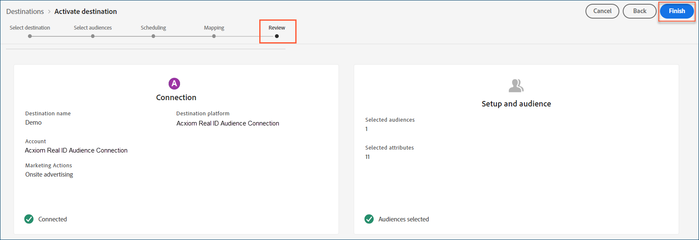

# [!DNL Acxiom Real ID&trade; Audience Connection] destination

Use the [!DNL Acxiom Real ID Audience Connection] destination to enhance audiences with [!DNL Acxiom]'s [Real ID&trade;](https://www.acxiom.com/real-id/real-id/) technology. Then activate those audiences across platforms such as [!DNL Altice], [!DNL Ampersand], [!DNL Comcast], and more.

>[!NOTE]
>
>This destination connector and documentation page are created and maintained by the [!DNL Acxiom] team. For any inquiries or update requests, contact [!DNL Acxiom] directly at [acxiom-adobe-help@acxiom.com](mailto:acxiom-adobe-help@acxiom.com).

Follow these steps to create an [!DNL Acxiom Real ID Audience Connection] destination connector using the [!DNL Adobe Experience Platform] user interface. Use this connector to build and distribute audiences to selected destinations.

## Use cases {#use-cases}

Use this destination if you have [!DNL Acxiom]'s [!DNL Real ID] loaded into [!DNL Real-Time CDP] as an identifier. The following use cases show how you can use the [!DNL Acxiom Real ID Audience Connection] destination.

### Send audiences from [!DNL Experience Platform] to your [!DNL Acxiom] account {#send-audiences}

Use this destination connector to send audiences from [!DNL Experience Platform] to your [!DNL Acxiom] account for cross-channel acquisition.

For example, the Marketing Operations department at a global financial services brand is interested in cross-channel customer acquisition through multiple advertising platforms. They can use the [!DNL Acxiom Real ID Audience Connection] destination connector to send audiences from [!DNL Experience Platform] to [!DNL Acxiom], enhance the audiences with [!DNL Acxiom]'s [!DNL Real ID] technology, and activate the audiences to multiple platforms, such as [!DNL Altice], [!DNL Ampersand], [!DNL Comcast], and more.

## Prerequisites {#prerequisites}

Before configuring the [!DNL Acxiom Real ID Audience Connection] destination, complete the following prerequisites.

* **Confirm terms of use:** Read and sign [!DNL Acxiom]'s Terms of Use Agreement. You receive the link to the agreement once your executed sales order is complete. Until you sign the agreement, the [!DNL Acxiom Real ID Audience Connection] destination card does not appear in the [!DNL Experience Platform] destination catalog. After you accept and sign the agreement, [!DNL Adobe] completes your setup and the [!DNL Acxiom Real ID Audience Connection] destination card becomes visible.
* **Know your [!DNL Adobe] organization ID:** Your [!DNL Adobe] organization ID is needed to complete your Terms of Use Agreement. See [!DNL Adobe]'s *Organizations in Experience Cloud* topic for details on how to [view your organization ID](https://experienceleague.adobe.com/en/docs/core-services/interface/administration/organizations#concept_EA8AEE5B02CF46ACBDAD6A8508646255).
* **Obtain a license for [!DNL Acxiom]'s [!DNL Real ID] product:** After you obtain a license, make [!DNL Acxiom]'s [!DNL Real ID] available within [!DNL Real-Time CDP]. See [Acxiom Data Enhancement](/help/destinations/catalog/data-partner/acxiom-data-enhancement.md) for details.

## Supported identities {#supported-identities}

[!DNL Acxiom]'s [!DNL Real ID] Audience Connection destination supports the following identity activations. Learn more about [identities](/help/identity-service/features/namespaces.md).

| Target identity | Description | Considerations |
| --------------- | ----------- | -------------- |
| [!DNL Real ID] | [!DNL Real ID] | Map a source field to this target identity. Your source field can be either an [!DNL Acxiom] [!DNL Real ID] or a custom identifier. |

{style="table-layout:auto"}

## Supported audiences {#supported-audiences}

This section describes which types of audiences you can export to this destination.

| Audience origin | Supported | Description |
| --------------- | --------- | ----------- |
| [!DNL Segmentation Service] | Yes | Audiences generated through the [!DNL Experience Platform] [Segmentation Service](/help/segmentation/home.md). |
| All other audience origins | Yes | This category includes all audience origins outside of audiences generated through the [!DNL Segmentation Service]. Read about the [various audience origins](/help/segmentation/ui/audience-portal.md#customize). Some examples include: <ul><li>custom upload audiences [imported](/help/segmentation/ui/audience-portal.md#import-audience) into [!DNL Experience Platform] from CSV files,</li><li>look-alike audiences,</li><li>federated audiences,</li><li>audiences generated in other [!DNL Experience Platform] apps such as [!DNL Adobe Journey Optimizer],</li><li>and more.</li></ul> |

{style="table-layout:auto"}

### Supported audiences by data type {#supported-audiences-data-type}

The following table describes which audience data types you can export to this destination.

| Audience data type | Supported | Description | Use cases |
| -------------------- | --------- | ----------- | --------- |
| [People audiences](/help/segmentation/types/people-audiences.md) | Yes | Based on customer profiles. Use them to target specific groups of people for marketing campaigns. | Frequent buyers, cart abandoners |
| [Account audiences](/help/segmentation/types/account-audiences.md) | No | Target individuals within specific organizations for account-based marketing strategies. | B2B marketing |
| [Prospect audiences](/help/segmentation/types/prospect-audiences.md) | No | Target individuals who are not yet customers but share characteristics with your target audience. | Prospecting with third-party data |
| [Dataset exports](/help/catalog/datasets/overview.md) | No | Collections of structured data stored in the [!DNL Adobe Experience Platform] Data Lake. | Reporting, data science workflows |

{style="table-layout:auto"}

## Export type and frequency {#export-type-frequency}

The following table describes the destination export type and frequency.

| Item | Type | Notes |
| ---- | ---- | ----- |
| Export type | **[!UICONTROL Audience export]** | Exports all members of an audience with the identifiers used in the [!DNL Acxiom Real ID Audience Connection] destination. |
| Export frequency | **[!UICONTROL Batch]** | Batch destinations export files to downstream platforms in increments of three, six, eight, twelve, or twenty-four hours. Read more about [batch file-based destinations](/help/destinations/destination-types.md#file-based). |

{style="table-layout:auto"}

## Supported destinations {#supported-destinations}

Activate audiences to the following platforms through the [!DNL Acxiom Real ID Audience Connection] destination.

* [!DNL Altice]
* [[!DNL Amazon]](#amazon)
* [!DNL Ampersand]
* [!DNL Comcast]
* [!DNL Cox]
* [[!DNL Facebook]](#facebook)
* [[!DNL LG Ads]](#lg-ads)
* [[!DNL Pinterest]](#pinterest)
* [!DNL Spectrum]
* [!DNL Viant]
* [[!DNL Vizio]](#vizio)

## Connect to the destination {#connect}

[!DNL Experience Platform] handles authentication automatically for your [!DNL Acxiom Real ID Audience Connection] destination.

>[!IMPORTANT]
>
>To connect to the destination, you need the **[!UICONTROL View Destinations]** and **[!UICONTROL Manage Destinations]** [access control permissions](/help/access-control/home.md#permissions). Read the [access control overview](/help/access-control/ui/overview.md) or contact your product administrator to obtain the required permissions.

## Destination-specific settings {#destination-settings}

Some [!DNL Acxiom Real ID Audience Connection] destinations require additional information. The following sections provide detailed guidance on how to configure these options.

### [!DNL Amazon] {#amazon}

To configure details for the destination, complete the following fields.

* **[!UICONTROL Publisher Account ID]**: Enter the publisher account ID associated with this destination.

    ![Screenshot of the [!DNL Amazon] destination details panel showing the Publisher Account ID field.](../../assets/catalog/advertising/acxiom-real-id-audience-connection/real_id_amazon_destination_details.png){zoomable="yes"}

### [!DNL Facebook] {#facebook}

To configure details for the destination, complete the following fields.

* **[!UICONTROL Destination Account ID]**: Enter the destination account ID for this destination.

    ![Screenshot of the [!DNL Facebook] destination details panel showing the Destination Account ID field.](../../assets/catalog/advertising/acxiom-real-id-audience-connection/real_id_facebook_destination_details.png){zoomable="yes"}

### [!DNL LG Ads] {#lg-ads}

To configure details for the destination, complete the following fields.

* **[!UICONTROL Segment Category]**: The target category or vertical that your segment falls into. Example: financial services, automotive, or health.

    ![Screenshot of the [!DNL LG Ads] destination details panel showing the Segment Category field.](../../assets/catalog/advertising/acxiom-real-id-audience-connection/real_id_lg_ads_destination_details.png){zoomable="yes"}

### [!DNL Pinterest] {#pinterest}

To configure details for the destination, complete the following fields.

* **[!UICONTROL Destination Account ID]**: Enter the destination account ID for this destination.

    ![Screenshot of the [!DNL Pinterest] destination details panel showing the Destination Account ID field.](../../assets/catalog/advertising/acxiom-real-id-audience-connection/real_id_pinterest_destination_details.png){zoomable="yes"}

### [!DNL Vizio] {#vizio}

To configure details for the destination, complete the following fields.

* **[!UICONTROL Advertiser Name]**: Enter the name of the advertiser for this destination.

    ![Screenshot of the [!DNL Vizio] destination details panel showing the Advertiser Name field.](../../assets/catalog/advertising/acxiom-real-id-audience-connection/real_id_vizio_destination_details.png){zoomable="yes"}

## Activate audiences to this destination {#activate}

Read [Activate audience data to batch profile export destinations](/help/destinations/ui/activate-batch-profile-destinations.md) for instructions on activating audiences to this destination.

>[!IMPORTANT]
>
>* To activate data, you need the **[!UICONTROL View Destinations]**, **[!UICONTROL Activate Destinations]**, **[!UICONTROL View Profiles]**, and **[!UICONTROL View Segments]** [access control permissions](/help/access-control/home.md#permissions). Read the [access control overview](/help/access-control/ui/overview.md) or contact your product administrator to obtain the required permissions.
>* To export *identities*, you need the **[!UICONTROL View Identity Graph]** [access control permission](/help/access-control/home.md#permissions).   {width="100" zoomable="yes"}

>[!NOTE]
>
>The [!DNL Acxiom Real ID Audience Connection] destination only supports full file exports.

### Map attributes and identities {#map}

For the [!DNL Acxiom Real ID Audience Connection] destination to correctly receive the audience data, map the source field from [!DNL Experience Platform] to the correct [!DNL Acxiom Real ID Audience Connection] target field.

The **[!UICONTROL Real ID]** target field is prepopulated automatically in the mapping step. Map your source field to it: either a custom identifier namespace or an actual [!DNL Acxiom] [!DNL Real ID] stored in your profile schema.

| Field name | Description | Required |
| ---------- | ----------- | -------- |
| [!DNL Real ID] | A [!DNL Real ID] is a unique 36-byte alphanumeric identifier from [!DNL Acxiom]'s proprietary identity resolution graph. It is an identifier that represents a person, household, or address. | Yes |

{style="table-layout:auto"}

In the **[!UICONTROL Source Field]** column, enter the name of the source attribute you want to map to the **[!UICONTROL Real ID]** target field. Or select **[!UICONTROL Select source field]** to browse available source fields. Then select **[!UICONTROL Next]**.

![Screenshot of the mapping screen showing the [!UICONTROL Source Field] column and the [!UICONTROL Select source field] panel.](../../assets/catalog/advertising/acxiom-real-id-audience-connection/real_id_mapping_screen.png){zoomable="yes"}

If you are not using [!DNL Adobe]'s standard schema, see the [Query Service UI guide](/help/query-service/ui/overview.md) to populate the [!DNL Adobe] standard schema with your field names.

### Review your destination {#review}

After you complete all the steps, review your destination connection status and audience details before activating it. The audiences you selected appear in a list. Each audience is a separate call to the [!DNL Acxiom Real ID Audience Connection] API.

When the results look correct, select **[!UICONTROL Finish]** to activate your destination.

{zoomable="yes"}

## Troubleshooting {#troubleshooting}

If your destination representative is unable to locate your audience, contact your [!DNL Adobe] representative for assistance.

Provide the following information to your [!DNL Adobe] representative:

* Audience name
* Destination name
* Audience activation date
* Exported file name

## Next steps {#next-steps}

You have successfully activated an audience to the selected destination platform. Next, contact your destination platform representative to begin setting up your campaign.

## Data usage and governance {#data-usage-governance}

All [!DNL Adobe Experience Platform] destinations are compliant with data usage policies when handling your data. For detailed information on how [!DNL Adobe Experience Platform] enforces data governance, read the [Data Governance overview](/help/data-governance/home.md).
