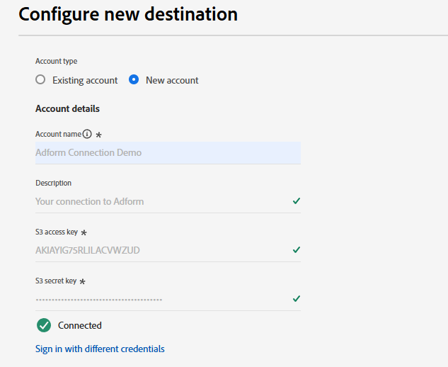

# Adform connection {#adform}

## Overview {#overview}

Adform is a leading provider of programmatic media buying and selling solutions. By connecting Adform to the Adobe Experience Platform, you can activate your first party audiences through Adform based on the Experience Cloud ID (ECID).

>[!IMPORTANT]
>
>The destination connector and documentation page are created and maintained by the Adform team. For any inquiries or update requests, please contact them directly at `support@adform.com`.

## Use cases {#use-cases}

To help you better understand how and when you should use the Adform destination, here are sample use cases that Adobe Experience Platform customers can solve by using this destination.

### Adobe Real-Time CDP audience activation {#use-case-1}

Use this destination to send Adobe Real-Time CDP audiences to Adform for activation based on the Experience Cloud ID (ECID) and Adform's ID Fusion. Adform's ID Fusion is Adform's ID resolution service that allows you to activate your first party audiences based on the Experience Cloud ID (ECID).

A common case is re-targeting of your website visitors to your website or app based on the Experience Cloud ID (ECID). All you need to do is to send the Experience Cloud ID (ECID) to Adform via the readily available [Event Streaming](https://exchange.adobe.com/apps/ec/600102/adform-s2s-site-tracking) or [client-side](https://experienceleague.adobe.com/en/docs/experience-platform/destinations/catalog/analytics/adform) Adform extensions. After that you can share audiences with Adform via the Adform destination for activation - solely based on the Experience Cloud ID (ECID).

## Prerequisites {#prerequisites}

* You need to be an existing Adform customer to use this destination.
* You need to have your Adform Audience Base Data Connection credentials.
    * If you don't have Adform Audience Base Data Connection credentials, please contact your Adform representative.
* For proper synchronization you need to either have an [Event Streaming](https://exchange.adobe.com/apps/ec/600102/adform-s2s-site-tracking) or [client-side](https://experienceleague.adobe.com/en/docs/experience-platform/destinations/catalog/analytics/adform) connection from your entities to Adform Site Tracking.
    * If you don't have an Event Streaming or client-side connection from your entities to Adform Site Tracking, please contact your Adform representative.
    * Adform provides Adobe Experience Cloud extensions for both [Event Streaming](https://exchange.adobe.com/apps/ec/600102/adform-s2s-site-tracking) and [client-side](https://experienceleague.adobe.com/en/docs/experience-platform/destinations/catalog/analytics/adform).

## Supported identities {#supported-identities}

Adform supports the activation of identities described in the table below. Learn more about [identities](/help/identity-service/features/namespaces.md).

|Target Identity|Description|Considerations|
|---|---|---|
|ECID|Experience Cloud ID|A namespace that represents ECID. This namespace can also be referred to by the following aliases: "Adobe Marketing Cloud ID", "Adobe Experience Cloud ID", "Adobe Experience Platform ID". See the following document on [ECID](/help/identity-service/features/ecid.md) for more information.|

{style="table-layout:auto"}

## Supported audiences {#supported-audiences}

This section describes which type of audiences you can export to this destination.

| Audience origin | Supported | Description | 
|---------|----------|----------|
| [!DNL Segmentation Service] | ✓ | Audiences generated through the Experience Platform [Segmentation Service](../../../segmentation/home.md).|
| Custom uploads | ✓ | Audiences [imported](../../../segmentation/ui/overview.md#import-audience) into Experience Platform from CSV files. |

{style="table-layout:auto"}

## Export type and frequency {#export-type-frequency}

Refer to the table below for information about the destination export type and frequency.

| Item | Type | Notes |
|---------|----------|---------|
| Export type | **[!UICONTROL Segment export]** | You are exporting all members of a segment (audience) with the identifiers (name, phone number, or others) used in the *YourDestination* destination.|
| Export frequency | **[!UICONTROL Batch]** | Batch destinations export files to downstream platforms in increments of three, six, eight, twelve, or twenty-four hours. Read more about [batch file-based destinations](/help/destinations/destination-types.md#file-based).|

{style="table-layout:auto"}

## Connect to the destination {#connect}

>[!IMPORTANT]
> 
>To connect to the destination, you need the **[!UICONTROL View Destinations]** and **[!UICONTROL Manage Destinations]** [access control permission](/help/access-control/home.md#permissions). Read the [access control overview](/help/access-control/ui/overview.md) or contact your product administrator to obtain the required permissions.

To connect to this destination, follow the steps described in the [destination configuration tutorial](../../ui/connect-destination.md). In the configure destination workflow, fill in the fields listed in the two sections below.

### Authenticate to destination {#authenticate}

To authenticate to the destination, fill in the required fields and select **[!UICONTROL Connect to destination]**.

* **[!UICONTROL Account name]**: Enter an account name by which you can identify this destination connection in the future..
* **[!UICONTROL S3 Access Key ID]**: Fill in the S3 Access Key provided by Adform.
* **[!UICONTROL S3 Secret Access Key]**: Fill in the S3 Secret Access Key provided by Adform.

### Fill in destination details {#destination-details}

To configure details for the destination, fill in the required and optional fields below. An asterisk next to a field in the UI indicates that the field is required.

*  **[!UICONTROL Name]**: A name by which you will recognize this destination in the future.
*  **[!UICONTROL Description]**: A description that will help you identify this destination in the future.
*  **[!UICONTROL Provider Name]**: Your Adform account name provided by Adform.

### Enable alerts {#enable-alerts}

You can enable alerts to receive notifications on the status of the dataflow to your destination. Select an alert from the list to subscribe to receive notifications on the status of your dataflow. For more information on alerts, see the guide on [subscribing to destinations alerts using the UI](../../ui/alerts.md).

When you are finished providing details for your destination connection, select **[!UICONTROL Next]**.

## Activate audiences to this destination {#activate}

>[!IMPORTANT]
> 
>* To activate data, you need the **[!UICONTROL View Destinations]**, **[!UICONTROL Activate Destinations]**, **[!UICONTROL View Profiles]**, and **[!UICONTROL View Segments]** [access control permissions](/help/access-control/home.md#permissions). Read the [access control overview](/help/access-control/ui/overview.md) or contact your product administrator to obtain the required permissions.
>* To export *identities*, you need the **[!UICONTROL View Identity Graph]** [access control permission](/help/access-control/home.md#permissions).   {width="100" zoomable="yes"}

Read [Activate audience data to batch profile export destinations](/help/destinations/ui/activate-batch-profile-destinations.md) for instructions on activating audience segments to this destination.

### Map attributes and identities {#map}

* **ECID** (Experience Cloud ID)

During the mapping step, use only the [!DNL ECID] target identity mapping. Do not include any other identity fields, as this will prevent the activation from completing successfully.

## Exported data / Validate data export {#exported-data}

The destination connector exports only the ECID identity to the destination. No other identity is exported. To check if the data export was successful, please log into your Adform Audience Base account and check if the audiences are available.

## Data usage and governance {#data-usage-governance}

All [!DNL Adobe Experience Platform] destinations are compliant with data usage policies when handling your data. For detailed information on how [!DNL Adobe Experience Platform] enforces data governance, read the [Data Governance overview](/help/data-governance/home.md).

## Additional resources {#additional-resources}

For additional information about the Adform Audience Base, see the [Adform Audience Base documentation](https://www.adformhelp.com/hc/en-us/categories/9738365991697-Data-Management-Platform).
