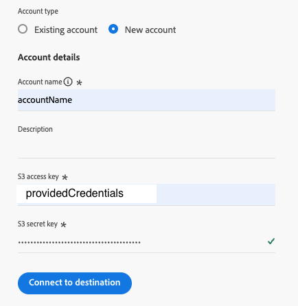
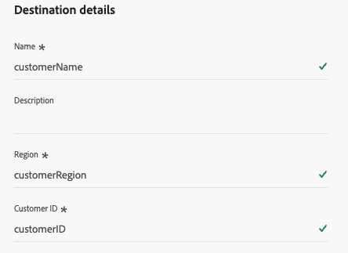
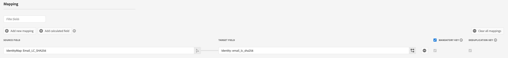

# Adhese connection {#adhese}

## Overview {#overview}

[Adhese](https://adhese.com) is an independent European advertising platform for publishers, retailers, and commerce media owners. With the Adhese destination, you can send audiences from [!DNL Adobe Experience Platform] to Adhese and use them for targeted ad delivery on Adhese-served inventory.

Audience exports are delivered as files to Adhese's secure cloud storage. For further reading, see the [Adhese documentation](https://documentation.adhese.org/books/inventory-management/page/adobe-destination-connection).

>[!IMPORTANT]
>
>This destination connector and documentation page are created and maintained by the [!DNL Adhese] team. For any inquiries or update requests, contact them directly at [Support Adhese](https://adhese.atlassian.net/servicedesk/customer/portals).

## Use cases {#use-cases}

To help you better understand how and when you should use the [!DNL Adhese] destination, here are sample use cases that [!DNL Adobe Experience Platform] customers can solve by using this destination.

### Use audience segmentation for advertising campaigns {#use-case-1}

A publisher or retailer builds first-party audiences in [!DNL Adobe Experience Platform], such as frequent readers of a content category, regular buyers of selected product categories, or loyalty program members. They send these audiences to their Adhese instance so advertisers can [target](https://documentation.adhese.org/books/inventory-management/page/targeting) them with relevant campaigns on the retailer's or publisher's own [inventory](https://documentation.adhese.org/books/inventory-management/page/the-inventorys-structure).

## Prerequisites {#prerequisites}

Before you can send audiences to Adhese, you must be onboarded as an Adhese customer. Contact your Adhese account manager or [Support Adhese](https://adhese.atlassian.net/servicedesk/customer/portals) to set up the integration. During onboarding, Adhese provides you with:

* An **Amazon S3 access key ID** and **secret access key**, used to authenticate the connection
* The **Adhese customer name** to export to
* Your active Adhese **region**

No data is shared with other Adhese customers. Your credentials grant write access exclusively to your own folder.

## Supported identities {#supported-identities}

[!DNL Adhese] supports the activation of identities described in the table below. Learn more about [identities](/help/identity-service/features/namespaces.md).

Use the identity that you also use to identify users on your website or app, so Adhese can match the exported audience members at ad-delivery time.

|Target Identity|Description|Considerations|
|---|---|---|
|GAID|Google Advertising ID|Select the GAID target identity when your source identity is a GAID namespace.|
|IDFA|Apple ID for Advertisers|Select the IDFA target identity when your source identity is an IDFA namespace.|
|ECID|Experience Cloud ID|A namespace that represents ECID. This namespace can also be referred to by the following aliases: "Adobe Marketing Cloud ID", "[!DNL Adobe Experience Cloud] ID", "[!DNL Adobe Experience Platform] ID". Read the following document on [ECID](/help/identity-service/features/ecid.md) for more information.|
|email_lc_sha256|Email addresses hashed with the SHA256 algorithm|Both plain text and SHA256 hashed email addresses are supported by [!DNL Adobe Experience Platform]. When your source field contains unhashed attributes, check the **[!UICONTROL Apply transformation]** option, to have [!DNL Experience Platform] automatically hash the data on activation.|
|extern_id|Custom user IDs|Select this target identity when your source identity is a custom namespace, for example, your own first-party user ID that is also available to Adhese at ad-delivery time.|

## Supported audiences {#supported-audiences}

This section describes which types of audiences you can export to this destination.

| Audience origin | Supported | Description |
|---------|----------|----------|
| [!DNL Segmentation Service] | Yes | Audiences generated through the Experience Platform [Segmentation Service](../../../segmentation/home.md).|
| All other audience origins | Yes | This category includes all audience origins outside of audiences generated through the [!DNL Segmentation Service]. Read about the [various audience origins](/help/segmentation/ui/audience-portal.md#customize). Some examples include: <ul><li> custom upload audiences [imported](../../../segmentation/ui/audience-portal.md#import-audience) into Experience Platform from CSV files,</li><li> look-alike audiences, </li><li> federated audiences, </li><li> audiences generated in other Experience Platform apps such as [!DNL Adobe Journey Optimizer], </li><li> and more. </li></ul> |

Supported audiences by audience data type:

| Audience data type | Supported | Description | Use cases |
|--------------------|-----------|-------------|-----------|
| [People audiences](/help/segmentation/types/people-audiences.md) | Yes | Based on customer profiles, allowing you to target specific groups of people for marketing campaigns. | Frequent buyers, cart abandoners |
| [Account audiences](/help/segmentation/types/account-audiences.md) | No | Target individuals within specific organizations for account-based marketing strategies. | B2B marketing |
| [Prospect audiences](/help/segmentation/types/prospect-audiences.md) | No | Target individuals who are not yet customers but share characteristics with your target audience. | Prospecting with third-party data |
| [Dataset exports](/help/catalog/datasets/overview.md) | No | Collections of structured data stored in the [!DNL Adobe Experience Platform] Data Lake. | Reporting, data science workflows |

## Export type and frequency {#export-type-frequency}

Refer to the table below for information about the destination export type and frequency.

| Item | Type | Notes |
|---------|----------|---------|
| Export type | **[!UICONTROL Audience export]** | You are exporting all members of an audience with the identifiers (such as ECID, hashed email, or a custom user ID) used in the [!DNL Adhese] destination.|
| Export frequency | **[!UICONTROL Batch]** | Batch destinations export files to downstream platforms in increments of three, six, eight, twelve, or twenty-four hours. Read more about [batch file-based destinations](/help/destinations/destination-types.md#file-based).|

## Connect to the destination {#connect}

>[!IMPORTANT]
>
>To connect to the destination, you need the **[!UICONTROL View Destinations]** and **[!UICONTROL Manage Destinations]** [access control permissions](/help/access-control/home.md#permissions). Read the [access control overview](/help/access-control/ui/overview.md) or contact your product administrator to obtain the required permissions.

To connect to this destination, follow the steps described in the [destination configuration tutorial](../../ui/connect-destination.md). In the configure destination workflow, fill in the fields listed in the two sections below.

### Authenticate to destination {#authenticate}

To authenticate to the destination, fill in the required fields and select **[!UICONTROL Connect to destination]**.



* **[!UICONTROL Access key ID]**: The Amazon S3 access key ID provided to you by Adhese during onboarding.
* **[!UICONTROL Secret access key]**: The Amazon S3 secret access key provided to you by Adhese during onboarding.

### Fill in destination details {#destination-details}

To configure details for the destination, fill in the required and optional fields below. An asterisk next to a field in the UI indicates that the field is required.



* **[!UICONTROL Name]**: A name by which you will recognize this destination in the future.
* **[!UICONTROL Description]**: A description that will help you identify this destination in the future.
* **[!UICONTROL Region]**: The region provided by Adhese during onboarding.
* **[!UICONTROL Customer ID]**: Your customer ID, provided by Adhese (for example `acme-corp`). This is the name of your Adhese account, used in your account URL, for example `https://acme-corp.adhese.org` or `https://acme-corp.classic.adhese.eu`.

### Enable alerts {#enable-alerts}

You can enable alerts to receive notifications on the status of the dataflow to your destination. Select an alert from the list to subscribe to receive notifications on the status of your dataflow. For more information on alerts, read the guide on [subscribing to destinations alerts using the UI](../../ui/alerts.md).

When you are finished providing details for your destination connection, select **[!UICONTROL Next]**.

## Activate audiences to this destination {#activate}

>[!IMPORTANT]
>
>* To activate data, you need the **[!UICONTROL View Destinations]**, **[!UICONTROL Activate Destinations]**, **[!UICONTROL View Profiles]**, and **[!UICONTROL View Segments]** [access control permissions](/help/access-control/home.md#permissions). Read the [access control overview](/help/access-control/ui/overview.md) or contact your product administrator to obtain the required permissions.
>* To export *identities*, you need the **[!UICONTROL View Identity Graph]** [access control permission](/help/access-control/home.md#permissions). <br> {width="100" zoomable="yes"}

Read [Activate audience data to batch profile export destinations](/help/destinations/ui/activate-batch-profile-destinations.md) for instructions on activating audiences to this destination.

### Map attributes and identities {#map}

The Adhese destination exports identities only. No profile attributes are exported.

In the **[!UICONTROL Mapping]** step of the activation workflow, select the identity namespace that you use to identify users on your website or app as the source field. The mapped identity values become the contents of the exported file. Mapping an identity is mandatory. Selecting profile attributes is not supported for this destination.



### Schedule audience export {#schedule}

In the **[!UICONTROL Scheduling]** step, configure the export schedule for each audience. By default, audiences are exported once per day as a full export. You can also select 6-hour, 8-hour, or 12-hour increments, and incremental exports after an initial full export.

### Filename configuration {#filename-configuration}

In the filename configuration, the audience ID is appended to the filename by default. You cannot change the filename, to make sure the destination runs stable.

## Exported data / Validate data export {#exported-data}

Data is exported to Adhese as CSV files, one file per audience per export. Each file contains a single column with the identity values you mapped in the activation workflow, with the identity namespace as the column header. For example:

```
ECID
14575006536349286404619648085736425115
66478888669296734530114754794777368480
```

The filename contains the destination name and the audience ID, for example:

```
Adhese_ede68175-1263-4f5b-9a1a-d6c44bd1fcb2.csv
```

To validate the integration, activate a test audience and confirm with your Adhese contact that the file arrived and the audience appears in your Adhese account. Audiences typically become available for targeting in Adhese a few minutes after the export completes.

## Data usage and governance {#data-usage-governance}

All [!DNL Adobe Experience Platform] destinations are compliant with data usage policies when handling your data. For detailed information on how [!DNL Adobe Experience Platform] enforces data governance, read the [Data Governance overview](/help/data-governance/home.md).

## Additional resources {#additional-resources}

* [Adhese documentation](https://www.adhese.com/docs/aep-destination)
* Contact Adhese support: [Support Adhese](https://adhese.atlassian.net/servicedesk/customer/portals)