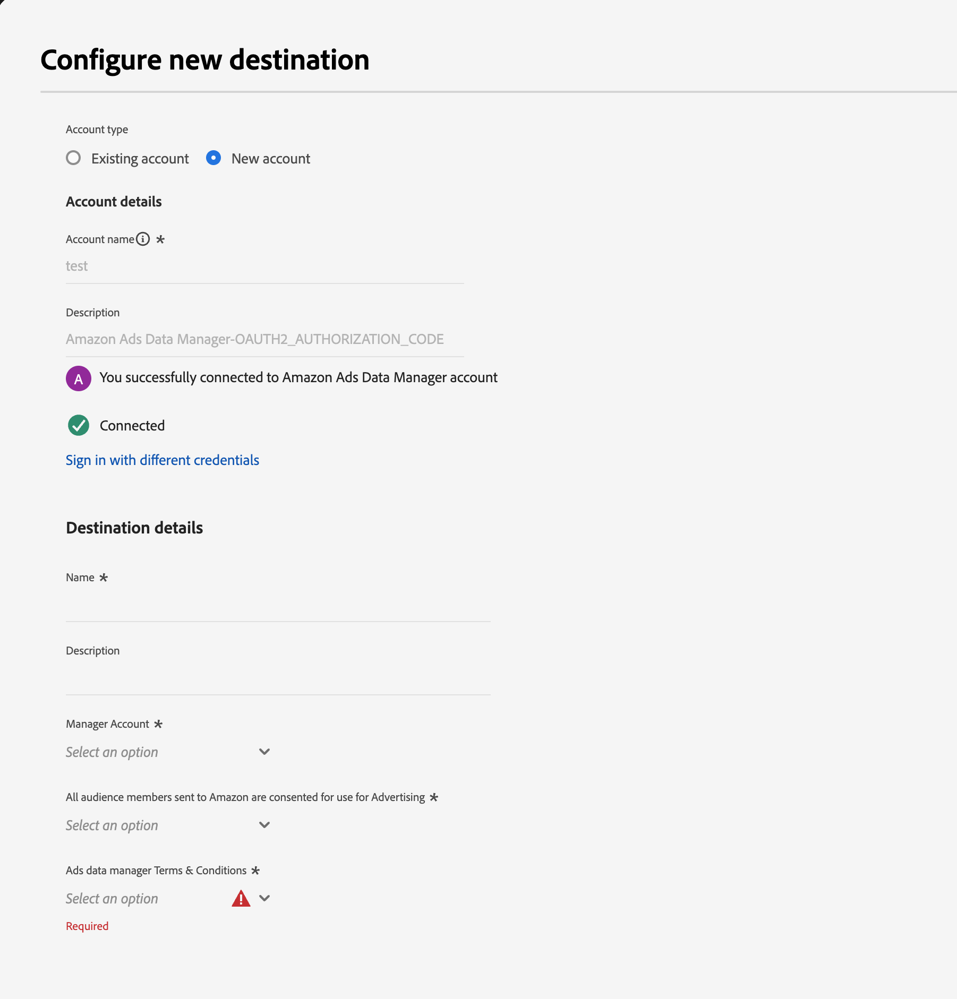

# Amazon Ads Data Manager connection {#amazon-ads-data-manager}

## Overview {#overview}

[!DNL Amazon Ads Data Manager] enables advertisers to efficiently ingest, manage, and activate audience data across Amazon Ads products.  

The [!DNL Amazon Ads Data Manager] integration with Adobe Experience Platform provides a direct connector for ingesting audience members into Amazon Ads. Once audiences are available in Ads Data Manager, you can use them within the console to share data with the **Amazon Ads**.

To learn more about the Ads Data Manager console, see:

* [Ads Data Manager — Console Overview](https://advertising.amazon.com/API/docs/en-us/adm/1_ads-data-manager-console-overview)
* [Using the Ads Data Manager Console](https://advertising.amazon.com/API/docs/en-us/adm/2_ads-data-manager-console)
* [Account setup in Ads Data Manager](https://advertising.amazon.com/API/docs/en-us/adm/2a_ads-data-manager_account_setup)

>[!IMPORTANT]
>
>This destination connector and documentation page are created and maintained by the *[!DNL Amazon Ads]* team. For any inquiries or update requests, please contact them directly at *`amc-support@amazon.com`.*

## Use cases {#use-cases}

You can use *[!DNL Amazon Ads Data Manager]* destination, for below purposes.

### Audience ingestion and activation {#activation-and-targeting}

This integration allows advertisers to send first-party audience segments from Adobe Experience Platform into [!DNL Amazon Ads Data Manager].  
Once ingested, audiences can be shared and activated across **Amazon Ads**.

### Data management and monitoring {#analytics-and-measurement}

After ingestion, you can monitor and manage uploaded data through the Ads Data Manager console — check audience ingestion status, view match rates, or delete outdated data.  

For details, see:
* [Data upload overview](https://advertising.amazon.com/API/docs/en-us/adm/3_adm-data-upload-overview)
* [Console upload workflow](https://advertising.amazon.com/API/docs/en-us/adm/4_adm-console-upload)
* [Manage data](https://advertising.amazon.com/API/docs/en-us/adm/6_adm-manage-data)

## Prerequisites {#prerequisites}

To use the [!DNL Amazon Ads Data Manager] connection with Adobe Experience Platform, you must have access to **Amazon Ads Data Manager** using a [Manager Account](https://advertising.amazon.com/help/G69CDSR9MNSWJH95).  

Refer to:
* [Get started with Amazon Ads Data Manager](https://advertising.amazon.com/API/docs/en-us/adm/1_ads-data-manager-console-overview)
* [Get started with Amazon Marketing Cloud](https://advertising.amazon.com/solutions/products/amazon-marketing-cloud)

## Supported identities {#supported-identities}

The *[!DNL Amazon Ads Data Manager]* destination supports the activation of the following identities:

|Target Identity|Description|Considerations|
|---|---|---|
|`phone_sha256`|Phone numbers hashed with SHA256|Supports plain text and SHA256 hashed. Check **[!UICONTROL Apply transformation]** to hash automatically.|
|`email_lc_sha256`|Email addresses hashed with SHA256|Supports plain text and SHA256 hashed. Check **[!UICONTROL Apply transformation]** to hash automatically.|
|`firstName`|First name of the user|Supports plain text or SHA256.|
|`lastName`|Last name of the user|Supports plain text or SHA256.|
|`street`|Street address|SHA256 hashed input only.|
|`city`|City of the user|Supports plain text or SHA256.|
|`state`|State or province|Supports plain text or SHA256.|
|`zip`|ZIP or postal code|Supports plain text or SHA256.|
|`country`|Country (2-character ISO code)|Supports plain text or SHA256.|

{style="table-layout:auto"}

## Supported external identities {#external-identities}

In addition to standard user identity fields, *[!DNL Amazon Ads Data Manager]* supports **external identity namespaces** to allow advertisers to send third-party or partner-matched identifiers.

|External Identity|Description|Considerations|
|---|---|---|
|`experianId`|Identifier assigned by Experian for audience matching.|Optional field; transmitted securely to Ads Data Manager.|
|`kantarId`|Identifier assigned by Kantar for audience matching.|Optional field; transmitted securely to Ads Data Manager.|
|`liveRampId`|Identifier assigned by LiveRamp for audience matching.|Optional field; transmitted securely to Ads Data Manager.|
|`maId`|Identifier assigned by mobile application for audience matching.|Optional field; transmitted securely to Ads Data Manager.|
|`merkleId`|Identifier assigned by Merkle for audience matching.|Optional field; transmitted securely to Ads Data Manager.|
|`neustarId`|Identifier assigned by Neustar for audience matching.|Optional field; transmitted securely to Ads Data Manager.|
|`realId`|Identifier assigned by Real ID graph for audience matching.|Optional field; transmitted securely to Ads Data Manager.|
|`sambaTvId`|Identifier assigned by Samba TV for audience matching.|Optional field; transmitted securely to Ads Data Manager.|

{style="table-layout:auto"}

>[!NOTE]
>
>All external identity fields are optional and transmitted securely to *[!DNL Amazon Ads Data Manager]* using the same encryption and hashing standards as other identity fields.

## Export type and frequency {#export-type-frequency}

| Item | Type | Notes |
| ---------|----------|---------|
| Export type | **[!UICONTROL Audience export]** | You are exporting all members of an audience with identifiers supported by *[!DNL Amazon Ads Data Manager]*.|
| Export frequency | **[!UICONTROL Streaming]** | Streaming destinations are "always on" API-based connections. Audience updates in Experience Platform are immediately sent to Ads Data Manager.|

{style="table-layout:auto"}

## Connect to the destination {#connect}

>[!IMPORTANT]
>
>To connect to the destination, you need the **[!UICONTROL View Destinations]** and **[!UICONTROL Manage Destinations]** [permissions](/help/access-control/home.md#permissions).

Follow the [destination configuration tutorial](../../ui/connect-destination.md).  
In the configuration workflow, complete the steps below.

### Authenticate to destination {#authenticate}

Select **[!UICONTROL Connect to destination]**.  
You are redirected to the [!DNL Amazon Ads Data Manager] interface, Click 'Allow' to sign into Amazon Account via Adobe Experience Platform.  
After authentication, you will return to Adobe Experience Platform with your new connection.

### Fill in destination details {#destination-details}

Provide the following information:

* **[!UICONTROL Name]**: Name for your connection.  
* **[!UICONTROL Description]**: Description to help identify it.  
* **[!UICONTROL Amazon Ads Data Manager Connection]**: Select the target manager account ID.  
* **[!UICONTROL Amazon Ads Consent Signal]**: Specify consent for data usage (`GRANTED` or `DENIED`).

>[!NOTE]
>
>Make sure to accept Amazon Ads Data Manager terms and coditions by visiting the Amazon Ads Data Manager in Amazon Ads console before clicking on **[!UICONTROL Next]**. The audience will not get created in Amazon Ads if the terms and conditions are not accepted.

### Enable alerts {#enable-alerts}

Enable alerts to monitor your dataflow status. See [Subscribing to destination alerts](../../ui/alerts.md).

When finished, select **[!UICONTROL Next]**.

## Activate audiences to this destination {#activate}

>[!IMPORTANT]
>
>* You need **[!UICONTROL View Destinations]**, **[!UICONTROL Activate Destinations]**, **[!UICONTROL View Profiles]**, and **[!UICONTROL View Segments]** permissions.  
>* To export identities, you also need **[!UICONTROL View Identity Graph]** permission.

Follow [Activate profiles and audiences to streaming destinations](/help/destinations/ui/activate-segment-streaming-destinations.md).

### Map attributes and identities {#map}

Map identity fields (email, phone, address, and external IDs) as shown below.  
This connector uses all mapped fields for matching, improving audience match rates.

* Use `Email_LC_SHA256` for hashed emails.  
* Use `Phone_SHA256` for hashed phones.  
* For unhashed data, enable **[!UICONTROL Apply transformation]**.  
* Include `countryCode` for better match rates (2-character ISO).  
* Map optional `externalIdentities` for partner identity matching.

Refer to:
* [Normalization Guide](https://advertising.amazon.com/help/GCCXMZYCK4RXWS6C)
* [Source connector details](https://advertising.amazon.com/API/docs/en-us/adm/5_adm-source-connector)

## Validate data export {#exported-data}

After activation, validate your audience ingestion in the **Ads Data Manager console**.

Navigate to:
**[!UICONTROL Audiences]** → **[!UICONTROL Uploaded Sources]**.  
Check your audience ingestion status, size, and any error logs.  

For more on validation, see:
* [Manage Data](https://advertising.amazon.com/API/docs/en-us/adm/6_adm-manage-data)
* [Destinations](https://advertising.amazon.com/API/docs/en-us/adm/7_adm-destinations)

## Data usage and governance {#data-usage-governance}

All [!DNL Adobe Experience Platform] destinations comply with data usage policies.  
See the [Data Governance overview](/help/data-governance/home.md).

## Additional resources {#additional-resources}

For additional help, visit:

* [Amazon Ads Data Manager Overview](https://advertising.amazon.com/API/docs/en-us/adm/1_ads-data-manager-console-overview)

## Changelog {#changelog}

+++ View changelog

|Release month|Update type|Description|
|---|---|---|
|January 2025|Documentation update|Added **external identity namespace support** (`experianId`, `kantarId`, `liveRampId`, `maId`, `merkleId`, `neustarId`, `realId`, `sambaTvId`).|

{style="table-layout:auto"}

+++
