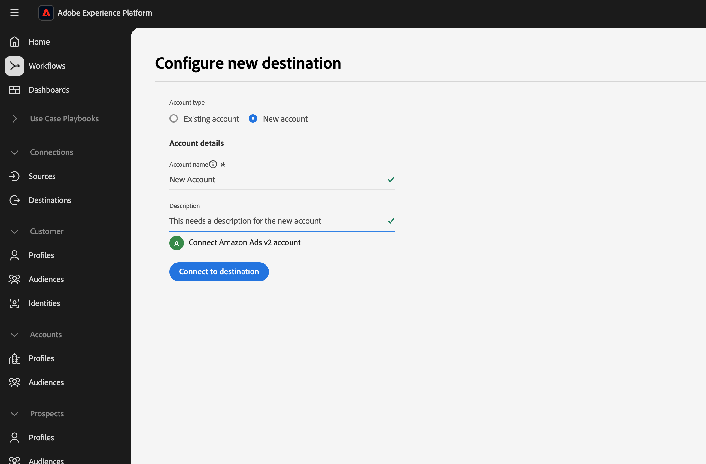
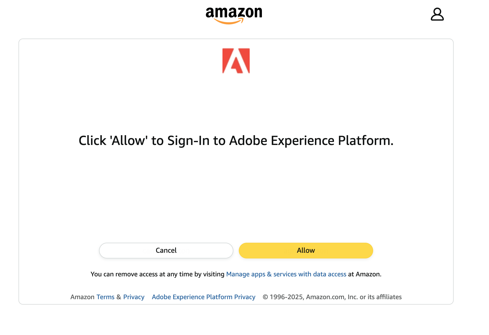
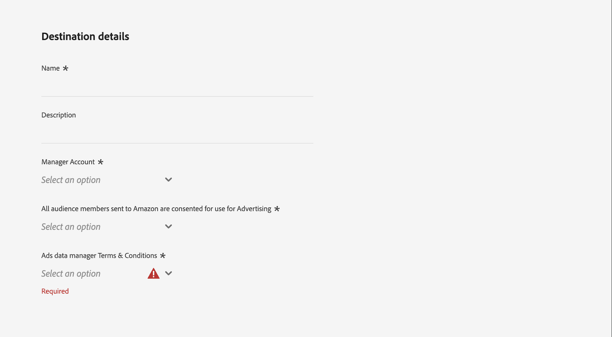
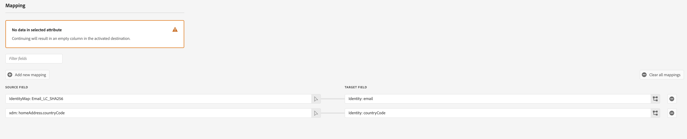

# Amazon Ads v2 connection {#amazon-ads-v2}

## Overview {#overview}

[!DNL Amazon Ads v2] enables advertisers to efficiently ingest, manage, activate and re-use audience data across Amazon Ads products.  

The [!DNL Amazon Ads v2] integration with Adobe Experience Platform provides a direct connection for ingesting audience members into Amazon Ads. The uploaded audiences are available in [!DNL Ads Data Manager (ADM)]console within [!DNL Amazon Ads]. You can use [!DNL Ads Data Manager] console to share data across different **Amazon Ads** products.

To learn more about Ads Data Manager, see:

* [Ads Data Manager — Console Overview](https://advertising.amazon.com/API/docs/en-us/adm/1_ads-data-manager-console-overview)
* [Using the Ads Data Manager Console](https://advertising.amazon.com/API/docs/en-us/adm/2_ads-data-manager-console)
* [Account setup in Ads Data Manager](https://advertising.amazon.com/API/docs/en-us/adm/2a_ads-data-manager_account_setup)

>[!IMPORTANT]
>
>This destination connector and documentation page are created and maintained by the *[!DNL Amazon Ads]* team. For any inquiries or update requests, please contact them directly at *`amc-support@amazon.com`.*

## Use cases {#use-cases}

You can use *[!DNL Amazon Ads v2]* destination, for below purposes.

### Audience ingestion and activation {#activation-and-targeting}

This integration allows advertisers to send first-party audience segments from Adobe Experience Platform into [!DNL Amazon Ads].  
Once ingested, audiences can be shared across **Amazon Ads** products via [!DNL Ads Data Manager].

### Data management and monitoring {#analytics-and-measurement}

After ingestion, you can monitor and manage uploaded data through the [!DNL Ads Data Manager] console — check audience ingestion status, view match rates, or delete outdated data.  

For details, see:
* [Manage data](https://advertising.amazon.com/API/docs/en-us/adm/6_adm-manage-data)

## Prerequisites {#prerequisites}

To use the [!DNL Amazon Ads v2] connection with Adobe Experience Platform, you must have access to **Amazon Ads Data Manager** using a [Manager Account](https://advertising.amazon.com/help/G69CDSR9MNSWJH95).  

Refer to:
* [Get started with Amazon Ads Data Manager](https://advertising.amazon.com/API/docs/en-us/adm/1_ads-data-manager-console-overview)

## Supported identities {#supported-identities}

The *[!DNL Amazon Ads v2]* destination supports the activation of the following identities.

|Target Identity|Description|Considerations|
|---|---|---|
|`phone_sha256`|Phone number of the user|Supports plain text or SHA256 hashed input. Select **[!UICONTROL Apply transformation]** to hash automatically.|
|`email_lc_sha256`|Email address of the user (lowercased)|Supports plain text or SHA256 hashed input. Select **[!UICONTROL Apply transformation]** to hash automatically.|
|`firstName`|First name of the user|Supports plain text or SHA256 hashed input.|
|`lastName`|Last name of the user|Supports plain text or SHA256 hashed input.|
|`street`|Street address of the user|Requires SHA256 hashed input.|
|`city`|City of the user|Supports plain text or SHA256 hashed input.|
|`state`|State or province of the user|Supports plain text or SHA256 hashed input.|
|`zip`|ZIP or postal code of the user|Supports plain text or SHA256 hashed input.|
|`country`|Country of the user (2-character ISO code)|Supports plain text or SHA256 hashed input.|
|`experianId`|Identifier assigned by Experian|Supports plain text input.|
|`kantarId`|Identifier assigned by Kantar|Supports plain text input.|
|`liveRampId`|Identifier assigned by LiveRamp|Supports plain text input.|
|`maId`|Identifier assigned by a mobile application |Supports plain text input.|
|`merkleId`|Identifier assigned by Merkle|Supports plain text input.|
|`neustarId`|Identifier assigned by Neustar|Supports plain text input.|
|`realId`|Identifier assigned by the Real ID identity graph|Supports plain text input.|
|`sambaTvId`|Identifier assigned by Samba TV|Supports plain text input.|

{style="table-layout:auto"}

## Export type and frequency {#export-type-frequency}

| Item | Type | Notes |
| ---------|----------|---------|
| Export type | **[!UICONTROL Audience export]** | You are exporting all members of an audience with identifiers supported by *[!DNL Amazon Ads]*.|
| Export frequency | **[!UICONTROL Streaming]** | Streaming destinations are "always on" API-based connections. Audience updates in Experience Platform are immediately sent to Ads Data Manager.|

{style="table-layout:auto"}

## Connect to the destination {#connect}

>[!IMPORTANT]
>
>To connect to the destination, you need the **[!UICONTROL View Destinations]** and **[!UICONTROL Manage Destinations]** [access control permissions](/help/access-control/home.md#permissions). Read the [access control overview](/help/access-control/ui/overview.md) or contact your product administrator to obtain the required permissions.

To connect to this destination, follow the steps described in the [destination configuration tutorial](/help/destinations/ui/connect-destination.md). In the configure destination workflow, fill in the fields listed in the two sections below.

### Authenticate to destination {#authenticate}

To authenticate to the destination, fill in the required fields and select **[!UICONTROL Connect to destination]**.
* **[!UICONTROL Name]**: Name for your connection.  
* **[!UICONTROL Description]**: Description to help identify it.

You will be redirected to the [!DNL Amazon Ads v2] interface, Click 'Allow' to sign into your Amazon Account.  
After authentication, you will return to Adobe Experience Platform with your new connection.

### Fill in destination details {#destination-details}

Provide the following information:

* **[!UICONTROL Amazon Ads Data Manager Connection]**: Select the target manager account ID.  
* **[!UICONTROL Amazon Ads Consent Signal]**: Specify consent for data usage (`GRANTED` or `DENIED`).

>[!NOTE]
>
>Make sure to accept [!DNL Ads Data Manager] terms and coditions by visiting the [!DNL Ads Data Manager] console in [!DNL Amazon Ads] before clicking on **[!UICONTROL Next]**. The audience will not get created in [!DNL Amazon Ads] if the terms and conditions are not accepted.

### Enable alerts {#enable-alerts}

Enable alerts to monitor your dataflow status. See [Subscribing to destination alerts](../../ui/alerts.md).

When finished, select **[!UICONTROL Next]**.

## Activate audiences to this destination {#activate}

>[!IMPORTANT]
>
>* You need **[!UICONTROL View Destinations]**, **[!UICONTROL Activate Destinations]**, **[!UICONTROL View Profiles]**, and **[!UICONTROL View Segments]** permissions.  
>* To export identities, you also need **[!UICONTROL View Identity Graph]** permission.

Follow [Activate profiles and audiences to streaming destinations](/help/destinations/ui/activate-segment-streaming-destinations.md).

### Map attributes and identities {#map}

Map identity fields (email, phone, address, and external IDs) as shown below.  
This connector uses all mapped fields for matching, improving audience match rates.

### Mapping best practices {#mapping-best-practices}

This section describes recommended mapping scenarios and examples to help improve audience match rates when activating data to [!DNL Amazon Ads v2].

For best results, Include countryCode for better match rates (2-character ISO).

Also, you can combine first-party identifiers (such as email or phone) with partner-provided identifiers when both are available. This allows Amazon Ads to use multiple identity signals during audience matching.

Use these identifiers only when they already exist in your source data.

Examples

* Use kantarId when activating audiences built or enriched using Kantar identity data.

* Use merkleId when your audience data originates from Merkle-managed identity solutions.

* Use neustarId when your data is linked through Neustar identity resolution.

* Use experianId for audiences enriched using Experian identity data.

* Use liveRampId when activating audiences that rely on LiveRamp identity resolution.

* Use sambaTvId when working with Samba TV–provided audience data.

These identifiers are typically provided by the respective partners as plain text identifiers and do not require hashing.

Refer to:
* [Normalization Guide](https://advertising.amazon.com/help/GCCXMZYCK4RXWS6C)

## Validate data export {#exported-data}

After activation, validate your audience ingestion in the **Ads Data Manager console**.

Navigate to:
**[!UICONTROL Audiences]** → **[!UICONTROL Uploaded Sources]**.  
Check your audience ingestion status, size, and any error logs.  

For more on validation, see:
* [Manage Data](https://advertising.amazon.com/API/docs/en-us/adm/6_adm-manage-data)
* [Destinations](https://advertising.amazon.com/API/docs/en-us/adm/7_adm-destinations)

## Data usage and governance {#data-usage-governance}

All Adobe Experience Platform destinations are compliant with data usage policies when handling your data. For detailed information on how Adobe Experience Platform enforces data governance, read the [Data Governance overview](/help/data-governance/home.md).

## Additional resources {#additional-resources}

For additional help, visit:

* [Amazon Ads Data Manager Overview](https://advertising.amazon.com/API/docs/en-us/adm/1_ads-data-manager-console-overview)

+++
