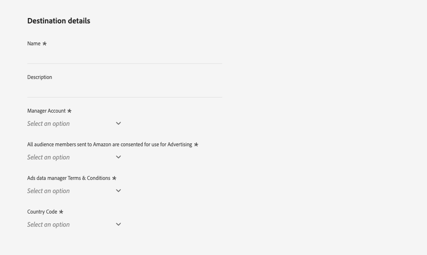
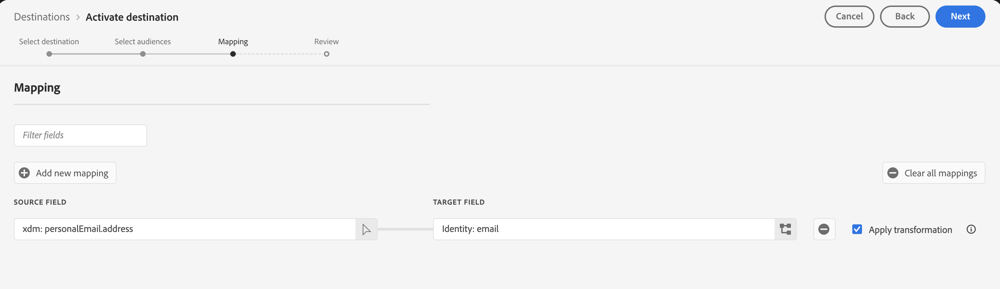

# Amazon Ads v2 connection {#amazon-ads-v2}

## Overview {#overview}

[!DNL Amazon Ads v2] enables advertisers to efficiently ingest, manage, activate and re-use audience data across Amazon Ads products.  

The [!DNL Amazon Ads v2] integration with Adobe Experience Platform provides a direct connection for ingesting audience members into Amazon Ads. The uploaded audiences are available in [!DNL Ads Data Manager (ADM)]console within [!DNL Amazon Ads]. You can use [!DNL Ads Data Manager] console to share data across different **Amazon Ads** products.

To learn more about Ads Data Manager, see:

* [Ads Data Manager — Console Overview](https://advertising.amazon.com/API/docs/en-us/adm/1_ads-data-manager-console-overview)
* [Using the Ads Data Manager Console](https://advertising.amazon.com/API/docs/en-us/adm/2_ads-data-manager-console)
* [Account setup in Ads Data Manager](https://advertising.amazon.com/API/docs/en-us/adm/2a_ads-data-manager_account_setup)

>[!IMPORTANT]
>
>This destination connector and documentation page are created and maintained by the *[!DNL Amazon Ads]* team. For any inquiries or update requests, please contact them directly at *`amc-support@amazon.com`.*

## Use cases {#use-cases}

To help you better understand how and when you should use the *[!DNL Amazon Ads v2]* destination, here are sample use cases that Adobe Experience Platform customers can solve by using this destination.

### Audience ingestion and activation {#activation-and-targeting}

An athletic apparel brand wants to reach its existing customers with relevant ads across *[!DNL Amazon Ads]*. The brand can ingest customer email addresses from its CRM into Adobe Experience Platform, build audiences using its first-party offline data, and activate these audiences to *[!DNL Amazon Ads]* through the *[!DNL Amazon Ads v2]* destination. Once activated, the audiences can be used to target ads to those customers across *[!DNL Amazon Ads]* inventory, helping the brand re-engage known customers and drive repeat purchases.

For details, see:
* [Manage data](https://advertising.amazon.com/API/docs/en-us/adm/6_adm-manage-data)

## Prerequisites {#prerequisites}

To use the [!DNL Amazon Ads v2] connection with Adobe Experience Platform, you must have access to **Amazon Ads Data Manager** using a [Manager Account](https://advertising.amazon.com/help/G69CDSR9MNSWJH95).  

Refer to:
* [Get started with Amazon Ads Data Manager](https://advertising.amazon.com/API/docs/en-us/adm/1_ads-data-manager-console-overview)

### Accept Amazon Ads Data Manager terms and conditions {#accept-terms}

Before configuring the [!DNL Amazon Ads v2] destination, you must log in to your [!DNL Amazon Ads] account and accept the [!DNL Ads Data Manager] terms and conditions. To do this, navigate to the [!DNL Ads Data Manager] console within [!DNL Amazon Ads] and accept the terms when prompted. If the terms and conditions are not accepted, audiences will not be created in [!DNL Amazon Ads].

## Supported identities {#supported-identities}

The *[!DNL Amazon Ads v2]* destination supports the activation of the following identities.

|Target Identity|Description|Considerations|
|---|---|---|
|`phone`|Phone numbers hashed with the SHA256 algorithm|Both plain text and SHA256 hashed phone numbers are supported by Adobe Experience Platform. When your source field contains unhashed attributes, check the Apply transformation option, to have Experience Platform automatically hash the data on activation.|
|`email`|Email addresses (lowercased) hashed with the SHA256 algorithm|Both plain text and SHA256 hashed email addresses are supported by Adobe Experience Platform. When your source field contains unhashed attributes, check the Apply transformation option, to have Experience Platform automatically hash the data on activation.|
|`firstname`|First name of the user|Both plain text and SHA256 hashed first names are supported by Adobe Experience Platform. When your source field contains unhashed attributes, check the Apply transformation option, to have Experience Platform automatically hash the data on activation.|
|`lastname`|Last name of the user|Both plain text and SHA256 hashed last names are supported by Adobe Experience Platform. When your source field contains unhashed attributes, check the Apply transformation option, to have Experience Platform automatically hash the data on activation.|
|`address`|Street address of the user|Both plain text and SHA256 hashed streets are supported by Adobe Experience Platform. When your source field contains unhashed attributes, check the Apply transformation option, to have Experience Platform automatically hash the data on activation.|
|`city`|City of the user|Both plain text and SHA256 hashed cities are supported by Adobe Experience Platform. When your source field contains unhashed attributes, check the Apply transformation option, to have Experience Platform automatically hash the data on activation.|
|`state`|State or province of the user|Both plain text and SHA256 hashed states are supported by Adobe Experience Platform. When your source field contains unhashed attributes, check the Apply transformation option, to have Experience Platform automatically hash the data on activation.|
|`zip`|ZIP or postal code of the user|Both plain text and SHA256 hashed zips are supported by Adobe Experience Platform. When your source field contains unhashed attributes, check the Apply transformation option, to have Experience Platform automatically hash the data on activation.|
|`countryCode`|Country of the user (2-character ISO code)|Supports plain text input.|
|`experianId`|Identifier assigned by Experian|Supports plain text input.|
|`kantarId`|Identifier assigned by Kantar|Supports plain text input.|
|`liveRampId`|Identifier assigned by LiveRamp|Supports plain text input.|
|`maId`|Identifier assigned by a mobile application |Supports plain text input.|
|`merkleId`|Identifier assigned by Merkle|Supports plain text input.|
|`neustarId`|Identifier assigned by Neustar|Supports plain text input.|
|`realId`|Identifier assigned by the Real ID identity graph|Supports plain text input.|
|`sambaTvId`|Identifier assigned by Samba TV|Supports plain text input.|

{style="table-layout:auto"}

## Supported audiences {#supported-audiences}

This section describes which types of audiences you can export to this destination.

| Audience origin | Supported | Description | 
|---------|----------|----------|
| [!DNL Segmentation Service] | Yes | Audiences generated through the Experience Platform [Segmentation Service](../../../segmentation/home.md).|
| All other audience origins | Yes | This category includes all audience origins outside of audiences generated through the [!DNL Segmentation Service]. Read about the [various audience origins](/help/segmentation/ui/audience-portal.md#customize). Some examples include: <ul><li> custom upload audiences [imported](../../../segmentation/ui/audience-portal.md#import-audience) into Experience Platform from CSV files,</li><li> look-alike audiences, </li><li> federated audiences, </li><li> audiences generated in other Experience Platform apps such as Adobe Journey Optimizer, </li><li> and more. </li></ul>  |

{style="table-layout:auto"}

Supported audiences by audience data type:

| Audience data type | Supported | Description | Use cases |
|--------------------|-----------|-------------|-----------|
| [People audiences](/help/segmentation/types/people-audiences.md) | No | Based on customer profiles, allowing you to target specific groups of people for marketing campaigns. | Frequent buyers, cart abandoners |
| [Account audiences](/help/segmentation/types/account-audiences.md) | No | Target individuals within specific organizations for account-based marketing strategies. | B2B marketing |
| [Prospect audiences](/help/segmentation/types/prospect-audiences.md) | No | Target individuals who are not yet customers but share characteristics with your target audience. | Prospecting with third-party data |
| [Dataset exports](/help/catalog/datasets/overview.md) | No | Collections of structured data stored in the Adobe Experience Platform Data Lake. | Reporting, data science workflows |

{style="table-layout:auto"}

## Export type and frequency {#export-type-frequency}

| Item | Type | Notes |
| ---------|----------|---------|
| Export type | **[!UICONTROL Audience export]** | You are exporting all members of an audience with identifiers supported by *[!DNL Amazon Ads]*.|
| Export frequency | **[!UICONTROL Streaming]** | Streaming destinations are "always on" API-based connections. Audience updates in Experience Platform are immediately sent to Ads Data Manager.|

{style="table-layout:auto"}

## Connect to the destination {#connect}

>[!IMPORTANT]
>
>To connect to the destination, you need the **[!UICONTROL View Destinations]** and **[!UICONTROL Manage Destinations]** [access control permissions](/help/access-control/home.md#permissions). Read the [access control overview](/help/access-control/ui/overview.md) or contact your product administrator to obtain the required permissions.

To connect to this destination, follow the steps described in the [destination configuration tutorial](/help/destinations/ui/connect-destination.md). In the configure destination workflow, fill in the fields listed in the two sections below.

### Authenticate to destination {#authenticate}

To authenticate to the destination, fill in the required fields and select **[!UICONTROL Connect to destination]**.
* **[!UICONTROL Account name]**: Enter a name that will help you easily identify this destination account in the future. This is especially useful if you have multiple connections to the same destination. 
* **[!UICONTROL Description]** (optional): Add any additional details that will help you or your team distinguish between accounts, such as the purpose of the connection or relevant business context.

You are redirected to the [!DNL Amazon Ads v2] interface. Click **[!UICONTROL Allow]** to sign in to your Amazon Account. 

After authentication, you will return to Adobe Experience Platform with your new connection.

### Fill in destination details {#destination-details}

To configure details for the destination, fill in the required and optional fields below. An asterisk next to a field in the UI indicates that the field is required.

* **[!UICONTROL Name]**: A name by which you will recognize this destination in the future.
* **[!UICONTROL Description]**: A description that will help you identify this destination in the future.
* **[!UICONTROL Manager Account]**: The target manager account ID from the dropdown.  
* **[!UICONTROL All audience members sent to Amazon are consented for use for Advertising]**: Specify consent for data usage (`GRANTED` or `DENIED`).
* **[!UICONTROL Ads data manager Terms & Conditions]**: Please accept Amazon Ads Data Manager Terms and conditions. Check [accept terms](amazon-ads-v2.md#accept-amazon-ads-data-manager-terms-and-conditions-accept-terms) section in pre-requisites section for further details.

### Enable alerts {#enable-alerts}

You can enable alerts to receive notifications on the status of the dataflow to your destination. Select an alert from the list to subscribe to receive notifications on the status of your dataflow. For more information on alerts, read the guide on [subscribing to destinations alerts using the UI](../../ui/alerts.md).

When you are finished providing details for your destination connection, select **[!UICONTROL Next]**.

## Activate audiences to this destination {#activate}

>[!IMPORTANT]
>
>* To activate data, you need the **[!UICONTROL View Destinations]**, **[!UICONTROL Activate Destinations]**, **[!UICONTROL View Profiles]** and **[!UICONTROL View Segments]** [access control permissions](/help/access-control/home.md#resource-permissions-permissions). Read the [access control overview](/help/access-control/ui/overview.md) or contact your product administrator to obtain the required permissions.
>* To export identities, you need the **[!UICONTROL View Identity Graph]** [access control permission](/help/access-control/home.md#resource-permissions-permissions).

Read [Activate profiles and audiences to streaming audience export destinations](/help/destinations/ui/activate-segment-streaming-destinations.md) for instructions on activating audiences to this destination.

### Mandatory mappings {#map}

The *[!DNL Amazon Ads v2]* destination requires you to configure the following mappings for successful data activation.

|Source field | Target field | Description |
|---------|----------|---------|
| 'IdentityMap: Email_LC_SHA256 or 'IdentityMap: Email'| `Identity: email` | When your source field contains unhashed attributes, check the Apply transformation option, to have Experience Platform automatically hash the data on activation.|
| `xdm: homeAddress.countryCode` | `Identity: countryCode` | Country of the user (2-character ISO code) |

### Mapping best practices {#mapping-best-practices}

Combine first-party identifiers (such as phone, address, etc.) with partner-provided identifiers. This allows Amazon Ads to use multiple identity signals during audience matching leading to better match rates.

Use partner-provided identifiers only when they are populated in your source data. If a mapped partner identifier field is empty or not present for a given profile, it will be ignored during audience matching and will not contribute to match rates.

Examples

* Use kantarId when activating audiences built or enriched using Kantar identity data.

* Use merkleId when your audience data originates from Merkle-managed identity solutions.

* Use neustarId when your data is linked through Neustar identity resolution.

* Use experianId for audiences enriched using Experian identity data.

* Use liveRampId when activating audiences that rely on LiveRamp identity resolution.

* Use sambaTvId when working with Samba TV–provided audience data.

These identifiers are typically provided by the respective partners as plain text identifiers and do not require hashing.

## Validate data export {#exported-data}

After activation, validate your audience ingestion in the **Ads Data Manager console**.

Navigate to:
**[!UICONTROL Audiences]** → **[!UICONTROL Uploaded Sources]**.  
Check your audience ingestion status, size, and any error logs.  

For more on validation, see:
* [Manage Data](https://advertising.amazon.com/API/docs/en-us/adm/6_adm-manage-data)
* [Destinations](https://advertising.amazon.com/API/docs/en-us/adm/7_adm-destinations)

## Data usage and governance {#data-usage-governance}

All Adobe Experience Platform destinations are compliant with data usage policies when handling your data. For detailed information on how Adobe Experience Platform enforces data governance, read the [Data Governance overview](/help/data-governance/home.md).

## Additional resources {#additional-resources}

For additional help, visit:

* [Amazon Ads Data Manager Overview](https://advertising.amazon.com/API/docs/en-us/adm/1_ads-data-manager-console-overview)
