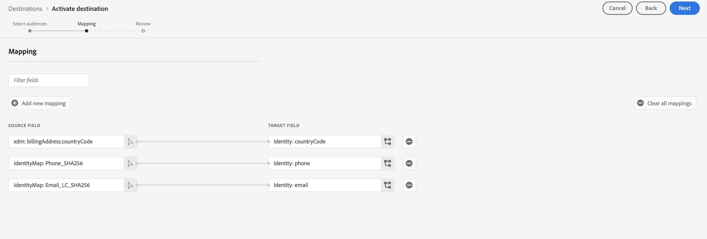
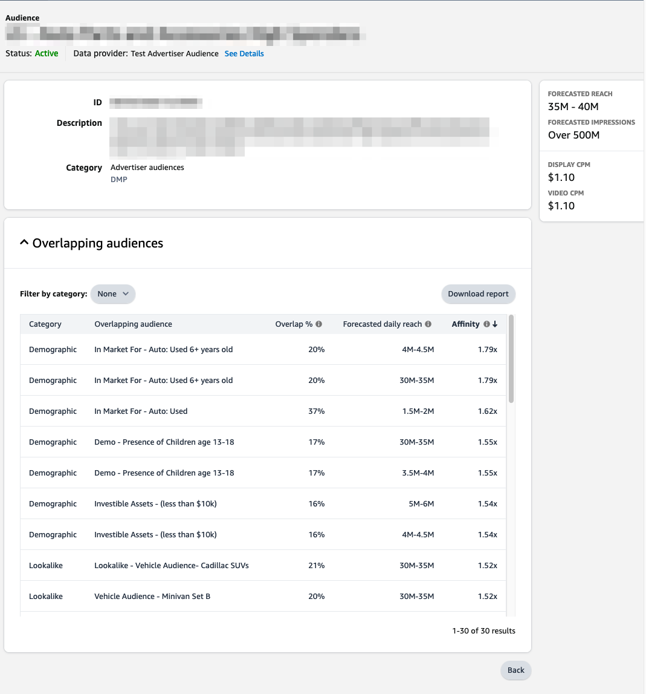

# (Beta) Amazon Ads connection {#amazon-ads}

## Overview {#overview}

Amazon Ads offers a range of options to help you achieve your advertising goals to registered sellers, vendors, book vendors, Kindle Direct Publishing (KDP) authors, app developers, and/or agencies.

The Amazon Ads integration with Adobe Experience Platform provides turn-key integration to Amazon Ads products, including the Amazon DSP (ADSP). Using the Amazon Ads destination in Adobe Experience Platform, users are able to define advertiser audiences for targeting and activation on the Amazon DSP.  

This connection supports Audience creation in the following Amazon Marketplaces: `US`, `CA`, `MX`, `BR`.

>[!IMPORTANT]
>
>This documentation page was created by the *Amazon Ads* team. This is currently a beta product and functionality is subject to change. For any inquiries or update requests, please contact them directly at *`amc-support@amazon.com`.*

## Use cases {#use-cases}

To help you better understand how and when you should use the *Amazon Ads* destination, here are sample use cases that Adobe Experience Platform customers can solve by using this destination.

### Activation and targeting {#activation-and-targeting}

This integration with Amazon DSP allows Amazon Ads advertisers to pass advertiser CDP segments from Adobe Experience Platform to Amazon's DSP to create advertiser audiences for advertising targeting. Audiences may be selected within the Amazon DSP for positive targeting, as well as negative targeting (suppression). Additionally, using signals generated through Amazon Marketing Cloud, advertisers can optimize their advertiser audiences which will synchronize audience changes with Amazon DSP.

## Prerequisites {#prerequisites}

In order to use the Amazon Ads connection with Adobe Experience Platform, users must first have access to an Amazon DSP Advertiser Account.  To provision these instances, please visit the following page on the Amazon Ads website:

* [Get started with Amazon DSP](https://advertising.amazon.com/solutions/products/amazon-dsp?ref_=a20m_us_hnav_p_dsp_adtech)

## Supported identities {#supported-identities}

The *Amazon Ads* connection supports the activation of identities described in the table below. Learn more about [identities](/help/identity-service/namespaces.md). For more details on the identities supported by Amazon Ads, visit the [Amazon DSP Support Center](https://advertising.amazon.com/dsp/help/ss/en/audiences#GA6BC9BW52YFXBNE).

|Target Identity|Description|Considerations|
|---|---|---|
|phone_sha256|Phone numbers hashed with the SHA256 algorithm|Both plain text and SHA256 hashed phone numbers are supported by Adobe Experience Platform. When your source field contains unhashed attributes, check the **[!UICONTROL Apply transformation]** option, to have [!DNL Platform] automatically hash the data on activation.|
|email_lc_sha256|Email addresses hashed with the SHA256 algorithm|Both plain text and SHA256 hashed email addresses are supported by Adobe Experience Platform. When your source field contains unhashed attributes, check the **[!UICONTROL Apply transformation]** option, to have [!DNL Platform] automatically hash the data on activation.|

{style="table-layout:auto"}

## Export type and frequency {#export-type-frequency}

Refer to the table below for information about the destination export type and frequency.

| Item | Type | Notes |
---------|----------|---------|
| Export type | **[!UICONTROL Segment export]** | You are exporting all members of a segment (audience) with the identifiers (name, phone number, or others) used in the *Amazon Ads* destination.|
| Export frequency | **[!UICONTROL Streaming]** | Streaming destinations are "always on" API-based connections. As soon as a profile is updated in Experience Platform based on segment evaluation, the connector sends the update downstream to the destination platform. Read more about [streaming destinations](/help/destinations/destination-types.md#streaming-destinations).|

{style="table-layout:auto"}

## Connect to the destination {#connect}

>[!IMPORTANT]
> 
>To connect to the destination, you need the **[!UICONTROL Manage Destinations]** [access control permission](/help/access-control/home.md#permissions). Read the [access control overview](/help/access-control/ui/overview.md) or contact your product administrator to obtain the required permissions.

To connect to this destination, follow the steps described in the [destination configuration tutorial](../../ui/connect-destination.md). In the configure destination workflow, fill in the fields listed in the two sections below.

### Authenticate to destination {#authenticate}

To authenticate to the destination, fill in the required fields and select **[!UICONTROL Connect to destination]**.

You will be taken to the Amazon Ads connection interface where you will first select the advertiser accounts you wish to connect to.  Upon connection, you will be redirected back to Adobe Experience Platform with a new connection, provided with the ID of the Advertiser Account you selected. Select the appropriate Advertiser Account on the destination configuration screen to proceed.

* **[!UICONTROL Bearer token]**: Fill in the bearer token to authenticate to the destination.

### Fill in destination details {#destination-details}

To configure details for the destination, fill in the required and optional fields below. An asterisk next to a field in the UI indicates that the field is required.

*  **[!UICONTROL Name]**: A name by which you will recognize this destination in the future.
*  **[!UICONTROL Description]**: A description that will help you identify this destination in the future.
*  **[!UICONTROL Amazon Ads Advertiser ID]**: Select the ID for the target Amazon Ads account used for the destination.

Note: once selecting this Amazon Ads Advertiser ID, you will need to create a new destination to change this. If you re-authenticate the OAuth credentials and select a new Advertiser Id, your changes will not apply.

### Enable alerts {#enable-alerts}

You can enable alerts to receive notifications on the status of the dataflow to your destination. Select an alert from the list to subscribe to receive notifications on the status of your dataflow. For more information on alerts, see the guide on [subscribing to destinations alerts using the UI](../../ui/alerts.md).

When you are finished providing details for your destination connection, select **[!UICONTROL Next]**.

## Activate segments to this destination {#activate}

>[!IMPORTANT]
> 
>To activate data, you need the **[!UICONTROL Manage Destinations]**, **[!UICONTROL Activate Destinations]**, **[!UICONTROL View Profiles]**, and **[!UICONTROL View Segments]** [access control permissions](/help/access-control/home.md#permissions). Read the [access control overview](/help/access-control/ui/overview.md) or contact your product administrator to obtain the required permissions.

Read [Activate profiles and segments to streaming segment export destinations](/help/destinations/ui/activate-segment-streaming-destinations.md) for instructions on activating audience segments to this destination.

### Map attributes and identities {#map}

The Amazon Ads connection supports hashed email address and hashed phone numbers for identity matching purposes.  The screenshot below provides an example matching that is compatible with the Amazon Ads connection:

* To map hashed email addresses, select the `Email_LC_SHA256` identity namespace as a source field.
* To map hashed phone numbers, select the `Phone_SHA256` identity namespace as a source field.
* To map unhashed email addresses or phone numbers, select the corresponding identity namespaces as source fields, and check the `Apply Transformation` option to have Platform hash the identities on activation.

It is strongly recommended that you map as many fields as you have available. If only one source attribute is available, you may map a single field.  The Amazon Ads destination will utilize all mapped fields for mapping purposes, yielding higher match rates if more fields are provided. For more information about the accepted identifiers, visit the [Amazon Ads hashed audience help page](https://advertising.amazon.com/dsp/help/ss/en/audiences#GA6BC9BW52YFXBNE).

## Exported data / Validate data export {#exported-data}

Once your audience has been uploaded, you may validate your audience has been created and uploaded correctly using the following steps:

**For Amazon DSP**

Navigate to your Advertiser ID → Audiences → Advertiser Audiences. If your audience was created successfully and meets the minimum number of audience members, you will see a Status of `Active`.  Additional details about your audience size and reach can be found in the Forecasted Reach panel on the right side of the Amazon DSP user interface. 

## Data usage and governance {#data-usage-governance}

All [!DNL Adobe Experience Platform] destinations are compliant with data usage policies when handling your data. For detailed information on how [!DNL Adobe Experience Platform] enforces data governance, read the [Data Governance overview](/help/data-governance/home.md).

## Additional resources {#additional-resources}

For additional help documentation, visit the following Amazon Ads help resources:

* [Amazon DSP Help Center](https://advertising.amazon.com/dsp/help/ss/en/audiences#/)
