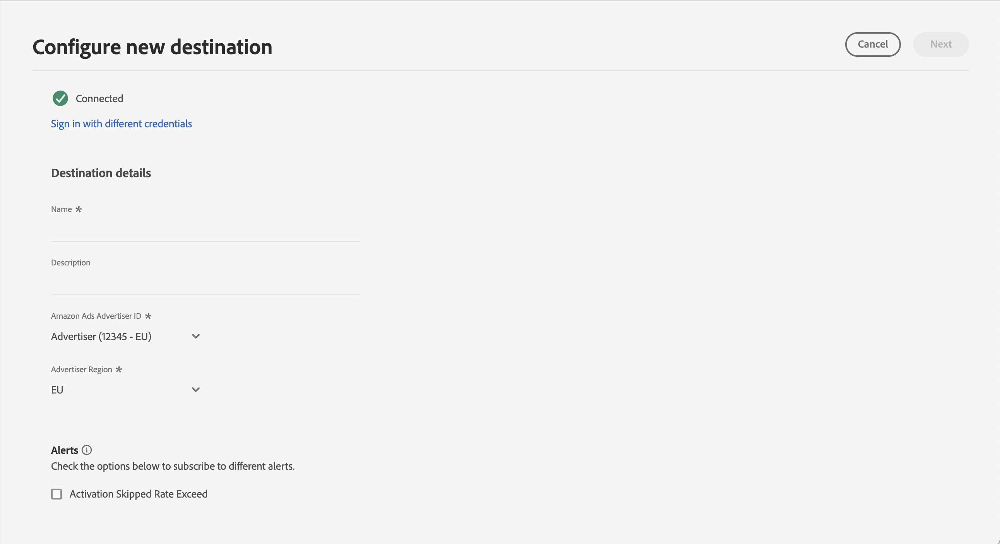

# (Beta) Amazon Ads connection {#amazon-ads}

## Overview {#overview}

[!DNL Amazon Ads] offers a range of options to help you achieve your advertising goals to registered sellers, vendors, book vendors, Kindle Direct Publishing (KDP) authors, app developers, and/or agencies.

The [!DNL Amazon Ads] integration with Adobe Experience Platform provides turn-key integration to [!DNL Amazon Ads] products, including the Amazon DSP (ADSP) and Amazon Marketing Cloud (AMC). 

Using the [!DNL Amazon Ads] destination in Adobe Experience Platform, users are able to define advertiser audiences for targeting and activation on the Amazon DSP.  Additionally, users may upload their data to [!DNL Amazon Marketing Cloud] to understand performance by audience, advertiser provided dimensions, membership in Amazon segments, or other signals available in AMC. After uploading advertiser audiences to AMC, users can use [!DNL Amazon Marketing Cloud] to modify, enhance, or append to audience members using Amazon signals from within [!DNL Amazon Marketing Cloud].

AMC brings together unique signals from across Amazon owned and operated properties, spanning across media including display, video, streaming TV, audio, and sponsored ads. Users can easily send curated segments from Adobe Experience Platform to AMC to enhance learning such as audiences' in-market groups, lifestyle cohorts, and brand engagement patterns. Augmented segments can then be used to optimize media activations in Amazon DSP. 

>[!IMPORTANT]
>
>This destination connector and documentation page are created and maintained by the *[!DNL Amazon Ads]* team. This is currently a beta product and functionality is subject to change. For any inquiries or update requests, please contact them directly at *`amc-support@amazon.com`.*

## Use cases {#use-cases}

To help you better understand how and when you should use the *[!DNL Amazon Ads]* destination, here are sample use cases that Adobe Experience Platform customers can solve by using this destination.

### Activation and targeting {#activation-and-targeting}

This integration with Amazon DSP allows [!DNL Amazon Ads] advertisers to pass advertiser CDP audiences from Adobe Experience Platform to Amazon's DSP to create advertiser audiences for advertising targeting. Audiences may be selected within the Amazon DSP for positive targeting, as well as negative targeting (suppression).

### Analytics and Measurement {#analytics-and-measurement}

This integration with [!DNL Amazon Marketing Cloud] (AMC) allows [!DNL Amazon Ads] advertisers to pass CDP segments from Adobe Experience Platform form to AMC. Advertisers can then join the CDP inputs with [!DNL Amazon Ads] signals, and conduct custom analytics on topics such as media impact, audience segments, and customer journeys in privacy compliant format. For example, an advertiser may upload a list of their existing customers to understand the aggregate advertising campaign performance, or aggregated statistics of on-Amazon conversion events, such as viewing a product detail page, adding a product to a shopping cart, or purchase of a product.

### Advertising optimization

This integration with [!DNL Amazon Marketing Cloud] (AMC) allows advertisers to upload their own customer lists, and using [!DNL Amazon Marketing Cloud] SQL, perform overlap analysis, suppressions, additions, or optimizations to audiences in a recurring basis before creating an activation-ready audience in Amazon DSP for targeting.

## Prerequisites {#prerequisites}

To use the [!DNL Amazon Ads] connection with Adobe Experience Platform, users must first have access to an Amazon DSP Advertiser Account or an [!DNL Amazon Marketing Cloud] instance. To provision these instances, visit the following page on the [!DNL Amazon Ads] website:

* [Get started with Amazon DSP](https://advertising.amazon.com/solutions/products/amazon-dsp)
* [Get started with Amazon Marketing Cloud](https://advertising.amazon.com/solutions/products/amazon-marketing-cloud)

## Supported identities {#supported-identities}

The *[!DNL Amazon Ads]* connection supports the activation of identities described in the table below. Learn more about [identities](/help/identity-service//features/namespaces.md). For more details on the identities supported by [!DNL Amazon Ads], visit the [Amazon DSP Support Center](https://advertising.amazon.com/dsp/help/ss/en/audiences#GA6BC9BW52YFXBNE).

|Target Identity|Description|Considerations|
|---|---|---|
|phone_sha256|Phone numbers hashed with the SHA256 algorithm|Both plain text and SHA256 hashed phone numbers are supported by Adobe Experience Platform. When your source field contains unhashed attributes, check the **[!UICONTROL Apply transformation]** option, to have [!DNL Platform] automatically hash the data on activation.|
|email_lc_sha256|Email addresses hashed with the SHA256 algorithm|Both plain text and SHA256 hashed email addresses are supported by Adobe Experience Platform. When your source field contains unhashed attributes, check the **[!UICONTROL Apply transformation]** option, to have [!DNL Platform] automatically hash the data on activation.|

{style="table-layout:auto"}

## Export type and frequency {#export-type-frequency}

Refer to the table below for information about the destination export type and frequency.

| Item | Type | Notes |
---------|----------|---------|
| Export type | **[!UICONTROL Audience export]** | You are exporting all members of an audience with the identifiers (name, phone number, or others) used in the *[!DNL Amazon Ads]* destination.|
| Export frequency | **[!UICONTROL Streaming]** | Streaming destinations are "always on" API-based connections. As soon as a profile is updated in Experience Platform based on audience evaluation, the connector sends the update downstream to the destination platform. Read more about [streaming destinations](/help/destinations/destination-types.md#streaming-destinations).|

{style="table-layout:auto"}

## Connect to the destination {#connect}

>[!IMPORTANT]
> 
>To connect to the destination, you need the **[!UICONTROL View Destinations]** and **[!UICONTROL Manage Destinations]** [access control permissions](/help/access-control/home.md#permissions). Read the [access control overview](/help/access-control/ui/overview.md) or contact your product administrator to obtain the required permissions.

To connect to this destination, follow the steps described in the [destination configuration tutorial](../../ui/connect-destination.md). In the configure destination workflow, fill in the fields listed in the two sections below.

### Authenticate to destination {#authenticate}

To authenticate to the destination, fill in the required fields and select **[!UICONTROL Connect to destination]**.

You are taken to the [!DNL Amazon Ads] connection interface where you first select the advertiser accounts you wish to connect to. Upon connection, you are redirected back to Adobe Experience Platform with a new connection, provided with the ID of the Advertiser Account you selected. Select the appropriate Advertiser Account on the destination configuration screen to proceed.

* **[!UICONTROL Bearer token]**: Fill in the bearer token to authenticate to the destination.

### Fill in destination details {#destination-details}

To configure details for the destination, fill in the required and optional fields below. An asterisk next to a field in the UI indicates that the field is required.

*  **[!UICONTROL Name]**: A name by which you will recognize this destination in the future.
*  **[!UICONTROL Description]**: A description that will help you identify this destination in the future.
*  **[!UICONTROL Amazon Ads Connection]**: Select the ID for the target [!DNL Amazon Ads] account used for the destination.

>[!NOTE]
>
>After saving the destination configuration, you will not be able to change the [!DNL Amazon Ads] Advertiser ID, even if you reauthenticate through your Amazon account. To use a different [!DNL Amazon Ads] Advertiser ID, you must create a new destination connection.

*  **[!UICONTROL Advertiser Region]**: Select the appropriate region in which your Advertiser is hosted. For more information on the marketplaces supported by each region, visit the [Amazon Ads documentation](https://advertising.amazon.com/API/docs/en-us/info/api-overview#api-endpoints).

### Enable alerts {#enable-alerts}

You can enable alerts to receive notifications on the status of the dataflow to your destination. Select an alert from the list to subscribe to receive notifications on the status of your dataflow. For more information on alerts, see the guide on [subscribing to destinations alerts using the UI](../../ui/alerts.md).

When you are finished providing details for your destination connection, select **[!UICONTROL Next]**.

## Activate audiences to this destination {#activate}

>[!IMPORTANT]
> 
>* To activate data, you need the **[!UICONTROL View Destinations]**, **[!UICONTROL Activate Destinations]**, **[!UICONTROL View Profiles]**, and **[!UICONTROL View Segments]** [access control permissions](/help/access-control/home.md#permissions). Read the [access control overview](/help/access-control/ui/overview.md) or contact your product administrator to obtain the required permissions.
>* To export *identities*, you need the **[!UICONTROL View Identity Graph]** [access control permission](/help/access-control/home.md#permissions).   {width="100" zoomable="yes"}

Read [Activate profiles and audiences to streaming audience export destinations](/help/destinations/ui/activate-segment-streaming-destinations.md) for instructions on activating audiences to this destination.

### Map attributes and identities {#map}

The [!DNL Amazon Ads] connection supports hashed email address and hashed phone numbers for identity matching purposes. The screenshot below provides an example matching that is compatible with the [!DNL Amazon Ads] connection:

* To map hashed email addresses, select the `Email_LC_SHA256` identity namespace as a source field.
* To map hashed phone numbers, select the `Phone_SHA256` identity namespace as a source field.
* To map unhashed email addresses or phone numbers, select the corresponding identity namespaces as source fields, and check the `Apply Transformation` option to have Platform hash the identities on activation.

You only select a given target field one time in a destination configuration of the [!DNL Amazon Ads] connector.  For example, if you submit business email, you cannot also map personal email in the same destination configuration.

It is strongly recommended that you map as many fields as you have available. If only one source attribute is available, you may map a single field. The [!DNL Amazon Ads] destination utilizes all mapped fields for mapping purposes, yielding higher match rates if more fields are provided. For more information about the accepted identifiers, visit the [Amazon Ads hashed audience help page](https://advertising.amazon.com/dsp/help/ss/en/audiences#GA6BC9BW52YFXBNE).

## Exported data / Validate data export {#exported-data}

Once your audience has been uploaded, you may validate your audience has been created and uploaded correctly using the following steps:

**For Amazon DSP**

Navigate to your **[!UICONTROL Advertiser ID]** > **[!UICONTROL Audiences]** > **[!UICONTROL Advertiser Audiences]**. If your audience was created successfully and meets the minimum number of audience members, you will see a Status of `Active`. Additional details about your audience size and reach can be found in the Forecasted Reach panel on the right side of the Amazon DSP user interface. 

**For [!DNL Amazon Marketing Cloud]**

In the left-hand schema browser, find your audience under **[!UICONTROL Advertiser Uploaded]** > **[!UICONTROL aep_audiences]**. You may then query your audience in the AMC SQL editor with the following clause:

`select count(user_id) from aep_audiences where audienceId = '1234567'`

## Data usage and governance {#data-usage-governance}

All [!DNL Adobe Experience Platform] destinations are compliant with data usage policies when handling your data. For detailed information on how [!DNL Adobe Experience Platform] enforces data governance, read the [Data Governance overview](/help/data-governance/home.md).

## Additional resources {#additional-resources}

For additional help documentation, visit the following [!DNL Amazon Ads] help resources:

* [Amazon DSP Help Center](https://www.amazon.com/ap/signin?openid.pape.max_auth_age=28800&openid.return_to=https%3A%2F%2Fadvertising.amazon.com%2Fdsp%2Fhelp%2Fss%2Fen%2Faudiences&openid.identity=http%3A%2F%2Fspecs.openid.net%2Fauth%2F2.0%2Fidentifier_select&openid.assoc_handle=amzn_bt_desktop_us&openid.mode=checkid_setup&openid.claimed_id=http%3A%2F%2Fspecs.openid.net%2Fauth%2F2.0%2Fidentifier_select&openid.ns=http%3A%2F%2Fspecs.openid.net%2Fauth%2F2.0)

## Changelog {#changelog}

This section captures the functionality and significant documentation updates made to this destination connector.

+++ View changelog

|Release month|Update type|Description|
|---|---|---|
|March 2024|Functionality and documentation update| Added the option to export audiences to be used in [!DNL Amazon Marketing Cloud] (AMC).|
|May 2023|Functionality and documentation update| <ul><li>Added support for Advertiser Region selection in the [destination connection workflow](#destination-details).</li><li>Updated documentation to reflect the addition of Advertiser Region selection. For more information on selecting the correct Advertiser Region, see the [Amazon documentation](https://advertising.amazon.com/API/docs/en-us/info/api-overview#api-endpoints).</li></ul> |
|March 2023|Initial release|Initial destination release and documentation published.|

{style="table-layout:auto"}

+++
