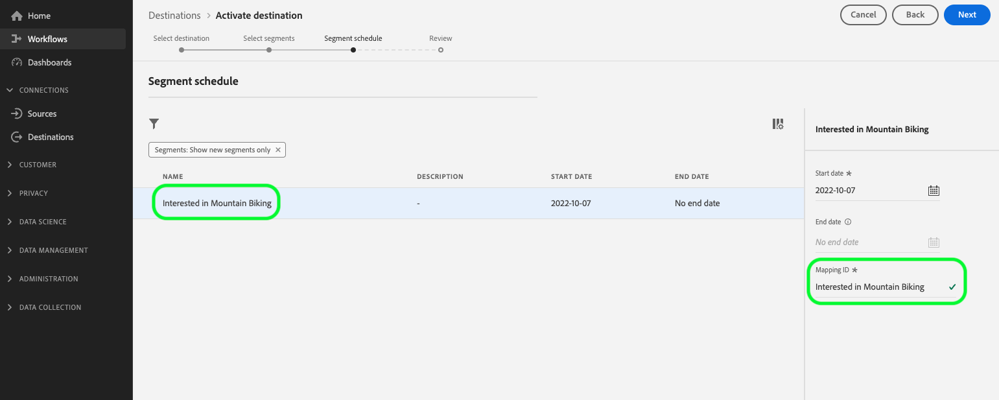

# [!DNL Microsoft Bing] connection {#bing-destination}

## Overview {#overview}

Use the [!DNL Microsoft Bing] destination to send profile data to the entire [!DNL Microsoft Advertising Network], including [!DNL Display Advertising], [!DNL Search], and [!DNL Native]. 

The [!DNL Microsoft Bing] destination creates *[!DNL Custom Audiences]* in Microsoft. Those are available both in the [!DNL Microsoft Search Network] and [!DNL Audience Network] ([!DNL Native] /[!DNL Display] /[!DNL Programmatic]) as listed in the [Microsoft Advertising documentation](https://help.ads.microsoft.com/#apex/ads/en/56892/1-500).

To send profile data to [!DNL Microsoft Bing], you must first connect to the destination.

## Use cases {#use-cases}

As a marketer, I want to be able to use audiences built off of [!DNL Microsoft Advertising IDs] to target users via display or search advertising across [!DNL Microsoft Advertising] channels.

## Supported identities {#supported-identities}

[!DNL Microsoft Bing] supports the activation of audiences based on the identities shown in the table below. Learn more about [identities](/help/identity-service/features/namespaces.md).

|Identity|Description|
|---|---|
|MAID|Microsoft Advertising ID|

{style="table-layout:auto"}

## Supported audiences {#supported-audiences}

This section describes which types of audiences you can export to this destination.

| Audience origin | Supported | Description | 
---------|----------|----------|
| [!DNL Segmentation Service] | ✓ | Audiences generated through the Experience Platform [Segmentation Service](../../../segmentation/home.md).|
| Custom uploads | ✓ | Audiences [imported](../../../segmentation/ui/overview.md#import-audience) into Experience Platform from CSV files. |

{style="table-layout:auto"}

## Export type and frequency {#export-type-frequency}

**[!DNL Audience Export]** - you are exporting all members of an audience to the [!DNL Microsoft Bing] destination.

Refer to the table below for information about the destination export type and frequency.

| Item | Type | Notes |
---------|----------|---------|
| Export type | **[!UICONTROL Audience export]** | You are exporting all members of an audience to the [!DNL Microsoft Bing] destination.|
| Export frequency | **[!UICONTROL Streaming]** | Streaming destinations are "always on" API-based connections. As soon as a profile is updated in Experience Platform based on audience evaluation, the connector sends the update downstream to the destination platform. Read more about [streaming destinations](/help/destinations/destination-types.md#streaming-destinations).|

{style="table-layout:auto"}

## Prerequisites {#prerequisites}

>[!IMPORTANT]
>
>If you are looking to create your first destination with [!DNL Microsoft Bing] and have not enabled the [ID sync functionality](https://experienceleague.adobe.com/docs/id-service/using/id-service-api/methods/idsync.html) in Experience Cloud ID Service in the past (with Adobe Audience Manager or other applications), please reach out to Adobe Consulting or Customer Care to enable ID syncs. If you had previously set up [!DNL Microsoft Bing] integrations in Audience Manager, the ID syncs you had set up carry over to Platform.

When configuring the destination, you must provide the following information:

* [!UICONTROL Account ID]: this is your [!DNL Bing Ads CID], in integer format.

## Connect to the destination {#connect}

>[!IMPORTANT]
> 
>To connect to the destination, you need the **[!UICONTROL View Destinations]** and **[!UICONTROL Manage Destinations]** [access control permissions](/help/access-control/home.md#permissions). Read the [access control overview](/help/access-control/ui/overview.md) or contact your product administrator to obtain the required permissions.

To connect to this destination, follow the steps described in the [destination configuration tutorial](../../ui/connect-destination.md).

### Fill in destination details {#parameters}

While [setting up](../../ui/connect-destination.md) this destination, you must provide the following information:

*  **[!UICONTROL Name]**: A name by which you will recognize this destination in the future.
*  **[!UICONTROL Description]**: A description that will help you identify this destination in the future.
*  **[!UICONTROL Account ID]**: Your [!DNL Bing Ads Customer ID] (CID). Your CID is an integer, found in the URL when you log into [!DNL Microsoft Advertising]. 

### Enable alerts {#enable-alerts}

You can enable alerts to receive notifications on the status of the dataflow to your destination. Select an alert from the list to subscribe to receive notifications on the status of your dataflow. For more information on alerts, see the guide on [subscribing to destinations alerts using the UI](../../ui/alerts.md).

When you are finished providing details for your destination connection, select **[!UICONTROL Next]**.

## Activate audiences to this destination {#activate}

>[!CONTEXTUALHELP]
>id="platform_destinations_bing_mapping_id"
>title="Mapping ID"
>abstract="Enter the numeric Bing audience ID to which you want to map the selected segment. If the provided [!UICONTROL Mapping ID] does not correspond to an audience ID in the Bing destination, you will not see the expected audience data in your Bing account."

>[!IMPORTANT]
> 
>To activate data, you need the **[!UICONTROL View Destinations]**, **[!UICONTROL Activate Destinations]**, **[!UICONTROL View Profiles]**, and **[!UICONTROL View Segments]** [access control permissions](/help/access-control/home.md#permissions). Read the [access control overview](/help/access-control/ui/overview.md) or contact your product administrator to obtain the required permissions.

See [Activate audience data to streaming audience export destinations](../../ui/activate-segment-streaming-destinations.md) for instructions on activating audiences to this destination.

In the [Audience schedule](../../ui/activate-segment-streaming-destinations.md#scheduling) step, you must manually map the audience name in the [!UICONTROL Mapping ID] field. This ensures that audience metadata is correctly passed through to [!DNL Bing]. 

## Exported data {#exported-data}

To verify if data has been exported successfully to the [!DNL Microsoft Bing] destination, check your [!DNL Microsoft Bing Ads] account. If activation was successful, audiences are populated in your account.
