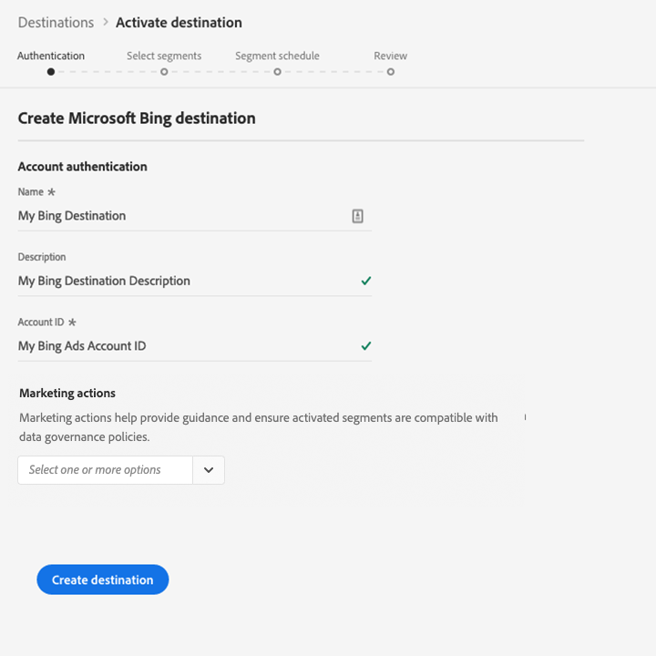

# [!DNL Microsoft Bing] connection

The [!DNL Microsoft Bing] destination helps you send profile data to [!DNL Microsoft Display Advertising].

To send profile data to [!DNL Microsoft Bing], you must first connect to the destination.

## Destination specs {#destination-specs}

Note the following details that are specific to the [!DNL Microsoft Bing] destination:

* You can send the following [identities](../../../identity-service/namespaces.md) to [!DNL Microsoft Bing] destinations: [!DNL Microsoft ID].

## Use cases {#use-cases}

As a marketer, I want to be able to use segments built off of [!DNL Microsoft Advertising IDs] to target users via display advertising across [!DNL Microsoft Advertising] channels.

## Export type {#export-type}

**[!DNL Segment Export]** - you are exporting all members of a segment (audience) to the [!DNL Microsoft Bing] destination.

## Prerequisites {#prerequisites}

When configuring the destination you will asked to provide the following information:

* [!UICONTROL Account ID]: this is your [!DNL Bing Ads CID], in integer format.

## Connect to destination {#connect-destination}

In **[!UICONTROL Connections]** > **[!UICONTROL Destinations]**, select [!DNL Microsoft Bing], and select **[!UICONTROL Configure]**.

>[!NOTE]
>
>If a connection with this destination already exists, you can see an **[!UICONTROL Activate]** button on the destination card. For more information about the difference between **[!UICONTROL Activate]** and **[!UICONTROL Configure]**, refer to the [Catalog](../../ui/destinations-workspace.md#catalog) section of the destination workspace documentation.
>
>

In the [!UICONTROL Authentication] step, you must enter the destination connection details:
   
 *  **[!UICONTROL Name]**: A name by which you will recognize this destination in the future.
 *  **[!UICONTROL Description]**: A description that will help you identify this destination in the future.
 *  **[!UICONTROL Account ID]**: Your [!DNL Bing Ads CID].
 *  **[!UICONTROL Marketing use case]**: Marketing use cases indicate the intent for which data will be exported to the destination. You can select from Adobe-defined marketing use cases or you can create your own marketing use case. For more information about marketing use cases, see the [Data Governance in Adobe Experience Platform](../../../data-governance/policies/overview.md) page. For information about the individual Adobe-defined marketing use cases, see the [Data usage policies overview](../../../data-governance/policies/overview.md).

    
Click **[!UICONTROL Create destination]**. Your destination is now created. You can click [!UICONTROL Save & Exit] if you want to activate segments later on, or you can click [!UICONTROL Next] to continue the workflow and select segments to activate. In either case, see the next section, [Activate Segments](#activate-segments), for the rest of the workflow.

## Activate segments {#activate-segments}

See [Activate profiles and segments to a destination](../../ui/activate-destinations.md#select-attributes) for information about the segment activation workflow.

In the [Segment schedule](../../ui/activate-destinations.md#segment-schedule) step, you must manually map your segments to their corresponding ID or friendly name in the destination.

When mapping segments, we recommend you use the [!DNL Platform] segment name or a shorter form of it, for ease of use. However, the segment ID or name in your destination does not need to match the one in your [!DNL Platform] account. Any value you insert in the mapping field will be reflected by the destination.

## Exported data {#exported-data}

To verify if data has been exported successfully to the [!DNL Microsoft Bing] destination, check your [!DNL Microsoft Bing Ads] account. If activation was successful, audiences are populated in your account. 