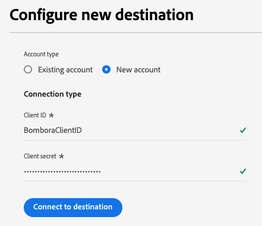
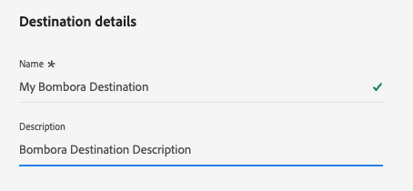

# Bombora connection {#bombora}

>[!AVAILABILITY]
>
>The functionality to activate account audiences to the Bombora destination is available for companies purchasing the [Business-to-Business](/help/rtcdp/overview.md#rtcdp-b2b) and [Business-to-Person](/help/rtcdp/overview.md#rtcdp-b2p) editions of Real-Time Customer Data Platform.

Activate profiles for your Bombora campaigns for audience targeting, personalization, and suppression, based on [account audiences](/help/segmentation/types/account-audiences.md).

## Use cases {#use-case}

To help you better understand how and when you should use the Bombora destination, here are sample use cases that Adobe Experience Platform customers can solve by using this destination.

### DSP integration {#dsp-integration}

As a B2B marketer, you can create an account list in Real-time CDP, identifying companies which show high intent for your products, then use this destination to activate this list in Bombora.

Through Bombora's integration with DSPs you can run targeted ad campaigns using Bombora data. This ensures your ad spend is focused on companies which are most likely to convert.

### Account-Based Marketing {#abm}

As a B2B marketer, you can build an account list based on CRM and marketing signals. Then, you can use this destination to activate this list in Bombora, where ABM-aware controls help you target decision makers at these companies.

### Multi-channel account-based marketing activation {#multi-channel-abm}

As a B2B marketer, you can create an account list in Real-time CDP, identifying companies with high intent. Then, you can use this destination to activate the list in Bombora to run targeted campaigns across multiple channels.

On paid social media, you might serve personalized ads to professionals at target accounts on platforms like [!DNL LinkedIn] and [!DNL Facebook]. Using native ad platforms, you can ensure the content reaches relevant decision makers.

You can also extend campaigns to advanced TV, delivering ads to key accounts.

This multi-channel approach ensures consistent messaging across platforms, maximizing engagement and conversion rates.

## Supported audiences {#supported-audiences}

This section describes which type of audiences you can export to this destination.

| Audience origin | Supported | Description | 
|---------|----------|----------|
| [!DNL Segmentation Service] | ✓ | Audiences generated through the Experience Platform [Segmentation Service](../../../segmentation/home.md).|
| Custom uploads | X | Audiences [imported](../../../segmentation/ui/overview.md#import-audience) into Experience Platform from CSV files. |

{style="table-layout:auto"}

## Supported identities {#supported-identities}

Bombora requires the mapping of the target identity described in the table below. Learn more about [identities](/help/identity-service/features/namespaces.md).

|Target Identity|Description|
|---|---|
| `primaryId` | Bombora requires the mapping of this target identity in order for the integration to work correctly. You can map any source field to this identity. This mapping is mandatory but does not export data to Bombora. |

{style="table-layout:auto"}

## Export type and frequency {#export-type-and-frequency} 

Refer to the table below for information about the destination export type and frequency.

| Item | Type | Notes |
|---------|----------|---------|
| Export type | **[!UICONTROL Audience export]** | You are exporting all members of an audience with the identifiers (name, phone number, or others) used in the [!DNL Bombora] destination.|
| Export frequency | **[!UICONTROL Streaming]** | Streaming destinations are "always on" API-based connections. As soon as a profile is updated in Experience Platform based on audience evaluation, the connector sends the update downstream to the destination platform. Read more about [streaming destinations](/help/destinations/destination-types.md#streaming-destinations).|

{style="table-layout:auto"}

## Prerequisites {#prerequisites}

To export account audiences to Bombora, you need the following information.

1. A Bombora account.
2. A Bombora **[!UICONTROL client ID]** and **[!UICONTROL client secret]**.

## Connect to the destination {#connect}

>[!IMPORTANT]
> 
>To connect to the destination, you need the **[!UICONTROL View Destinations]** and **[!UICONTROL Manage Destinations]** [access control permission](/help/access-control/home.md#permissions). Read the [access control overview](/help/access-control/ui/overview.md) or contact your product administrator to obtain the required permissions.

To connect to this destination, follow the steps described in the [destination configuration tutorial](../../ui/connect-destination.md). In the configure destination workflow, fill in the fields listed in the two sections below.

### Authenticate to destination {#authenticate}

To authenticate to the destination, fill in the required fields and select **[!UICONTROL Connect to destination]**.

* **[!UICONTROL Client ID]**: Enter your [!DNL Bombora] client ID.
* **[!UICONTROL Client secret]**: Enter your [!DNL Bombora] client secret.

### Fill in destination details {#destination-details}

To configure details for the destination, fill in the required and optional fields below. An asterisk next to a field in the UI indicates that the field is required.

* **[!UICONTROL Name]**: A name by which you will recognize this destination in the future.
* **[!UICONTROL Description]**: A description that will help you identify this destination in the future.

Now you're ready to activate your audiences within Bombora.

## Activate audiences to this destination {#activate}

>[!IMPORTANT]
> 
>* To activate data, you need the **[!UICONTROL View Destinations]**, **[!UICONTROL Activate Destinations]**, **[!UICONTROL View Profiles]**, and **[!UICONTROL View Segments]** [access control permissions](/help/access-control/home.md#permissions). Read the [access control overview](/help/access-control/ui/overview.md) or contact your product administrator to obtain the required permissions.
>* To export *identities*, you need the **[!UICONTROL View Identity Graph]** [access control permission](/help/access-control/home.md#permissions).   {width="100" zoomable="yes"}

Read [Activate account audiences](/help/destinations/ui/activate-account-audiences.md) for instructions on activating account audiences to this destination.

### Mandatory mappings {#mapping}

The Bombora destination requires you to configure the following mappings for successful data activation. 

|Source field | Target field | Description |
|---------|----------|---------|
| Any value | `Identity: primaryId` | This mapping is mandatory for Experience Platform to establish a connection to Bombora. This value does not get exported to Bombora, but is required for the destination configuration. You can select any attribute for the source field.|
| `xdm: accountOrganization.domain` | `xdm: companyWebsiteDomain` | Bombora uses website or domain addresses to create an account list. |

## Additional notes and important callouts {#additional-notes}

If an account audience with the same name was activated earlier to Bombora, you will receive an error if you try to activate it again through a different dataflow to the Bombora destination.
