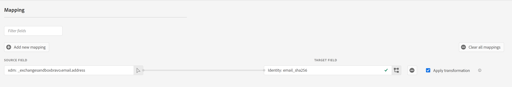
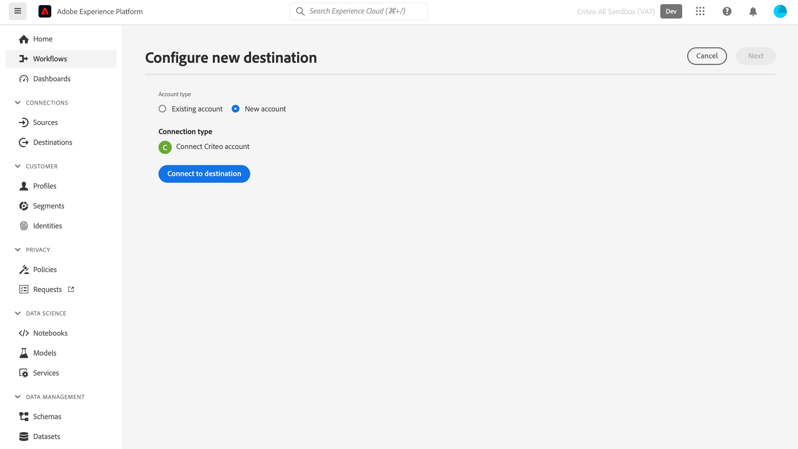
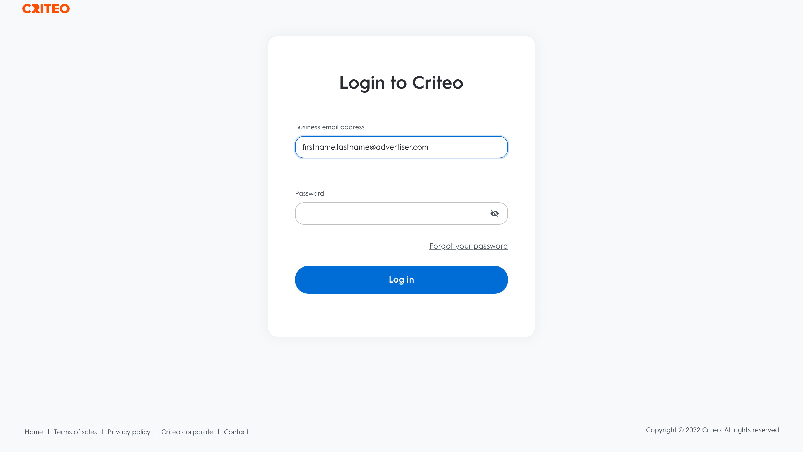
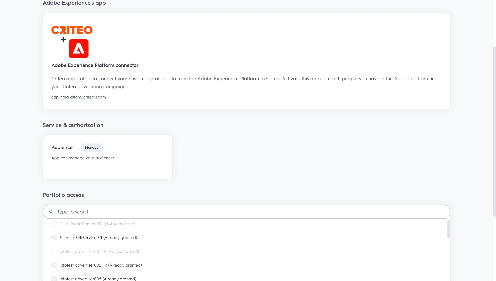
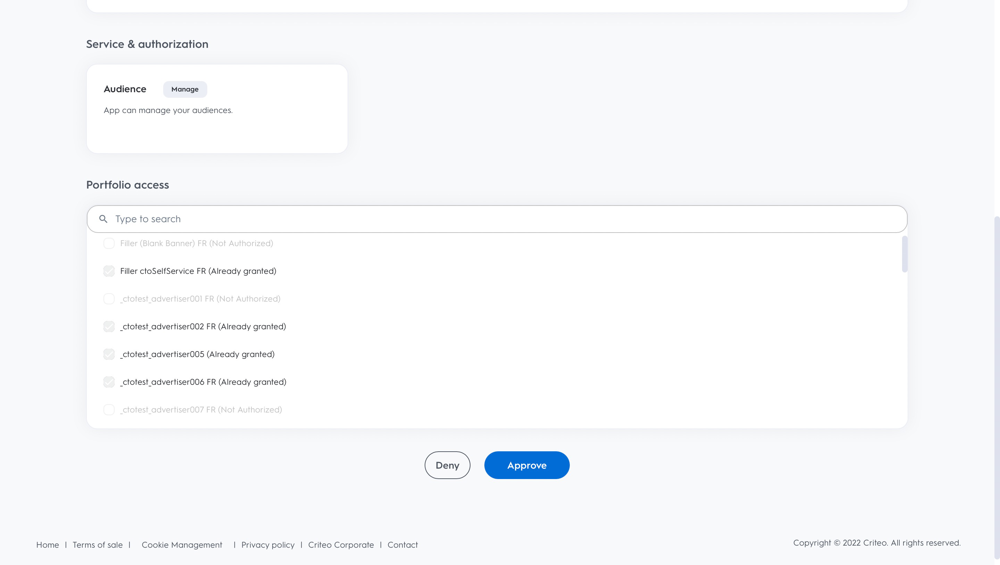
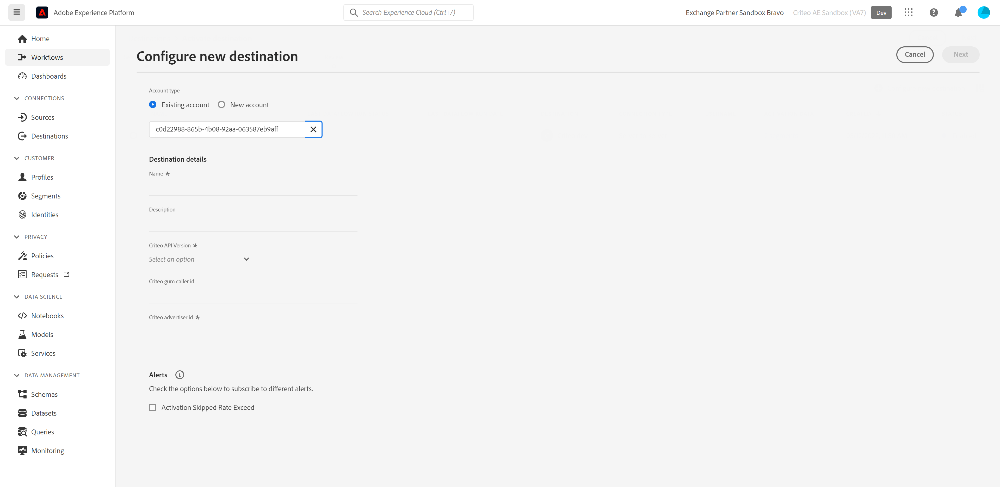

# (Beta) Criteo connection

## Overview {#overview}

>[!IMPORTANT]
>
>This destination connector and documentation page are created and maintained by Criteo. This is currently a beta product and functionality is subject to change. For any inquiries or update requests, please contact Criteo directly [here](mailto:criteoTechnicalPartnerships@criteo.com).

Criteo powers trusted and impactful advertising to bring richer experiences to every consumer across the open internet. With the world's largest commerce data set and best-in-class AI, Criteo ensures each touchpoint across the shopping journey is personalized to reach customers with the right ad, at the right time.

## Prerequisites {#prerequisites}

* You need to have an administrator user account on [Criteo Management Center](https://marketing.criteo.com).
* You'll need your Criteo Advertiser ID (ask your Criteo contact if you don't have this ID).
* You'll need to provide [!DNL GUM caller ID], in case you want to use [!DNL GUM ID] as identifier.

## Limitations {#limitations}

* Criteo only accepts [!DNL SHA-256]-hashed and plain-text emails (to be transformed into [!DNL SHA-256] before sending). Please do not send any PII (Personal Identifiable Information, such as individuals' names or phone numbers).
* Criteo needs at least one identifier to be provided by the client. It prioritizes [!DNL GUM ID] as identifier over hashed email as it contributes to better matching rate.



## Supported identities {#supported-identities}

Criteo supports the activation of identities described in the table below. Learn more about [identities](https://experienceleague.adobe.com/docs/experience-platform/identity/namespaces.html?lang=en#getting-started).

| Target Identity | Description | Considerations |
| --- | --- | --- |
| `email_sha256` | Email addresses hashed with the SHA-256 algorithm | Both plain text and SHA-256-hashed email addresses are supported by Adobe Experience Platform. When your source field contains unhashed attributes, check the [!UICONTROL Apply transformation] option, to have Platform automatically hash the data on activation. |
| `gum_id` | Criteo [!DNL GUM] cookie identifier | [!DNL GUM IDs] allow clients to maintain a correspondence between their user identification system and Criteo's user identification ([!DNL UID]). If the identifier type is `gum_id`, an additional parameter, the [!DNL GUM Caller ID], must also be included. Please reach out to your Criteo account team for the appropriate [!DNL GUM Caller ID] or to get more information on this [!DNL GUM ID] sync, if needed.|

## Export type and frequency {#export-type-frequency}

Refer to the table below for information about the destination export type and frequency.

| Item | Type | Notes |
| --- | --- | --- |
| Export type | Audience export | You are exporting all members of an audience with the identifiers (name, phone number, or others) used in the [!DNL Criteo] destination. |
| Export frequency | Streaming | Streaming destinations are "always on" API-based connections. As soon as a profile is updated in Experience Platform based on audience evaluation, the connector sends the update downstream to the destination platform. Read more about [streaming destinations](../../destination-types.md#streaming-destinations). |

## Use cases {#use-cases}

To help you better understand how to use the [!DNL Criteo] destination, here are some goals that Adobe Experience Platform customers can achieve with [!DNL Criteo]:

### Use case 1 : Get traffic

Showcase your business with relevant product offers and flexible creatives. With intelligent product recommendations, your ads will automatically feature the products most likely to trigger visits and engagement. Flexible targeting allows you to build audiences from Criteo's commerce data set or from your own prospect lists and Adobe CDP segments.

### Use case 2 : Increase website conversions

When visitors leave your website, remind them what they're missing with retargeting ads that increase conversions by showing special deals and hyper-relevant offers, wherever they go next. Connect your Adobe CDP audience to re-engage existing customers or target consumers similar to your most loyal shoppers.

## Connect to Criteo {#connect}

>[!IMPORTANT]
> 
>To connect to the destination, you need the **[!UICONTROL Manage Destinations]** [access control permission](/help/access-control/home.md#permissions). Read the [access control overview](/help/access-control/ui/overview.md) or contact your product administrator to obtain the required permissions.

To connect to this destination, follow the steps described in the [destination configuration tutorial](../../ui/connect-destination.md).

### Authenticate to Criteo

Steps to connect are as follows:

1. Log in to Adobe Experience Platform and connect to the Criteo destination.
  
    

1. You will be redirected to Criteo to authorize the connection. You may need to first log in with your Criteo credentials:

    
    
    
    
    


### Connection parameters {#connection-parameters}

After authenticating to the destination, please fill in the following connection parameters.



| Field | Description | Required |
| --- | --- | --- |
| Name | A name to help you recognize this destination in the future. The name you choose here will be the [!DNL Audience] name in Criteo Management Center and cannot be modified at later stage. | Yes |
| Description | A description to help you identify this destination in the future. | No |
| Advertiser ID | Criteo Advertiser ID of your organization. Please contact your Criteo account manager to obtain this information. | Yes |
| Criteo [!DNL GUM caller ID] | [!DNL GUM Caller ID] of your organization. Please reach out to your Criteo account team for the appropriate [!DNL GUM Caller ID] or to get more information on this [!DNL GUM] sync, if needed. | Yes, whenever [!DNL GUM ID] is provided as an identifier |

### Enable alerts {#enable-alerts}

You can enable alerts to receive notifications on the status of the dataflow to your destination. Select an alert from the list to subscribe to receive notifications on the status of your dataflow. For more information on alerts, see the guide on [subscribing to destinations alerts using the UI](../../ui/alerts.md).

When you are finished providing details for your destination connection, select **[!UICONTROL Next]**.

## Activate audiences to this destination {#activate-segments}

>[!IMPORTANT]
> 
>To activate data, you need the **[!UICONTROL Manage Destinations]**, **[!UICONTROL Activate Destinations]**, **[!UICONTROL View Profiles]**, and **[!UICONTROL View Segments]** [access control permissions](/help/access-control/home.md#permissions). Read the [access control overview](/help/access-control/ui/overview.md) or contact your product administrator to obtain the required permissions.

Read [Activate profiles and audiences to streaming audience export destinations](../../ui/activate-segment-streaming-destinations.md) for instructions on activating audiences to this destination.

## Exported data {#exported-data}

You can see the exported audiences in the [Criteo management center](https://marketing.criteo.com/audience-manager/dashboard).

The request body of adding a user profile received by the [!DNL Criteo] connection looks similar to this:

```json
{
  "data": {
    "type": "ContactlistWithUserAttributesAmendment",
    "attributes": {
      "operation": "add",
      "identifierType": "gum",
      "gumCallerId": "123",
      "identifiers": [
        {
          "identifier": "456",
          "attributes": [
            { "key": "ctoid_GumCaller", "value": "123" },
            { "key": "ctoid_Gum", "value": "456" },
            {
              "key": "ctoid_HashedEmail",
              "value": "98833030dc03751f2b2c1a0017078975fdae951aa6908668b3ec422040f2d4be"
            }
          ]
        }
      ]
    }
  }
}
```

The request body of removing user profile  received by the [!DNL Criteo] connection looks similar to this:

```json
{
  "data": {
    "type": "ContactlistWithUserAttributesAmendment",
    "attributes": {
      "operation": "remove",
      "identifierType": "gum",
      "gumCallerId": "123",
      "identifiers": [
        {
          "identifier": "456",
          "attributes": [
            { "key": "ctoid_GumCaller", "value": "123" },
            { "key": "ctoid_Gum", "value": "456" },
            {
              "key": "ctoid_HashedEmail",
              "value": "98833030dc03751f2b2c1a0017078975fdae951aa6908668b3ec422040f2d4be"
            }
          ]
        }
      ]
    }
  }
}
```

## Data usage and governance {#data-usage}

All Adobe Experience Platform destinations are compliant with data usage policies when handling your data. For detailed information on how Adobe Experience Platform enforces data governance, read the [Data Governance overview](https://experienceleague.adobe.com/docs/experience-platform/data-governance/home.html?lang=en).

## Additional resources

* [Criteo Help Center](https://help.criteo.com/kb/en)
* [Criteo Developer Portal](https://developers.criteo.com)
