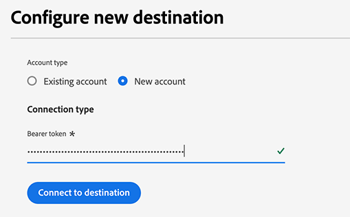
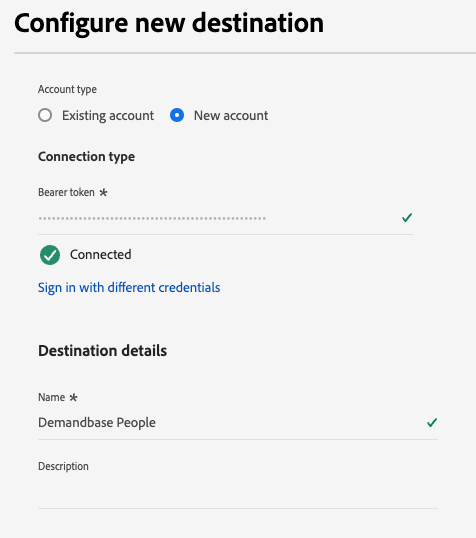

# Demandbase People connection {#demandbase-people}

Activate profiles for your Demandbase campaigns for audience targeting, personalization, and suppression.

>[!IMPORTANT]
>
>For B2B use cases where you need to [activate account audiences](../../ui/activate-account-audiences.md), use the [Demandbase](demandbase.md) destination connector instead.

## Use case {#use-case}

Marketers can use Adobe Real-Time CDP to create a People List of first-party contacts and activate it in Demandbase for optimized and orchestrated engagement across its demand-side platform (DSP) and other channels such as LinkedIn.

This approach allows marketers to prioritize campaign spending on known individuals sourced from their own CRM or marketing automation system, ensuring that marketing efforts focus on high-value prospects.

Once activated, Demandbase optimizes ad delivery, refining targeting strategies to maximize engagement, reach, and conversion rates, ultimately improving campaign efficiency.

## Supported identities {#supported-identities}

The [!DNL Demandbase People] connection supports the activation of identities described in the table below. Learn more about [identities](/help/identity-service/features/namespaces.md).

|Target Identity|Description|Considerations|
|---|---|---|
|email|Plain text email addresses | Only plain text email addresses are supported by the [!DNL Demandbase People] connection.|

{style="table-layout:auto"}

## Supported audiences {#supported-audiences}

This section describes which type of audiences you can export to this destination.

| Audience origin | Supported | Description | 
|---------|----------|----------|
| [!DNL Segmentation Service] | ✓ | Audiences generated through the Experience Platform [Segmentation Service](../../../segmentation/home.md).|
| Custom uploads | X | Audiences [imported](../../../segmentation/ui/overview.md#import-audience) into Experience Platform from CSV files. |

{style="table-layout:auto"}

## Export type and frequency {#export-type-and-frequency} 

Refer to the table below for information about the destination export type and frequency.

| Item         | Type      | Notes                       |
|--------------|-----------|---------------------------|
| Export Type  | Audience export | You are exporting all members of an audience with the identifiers (name, phone number, or others) used in the *Demandbase* destination. |
| Frequency    | Streaming  | Streaming destinations are "always on" API-based connections. As soon as a profile is updated in Experience Platform based on audience evaluation, the connector sends the update downstream to the destination platform. Read more about [streaming destinations](/help/destinations/destination-types.md#streaming-destinations). |

{style="table-layout:auto"}

## Prerequisites {#prerequisites}

To export audiences to Demandbase, you need the following:

1. A Demandbase account.
2. A Demandbase API token. You can generate an API token with your user in Demandbase. To generate a token, navigate to [My Profile > API Token](https://web.demandbase.com/o/ad/at) after logging into your Demandbase account.

## Connect to the destination {#connect}

>[!IMPORTANT]
> 
>To connect to the destination, you need the **[!UICONTROL View Destinations]** and **[!UICONTROL Manage Destinations]** [access control permission](/help/access-control/home.md#permissions). Read the [access control overview](/help/access-control/ui/overview.md) or contact your product administrator to obtain the required permissions.

To connect to this destination, follow the steps described in the [destination configuration tutorial](../../ui/connect-destination.md). In the configure destination workflow, fill in the fields listed in the two sections below.

### Authenticate to destination {#authenticate}

To authenticate to the destination, fill in the required fields and select **[!UICONTROL Connect to destination]**.

* **[!UICONTROL Bearer token]**: Fill in the bearer token to authenticate to the destination. View [prerequisites](#prerequisites) for information on how to obtain the token.

### Fill in destination details {#destination-details}

To configure details for the destination, fill in the required and optional fields below. An asterisk next to a field in the UI indicates that the field is required.

*  **[!UICONTROL Name]**: A name by which you will recognize this destination in the future.
*  **[!UICONTROL Description]**: A description that will help you identify this destination in the future.

Now you're ready to activate your audiences within Demandbase People.

## Activate audiences to this destination {#activate}

>[!IMPORTANT]
> 
>* To activate data, you need the **[!UICONTROL View Destinations]**, **[!UICONTROL Activate Destinations]**, **[!UICONTROL View Profiles]**, and **[!UICONTROL View Segments]** [access control permissions](/help/access-control/home.md#permissions). Read the [access control overview](/help/access-control/ui/overview.md) or contact your product administrator to obtain the required permissions.
>* To export *identities*, you need the **[!UICONTROL View Identity Graph]** [access control permission](/help/access-control/home.md#permissions).   {width="100" zoomable="yes"}

Read [Activate profiles and audiences to streaming audience export destinations](/help/destinations/ui/activate-segment-streaming-destinations.md) for instructions on activating audiences to this destination.

### Mandatory mappings {#mandatory-mappings}

When activating audiences to the [!DNL Demandbase People] destination, you must configure the following mandatory field mapping in the mapping step:

| Source field | Target field | Description |
|--------------|--------------|-------------|
| `xdm: workEmail.address` | `Identity: email` | The work email address of the person |

### Recommended mappings {#recommended-mappings}

For optimal matching accuracy, include the following optional mappings in your activation flow, in addition to the [mandatory mapping](#mandatory-mappings) above.

| Source field | Target field | Description |
|--------------|--------------|-------------|
| `xdm: b2b.personKey.sourceKey` | `xdm: externalPersonId` | The unique identifier for the person |
| `xdm: person.name.lastName` | `xdm: lastName` | The last name of the person |
| `xdm: person.name.firstName` | `xdm: firstName` | The first name of the person |

### Mapping best practices {#mapping-best-practices}

When mapping fields to [!DNL Demandbase People], consider the following matching behavior:

* **Primary matching**: If `externalPersonId` is present, Demandbase uses it as the primary identifier for person matching.
* **Fallback matching**: If `externalPersonId` is not available, Demandbase uses the `email` field for identification.
* **Required vs. recommended**: While only `email` is required by Demandbase, Adobe recommends mapping all available fields from the recommended mappings table above, to improve matching accuracy and campaign performance.

These mappings are required for the destination to function properly and must be configured before you can proceed with the activation workflow.

## Additional notes and important callouts {#additional-notes}

* **Demandbase API guardrails**: If you have exported audiences to Demandbase and the exports are successful in Experience Platform, yet not all of the data reaches Demandbase, you might have encountered API throttling on the Demandbase side. Reach out to them for clarification.
* **List deletion**: People lists are unique, so you cannot re-create a new list with a name already in use. When you remove people from a list, they will no longer be available, but they will not be deleted.
* **Activation time**: Data loading in Demandbase is subject to overnight processing.
* **Audience naming**: If a people audience with the same name was activated earlier to Demandbase, you cannot activate it again through a different dataflow to the Demandbase destination.
