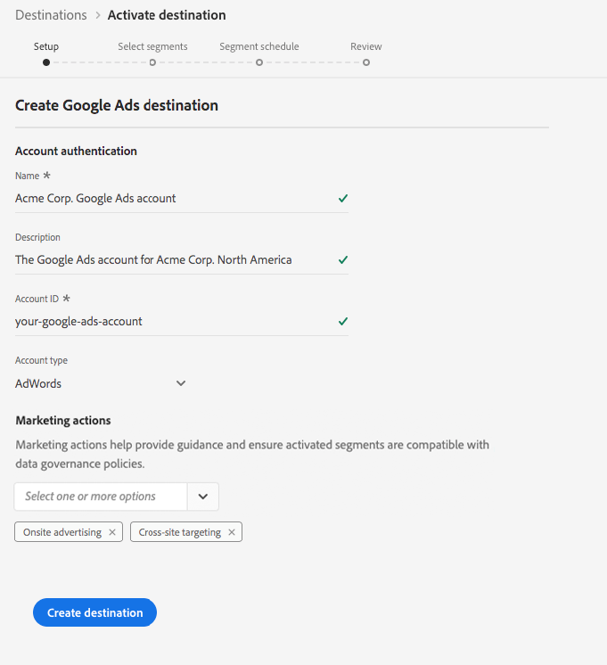

# [!DNL Google Ads] Destination

## Overview

[!DNL Google Ads], formerly known as [!DNL Google AdWords], is an online advertising service that allows businesses to pay-per-click advertising across text-based searches, graphic displays, [!DNL YouTube] videos, and in-app mobile displays.

## Destination specs

Note the following details that are specific to [!DNL Google Ads] destinations:

* You can send the following [identities](../../../identity-service/namespaces.md) to [!DNL Google Ads] destinations: Google cookie ID, IDFA, GAID, Roku IDs, Microsoft IDs, and Amazon Fire TV IDs.
* Activated audiences are created programmatically in the [!DNL Google] platform.
* Real-time CDP does not currently include a measurement metric to validate successful activation. Refer to the audience counts in Google to validate the integration and understand audience targeting size.

>[!IMPORTANT]
>
>If you are looking to create your first destination with [!DNL Google Ads] and have not enabled the [ID sync functionality](https://experienceleague.adobe.com/docs/id-service/using/id-service-api/methods/idsync.html) in Experience Cloud ID Service in the past (with Audience Manager or other applications), please reach out to Adobe Consulting or Customer Care to enable ID syncs. If you had previously set up Google integrations in Audience Manager, the ID syncs you had set up carry over to Real-time CDP.

### Export Type {#export-type}

**Segment Export** - you are exporting all members of a segment (audience) to the Google destination.

## Prerequisites

### Existing [!DNL Google Ads] account

>[!IMPORTANT]
>
> [!DNL Google] has deprecated new [!DNL Google Ads] integrations with third-party vendors. In order to follow the steps in the next section, you must have an existing integration with [!DNL Google Ads]. In order to use [!DNL Google Ads], set up a [!DNL Google Customer Match] integration. For more details, on creating a [!DNL Google Customer Match] integration, please read the tutorial on creating a [[!DNL Google Customer Match]](./google-customer-match.md) connection.

### Allow list

>[!NOTE]
>
>The allow list is mandatory before setting up your first [!DNL Google Ads] destination in Real-time CDP. Please ensure the allow list process described below has been completed by [!DNL Google] before creating a destination.

Before creating the [!DNL Google Ads] destination in Real-time CDP, you must contact [!DNL Google] for Adobe to be put on the list of allowed data providers, and for your account to be added to the allow list. Contact [!DNL Google] and provide the following information:

* **Account ID** : this is Adobe's account ID with [!DNL Google]. Contact Adobe Customer Care or your Adobe representative to obtain this ID.
* **Customer ID** : this is Adobe's customer account ID with [!DNL Google]. Contact Adobe Customer Care or your Adobe representative to obtain this ID.
* Your account type: **AdWords**
* **Google AdWords ID** : This is your ID with [!DNL Google]. The ID format is typically 123-456-7890.

## Configure destination

In **[!UICONTROL Connections]** > **[!UICONTROL Destinations]**, select [!DNL Google Ads], and select **[!UICONTROL Configure]**.

>[!NOTE]
>
>If a connection with this destination already exists, you can see an **[!UICONTROL Activate]** button on the destination card. For more information about the difference between **[!UICONTROL Activate]** and **[!UICONTROL Configure]**, refer to the [Catalog](../../ui/destinations-workspace.md#catalog) section of the destination workspace documentation.  

In the **Setup** step of the create destination workflow, fill in the [!UICONTROL Basic Information] for the destination. 

*  **[!UICONTROL Name]**: Fill in the preferred name for this destination.
*  **[!UICONTROL Description]**: Optional. For example, you can mention which campaign you are using this destination for.
*  **[!UICONTROL Account Type]**: AdWords is the only available option.
*  **[!UICONTROL Account ID]**: Fill in your account ID with [!DNL Google Ads]. The ID format is typically 123-456-7890. 
*  **[!UICONTROL Marketing use case]**: Marketing use cases indicate the intent for which data will be exported to the destination. You can select from Adobe-defined marketing use cases or you can create your own marketing use case. For more information about marketing use cases, see the [Data Governance in Real-time CDP](../../../rtcdp/privacy/data-governance-overview.md#destinations) page. For information about the individual Adobe-defined marketing use cases, see the [Data usage policies overview](../../../data-governance/policies/overview.md#core-actions).  

## Activate segments to [!DNL Google Ads]

For instructions on how to activate segments to [!DNL Google Ads], see [Activate Data to Destinations](../../ui/activate-destinations.md).

## Exported data 

To verify if data has been exported successfully to the [!DNL Google Ads] destination, check your [!DNL Google Ads] account. If activation was successful, audiences are populated in your account.