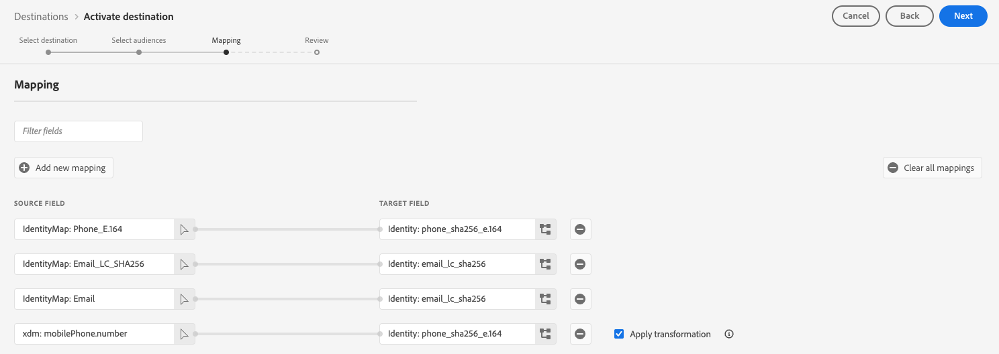

# [!DNL Google Customer Match + Display & Video 360] connection

>[!NOTE]
>
>**Limited availability of the Google Customer Match + Display & Video 360 connector** As we're going through the full lifecycle of maturity on this integration with Google, we're seeing data that points to weaknesses in implementation that need to be corrected before wider adoption can happen. Given these concerns, Adobe has reduced the visibility of this destination to a limited number of customers. We are in active conversations with Google to improve the product experience. We understand this may be disappointing news, but we believe it's the responsible approach to ensure a high-quality, reliable experience for our customers. 

Use this destination to activate your first-party PII-based [[!DNL Google Customer Match]](https://support.google.com/google-ads/answer/6379332?hl=en) lists directly to [!DNL Google Display & Video 360] properties such as [!DNL Search], [!DNL YouTube], [!DNL Gmail], and the [!DNL Google Display Network].

Certain Google-integrated third parties, such as Adobe Real-Time CDP, can use the [!DNL Google Audience Partner API] to create [!DNL Customer Match] audiences directly in customers' [!DNL Display & Video 360] account.

With the newly introduced capability of being able to utilize [!DNL Customer Matched] audiences across [!DNL Display & Video 360], you are now able to target audiences across an expanded roster of inventory sources. 

## Important notice about changes to Google destinations related to updated consent requirements in the European Union

>[!IMPORTANT]
>
> Google is releasing changes to the [Google Ads API](https://developers.google.com/google-ads/api/docs/start), [Customer Match](https://ads-developers.googleblog.com/2023/10/updates-to-customer-match-conversion.html), and the [Display & Video 360 API](https://developers.google.com/display-video/api/guides/getting-started/overview) in order to support the compliance and consent-related requirements defined under the [Digital Markets Act](https://digital-markets-act.ec.europa.eu/index_en) (DMA) in the European Union ([EU User Consent Policy](https://www.google.com/about/company/user-consent-policy/)). Enforcement of these changes to consent requirements is live as of March 6, 2024.
> 
>To adhere to the EU user consent policy and continue creating audience lists for users in the European Economic Area (EEA), advertisers and partners must ensure they are passing end-user consent when uploading audience data. As a Google Partner, Adobe provides you with the necessary tools to comply with these consent requirements under the DMA in the European Union.
> 
>Customers who have purchased Adobe Privacy & Security Shield and have configured a [consent policy](../../../data-governance/enforcement/auto-enforcement.md#consent-policy-evaluation) to filter out non-consented profiles do not need to take any action.
> 
>Customers who have not purchased Adobe Privacy & Security Shield must use the [segment definition](../../../segmentation/home.md#segment-definitions) capabilities within [Segment Builder](../../../segmentation/ui/segment-builder.md) to filter out non-consented profiles, in order to continue using the existing Real-Time CDP Google Destinations without interruption.

## When to use this destination

Several integrations with Google are available in the destinations catalog and it might be difficult to understand when to use each of the available Google destinations. Make sense of the different use cases by reading the information in the table below:

| [Google Customer Match](/help/destinations/catalog/advertising/google-customer-match.md) | [Google Display & Video 360](/help/destinations/catalog/advertising/google-dv360.md) | [!DNL Google Customer Match] + [!DNL Display & Video 360] (this connector) |
|---------|----------|---------|
| Export your PII-based audiences and reach them on inventory available in [!DNL Google Customer Match].| Reach cookie-based audiences across inventory available via [!DNL Google Display & Video 360], on Google owned-and-operated properties like Youtube and [!DNL Search], and beyond. | Create PII-based audiences in [!DNL Google Customer Match] and reach them on the inventory available in [!DNL Google Display & Video 360], on Google owned-and-operated properties only. |

## Use cases {#use-cases}

To help you better understand how and when to use this destination, here are sample use cases that Adobe Experience Platform customers can solve by using this feature.

### Use case #1

An athletic apparel brand wants to reach existing customers through [!DNL Google Search] and [!DNL Google Shopping] to personalize offers and items based on their past purchases and browsing history. The apparel brand can ingest email addresses from their own CRM to Experience Platform, and build audiences from their own offline data. Then, they can send these audiences to the [!DNL Google Customer Match + Display & Video 360] destination to be used across [!DNL Google Display & Video 360] properties such as [!DNL Search], [!DNL YouTube], [!DNL Gmail], and the [!DNL Google Display Network].

### Use case #2

A prominent technology company has launched a new phone. To promote this new phone model, they are looking to drive awareness of the new features and functionality of the phone to customers who own previous models of their phones. 

To promote the release, they upload email addresses from their CRM database into Experience Platform, using the email addresses as identifiers. Audiences are created based on customers who own older phone models. Then audiences get sent to [!DNL Google Customer Match], so the company can target current customers, customers who own older phone models, and similar customers on [!DNL Google Display & Video 360] properties such as [!DNL Search], [!DNL YouTube], [!DNL Gmail], and the [!DNL Google Display Network].

## Supported identities {#supported-identities}

[!DNL Google Customer Match] supports the activation of identities described in the table below. Learn more about [identities](/help/identity-service/features/namespaces.md).

|Target Identity|Description|Considerations|
|---|---|---|
|GAID|Google Advertising ID|Select the GAID target identity when your source identity is a GAID namespace.|
|IDFA|Apple ID for Advertisers|Select the IDFA target identity when your source identity is an IDFA namespace.|
|phone_sha256_e.164|Phone numbers in E164 format, hashed with the SHA256 algorithm|Both plain text and SHA256 hashed phone numbers are supported by Adobe Experience Platform. Follow the instructions in the [ID matching requirements](#id-matching-requirements-id-matching-requirements) section and use the appropriate namespaces for plain text and hashed phone numbers, respectively. When your source field contains unhashed attributes, check the **[!UICONTROL Apply transformation]** option, to have [!DNL Experience Platform] automatically hash the data on activation.|
|email_lc_sha256|Email addresses hashed with the SHA256 algorithm|Both plain text and SHA256 hashed email addresses are supported by Adobe Experience Platform. Follow the instructions in the [ID matching requirements](#id-matching-requirements-id-matching-requirements) section and use the appropriate namespaces for plain text and hashed email addresses, respectively. When your source field contains unhashed attributes, check the **[!UICONTROL Apply transformation]** option, to have [!DNL Experience Platform] automatically hash the data on activation.|

{style="table-layout:auto"}

## Supported audiences {#supported-audiences}

This section describes which types of audiences you can export to this destination.

| Audience origin | Supported | Description | 
|---------|----------|----------|
| [!DNL Segmentation Service] | ✓ | Audiences generated through the Experience Platform [Segmentation Service](../../../segmentation/home.md).|
| Custom uploads | ✓ | Audiences [imported](../../../segmentation/ui/audience-portal.md#import-audience) into Experience Platform from CSV files. |

{style="table-layout:auto"}

## Export type and frequency {#export-type-frequency}

Refer to the table below for information about the destination export type and frequency.

| Item | Type | Notes |
|---------|----------|---------|
| Export type | **[!UICONTROL Audience export]** | You are exporting all members of an audience with the identifiers (name, phone number, and others) used in the [!DNL Google Customer Match] destination.|
| Export frequency | **[!UICONTROL Streaming]** | Streaming destinations are "always on" API-based connections. As soon as a profile is updated in Experience Platform based on audience evaluation, the connector sends the update downstream to the destination platform. Read more about [streaming destinations](/help/destinations/destination-types.md#streaming-destinations).|

{style="table-layout:auto"}

## [!DNL Google Customer Match] account prerequisites {#google-account-prerequisites}

Before setting up a [!DNL Google Customer Match] destination in Experience Platform, make sure you read and adhere to Google's policy for using [!DNL Customer Match], outlined in the [Google support documentation](https://support.google.com/google-ads/answer/6299717).

Next, make sure that your [!DNL Google] account is configured for a [!DNL Standard] or higher permission level. See the [Google Ads documentation](https://support.google.com/google-ads/answer/9978556?visit_id=637611563637058259-4176462731&rd=1) for details.

### Account linking requirements {#linking}

Before configuring this destination connector, you must link your Google account ID to Adobe's Google account ID: `4641108541`. 

Data exports will fail if your Google account is not properly linked to Adobe's account ID.

>[!NOTE]
>
>For customers who were part of the beta program for this connector: Adobe has updated the Google Partner Account ID from `6219889373` to `4641108541`. 
>
>**If you were part of the beta program for the Google Customer Match + Display & Video 360 connector and if your Google account is currently linked to the old Adobe Partner Account ID (`6219889373`) follow the steps below:**
>
>1. Unlink your Google account from the old Adobe Partner Account ID (`6219889373`)
>2. Link your Google account to the new Adobe Partner Account ID (`4641108541`)
>3. Remove all audiences from your existing dataflows
>4. Create new dataflows and map your audiences
>
>If your Google account is already linked to the new Adobe Partner Account ID (`4641108541`), no action is required from you to use this connector.

**For organizations with manager accounts:**

If your organization uses a [manager [!DNL Google] account](https://support.google.com/google-ads/answer/6139186) to manage multiple client accounts, follow these specific linking requirements:

* **To export to a specific client account:** Link that individual client account (not the manager account) to Adobe's Google account ID: `4641108541`
* **Manager account linking alone is not sufficient** and will cause data export failures

### Allow list {#allowlist}

Before creating the [!DNL Google Customer Match] destination in Experience Platform, make sure that your [!DNL Google Ads] account complies with the [[!DNL Google Customer Match] policy](https://support.google.com/google-ads/answer/6299717/customer-match-policy).

Customers with compliant accounts are automatically allowlisted by Google.

## ID matching requirements {#id-matching-requirements}

[!DNL Google] requires that no personally identifiable information (PII) is sent in clear. Therefore, the audiences activated to [!DNL Google Customer Match] must be keyed off *hashed* identifiers, such as hashed email addresses or phone numbers.

Depending on the type of IDs that you ingest into Adobe Experience Platform, you must adhere to their corresponding requirements.

### Phone number hashing requirements {#phone-number-hashing-requirements}

There are two methods to activate phone numbers in [!DNL Google Customer Match]:

* **Ingesting raw phone numbers**: you can ingest raw phone numbers in the [!DNL E.164] format into [!DNL Experience Platform], and they are automatically hashed upon activation. If you choose this option, make sure to always ingest your raw phone numbers into the `Phone_E.164` namespace.
* **Ingesting hashed phone numbers**: you can pre-hash your phone numbers before ingestion into [!DNL Experience Platform]. If you choose this option, make sure to always ingest your hashed phone numbers into the `PHONE_SHA256_E.164` namespace.

>[!NOTE]
>
>Phone numbers ingested into the `Phone` namespace cannot be activated to the [!DNL Google Customer Match + DV360] destination.

### Email hashing requirements {#hashing-requirements}

You can hash email addresses before ingesting them into Adobe Experience Platform, or use email addresses in clear in Experience Platform, and have [!DNL Experience Platform] hash them on activation.

For more information about Google's hashing requirements and other restrictions on activation, see the following sections in Google's documentation:

* [[!DNL Customer Match] with email address, address, or user ID](https://developers.google.com/google-ads/api/docs/remarketing/audience-types/customer-match#customer_match_with_email_address_address_or_user_id)
* [[!DNL Customer Match] considerations](https://developers.google.com/google-ads/api/docs/remarketing/audience-types/customer-match#customer_match_considerations)
* [[!DNL Customer Match] with phone number](https://developers.google.com/google-ads/api/docs/remarketing/audience-types/customer-match#customer_match_with_phone_number)
* [[!DNL Customer Match] with mobile device IDs](https://developers.google.com/google-ads/api/docs/remarketing/audience-types/customer-match#customer_match_with_mobile_device_ids)

To learn about ingesting email addresses in Experience Platform, see the [batch ingestion overview](../../../ingestion/batch-ingestion/overview.md) and the [streaming ingestion overview](../../../ingestion/streaming-ingestion/overview.md).

If you select to hash the email addresses yourself, make sure to comply with Google's requirements, outlined in the links above.

<!-- ### Using custom namespaces {#custom-namespaces}

Before you can use the `User_ID` namespace to send data to Google, make sure you synchronize your own identifiers using [!DNL gTag]. Refer to the [Google official documentation](https://support.google.com/google-ads/answer/9199250) for detailed information. -->

<!-- Data from unhashed namespaces is automatically hashed by [!DNL Experience Platform] upon activation.

Attribute source data is not automatically hashed. When your source field contains unhashed attributes, check the **[!UICONTROL Apply transformation]** option, to have [!DNL Experience Platform] automatically hash the data on activation.
 -->

<!-- ## Configure destination - video walkthrough {#video}

The video below demonstrates the steps to configure a [!DNL Google Customer Match] destination and activate audiences. The steps are also laid out sequentially in the next sections.

>[!VIDEO](https://video.tv.adobe.com/v/332599/?quality=12&learn=on&captions=eng) -->

## Connect to the destination {#connect}

>[!CONTEXTUALHELP]
>id="platform_destinations_gcm_dv360_accountID"
>title="Link Google and Adobe accounts"
>abstract="Make sure the Google Account ID that you enter here is already linked to your Adobe account. If you have a manager Google account with multiple client accounts and you intend to export data from Experience Platform to a specific client account, you must link that client account with your Adobe account and enter the Account ID here."

>[!IMPORTANT]
> 
>To connect to the destination, you need the **[!UICONTROL View Destinations]** and **[!UICONTROL Manage Destinations]** [access control permissions](/help/access-control/home.md#permissions). Read the [access control overview](/help/access-control/ui/overview.md) or contact your product administrator to obtain the required permissions.

To connect to this destination, follow the steps described in the [destination configuration tutorial](../../ui/connect-destination.md).

### Connection parameters {#parameters}

While [setting up](../../ui/connect-destination.md) this destination, you must provide the following information:

* **[!UICONTROL Name]**: provide a name for this destination connection
* **[!UICONTROL Description]**: provide a description for this destination connection
* **[!UICONTROL Account ID]**: your [Google Ads customer ID](https://support.google.com/google-ads/answer/1704344?hl=en). The format of the ID is xxx-xxx-xxxx. If you are using the [!DNL Google Ads Manager Account (My Client Center)], do not use your Manager Account ID. Use the [Google Ads customer ID](https://support.google.com/google-ads/answer/1704344?hl=en) instead.
* **[!UICONTROL Account type]**: your Google account type. Select an option, depending on your advertising account type with Google:
    * **[!UICONTROL Display Video Partner]**
    * **[!UICONTROL Display Video Advertiser]**

### Enable alerts {#enable-alerts}

You can enable alerts to receive notifications on the status of the dataflow to your destination. Select an alert from the list to subscribe to receive notifications on the status of your dataflow. For more information on alerts, see the guide on [subscribing to destinations alerts using the UI](../../ui/alerts.md).

When you are finished providing details for your destination connection, select **[!UICONTROL Next]**.

## Activate audiences to this destination {#activate}

>[!IMPORTANT]
> 
>* To activate data, you need the **[!UICONTROL View Destinations]**, **[!UICONTROL Activate Destinations]**, **[!UICONTROL View Profiles]**, and **[!UICONTROL View Segments]** [access control permissions](/help/access-control/home.md#permissions). Read the [access control overview](/help/access-control/ui/overview.md) or contact your product administrator to obtain the required permissions.
>* To export *identities* to destinations, you need the **[!UICONTROL View Identity Graph]** [access control permission](/help/access-control/home.md#permissions).   {width="100" zoomable="yes"}

See [Activate audience data to streaming audience export destinations](../../ui/activate-segment-streaming-destinations.md) for instructions on activating audiences to this destination.

<!-- In the **[!UICONTROL Segment schedule]** step, you must provide the [!UICONTROL App ID] when sending [!DNL IDFA] or [!DNL GAID] audiences to [!DNL Google Customer Match].

For details on how to find the [!DNL App ID], refer to the [Google official documentation](https://developers.google.com/adwords/api/docs/reference/v201809/AdwordsUserListService.CrmBasedUserList#appid) or ask your Google representative. -->

### Mapping example: activating audience data in [!DNL Google Customer Match + Display & Video 360] {#example-gcm}

This is an example of correct identity mapping when activating audience data in [!DNL Google Customer Match + Display & Video 360].

Selecting source fields:

* Select the `Email` namespace as source identity if the email addresses you are using are not hashed.
* Select the `Email_LC_SHA256` namespace as source identity if you hashed customer email addresses on data ingestion into [!DNL Experience Platform], according to [!DNL Google Customer Match] [email hashing requirements](#hashing-requirements).
* Select the `PHONE_E.164` namespace as source identity if your data consists of non-hashed phone numbers. [!DNL Experience Platform] will hash the phone numbers to comply with [!DNL Google Customer Match] requirements.
* Select the `Phone_SHA256_E.164` namespace as source identity if you hashed phone numbers on data ingestion into [!DNL Experience Platform], according to [!DNL Facebook] [phone number hashing requirements](#phone-number-hashing-requirements).

Selecting target fields:

* Select the `Email_LC_SHA256` namespace as target identity when your source namespaces are either `Email` or `Email_LC_SHA256`.
* Select the `Phone_SHA256_E.164` namespace as target identity when your source namespaces are either `PHONE_E.164` or `Phone_SHA256_E.164`.

Data from unhashed namespaces is automatically hashed by [!DNL Experience Platform] upon activation.

Attribute source data is not automatically hashed. When your source field contains unhashed attributes, check the **[!UICONTROL Apply transformation]** option, to have [!DNL Experience Platform] automatically hash the data on activation.

## Monitor destination {#monitor-destination}

After connecting to the destination and establishing a destination dataflow, you can use the [monitoring functionality](/help/dataflows/ui/monitor-destinations.md) in Real-Time CDP to get extensive information about the profile records activated to your destination in each dataflow run. 

The monitoring information for the [!DNL Google Customer Match + Display & Video 360] connection includes audience-level information related to activated, excluded, and failed identities in each dataflow and dataflow run. [Read more](/help/dataflows/ui/monitor-destinations.md#segment-level-view) about the functionality. 

## Verify that audience activation was successful {#verify-activation}

After completing the activation flow, switch to your **[!UICONTROL Google Ads]** account. The activated audiences are shown in your Google account as customer lists. Depending on your audience size, some audiences do not populate unless there are over 1000 active users to serve. Find further information in the [Google Audience Partner documentation](https://developers.google.com/audience-partner/api/docs/customer-match/get-started#verify-list). Note that you need to ask Google for access to the documentation in the link.

## Data governance

Some destinations in Experience Platform have certain rules and obligations for data sent to, or received from, the destination platform. You are responsible for understanding the limitations and obligations of your data and how you use that data in Adobe Experience Platform and the destination platform. Adobe Experience Platform provides data governance tools to help you manage some of those data usage obligations. [Learn more](../../../data-governance/labels/overview.md) about data governance tools and policies.

## Troubleshooting {#troubleshooting}

### 400 Bad Request error message {#bad-request}

When configuring this destination, you may receive the following error:

`{"message":"Google Customer Match Error: OperationAccessDenied.ACTION_NOT_PERMITTED","code":"400 BAD_REQUEST"}`

This error occurs when customer accounts do not comply with the [prerequisites](#google-account-prerequisites). To fix this issue, contact Google and make sure that your account is allow-listed and is configured for a [!DNL Standard] or higher permission level. See the [Google Ads documentation](https://support.google.com/google-ads/answer/9978556?visit_id=637611563637058259-4176462731&rd=1) for details.
