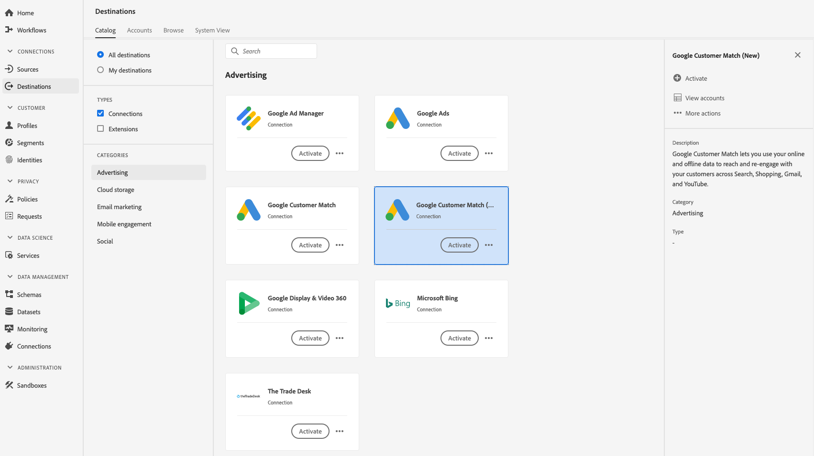
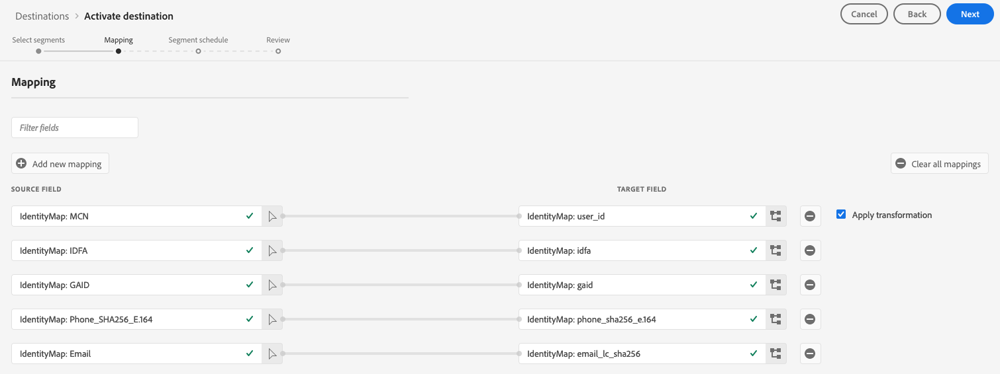
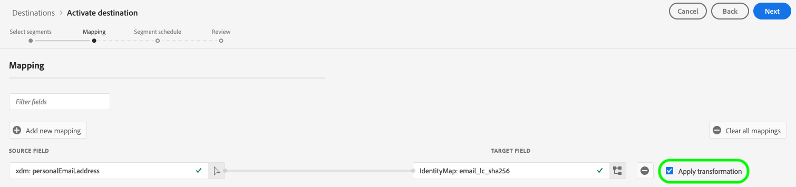

# [!DNL Google Customer Match] connection

## Overview {#overview}

[[!DNL Google Customer Match]](https://support.google.com/google-ads/answer/6379332?hl=en) lets you use your online and offline data to reach and re-engage with your customers across Google's owned and operated properties, such as: [!DNL Search], [!DNL Shopping], [!DNL Gmail], and [!DNL YouTube].

## Use cases {#use-cases}

To help you better understand how and when to use the [!DNL Google Customer Match] destination, here are sample use cases that Adobe Experience Platform customers can solve by using this feature.

### Use case #1

An athletic apparel brand wants to reach existing customers through [!DNL Google Search] and [!DNL Google Shopping] to personalize offers and items based on their past purchases and browsing history. The apparel brand can ingest email addresses from their own CRM to Experience Platform, and build audiences from their own offline data. Then, they can send these audiences to [!DNL Google Customer Match] to be used across [!DNL Search] and [!DNL Shopping], optimizing their advertising spending.  

### Use case #2

A prominent technology company launched a new phone. To promote this new phone model, they are looking to drive awareness of the new features and functionality of the phone to customers who own previous models of their phones. 

To promote the release, they upload email addresses from their CRM database into Experience Platform, using the email addresses as identifiers. Audiences are created based on customers who own older phone models. Then audiences get sent to [!DNL Google Customer Match], so the company can target current customers, customers who own older phone models, and similar customers on [!DNL YouTube]. 

## Data governance for [!DNL Google Customer Match] destinations {#data-governance}

Some destinations in Experience Platform have certain rules and obligations for data sent to, or received from, the destination platform. You are responsible for understanding the limitations and obligations of your data and how you use that data in Adobe Experience Platform and the destination platform. Adobe Experience Platform provides data governance tools to help you manage some of those data usage obligations. [Learn more](../../../data-governance/labels/overview.md) about data governance tools and policies.

## Supported identities {#supported-identities}

[!DNL Google Customer Match] supports the activation of identities described in the table below. Learn more about [identities](/help/identity-service/namespaces.md).

|Target Identity|Description|Considerations|
|---|---|---|
|GAID|Google Advertising ID|Select this target identity when your source identity is a GAID namespace.|
|IDFA|Apple ID for Advertisers|Select this target identity when your source identity is an IDFA namespace.|
|phone_sha256_e.164|Phone numbers in E164 format, hashed with the SHA256 algorithm|Both plain text and SHA256 hashed phone numbers are supported by Adobe Experience Platform. Follow the instructions in the [ID matching requirements](#id-matching-requirements-id-matching-requirements) section and use the appropriate namespaces for plain text and hashed phone numbers, respectively. When your source field contains unhashed attributes, check the **[!UICONTROL Apply transformation]** option, to have [!DNL Platform] automatically hash the data on activation.|
|email_lc_sha256|Email addresses hashed with the SHA256 algorithm|Both plain text and SHA256 hashed email addresses are supported by Adobe Experience Platform. Follow the instructions in the [ID matching requirements](#id-matching-requirements-id-matching-requirements) section and use the appropriate namespaces for plain text and hashed email addresses, respectively. When your source field contains unhashed attributes, check the **[!UICONTROL Apply transformation]** option, to have [!DNL Platform] automatically hash the data on activation.|
|user_id|Custom user IDs|Select this target identity when your source identity is a custom namespace.|

{style="table-layout:auto"}

## Supported audiences {#supported-audiences}

This section describes all the audiences that you can export to this destination.

All destinations support the activation of audiences generated through the Experience Platform [Segmentation Service](../../../segmentation/home.md).

Additionally, this destination also supports the activation of the audiences described in the table below.

| Audience type | Description | 
---------|----------|
| Custom uploads | Audiences ingested into Experience Platform from CSV files. |

{style="table-layout:auto"}

## Export type and frequency {#export-type-frequency}

Refer to the table below for information about the destination export type and frequency.

| Item | Type | Notes |
---------|----------|---------|
| Export type | **[!UICONTROL Audience export]** | You are exporting all members of an audience with the identifiers (name, phone number, and others) used in the [!DNL Google Customer Match] destination.|
| Export frequency | **[!UICONTROL Streaming]** | Streaming destinations are "always on" API-based connections. As soon as a profile is updated in Experience Platform based on audience evaluation, the connector sends the update downstream to the destination platform. Read more about [streaming destinations](/help/destinations/destination-types.md#streaming-destinations).|

{style="table-layout:auto"}

## [!DNL Google Customer Match] account prerequisites {#google-account-prerequisites}

Before setting up a [!DNL Google Customer Match] destination in Experience Platform, make sure you read and adhere to Google's policy for using [!DNL Customer Match], outlined in the [Google support documentation](https://support.google.com/google-ads/answer/6299717).

Next, make sure your [!DNL Google] account is configured for a [!DNL Standard] or higher permission level. See the [Google Ads documentation](https://support.google.com/google-ads/answer/9978556?visit_id=637611563637058259-4176462731&rd=1) for details.

### Allow list {#allowlist}

Before creating the [!DNL Google Customer Match] destination in Experience Platform, make sure your [!DNL Google Ads] account complies with the [[!DNL Google Customer Match] policy](https://support.google.com/google-ads/answer/6299717/customer-match-policy).

Customers with compliant accounts are automatically allow listed by Google.

## ID matching requirements {#id-matching-requirements}

[!DNL Google] requires that no personally identifiable information (PII) is sent in clear. Therefore, the audiences activated to [!DNL Google Customer Match] can be keyed off *hashed* identifiers, such as email addresses or phone numbers.

Depending on the type of IDs that you ingest into Adobe Experience Platform, you must adhere to their corresponding requirements.

### Phone number hashing requirements {#phone-number-hashing-requirements}

There are two methods to activate phone numbers in [!DNL Google Customer Match]:

* **Ingesting raw phone numbers**: you can ingest raw phone numbers in the [!DNL E.164] format into [!DNL Platform], and they are automatically hashed upon activation. If you choose this option, make sure to always ingest your raw phone numbers into the `Phone_E.164` namespace.
* **Ingesting hashed phone numbers**: you can pre-hash your phone numbers before ingestion into [!DNL Platform]. If you choose this option, make sure to always ingest your hashed phone numbers into the `PHONE_SHA256_E.164` namespace.

>[!NOTE]
>
>Phone numbers ingested into the `Phone` namespace cannot be activated in [!DNL Google Customer Match].

### Email hashing requirements {#hashing-requirements}

You can hash email addresses before ingesting them into Adobe Experience Platform, or use email addresses in clear in Experience Platform, and have [!DNL Platform] hash them on activation.

For more information about Google's hashing requirements and other restrictions on activation, see the following sections in Google's documentation:

* [[!DNL Customer Match] with email address, address, or user ID](https://developers.google.com/google-ads/api/docs/remarketing/audience-types/customer-match#customer_match_with_email_address_address_or_user_id)
* [[!DNL Customer Match] considerations](https://developers.google.com/google-ads/api/docs/remarketing/audience-types/customer-match#customer_match_considerations)
* [[!DNL Customer Match] with phone number](https://developers.google.com/google-ads/api/docs/remarketing/audience-types/customer-match#customer_match_with_phone_number)
* [[!DNL Customer Match] with mobile device IDs](https://developers.google.com/google-ads/api/docs/remarketing/audience-types/customer-match#customer_match_with_mobile_device_ids)

To learn about ingesting email addresses in Experience Platform, see the [batch ingestion overview](../../../ingestion/batch-ingestion/overview.md) and the [streaming ingestion overview](../../../ingestion/streaming-ingestion/overview.md).

If you select to hash the email addresses yourself, make sure to comply with Google's requirements, outlined in the links above.

### Using custom namespaces {#custom-namespaces}

Before you can use the `User_ID` namespace to send data to Google, make sure you synchronize your own identifiers using [!DNL gTag]. Refer to the [Google official documentation](https://support.google.com/google-ads/answer/9199250) for detailed information.

<!-- Data from unhashed namespaces is automatically hashed by [!DNL Platform] upon activation.

Attribute source data is not automatically hashed. When your source field contains unhashed attributes, check the **[!UICONTROL Apply transformation]** option, to have [!DNL Platform] automatically hash the data on activation.
 -->

<!-- ## Configure destination - video walkthrough {#video}

The video below demonstrates the steps to configure a [!DNL Google Customer Match] destination and activate audiences. The steps are also laid out sequentially in the next sections.

>[!VIDEO](https://video.tv.adobe.com/v/332599/?quality=12&learn=on&captions=eng) -->

## Connect to the destination {#connect}

>[!IMPORTANT]
> 
>To connect to the destination, you need the **[!UICONTROL Manage Destinations]** [access control permission](/help/access-control/home.md#permissions). Read the [access control overview](/help/access-control/ui/overview.md) or contact your product administrator to obtain the required permissions.

To connect to this destination, follow the steps described in the [destination configuration tutorial](../../ui/connect-destination.md).

### Connection parameters {#parameters}

While [setting up](../../ui/connect-destination.md) this destination, you must provide the following information:

* **[!UICONTROL Name]**: provide a name for this destination connection
* **[!UICONTROL Description]**: provide a description for this destination connection
* **[!UICONTROL Account ID]**: your [Google Ads customer ID](https://support.google.com/google-ads/answer/1704344?hl=en). The format of the ID is xxx-xxx-xxxx. If you are using the [!DNL Google Ads Manager Account (My Client Center)], do not use your Manager Account ID. Use the [Google Ads customer ID](https://support.google.com/google-ads/answer/1704344?hl=en) instead.

>[!IMPORTANT]
>
> * The **[!UICONTROL Combine with PII]** marketing action is selected by default for the [!DNL Google Customer Match] destination and cannot be removed.

### Enable alerts {#enable-alerts}

You can enable alerts to receive notifications on the status of the dataflow to your destination. Select an alert from the list to subscribe to receive notifications on the status of your dataflow. For more information on alerts, see the guide on [subscribing to destinations alerts using the UI](../../ui/alerts.md).

When you are finished providing details for your destination connection, select **[!UICONTROL Next]**.

## Activate audiences to this destination {#activate}

>[!IMPORTANT]
> 
>To activate data, you need the **[!UICONTROL Manage Destinations]**, **[!UICONTROL Activate Destinations]**, **[!UICONTROL View Profiles]**, and **[!UICONTROL View Segments]** [access control permissions](/help/access-control/home.md#permissions). Read the [access control overview](/help/access-control/ui/overview.md) or contact your product administrator to obtain the required permissions.

See [Activate audience data to streaming audience export destinations](../../ui/activate-segment-streaming-destinations.md) for instructions on activating audiences to this destination.

In the **[!UICONTROL Segment schedule]** step, you must provide the [!UICONTROL App ID] when sending [!DNL IDFA] or [!DNL GAID] audiences to [!DNL Google Customer Match].

For details on how to find the [!DNL App ID], refer to the [Google official documentation](https://developers.google.com/adwords/api/docs/reference/v201809/AdwordsUserListService.CrmBasedUserList#appid).

### Mapping example: activating audience data in [!DNL Google Customer Match] {#example-gcm}

This is an example of correct identity mapping when activating audience data in [!DNL Google Customer Match].

Selecting source fields:

* Select the `Email` namespace as source identity if the email addresses you are using are not hashed.
* Select the `Email_LC_SHA256` namespace as source identity if you hashed customer email addresses on data ingestion into [!DNL Platform], according to [!DNL Google Customer Match] [email hashing requirements](#hashing-requirements).
* Select the `PHONE_E.164` namespace as source identity if your data consists of non-hashed phone numbers. [!DNL Platform] will hash the phone numbers to comply with [!DNL Google Customer Match] requirements.
* Select the `Phone_SHA256_E.164` namespace as source identity if you hashed phone numbers on data ingestion into [!DNL Platform], according to [!DNL Facebook] [phone number hashing requirements](#phone-number-hashing-requirements).
* Select the `IDFA` namespace as source identity if your data consists of [!DNL Apple] device IDs. 
* Select the `GAID` namespace as source identity if your data consists of [!DNL Android] device IDs.
* Select the `Custom` namespace as source identity if your data consists of other type of identifiers.

Selecting target fields:

* Select the `Email_LC_SHA256` namespace as target identity when your source namespaces are either `Email` or `Email_LC_SHA256`.
* Select the `Phone_SHA256_E.164` namespace as target identity when your source namespaces are either `PHONE_E.164` or `Phone_SHA256_E.164`.
* Select the `IDFA` or `GAID` namespaces as target identity when your source namespaces are `IDFA` or `GAID`.
* Select the `User_ID` namespace as target identity when your source namespace is a custom one.

Data from unhashed namespaces is automatically hashed by [!DNL Platform] upon activation.

Attribute source data is not automatically hashed. When your source field contains unhashed attributes, check the **[!UICONTROL Apply transformation]** option, to have [!DNL Platform] automatically hash the data on activation.

## Verify that audience activation was successful {#verify-activation}

After completing the activation flow, switch to your **[!UICONTROL Google Ads]** account. The activated audiences are shown in your Google account as customer lists. Please note that depending on your audience size, some audiences do not populate unless there are over 100 active users to serve.

When mapping an audience to both [!DNL IDFA] and [!DNL GAID] mobile IDs, [!DNL Google Customer Match] creates a separate audience for each ID mapping. Your [!DNL Google Ads] account shows two different segments, one for the [!DNL IDFA], and one for the [!DNL GAID] mapping.

## Troubleshooting {#troubleshooting}

### 400 Bad Request error message {#bad-request}

When configuring this destination, you may receive the following error:

`{"message":"Google Customer Match Error: OperationAccessDenied.ACTION_NOT_PERMITTED","code":"400 BAD_REQUEST"}`

This error occurs when customer accounts do not comply with the [prerequisites](#google-account-prerequisites). To fix this issue, contact Google and make sure your account is allow-listed and is configured for a [!DNL Standard] or higher permission level. See the [Google Ads documentation](https://support.google.com/google-ads/answer/9978556?visit_id=637611563637058259-4176462731&rd=1) for details.

## Additional resources {#additional-resources}

* [Integrate [!DNL Google Customer Match] - Video tutorial](https://experienceleague.adobe.com/docs/platform-learn/tutorials/rtcdp/integrate-with-google-customer-match.html)

