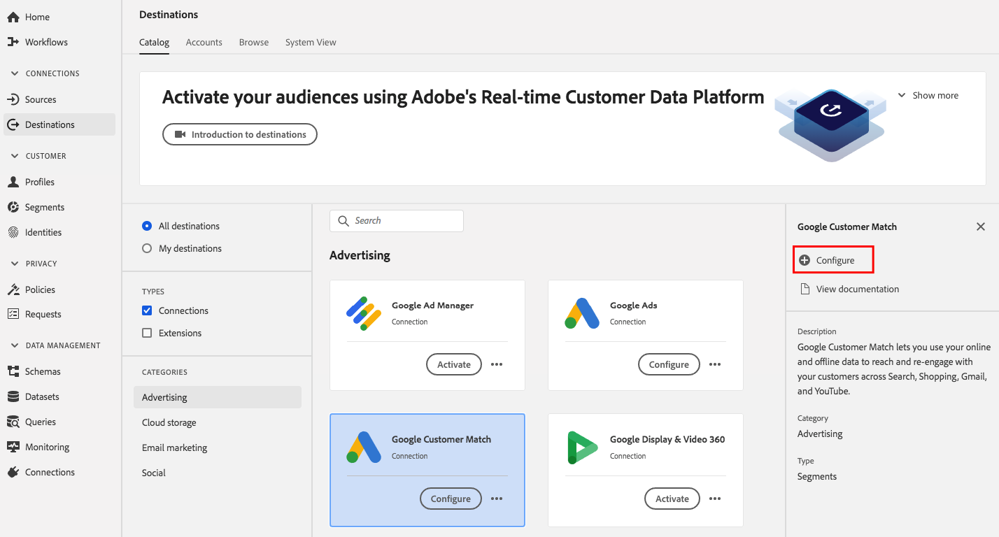
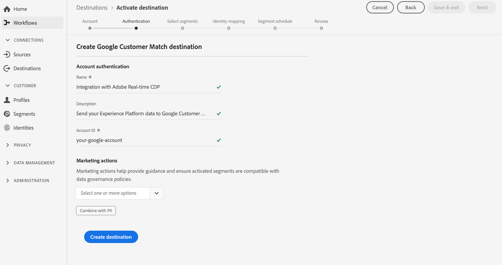
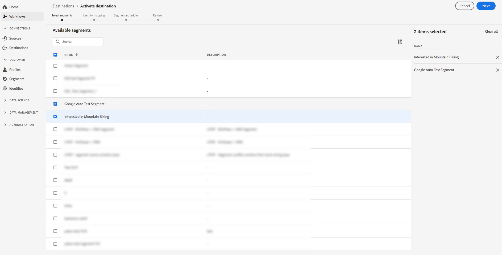
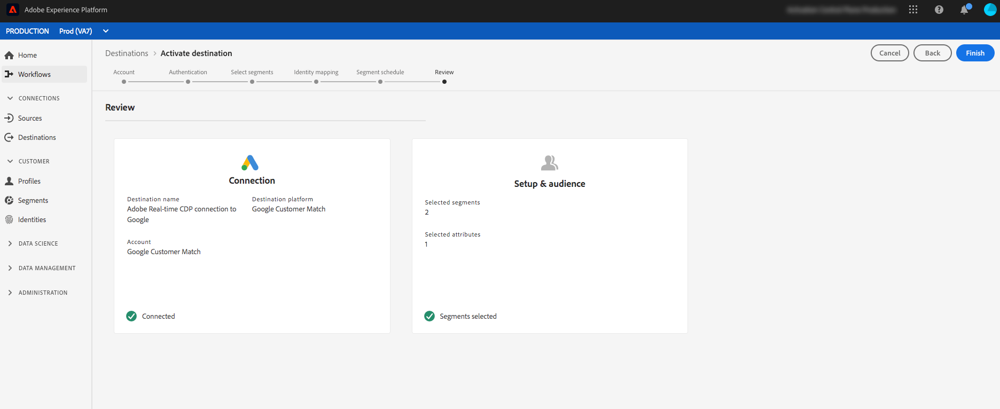

# Google Customer Match Destination

## Overview {#overview}

[Google Customer Match](https://support.google.com/google-ads/answer/6379332?hl=en) lets you use your online and offline data to reach and re-engage with your customers across Google's owned and operated properties, such as: [!DNL Search], [!DNL Shopping], [!DNL Gmail], and [!DNL YouTube].

## Use Cases

To help you better understand how and when you should use the [!DNL Google Customer Match] destination, here are sample use cases that Real-time Customer Data Platform customers can solve by using this feature.

### Use Case #1

An athletic apparel brand wants to reach existing customers through [!DNL Google Search] and [!DNL Google Shopping] to personalize offers and items based on their past purchases and browsing history. The apparel brand can ingest email addresses from their own CRM to Real-time CDP, build segments from their own offline data, and send these segments to [!DNL Google Customer Match] to be used across [!DNL Search] and [!DNL Shopping], optimizing their advertising spending.  

### Use Case #2

A prominent technology company has just released a new phone. In an effort to promote this new phone model, they are looking to drive awareness of the new features and functionality of the phone to customers who own previous models of their phones. 

To promote the release, they upload email addresses from their CRM database into Real-time CDP, using the email addresses as identifiers. Segments are created based on customers who own older phone models and sent to [!DNL Google Customer Match] so that they can target current customers, customers who own older phone models, as well as similar customers on [!DNL YouTube]. 

## Data governance for [!DNL Google Customer Match] destinations {#data-governance}

The destinations in Real-time CDP may have certain rules and obligations for data sent to, or received from, the destination platform. You are responsible for understanding the limitations and obligations of your data and how you use that data in Adobe Experience Platform and the destination platform. Adobe Experience Platform provides data governance tools to help you manage some of those data usage obligations. [Learn more](../../..//data-governance/labels/overview.md) about data governance tools and policies.

## Export Type and Identities {#export-type}

**Segment Export** - you are exporting all members of a segment (audience) with the identifiers (name, phone number, etc.) used in the [!DNL Google Customer Match] destination.

**Identities** - you can use raw or hashed emails as customer IDs in Google

## [!DNL Google Customer Match] account prerequisites {#google-account-prerequisites}

Before setting up a [!DNL Google Customer Match] destination in Real-time CDP, make sure you read and adhere to Google's policy for using [!DNL Customer Match], outlined in the [Google support documentation](https://support.google.com/google-ads/answer/6299717). 

### Allow list {#allowlist}

>[!NOTE]
>
>It is mandatory to be added to Google's allow list before setting up your first [!DNL Google Customer Match] destination in Real-time CDP. Please ensure the allow list process described below has been completed by Google before creating a destination.

Before creating the [!DNL Google Customer Match] destination in Real-time CDP, you must contact Google and follow the allow list instructions in [Use Customer Match partners to upload your data](https://support.google.com/google-ads/answer/7361372?hl=en&ref_topic=6296507) in the Google documentation.

### Email hashing requirements {#hashing-requirements}

<!--

>[!IMPORTANT]
>
> When using mobile device IDs as identifiers, an AppId must be provided in the activation flow. For more information, see step 6 in the [Activate segments](#activate-segments) section of this page.

-->

Google requires that no personally identifiable information (PII) is sent in clear. Therefore, the audiences activated to [!DNL Google Customer Match] must be keyed off *hashed* email addresses. You can choose to hash email addresses before ingesting them into Adobe Experience Platform, or you can choose to work with email addresses in clear in Experience Platform and have our algorithm hash them on activation.

For more information about Google's hashing requirements and other restrictions on activation, see the following sections in Google's documentation:

* [[!DNL Customer Match] with email address, address, or user ID](https://developers.google.com/adwords/api/docs/guides/remarketing#customer_match_with_email_address_address_or_user_id)
* [[!DNL Customer Match] considerations](https://developers.google.com/adwords/api/docs/guides/remarketing#customer_match_considerations)

<!--

Links to be added when activation based on phone number and device IDs becomes available.

* [Customer Match with phone number](https://developers.google.com/adwords/api/docs/guides/remarketing#customer_match_with_phone_number)
* [Customer Match with mobile device IDs](https://developers.google.com/adwords/api/docs/guides/remarketing#customer_match_with_mobile_device_ids)

-->

To learn about ingesting email addresses in Experience Platform, see the [batch ingestion overview](../../../ingestion/batch-ingestion/overview.md) and the [steaming ingestion overview](../../../ingestion/streaming-ingestion/overview.md).

If you select to hash the email addresses yourself, make sure to comply with Google's requirements, outlined in the links above.

>[!IMPORTANT]
>
>If you choose not to hash email addresses, Real-time CDP will do that for you when you activate segments to [!DNL Google Customer Match]. In the [activation workflow](#activate-segments) (see step 5), select the `Email` option as shown below for *plain text email addresses* and `Email_LC_SHA256` for *hashed email addresses*.

## Connect to destination {#connect-destination}

In **[!UICONTROL Destinations]** > **[!UICONTROL Catalog]**, scroll to the **[!UICONTROL Advertising]** category. Select [!DNL Google Customer Match], then select **[!UICONTROL Configure]**.

>[!NOTE]
>
>If a connection with this destination already exists, you can see an **[!UICONTROL Activate]** button on the destination card. For more information about the difference between **[!UICONTROL Activate]** and **[!UICONTROL Configure]**, refer to the [Catalog](../../ui/destinations-workspace.md#catalog) section of the destination workspace documentation.  

In the **Account** step, if you had previously set up a connection to your [!DNL Google Customer Match] destination, select **[!UICONTROL Existing Account]** and select your existing connection. Or, you can select **[!UICONTROL New Account]** to set up a new connection to [!DNL Google Customer Match]. Select **[!UICONTROL Connect to destination]** to log in and connect Adobe Experience Cloud to your [!DNL Google Ad] account.

>[!NOTE]
>
>Real-time CDP supports credentials validation in the authentication process and displays an error message if you input incorrect credentials to your [!DNL Google Ad] account. This ensures that you don't complete the workflow with incorrect credentials.

Once your credentials are confirmed and Adobe Experience Cloud is connected to your Google account, you can select **[!UICONTROL Next]** to proceed to the **[!UICONTROL Setup]** step.

In the **[!UICONTROL Authentication]** step, enter a [!UICONTROL Name] and a [!UICONTROL Description] for your activation flow and fill your Google the [!UICONTROL Account ID].   Also in this step, you can select any **[!UICONTROL Marketing use case]** that should apply to this destination. Marketing use cases indicate the intent for which data will be exported to the destination. You can select from Adobe-defined marketing use cases or you can create your own marketing use case. For more information about marketing use cases, see the [Data Governance in Real-time CDP](../../../rtcdp/privacy/data-governance-overview.md#destinations) page. For information about the individual Adobe-defined marketing use cases, see the [Data usage policies overview](../../../data-governance/policies/overview.md#core-actions). 

Select **[!UICONTROL Create Destination]** after you filled in the fields above.

>[!IMPORTANT]
>
> * The **[!UICONTROL Combine with PII]** marketing use case is selected by default for the [!DNL Google Customer Match] destination and cannot be removed. 
> * For [!DNL Google Customer Match] destinations. **[!UICONTROL Account ID]** is your customer client ID with Google. The format of the ID is xxx-xxx-xxxx.  

Your destination is now created. You can select **[!UICONTROL Save & Exit]** if you want to activate segments later on or you can select **[!UICONTROL Next]** to continue the workflow and select segments to activate. In either case, see the next section, [Activate segments to [!DNL Google Customer Match]](#activate-segments), for the rest of the workflow.

## Activate segments to [!DNL Google Customer Match] {#activate-segments}

To activate segments to [!DNL Google Customer Match], follow the steps below: 

In **[!UICONTROL Destinations > Browse]**, select the [!DNL Google Customer Match] destination where you want to activate your segments.

Click the name of the destination. This takes you to the Activate flow.

Note that if an activation flow already exists for a destination, you can see the segments that are currently being sent to the destination. Select **[!UICONTROL Edit activation]** in the right rail and follow the steps below to modify the activation details.

Select **[!UICONTROL Activate]**. In the **[!UICONTROL Activate destination]** workflow, on the **[!UICONTROL Select Segments]** page, select which segments to send to [!DNL Google Customer Match].

In the **[!UICONTROL Identity mapping]** step, select which attributes to be included as an identity in this destination. Select **[!UICONTROL Add new mapping]** and browse your schema, select email and/or hashed email, and map them to the corresponding target identity.

 

**Plain text email address as primary identity**: If you have plain text (unhashed) email addresses as primary identity in your schema, select the email field in your **[!UICONTROL Source Attributes]** and map to the Email field in the right column under **[!UICONTROL Target Identities]**, as shown below:

 

**Hashed email address as primary identity**: If you have hashed email addresses as primary identity in your schema, select the hashed email field in your **[!UICONTROL Source Attributes]** and map to the Email_LC_SHA256 field in the right column under **[!UICONTROL Target Identities]**, as shown below:

On the **[!UICONTROL Segment schedule]** page, you can set the start date for sending data to the destination.

On the **[!UICONTROL Review]** page, you can see a summary of your selection. Select **[!UICONTROL Cancel]** to break up the flow, **[!UICONTROL Back]** to modify your settings, or **[!UICONTROL Finish]** to confirm your selection and start sending data to the destination.

>[!IMPORTANT]
>
>In this step, Real-time CDP checks for data usage policy violations. Shown below is an example where a policy is violated. You cannot complete the segment activation workflow until you have resolved the violation. For information on how to resolve policy violations, see [Policy enforcement](../../../rtcdp/privacy/data-governance-overview.md#enforcement) in the data governance documentation section.
 

If no policy violations have been detected, select **[!UICONTROL Finish]** to confirm your selection and start sending data to the destination.

<!--

Insert in Step 6 when mobile device ID activation is available

    >[!IMPORTANT]
    >
    >If you select mobile device IDs (GAID or IDFA) as primary identity in the Identity mapping step, you must also provide an Application Id in this step. If you selected GAID as identity, see [Set the Application ID](https://developer.android.com/studio/build/application-id) in the Android developer documentation. IF you selected IDFA as identity, see [App ID](https://developer.android.com/studio/build/application-id) in the Apple developer documentation.

     

-->

## Verify that segment activation was successful {#verify-activation}

After completing the activation flow, switch to your **[!UICONTROL Google Ads]** account. The activated segments will now show up in your Google account as customer lists. Please note that depending on your segment size, some audiences will not populate unless there are over 100 active users to serve.

## Additional resources {#additional-resources}

* [Integrate Google Customer Match - Video tutorial](https://experienceleague.adobe.com/docs/platform-learn/tutorials/rtcdp/integrate-with-google-customer-match.html)