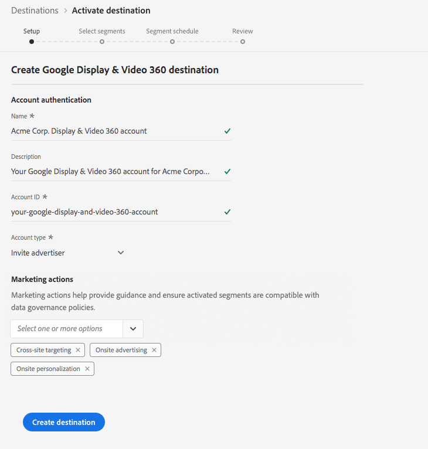

# [!DNL Google Display & Video 360] connection

## Overview {#overview}

[!DNL Display & Video 360], formerly known as [!DNL DoubleClick Bid Manager], is a tool used to execute retargeting and audience targeted digital campaigns across Display, Video and Mobile inventory sources. 

## Destination specifics {#specifics}

Note the following details that are specific to [!DNL Google Display & Video 360] destinations:

* Activated audiences are created programmatically in the Google platform.
* Platform does not currently include a measurement metric to validate successful activation. Refer to the audience counts in Google to validate the integration and understand audience targeting size.

>[!IMPORTANT]
>
>If you are looking to create your first destination with Google Display & Video 360 and have not enabled the [ID sync functionality](https://experienceleague.adobe.com/docs/id-service/using/id-service-api/methods/idsync.html) in Experience Cloud ID Service in the past (with Adobe Audience Manager or other applications), please reach out to Adobe Consulting or Customer Care to enable ID syncs. If you had previously set up Google integrations in Audience Manager, the ID syncs you had set up carry over to Platform.

## Supported Identities {#supported-identities}

[!DNL Google Ad Manager] supports the activation of identities described in the table below.

|Target Identity|Description|Considerations|
|---|---|---|
|GAID|[!DNL Google Advertising ID]|Select this target identity when your source identity is a GAID namespace.|
|IDFA|[!DNL Apple ID for Advertisers]|Select this target identity when your source identity is an IDFA namespace.|
|AAM UUID|[Adobe Audience Manager [!DNL Unique User ID]](https://experienceleague.adobe.com/docs/audience-manager/user-guide/reference/ids-in-aam.html), also known as [!DNL Device ID]. A numerical, 38-digit device ID that Audience Manager associates to each device it interacts with.|Google uses [AAM UUID](https://experienceleague.adobe.com/docs/audience-manager/user-guide/reference/ids-in-aam.html?lang=en) to target users in California, and the Google Cookie ID for all other users.|
|[!DNL Google] cookie ID|[!DNL Google] cookie ID|[!DNL Google] uses this ID to target users outside of California.|
|RIDA|Roku ID for Advertising. This ID uniquely identifies Roku devices.||
|MAID|Microsoft Advertising ID. This ID uniquely identifies devices running Windows 10.||
|Amazon Fire TV ID|This ID uniquely identifies Amazon Fire TVs.||

## Export Type {#export-type}

**Segment Export** - you are exporting all members of a segment (audience) to the Google destination.

## Prerequisites

### Allow list

>[!NOTE]
>
>The allow list is mandatory before setting up your first [!DNL Google Display & Video 360] destination in Platform. Please ensure the allow list process described below has been completed by Google before creating a destination.

Before creating the [!DNL Google Display & Video 360] destination in Platform, you must contact Google asking for Adobe to be put on the list of allowed data providers, and for your account to be added to the allow list. Contact Google and provide the following information:

* **Account ID** : this is Adobe's account ID with Google. Contact Adobe Customer Care or your Adobe representative to obtain this ID.
* **Customer ID** : this is Adobe's customer account ID with Google. Contact Adobe Customer Care or your Adobe representative to obtain this ID.
* **Your account type**: use **[!DNL Invite advertiser]** to allow audiences to be shared only to a specific brand in your Display & Video 360 account or use **[!DNL Invite partner]** to allow audiences to be shared to all brands in your Display & Video 360 account.

## Configure destination

In **[!UICONTROL Connections]** > **[!UICONTROL Destinations]**, select [!DNL Google Display & Video 360], and select **[!UICONTROL Configure]**.

    
>[!NOTE]
>
>If a connection with this destination already exists, you can see an **[!UICONTROL Activate]** button on the destination card. For more information about the difference between [!UICONTROL Activate] and [!UICONTROL Configure], refer to the [Catalog](../../ui/destinations-workspace.md#catalog) section of the destination workspace documentation.  

In the **Setup** step of the create destination workflow, fill in the [!UICONTROL Basic Information] for the destination, as well as the marketing actions that should apply to this destination.

*  **[!UICONTROL Name]**: Fill in the preferred name for this destination.
*  **[!UICONTROL Description]**: Optional. For example, you can mention which campaign you are using this destination for.
*  **[!UICONTROL Account Type]**: Select an option, depending on your account with Google:
   * Use `Invite Advertiser` to allow audiences to be shared only to a specific brand in your Display & Video 360 account.
   * Use `Invite Partner` to allow audiences to be shared to all brands in your Display & Video 360 account.
*  **[!UICONTROL Account ID]**: Fill in your **[!DNL Invite partner]** or **[!DNL Invite advertiser]** account ID with Google. Typically, this is a six or seven digit ID.
*  **[!UICONTROL Marketing action]**: Marketing actions indicate the intent for which data will be exported to the destination. You can select from Adobe-defined marketing actions or you can create your own marketing action. For more information about marketing actions, see the [Data usage policies overview](../../../data-governance/policies/overview.md).  

>[!NOTE]
>
>When setting up a [!DNL Google Display & Video 360] destination please work with your [!DNL Google Account Manager] or Adobe representative to understand which account type you have.

## Activate segments to [!DNL Google Display & Video 360]

For instructions on how to activate segments to [!DNL Google Display & Video 360], see [Activate Data to Destinations](../../ui/activate-destinations.md).

## Exported data 

To verify if data has been exported successfully to the [!DNL Google Display & Video 360] destination, check your [!DNL Google Display & Video 360] account. If activation was successful, audiences are populated in your account.