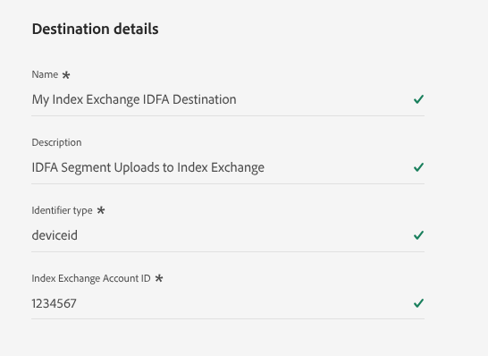
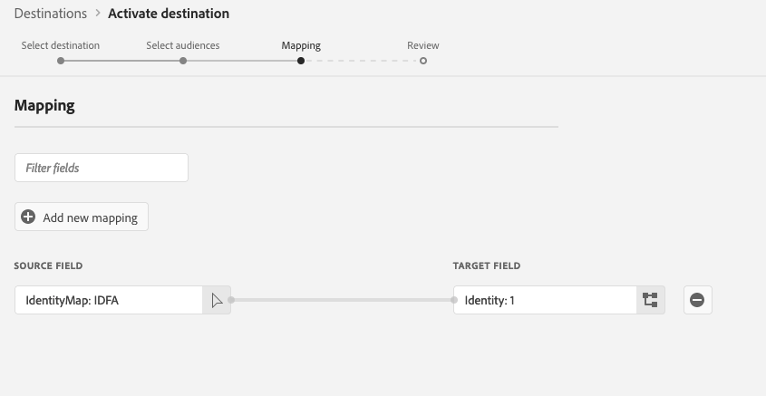

# [!DNL Index Exchange] {#index-exchange}

## Overview {#overview}

[!DNL Index] is a global advertising supply-side platform that helps media owners maximize the value of their content across every screen. With over 20 years of industry leadership, [!DNL Index] connects the world's largest brands with premium experience makers to deliver high-quality consumer experiences.

Use this destination connector to export audience segments from Adobe Experience Platform directly to [!DNL Index Exchange]'s programmatic advertising platform.

Once exported, these audience segments can be used to target deals by media owners, marketplace partners, or shared with publishers and curators by marketplace vendors.

>[!IMPORTANT]
>
>The destination connector and documentation page are created and maintained by the [!DNL Index] team. For questions or update requests, contact them directly at [technical_am_marketplace@indexexchange.com](mailto:technical_am_marketplace@indexexchange.com).

## Use cases {#use-cases}

To help you better understand how and when you should use the [!DNL Index Exchange] destination, here are sample use cases that Experience Platform customers can solve by using this destination.

### Targeting users on mobile, web, and CTV platforms {#targeting-users}

Media owners, marketplace partners, or marketplace vendors who want to send audiences from Experience Platform to [!DNL Index] to target users on mobile, web, and CTV platforms, using a large range of identifiers.

### Targeting specific content on mobile, web, and CTV platforms {#targeting-content}

Media owners, marketplace partners, or marketplace vendors who want to send audiences from Experience Platform to [!DNL Index] to target users looking at specific content across mobile, web, and CTV platforms using specific URLs, App Bundles or content IDs.

## Prerequisites {#prerequisites}

Audience segments must be registered with [!DNL Index] using an additional process when using this destination before they will appear in your account. Reach out to your [!DNL Index Exchange] account representative for assistance with this process.

## Supported identities {#supported-identities}

[!DNL Index] supports the activation of identities described in the table below. Learn more about [identities](/help/identity-service/features/namespaces.md).

Note that [!DNL Index Exchange] destinations support only one identity type per upload. You must specify the appropriate identifier type when configuring the destination details (see the ["Fill in destination details"](#destination-details) section below).

To upload multiple identity types, create separate instances of the [!DNL Index Exchange] destination for each identity type.

|Target Identity | Description | Considerations |
| --- | --- | --- |
| GAID | Google Advertising ID | If the source identity is a GAID namespace, select GAID as the target identity. |
| IDFA | Apple ID for Advertisers | If your source identity is an IDFA namespace, select the IDFA target identity. |
| Windows AID | Windows Advertising ID | If your source identity is a Windows AID namespace, select the Windows AID target identity. |
| extern_id | Custom user IDs | If your source identity is a custom namespace, select this target identity. |

{style="table-layout:auto"}

## Supported audiences {#supported-audiences}

This section explains which audience types you can export to this destination.

| Audience origin | Supported | Description | 
| --------- | ---------- | ---------- |
| [!DNL Segmentation Service] | ✓ | Audiences generated through the Experience Platform [Segmentation Service](../../../segmentation/home.md). |
| Custom uploads | ✓ | Audiences [imported](../../../segmentation/ui/overview.md#import-audience) into Experience Platform from CSV files. |

{style="table-layout:auto"}

## Export type and frequency {#export-type-frequency}

Refer to the table below for information about the destination export type and frequency.

| Item | Type | Notes |
| --------- | ---------- | --------- | 
| Export type | **[!UICONTROL Segment export]** | Exports all members of a segment (audience) with the identifiers (IDFA, GAID, or others) used in the [!DNL Index Exchange] destination. |
| Export frequency | **[!UICONTROL Batch]** | Exports files to downstream platforms at intervals of 3, 6, 8, 12, or 24 hours. Read more about [batch file-based destinations](/help/destinations/destination-types.md#file-based). |

{style="table-layout:auto"}

## Connect to the destination {#connect}

>[!IMPORTANT]
> 
>To connect to the destination, you need the **[!UICONTROL View Destinations]** and **[!UICONTROL Manage Destinations]** [access control permission](/help/access-control/home.md#permissions). Read the [access control overview](/help/access-control/ui/overview.md) or contact your product administrator to obtain the required permissions.

To connect to this destination, follow the steps described in the [destination configuration tutorial](../../ui/connect-destination.md). In the configure destination workflow, fill in the fields listed in the two sections below.

### Fill in destination details {#destination-details}

To configure details for the destination, fill in the fields below. An asterisk next to a field in the UI indicates that the field is required.

* [!UICONTROL Name]: Enter a name to help you recognize this destination later.
* [!UICONTROL Description]: Enter a description to help you identify this destination later.
* [!UICONTROL Identifier Type]: Select the Index–provided identifier type that matches the identifier you are sending to [!DNL Index]. See the table of supported identifier types below. If you are unsure which identifier type to use, contact your [!DNL Index] Representative. To send multiple identifier types, create separate instances of this destination.
* [!UICONTROL Account ID]: Enter your [!DNL Index] account ID. This is not the same as your publisher ID. If you are unsure about which ID to use, contact your [!DNL Index] Representative.

#### Supported Identifier Types

| Identifier Type | Description | 
|------------------ | ------------- |
| [!DNL appbundle] | Mobile App Bundle | 
| [!DNL contentid] | Content ID |
| [!DNL deviceid] | Device ID (eg. IDFA, GAID, WAID, etc) |
| [!DNL ip] | IP Address |
| [!DNL postcode] | ZIP / Postal Code |
| [!DNL url] | Site URL |
| [!DNL ppid_xxx] | For PPID identifiers, reach out to your [!DNL Index Exchange] account representative for assistance. |

{style="table-layout:auto"}

### Enable alerts {#enable-alerts}

You can enable alerts to receive notifications about the status of your dataflow to this destination. Select one or more alerts from the list to subscribe to status notifications for your dataflow. For more information, see the guide on [subscribing to destinations alerts using the UI](../../ui/alerts.md).
When you are finished providing details for your destination connection, select **[!UICONTROL Next]**.

## Activate segments to this destination {#activate}

>[!IMPORTANT]
> 
>* To activate data, you need the **[!UICONTROL View Destinations]**, **[!UICONTROL Activate Destinations]**, **[!UICONTROL View Profiles]**, and **[!UICONTROL View Segments]** [access control permissions](/help/access-control/home.md#permissions). Read the [access control overview](/help/access-control/ui/overview.md) or contact your product administrator to obtain the required permissions.
>* To export *identities*, you need the **[!UICONTROL View Identity Graph]** [access control permission](/help/access-control/home.md#permissions).   {width="100" zoomable="yes"}

Read [Activate audience data to batch profile export destinations](/help/destinations/ui/activate-batch-profile-destinations.md) for instructions on activating audience segments to this destination.

### Map attributes and identities {#map}

Selecting source fields:

* Select an identifier (usually namespaces like IDFA or a custom ID namespace). This must correspond to the Identifier Type selected when configuring the destination. For example when using IDFA identifier as a source field, the destination must have been set up with the "deviceid" Identifier Type.

Selecting target fields:

* Names of target fields are ignored and are not important. The destination only cares about the type of identifier being sent, which is determined by the Identifier Type selected when configuring the destination.

### Register segments with [!DNL Index] {#register-segments}

Before or after activating data to the destination, contact your [!DNL Index] Representative to register the segments you plan to activate. Your representative will provide instructions on how to register additional segment details, including names, IDs, descriptions, and pricing, if applicable.

## Exported data / Validate data export {#exported-data}

Once registration is complete, the segments will be available for targeting in your [!DNL Index] account. To confirm that data is being received correctly, contact your [!DNL Index] Representative, who can provide details on the volume of segment data received.

## Data usage and governance {#data-usage-governance}

All Experience Platform destinations are compliant with data usage policies when handling your data. For detailed information on how Experience Platform enforces data governance, read the [Data Governance overview](/help/data-governance/home.md).
