# [!DNL LiveRamp - Distribution] connection

The [!DNL LiveRamp - Distribution] connection enables you to activate audiences from Experience Platform to premium publishers across mobile, web, display, and connected TV mediums.

>[!IMPORTANT]
>
>This destination connector and documentation page are created and maintained by LiveRamp. For any inquiries or update requests, contact LiveRamp directly [here](mailto:adobertcdp@liveramp.com).

## Supported destinations {#supported-destinations}

[!DNL LiveRamp - Distribution] currently supports audience activation to the following platforms:

* [[!DNL 4C Insights]](#insights)
* [[!DNL Acast]](#acast)
* [[!DNL Nexxen]](#nexxen)
* [[!DNL Ampersand.tv]](#ampersand-tv)
* [[!DNL Captify]](#captify)
* [[!DNL Cardlytics]](#cardlytics)
* [[!DNL Disney (Hulu/ESPN/ABC)]](#disney)
* [[!DNL iHeartMedia]](#iheartmedia)
* [[!DNL Index Exchange]](#index-exchange)
* [[!DNL Magnite CTV Platform]](#magnite)
* [[!DNL Magnite DV+ (Rubicon Project)]](#magnite-dv)
* [[!DNL One Fox]](#fox)
* [[!DNL Pandora]](#pandora)
* [[!DNL Reddit]](#reddit)
* [[!DNL Roku]](#roku)
* [[!DNL Spotify]](#spotify)
* [[!DNL Taboola]](#taboola)
* [[!DNL TargetSpot]](#targetspot)
* [[!DNL Teads]](#teads)
* [[!DNL WB Discovery]](#wb-discovery)

## Use cases {#use-cases}

To help you better understand how and when you should use the [!DNL LiveRamp - Distribution] destination, here is a sample use case that Adobe Experience Platform customers can solve by using this destination.

The marketing team of a sports apparel retailer used the [LiveRamp - Onboarding](liveramp-onboarding.md) connection to send audiences from Experience Platform to their LiveRamp account.

Through the [!DNL LiveRamp - Distribution] connection they can now trigger the activation of the onboarded audiences to the [supported destinations](#supported-destinations). Then, they can target users on mobile, open web, social, and [!DNL CTV] platforms.

## Onboard audiences to LiveRamp {#onboarding}

Before activating audiences through the [!DNL LiveRamp - Distribution] connection, use the [LiveRamp - Onboarding](liveramp-onboarding.md) connection to export your Experience Platform audiences to LiveRamp.

After you have onboarded your audiences to LiveRamp, continue the activation workflow from the [connect to the destination](#connect) step to select and configure your target destination platforms for data activation.

## Connect to the destination {#connect}

>[!CONTEXTUALHELP]
>id="platform_destinations_liveramp_distribution_identifier_settings"
>title="Identifier Settings"
>abstract="Select the identifiers supported by your destination. See the documentation for the complete list of supported identifiers for each destination."

>[!IMPORTANT]
> 
>To connect to the destination, you need the **[!UICONTROL View Destinations]** and **[!UICONTROL Manage Destinations]** [access control permissions](/help/access-control/home.md#permissions). Read the [access control overview](/help/access-control/ui/overview.md) or contact your product administrator to obtain the required permissions.

To connect to this destination, follow the steps described in the [destination configuration tutorial](../../ui/connect-destination.md). In the configure destination workflow, fill in the fields listed in the two sections below.

### Authenticate to LiveRamp {#authenticate}

To authenticate to the destination, fill in the required fields and select **[!UICONTROL Connect to destination]**.

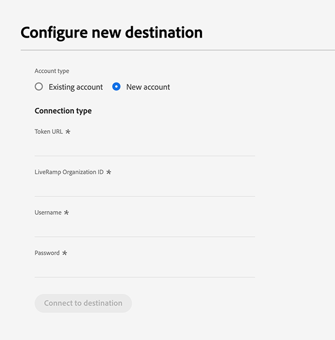

* **[!UICONTROL LiveRamp Organization ID]**: The organization ID of your LiveRamp account (listed as _owner_org_ in your LiveRamp-provided credentials).
* **[!UICONTROL Password]**: Your LiveRamp account password (listed as _secret_key_ in your LiveRamp-provided credentials).
* **[!UICONTROL Token URL]**: Your LiveRamp token URL.
* **[!UICONTROL Username]**: Your LiveRamp account username (listed as _account_id_ in your LiveRamp-provided credentials).

### Configure destination details {#destination-details}

After you have successfully connected to your LiveRamp account, enter the required information to connect to the destination that you want to activate audiences to.

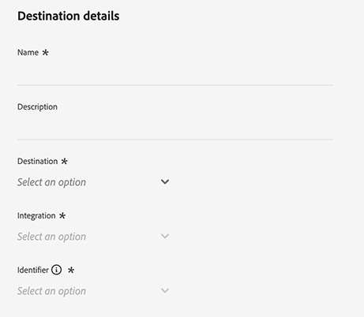

* **[!UICONTROL Name]**: Fill in the preferred name for your destination connection.

>[!NOTE]
>
>When naming your destination, Adobe recommends to follow this format: `LiveRamp - Downstream Destination Name`. This naming pattern helps you quickly identify your destinations in the [Browse](../../ui/destinations-workspace.md#browse) tab of the destinations workspace.
> 
>Example: `LiveRamp - Roku`.

* **[!UICONTROL Description]**: Enter a description for your destination. Use a description which helps you easily identify the purpose of this destination.
* **[!UICONTROL Destination]**: Use the drop-down menu to select the destination to which you want to activate audiences. The destination you select here directly affects what you see in the [destination-specific settings](#destination-settings) screen.
* **[!UICONTROL Integration]**: Select the integration account that you want to use for your destination.
* **[!UICONTROL Identifier]**: Select the identifiers supported by your destination. Currently, all the destinations have their supported identifiers prefilled in the drop-down menu.

## Destination-specific settings {#destination-settings}

Each of the destinations [supported](#supported-destinations) by [!DNL LiveRamp - Distribution] requires you to fill in specific configuration options.

See the sections below for detailed guidance on how to configure each destination.

### [!DNL 4C Insights] {#insights}

>[!CONTEXTUALHELP]
>id="platform_destinations_liveramp_distribution_4cinsights_profile_id"
>title="4C Brand Profile ID"
>abstract="Enter the numeric ID associated with your 4C Brand Profile. If you do not have this ID, contact your 4C client services representative."

To configure details for the destination, fill in the fields below.

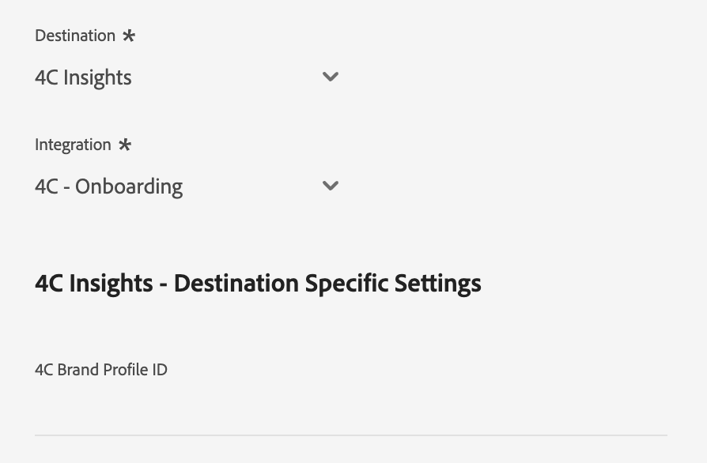

* **[!UICONTROL 4C Brand Profile ID]**: Enter the numeric ID associated with your 4C Brand Profile. If you do not have this ID, contact your 4C client services representative.

### [!DNL Acast] {#acast}

>[!CONTEXTUALHELP]
>id="platform_destinations_liveramp_distribution_acast_client"
>title="Client name"
>abstract="Your advertiser account name, as you would like it to be shown to the destination partner. Use your company name. Do not use spaces or special characters."

To configure details for the destination, fill in the fields below.

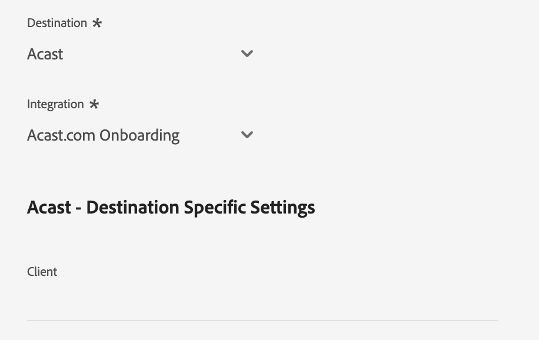

* **[!UICONTROL Client name]**: Your advertiser account name, as you would like it to be shown to the destination partner. Use your company name. Do not use spaces or special characters.

### [!DNL Ampersand.tv] {#ampersand-tv}

>[!CONTEXTUALHELP]
>id="platform_destinations_liveramp_distribution_ampersand_company_name"
>title="Your company name"
>abstract="Your company name, as you would like it to be shown to the destination partner. Do not use spaces or special characters."

To configure details for the destination, fill in the fields below.

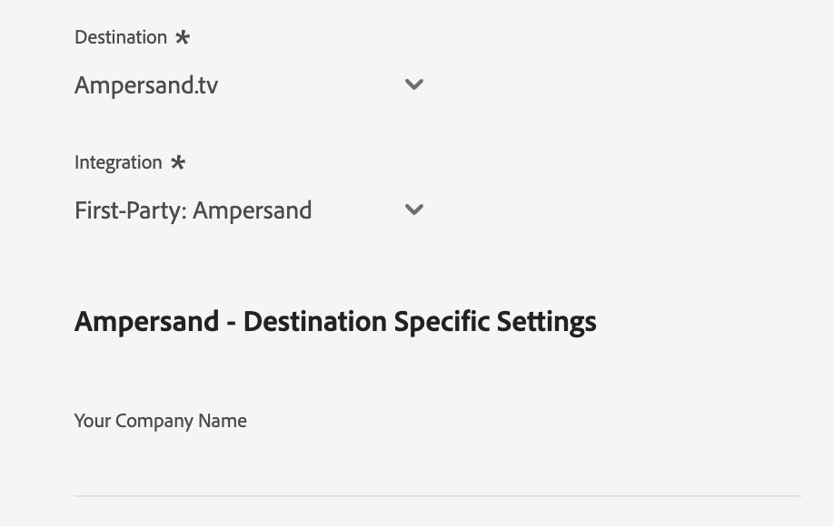

* **[!UICONTROL Your Company Name]**: Your company name, as you would like it to be shown to the destination partner. Do not use spaces or special characters.
  
### [!DNL Captify] {#captify}

>[!CONTEXTUALHELP]
>id="platform_destinations_liveramp_distribution_captify_client"
>title="Client name"
>abstract="Your advertiser account name, as you would like it to be shown to the destination partner. Use your company name. Do not use spaces or special characters."

To configure details for the destination, fill in the fields below.

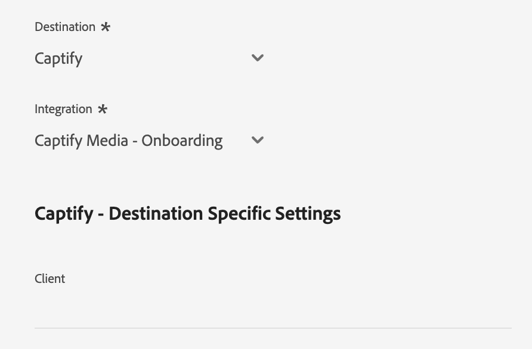

* **[!UICONTROL Client name]**: Your advertiser account name, as you would like it to be shown to the destination partner. Use your company name. Do not use spaces or special characters.

### [!DNL Cardlytics] {#cardlytics}

>[!CONTEXTUALHELP]
>id="platform_destinations_liveramp_distribution_cardlytics_client"
>title="Client name"
>abstract="Your advertiser account name, as you would like it to be shown to the destination partner. Use your company name. Do not use spaces or special characters."

To configure details for the destination, fill in the fields below.

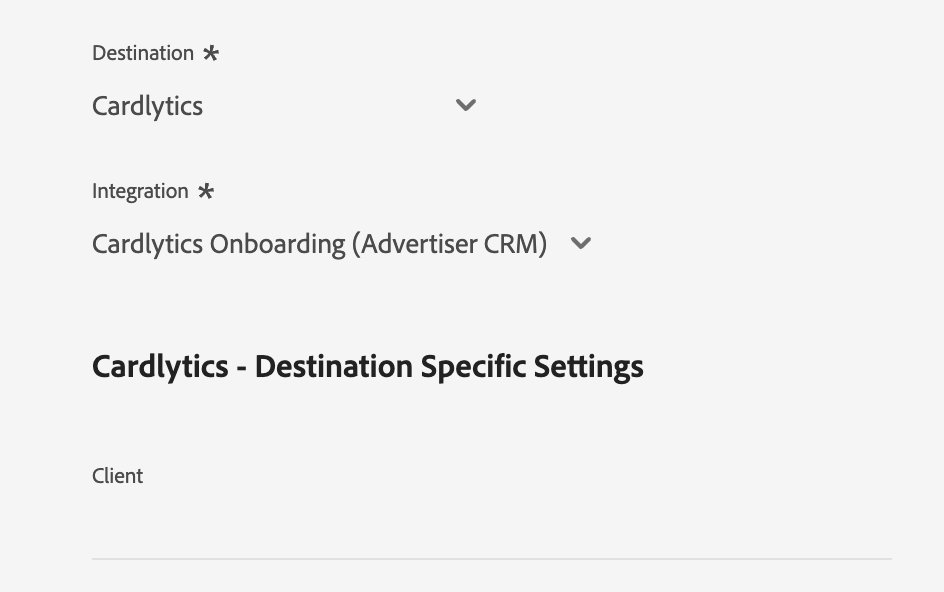

* **[!UICONTROL Client name]**: Your advertiser account name, as you would like it to be shown to the destination partner. Use your company name. Do not use spaces or special characters.

### [!DNL Disney (Hulu/ESPN/ABC)] {#disney}

>[!CONTEXTUALHELP]
>id="platform_destinations_liveramp_distribution_agreement"
>title="Advertiser data destination terms agreement"
>abstract="Type in `I AGREE` to confirm the acknowledgment and agreement to the Disney advertiser data terms."

<!-- >additional-url="<https://www.disneyadvertising.com/ADVERTISER-DATA-DESTINATION-TERMS/>" text="Read the agreement" -->

>[!CONTEXTUALHELP]
>id="platform_destinations_liveramp_distribution_disney_client"
>title="Client name"
>abstract="Your advertiser account name, as you would like it to be shown to the destination partner. Use your company name. Do not use spaces or special characters."

>[!CONTEXTUALHELP]
>id="platform_destinations_liveramp_distribution_disney_email"
>title="Your email address"
>abstract="Enter an email address tied to an individual. This email address serves as a signature to the advertiser data terms agreement. This email address is also used to contact you if needed."

To configure details for the destination, fill in the fields below.

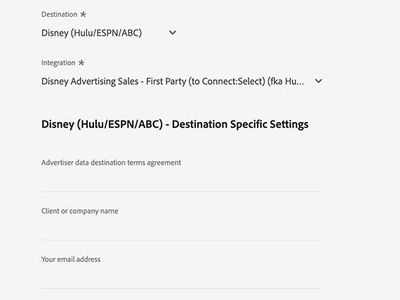

* **[!UICONTROL Advertiser data destination terms agreement]**: Type in `I AGREE` to confirm the acknowledgment and agreement to the Disney advertiser data terms.
* **[!UICONTROL Client name]**: Enter your company name as you want it to be shown to the destination partner.
* **[!UICONTROL Email address]**: Enter an email address tied to an individual. This email address serves as a signature to the advertiser data terms agreement.

### [!DNL iHeartMedia] {#iheartmedia}

>[!CONTEXTUALHELP]
>id="platform_destinations_liveramp_distribution_iheartmedia_client"
>title="Client Name"
>abstract="Your advertiser account name, as you would like it to be shown to the destination partner. Use your company name. Do not use spaces or special characters."

To configure details for the destination, fill in the fields below.

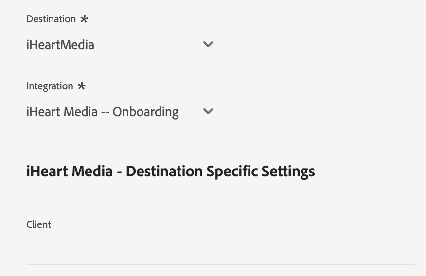

* **[!UICONTROL Client Name]**: Your advertiser account name, as you would like it to be shown to the destination partner. Use your company name. Do not use spaces or special characters.

### [!DNL Index Exchange] {#index-exchange}

>[!CONTEXTUALHELP]
>id="platform_destinations_liveramp_distribution_index_advertiseraccountname"
>title="Account Name"
>abstract="Your Index Exchange client account name. Do not use spaces or special characters."

To configure details for the destination, fill in the fields below.

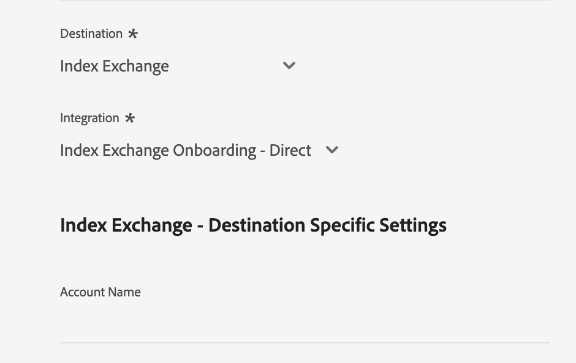

* **[!UICONTROL Account Name]**: Your Index Exchange client account name. Do not use spaces or special characters.

### [!DNL Magnite CTV Platform] {#magnite}

>[!CONTEXTUALHELP]
>id="platform_destinations_liveramp_distribution_magnitectv_client"
>title="Client"
>abstract="Your client name, as you would like it to be shown to the destination partner. Use your company name. Do not use spaces or special characters."

To configure details for the destination, fill in the fields below.

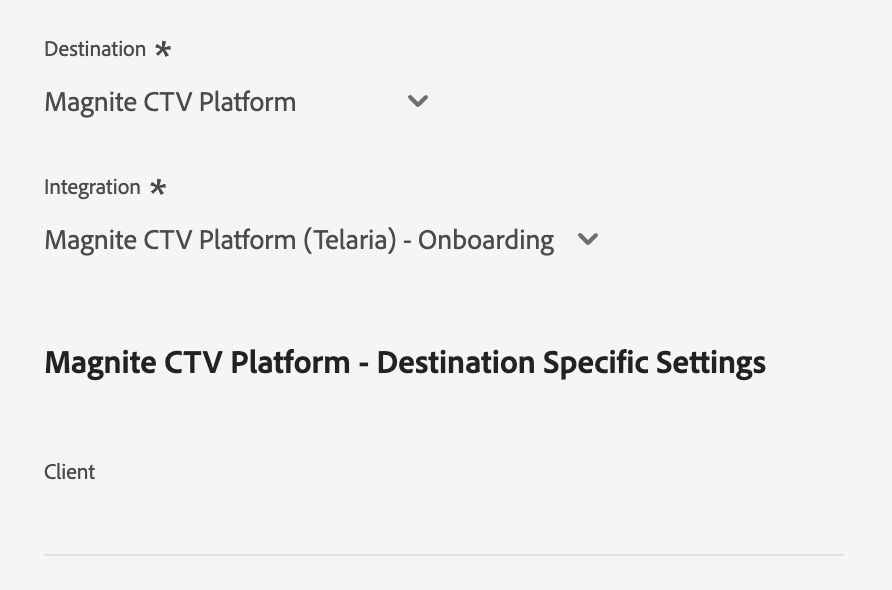

* **[!UICONTROL Client]**: Your client name, as you would like it to be shown to the destination partner. Use your company name. Do not use spaces or special characters.

### [!DNL Magnite DV+ (Rubicon Project)] {#magnite-dv}

>[!CONTEXTUALHELP]
>id="platform_destinations_liveramp_distribution_magnitedv+_partnerid"
>title="Partner ID"
>abstract="The Rubicon Project Partner ID associated with the publisher who owns the segment/data. Contact your Rubicon Project account representative if unsure of the value you should use."

>[!CONTEXTUALHELP]
>id="platform_destinations_liveramp_distribution_magnitedv+_seatid"
>title="Seat ID"
>abstract="Magnite DV+ Seat ID provided by your Magnite account manager"

To configure details for the destination, fill in the fields below.

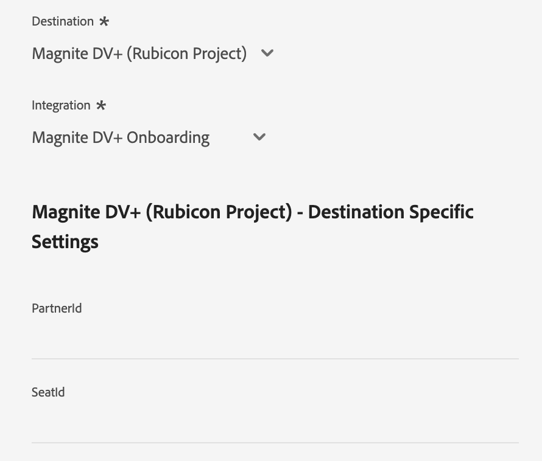

* **[!UICONTROL Partner ID]**: The Rubicon Project Partner ID associated with the publisher who owns the segment/data. Contact your Rubicon Project account representative if unsure of the value you should use.
* **[!UICONTROL Seat ID]**: Magnite DV+ Seat ID provided by your Magnite account manager

### [!DNL Nexxen (formerly known as [!DNL Amobee])] {#nexxen}

>[!CONTEXTUALHELP]
>id="platform_destinations_liveramp_distribution_nexxen_ratetype"
>title="Rate Type"
>abstract="Rate type represents the way data usage should be billed. All $0.00 rates should be flat fee. Confirm with your Nexxen representative if you're not sure which rate type to use."

>[!CONTEXTUALHELP]
>id="platform_destinations_liveramp_distribution_nexxen_marketid"
>title="Market ID"
>abstract="Enter the numeric Market ID where the Nexxen data contract should be created. If you are doing "AlwaysOn" syndication across every market in the Nexxen platform, enter -1."

>[!CONTEXTUALHELP]
>id="platform_destinations_liveramp_distribution_nexxen_advertiserid"
>title="Advertiser ID"
>abstract="If you're sending data to a single advertiser in the Nexxen platform, enter the numeric Amobee Advertiser ID. If you want to make the data available to all advertisers in a market or if these segments are "AlwaysOn", please enter -1."

>[!CONTEXTUALHELP]
>id="platform_destinations_liveramp_distribution_nexxen_contactemail"
>title="Contact Email"
>abstract="Enter the email address which Nexxen should use to send data contract details. Most likely this is your own email address, but it can also be an email alias. For multiple recipients, separate using commas (`email1@domain.com`,`email2@domain.com`, and so on.)."

To configure details for the destination, fill in the fields below.

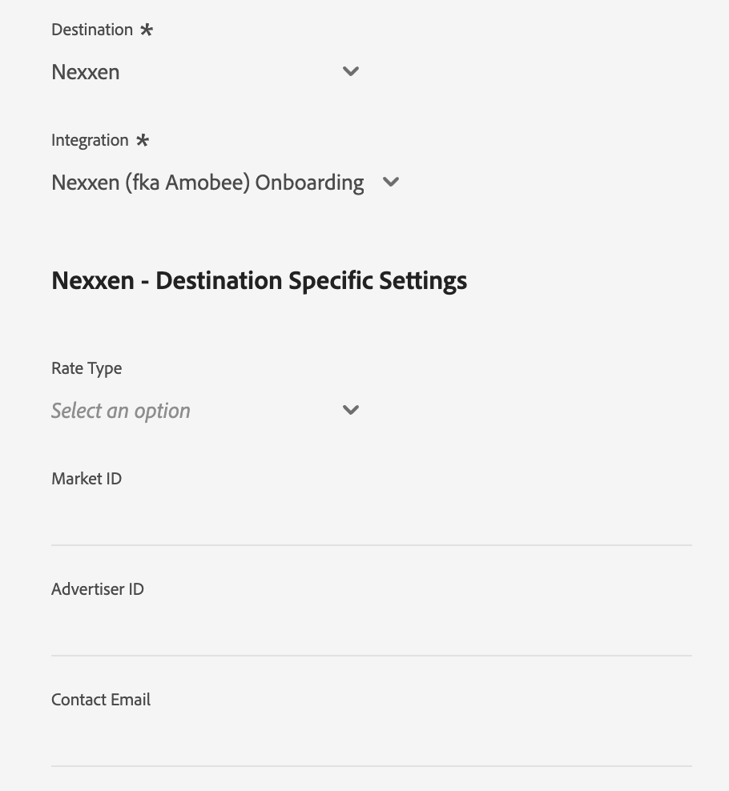

* **[!UICONTROL Rate Type]**: Rate type represents the way data usage should be billed. All $0.00 rates should be flat fee. Confirm with your Nexxen representative if you're not sure which rate type to use.
* **[!UICONTROL Market ID]**: Enter the numeric Market ID where the Nexxen data contract should be created. If you are doing "AlwaysOn" syndication across every market in the Nexxen platform, enter -1.
* **[!UICONTROL Advertiser ID]**: If you're sending data to a single advertiser in the Nexxen platform, enter the numeric Nexxen Advertiser ID. If you want to make the data available to all advertisers in a market or if these segments are "AlwaysOn", enter -1.
* **[!UICONTROL Contact Email]**: Enter the email address which Nexxen should use to send data contract details. Most likely this is your own email address, but it can also be an email alias. For multiple recipients, separate using commas ( `email1@domain.com`, `email2@domain.com`).

### [!DNL One Fox] {#fox}

>[!CONTEXTUALHELP]
>id="platform_destinations_liveramp_distribution_fox_client"
>title="Client"
>abstract="The name of your company/distribution account as you would like it to appear to the partner. Contact your partner account representative if unsure what name to use. Do not use spaces or special characters."

To configure details for the destination, fill in the fields below.

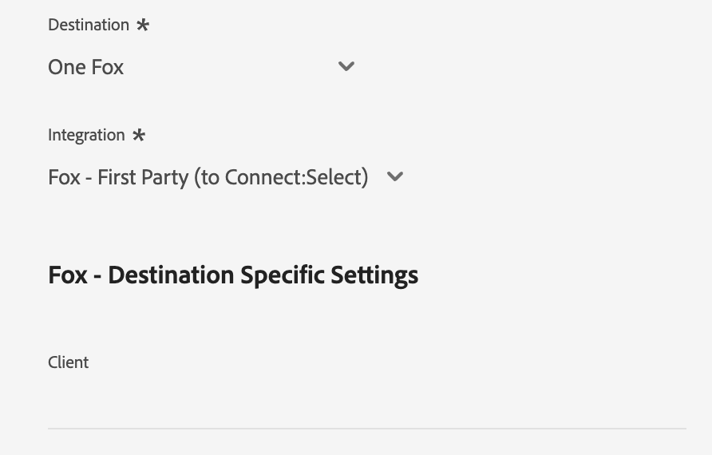

* **[!UICONTROL Client]**: The name of your company/distribution account as you would like it to appear to the partner. Use your company name by default. Contact your partner account representative if unsure what name to use. Do not use spaces or special characters.

### [!DNL Pandora] {#pandora}

>[!CONTEXTUALHELP]
>id="platform_destinations_liveramp_distribution_pandora_account_name"
>title="Account name"
>abstract="The name of your Pandora account. Contact your Pandora account representative if you are not sure what your account name is. Do not use spaces or special characters."

To configure details for the destination, fill in the fields below.

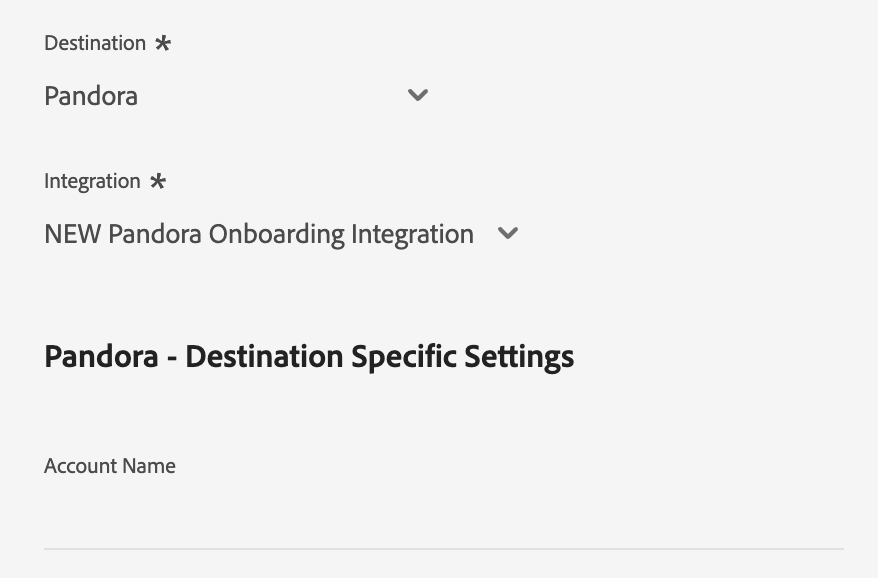

* **[!UICONTROL Account name]**: The name of your Pandora account. Contact your Pandora account representative if you are not sure what your account name is. Do not use spaces or special characters.

### [!DNL Reddit] {#reddit}

>[!CONTEXTUALHELP]
>id="platform_destinations_liveramp_distribution_reddit_advertiser_id"
>title="Reddit advertiser ID"
>abstract="Your Reddit advertiser ID. Must begin with "t2_" or "a2_". Contact your Reddit representative if you do not know your advertiser ID."

>[!CONTEXTUALHELP]
>id="platform_destinations_liveramp_distribution_reddit_advertiser_name"
>title="Reddit advertiser name"
>abstract="Your Reddit advertiser name. Do not use spaces or special characters."

To configure details for the destination, fill in the fields below.

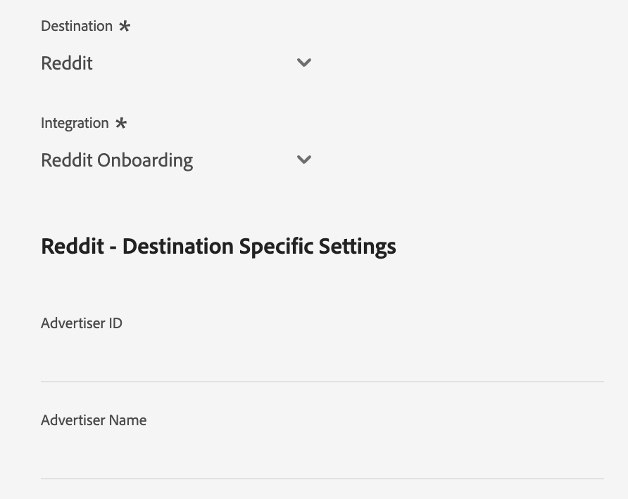

* **[!UICONTROL Reddit advertiser ID]**: Your Reddit advertiser ID. Must begin with "t2_" or "a2_". Contact your Reddit representative if you do not know your advertiser ID.
* **[!UICONTROL Reddit advertiser name]**: Your Reddit advertiser name. Do not use spaces or special characters.

### [!DNL Roku] {#roku}

>[!CONTEXTUALHELP]
>id="platform_destinations_liveramp_distribution_roku_email"
>title="Roku account email address"
>abstract="Enter the email address tied to your Roku account."

>[!CONTEXTUALHELP]
>id="platform_destinations_liveramp_distribution_roku_representative_email"
>title="Roku account representative email address"
>abstract="Enter the email address of your Roku account representative. This address is used to send taxonomy updates. To enter multiple addresses, separate them by commas."

To configure details for the destination, fill in the fields below.

* **[!UICONTROL Roku account email address]**: Enter the email address tied to your Roku account.
* **[!UICONTROL Roku account representative email address]**: Enter the email address of your Roku account representative. To enter multiple addresses, separate them by commas.

### [!DNL Spotify] {#spotify}

>[!CONTEXTUALHELP]
>id="platform_destinations_liveramp_distribution_spotify_client"
>title="Client name"
>abstract="Your advertiser account name, as you would like it to be shown to the destination partner. Use your company name. Do not use spaces or special characters."

To configure details for the destination, fill in the fields below.

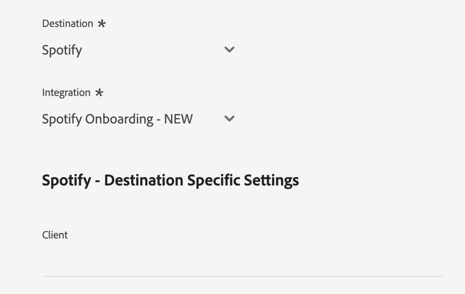

* **[!UICONTROL Client name]**: Your advertiser account name, as you would like it to be shown to the destination partner. Use your company name. Do not use spaces or special characters.

### [!DNL Taboola] {#taboola}

>[!CONTEXTUALHELP]
>id="platform_destinations_liveramp_distribution_taboola_rep_email"
>title="Account manager email address"
>abstract="The email address of your Taboola account manager."

>[!CONTEXTUALHELP]
>id="platform_destinations_liveramp_distribution_taboola_seg_type"
>title="Segment type"
>abstract="The segment type. Only first party segments are currently supported."

To configure details for the destination, fill in the fields below.

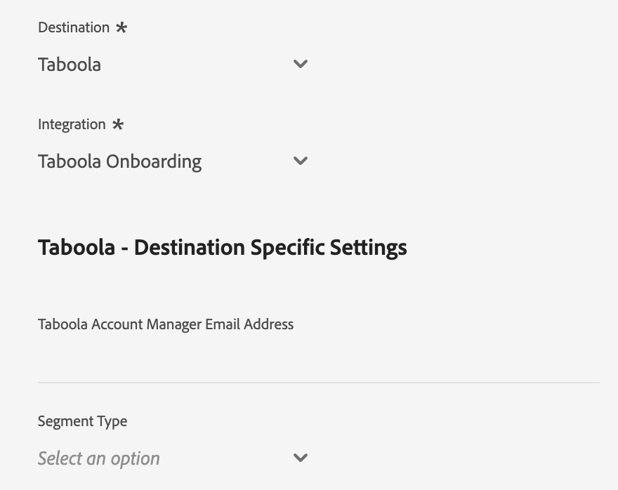

* **[!UICONTROL Account manager email address]**: The email address of your Taboola account manager.
* **[!UICONTROL Segment type]**: The segment type. Only first party segments are currently supported.

### [!DNL TargetSpot] {#targetspot}

>[!CONTEXTUALHELP]
>id="platform_destinations_liveramp_distribution_targetspot_client"
>title="Client name"
>abstract="Your advertiser account name, as you would like it to be shown to the destination partner. Use your company name. Do not use spaces or special characters."

To configure details for the destination, fill in the fields below.

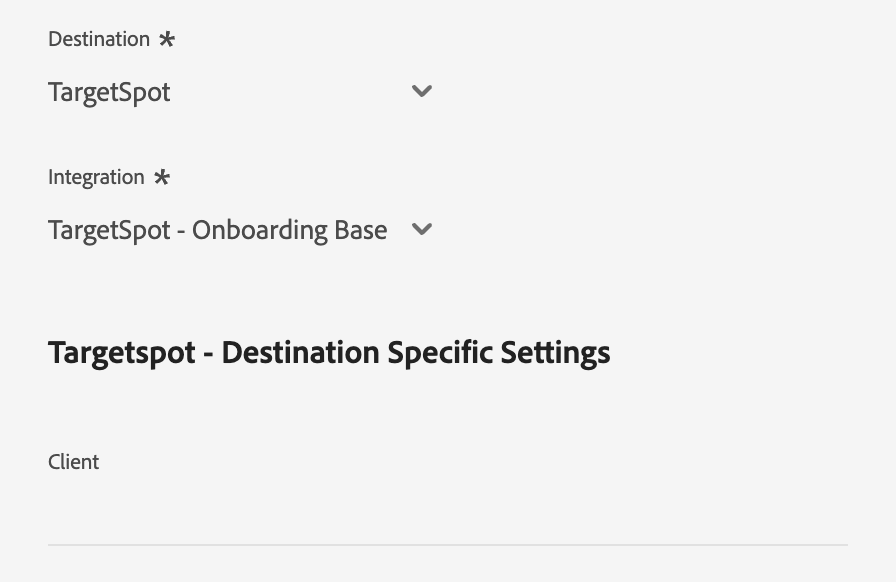

* **[!UICONTROL Client name]**: Your advertiser account name, as you would like it to be shown to the destination partner. Use your company name. Do not use spaces or special characters.

### [!DNL Teads] {#teads}

>[!CONTEXTUALHELP]
>id="platform_destinations_liveramp_distribution_teads_teadsid"
>title="Teads ID"
>abstract="Your Teads ID"

To configure details for the destination, fill in the fields below.

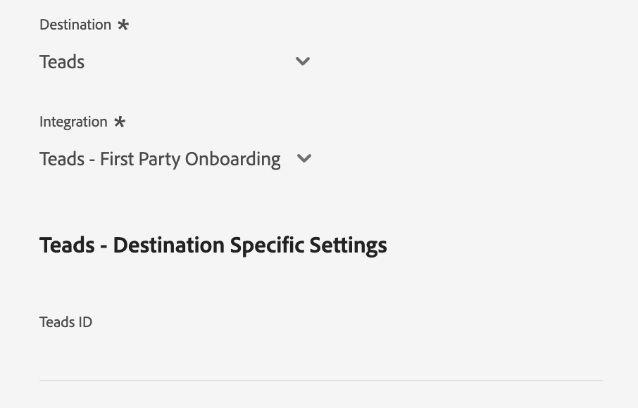

* **[!UICONTROL Teads ID]**: Your Teads ID

### [!DNL WB Discovery] {#wb-discovery}

>[!CONTEXTUALHELP]
>id="platform_destinations_liveramp_distribution_wb_client"
>title="Client name"
>abstract="Your advertiser account name, as you would like it to be shown to the destination partner. Use your company name. Do not use spaces or special characters."

To configure details for the destination, fill in the fields below.

* **[!UICONTROL Client name]**: Your advertiser account name, as you would like it to be shown to the destination partner. Use your company name. Do not use spaces or special characters.

### Enable alerts {#enable-alerts}

You can enable alerts to receive notifications on the status of the dataflow to your destination. To receive notifications on the status of your dataflow, select an alert from the list. For more information on alerts, read the guide on [subscribing to destinations alerts using the UI](../../ui/alerts.md).

When you are finished providing details for your destination connection, select **[!UICONTROL Next]**.

## Activate audiences to this destination {#activate}

>[!IMPORTANT]
> 
>To activate data, you need the **[!UICONTROL View Destinations]**, **[!UICONTROL Activate Destinations]**, **[!UICONTROL View Profiles]**, and **[!UICONTROL View Segments]** [access control permissions](/help/access-control/home.md#permissions). Read the [access control overview](/help/access-control/ui/overview.md) or contact your product administrator to obtain the required permissions.

The [!DNL LiveRamp - Distribution] connection activates audiences which have already been onboarded to your LiveRamp account through the [LiveRamp - Onboarding](liveramp-onboarding.md) connection.

To successfully activate your audiences, you must select the **same audiences** that you have [previously onboarded](liveramp-onboarding.md) to LiveRamp.

>[!IMPORTANT]
>
>Selecting audiences which have not been previously onboarded through the [LiveRamp - Onboarding](liveramp-onboarding.md) connection does not trigger the onboarding of the new audiences.

## Exported data / Validate data export {#exported-data}

To verify and monitor the activation of your audiences, log in to your LiveRamp account and check the activation metrics.

If you have questions about the audience activation, contact your LiveRamp account representative.

## Data usage and governance {#data-usage-governance}

All [!DNL Adobe Experience Platform] destinations are compliant with data usage policies when handling your data. For detailed information on how [!DNL Adobe Experience Platform] enforces data governance, read the [Data Governance overview](/help/data-governance/home.md).

## Additional resources {#additional-resources}

For more details on how to configure your [!DNL LiveRamp - Onboarding] destination, see the [LiveRamp - Onboarding documentation](liveramp-onboarding.md).
