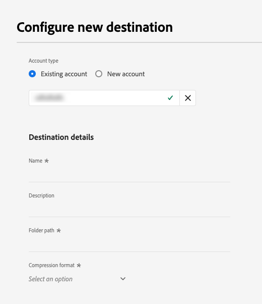

# [!DNL LiveRamp - Distribution] connection {#liveramp-onboarding}

Use the [!DNL LiveRamp - Distribution] connection to activate audiences previously onboarded into LiveRamp through the [LiveRamp - Onboarding](liveramp-onboarding.md) connection, to destinations which use the [!DNL Ramp ID] identifier.

[!DNL LiveRamp - Distribution] currently supports audience activation to the following platforms:

* Hulu
* Roku
* ...
* ...
* ...

## Use cases {#use-cases}

To help you better understand how and when you should use the [!DNL LiveRamp - Distribution] destination, here is a sample use case that Adobe Experience Platform customers can solve by using this destination.

The marketing team of a sports apparel retailer used the [LiveRamp - Onboarding](liveramp-onboarding.md) connection to send audiences from Experience Platform to their LiveRamp account. Through the [!DNL LiveRamp - Distribution] connection they can now trigger the activation of the onboarded audiences so that they can target users on mobile, open web, social, and [!DNL CTV] platforms, using the [!DNL Ramp ID] identifier. 

## Prerequisites {#prerequisites}

The [!DNL LiveRamp - Distribution] connection requires you to have already onboarded audiences from Experience Platform into LiveRamp. To do that, see the [LiveRamp - Onboarding](liveramp-onboarding.md) documentation.

Before you can send data from Experience Platform to [!DNL LiveRamp - Onboarding], you need your [!DNL LiveRamp] credentials. Please reach out to your [!DNL LiveRamp] representative to obtain your credentials, if you don't already have them.

## Supported identities {#supported-identities}

[!DNL LiveRamp - Distribution] supports the activation of identities such as PII-based identifiers, known identifiers, and custom IDs, described in the official [LiveRamp documentation](https://docs.liveramp.com/connect/en/identity-and-identifier-terms-and-concepts.html#known-identifiers).

## Supported audiences {#supported-audiences}

This section describes all the audiences that you can export to this destination.

This destination supports the activation of audiences generated through the Experience Platform [Segmentation Service](../../../segmentation/home.md).

Additionally, this destination also supports the activation of the additional audiences described in the table below.

| Audience type | Description | 
---------|----------|
| Custom uploads | Audiences [imported](../../../segmentation/ui/overview.md#importing-an-audience) into Experience Platform from CSV files. |

{style="table-layout:auto"}

## Connect to the destination {#connect}

>[!IMPORTANT]
> 
>To connect to the destination, you need the **[!UICONTROL Manage Destinations]** [access control permission](/help/access-control/home.md#permissions). Read the [access control overview](/help/access-control/ui/overview.md) or contact your product administrator to obtain the required permissions.

To connect to this destination, follow the steps described in the [destination configuration tutorial](../../ui/connect-destination.md). In the configure destination workflow, fill in the fields listed in the two sections below.

### Authenticate to destination {#authenticate}

To authenticate to the destination, fill in the required fields and select **[!UICONTROL Connect to destination]**.

**SFTP authentication with password** {#sftp-password}

* **[!UICONTROL Username]**: The username for your [!DNL LiveRamp - Onboarding] storage location.
* **[!UICONTROL Password]**: The password for your [!DNL LiveRamp - Onboarding] storage location.
* **[!UICONTROL PGP/GPG encryption key]**: Optionally, you can attach your RSA-formatted public key to add encryption to your exported files. View an example of a correctly formatted encryption key in the image below.
    
* **[!UICONTROL Subkey ID]**:If you provide an encryption key, you must also provide an encryption **[!UICONTROL Subkey ID]**. See the [!DNL LiveRamp] [encryption documentation](https://docs.liveramp.com/connect/en/encrypting-files-for-uploading.html#downloading-the-current-encryption-key) to learn how to obtain the subkey ID.

**SFTP with SSH key authentication** {#sftp-ssh}

* **[!UICONTROL Username]**: The username for your [!DNL LiveRamp - Onboarding] storage location.
* **[!UICONTROL SSH Key]**: The private [!DNL SSH] key used to log in to your [!DNL LiveRamp - Onboarding] storage location. The private key must be formatted as a [!DNL Base64]-encoded string and must not be password protected.

    * To connect your [!DNL SSH] key to the [!DNL LiveRamp - Onboarding] server, you must submit a ticket through [!DNL LiveRamp]'s technical support portal, and provide your public key. See more information in the [LiveRamp documentation](https://docs.liveramp.com/connect/en/upload-a-file-via-liveramp-s-sftp.html#upload-with-an-sftp-client).

* **[!UICONTROL PGP/GPG encryption key]**: Optionally, you can attach your RSA-formatted public key to add encryption to your exported files. View an example of a correctly formatted encryption key in the image below.
    
* **[!UICONTROL Subkey ID]**:If you provide an encryption key, you must also provide an encryption **[!UICONTROL Subkey ID]**. See the [!DNL LiveRamp] [encryption documentation](https://docs.liveramp.com/connect/en/encrypting-files-for-uploading.html#downloading-the-current-encryption-key) to learn how to obtain the subkey ID.

### Fill in destination details {#destination-details}

>[!CONTEXTUALHELP]
>id="platform_destinations_liveramp_subkey"
>title="Encryption subkey ID"
>abstract="The subkey ID used for encryption, based on the LiveRamp public encryption key. This field is required if you provided an encryption key in the authentication step."
>additional-url="https://docs.liveramp.com/connect/en/encrypting-files-for-uploading.html#downloading-the-current-encryption-key" text="Learn how to obtain the subkey ID"

To configure details for the destination, fill in the required and optional fields below. An asterisk next to a field in the UI indicates that the field is required.

*  **[!UICONTROL Name]**: A name by which you will recognize this destination in the future.
*  **[!UICONTROL Description]**: A description that will help you identify this destination in the future.
*  **[!UICONTROL Folder path]**: The path to the [!DNL LiveRamp] `uploads` subfolder that will host the exported files. The `uploads` prefix is automatically added to the folder path. [!DNL LiveRamp] recommends creating a dedicated subfolder for deliveries from Adobe Real-Time CDP to keep the files separate from any other existing feeds and to ensure all automation runs smoothly. 
    *  For example, if you want to export your files to `uploads/my_export_folder`, type in `my_export_folder` in the **[!UICONTROL Folder path]** field.
*  **[!UICONTROL Compression format]**: Select the compression type that Experience Platform should use for the exported files. Available options are **[!UICONTROL GZIP]** or **[!UICONTROL None]**.

### Enable alerts {#enable-alerts}

You can enable alerts to receive notifications on the status of the dataflow to your destination. Select an alert from the list to subscribe to receive notifications on the status of your dataflow. For more information on alerts, read the guide on [subscribing to destinations alerts using the UI](../../ui/alerts.md).

When you are finished providing details for your destination connection, select **[!UICONTROL Next]**.

## Activate audiences to this destination {#activate}

>[!IMPORTANT]
> 
>To activate data, you need the **[!UICONTROL Manage Destinations]**, **[!UICONTROL Activate Destinations]**, **[!UICONTROL View Profiles]**, and **[!UICONTROL View Segments]** [access control permissions](/help/access-control/home.md#permissions). Read the [access control overview](/help/access-control/ui/overview.md) or contact your product administrator to obtain the required permissions.

Read [Activate audience data to batch profile export destinations](/help/destinations/ui/activate-batch-profile-destinations.md) for instructions on activating audiences to this destination.

## Exported data / Validate data export {#exported-data}

The [!DNL LiveRamp - Distribution] connection does not transfer any data between Experience Platform and [!DNL LiveRamp].

This destination is only used to activate audiences that you have sent to LiveRamp through the [LiveRamp - Onboarding](liveramp-onboarding.md) connection.

## Data usage and governance {#data-usage-governance}

All [!DNL Adobe Experience Platform] destinations are compliant with data usage policies when handling your data. For detailed information on how [!DNL Adobe Experience Platform] enforces data governance, read the [Data Governance overview](/help/data-governance/home.md).

## Additional resources {#additional-resources}

For more details on how to configure your [!DNL LiveRamp - Onboarding] storage, see the [official documentation](https://docs.liveramp.com/connect/en/upload-a-file-via-liveramp-s-sftp.html).
