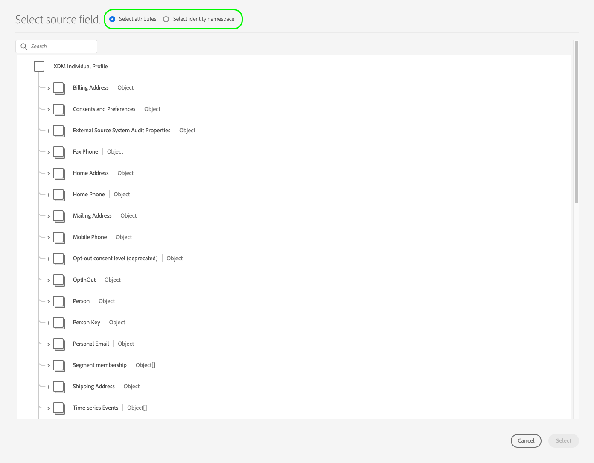
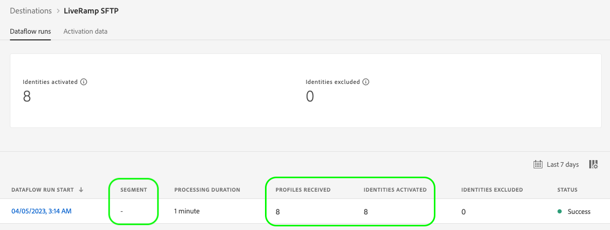

# (Alpha) [!DNL LiveRamp - SFTP] connection {#liveramp-destination}

Use the LiveRamp connection to onboard audiences from Adobe Real-Time Customer Data Platform to [!DNL LiveRamp Connect].

>[!IMPORTANT]
>
>This destination connection is currently in alpha stage and only available to a limited selection of customers. The functionality and documentation are subject to change.

## Use cases {#use-cases}

To help you better understand how and when you should use the [!DNL LiveRamp SFTP] destination, here is a sample use case that Adobe Experience Platform customers can solve by using this destination.

As a marketer, I want to send audiences from Adobe Experience Platform to onboard identities into [!DNL LiveRamp Connect] so that I can target users on [!DNL CTV] platforms, using the [!DNL Ramp ID] identifier. 

## Prerequisites {#prerequisites}

The [!DNL LiveRamp - SFTP] connection exports files using [LiveRamp's SFTP](https://docs.liveramp.com/connect/en/upload-a-file-via-liveramp-s-sftp.html) storage.

Before you can send data from Experience Platform to [!DNL LiveRamp SFTP], you need your [!DNL LiveRamp] credentials. Please reach out to your [!DNL LiveRamp] representative to obtain your credentials, if you don't already have them.

## Supported identities {#supported-identities}

LiveRamp SFTP supports the activation of identities such as PII-based identifiers, known identifiers, and custom IDs, described in the official [LiveRamp documentation](https://docs.liveramp.com/connect/en/identity-and-identifier-terms-and-concepts.html#known-identifiers).

In the [mapping step](#map) of the activation workflow, you must define the target mappings as custom attributes.

## Export type and frequency {#export-type-frequency}

Refer to the table below for information about the destination export type and frequency.

| Item | Type | Notes |
---------|----------|---------|
| Export type | **[!UICONTROL Segment export]** | You are exporting all members of a segment (audience) with the identifiers (name, phone number, or others) used in the [!DNL LiveRamp SFTP] destination.|
| Export frequency | **[!UICONTROL Daily Batch]** | As a profile is updated in Experience Platform based on segment evaluation, the profile (identities) are updated once a day downstream to the destination platform. Read more about [batch file-based destinations](/help/destinations/destination-types.md#file-based).|

{style="table-layout:auto"}

## Connect to the destination {#connect}

>[!IMPORTANT]
> 
>To connect to the destination, you need the **[!UICONTROL Manage Destinations]** [access control permission](/help/access-control/home.md#permissions). Read the [access control overview](/help/access-control/ui/overview.md) or contact your product administrator to obtain the required permissions.

To connect to this destination, follow the steps described in the [destination configuration tutorial](../../ui/connect-destination.md). In the configure destination workflow, fill in the fields listed in the two sections below.

### Authenticate to destination {#authenticate}

To authenticate to the destination, fill in the required fields and select **[!UICONTROL Connect to destination]**.

**SFTP authentication with password** {#sftp-password}


* **[!UICONTROL Username]**: The username for your [!DNL LiveRamp SFTP] storage location.
* **[!UICONTROL Password]**: The password for your [!DNL LiveRamp SFTP] storage location.
* **[!UICONTROL PGP/GPG encryption key]**: Optionally, you can attach your RSA-formatted public key to add encryption to your exported files. View an example of a correctly formatted encryption key in the image below. If you provide an encryption key, you must also provide an **[!UICONTROL Encryption subkey ID]** in the [destination details](#destination-details) section.

    

**SFTP with SSH key authentication** {#sftp-ssh}


* **[!UICONTROL Username]**: The username for your [!DNL LiveRamp SFTP] storage location.
* **[!UICONTROL SSH Key]**: The private [!DNL SSH] key used to log in to your [!DNL LiveRamp SFTP] storage location. The private key must be formatted as a [!DNL Base64]-encoded string and must not be password protected.

    * To connect your [!DNL SSH] key to the [!DNL LiveRamp SFTP] server, you must submit a ticket through [!DNL LiveRamp]'s technical support portal, and provide your public key. See more information in the [LiveRamp documentation](https://docs.liveramp.com/connect/en/upload-a-file-via-liveramp-s-sftp.html#upload-with-an-sftp-client).

* **[!UICONTROL PGP/GPG encryption key]**: Optionally, you can attach your RSA-formatted public key to add encryption to your exported files. If you provide an encryption key, you must also provide an **[!UICONTROL Encryption subkey ID]** in the [destination details](#destination-details) section. View an example of a correctly formatted encryption key in the image below.

    

### Fill in destination details {#destination-details}

>[!CONTEXTUALHELP]
>id="platform_destinations_liveramp_subkey"
>title="Encryption subkey ID"
>abstract="The subkey ID used for encryption, based on the LiveRamp public encryption key. This field is required if you provided an encryption key in the authentication step."
>additional-url="https://docs.liveramp.com/connect/en/encrypting-files-for-uploading.html#downloading-the-current-encryption-key" text="Learn how to obtain the subkey ID."

To configure details for the destination, fill in the required and optional fields below. An asterisk next to a field in the UI indicates that the field is required.


*  **[!UICONTROL Name]**: A name by which you will recognize this destination in the future.
*  **[!UICONTROL Description]**: A description that will help you identify this destination in the future.
*  **[!UICONTROL Folder path]**: The path to the destination folder that will host the exported files.
*  **[!UICONTROL Compression format]**: Select the compression type that Experience Platform should use for the exported files. Available options are **[!UICONTROL GZIP]** or **[!UICONTROL None]**.
*  **[!UICONTROL Encryption subkey ID]**: The subkey used for encryption, based on the [!DNL LiveRamp] public encryption key. This field is required if you provided an encryption key in the [authentication](#authenticate) step. See the [!DNL LiveRamp] [encryption documentation](https://docs.liveramp.com/connect/en/encrypting-files-for-uploading.html#downloading-the-current-encryption-key) to learn how to obtain the subkey ID.

### Enable alerts {#enable-alerts}

You can enable alerts to receive notifications on the status of the dataflow to your destination. Select an alert from the list to subscribe to receive notifications on the status of your dataflow. For more information on alerts, read the guide on [subscribing to destinations alerts using the UI](../../ui/alerts.md).

When you are finished providing details for your destination connection, select **[!UICONTROL Next]**.

## Activate segments to this destination {#activate}

>[!IMPORTANT]
> 
>To activate data, you need the **[!UICONTROL Manage Destinations]**, **[!UICONTROL Activate Destinations]**, **[!UICONTROL View Profiles]**, and **[!UICONTROL View Segments]** [access control permissions](/help/access-control/home.md#permissions). Read the [access control overview](/help/access-control/ui/overview.md) or contact your product administrator to obtain the required permissions.

Read [Activate audience data to batch profile export destinations](/help/destinations/ui/activate-batch-profile-destinations.md) for instructions on activating audience segments to this destination.

### Scheduling {#scheduling}

In the [!UICONTROL Scheduling] step, create an export schedule for each segment, with the settings shown below.

>[!IMPORTANT]
>
>All segments activated to this destination must be configured with the exact same schedule, as shown below.

* **[!UICONTROL File export options]**: [!UICONTROL Export full files]. [Incremental file exports](../../ui/activate-batch-profile-destinations.md#export-incremental-files) are currently not supported.
* **[!UICONTROL Frequency]**: [!UICONTROL Daily]
* Set the export time to **[!UICONTROL After segment evaluation]**. Scheduled segment exports and [on-demand file exports](../../ui/export-file-now.md) are currently not supported.
* **[!UICONTROL Date]**: Select the export start and end times as you wish.


The exported file name is currently not user-configurable. All files exported to the [!DNL LiveRamp SFTP] destination are automatically named based on the following template:

`%ORGANIZATION_NAME%_%DESTINATION%_%DESTINATION_INSTANCE_ID%_%DATETIME%`


For example, the name of an exported file for an organization named [!DNL Luma] could look similar to this:

```json
Luma_LiveRamp_52137231-4a99-442d-804c-39a09ddd005d_20230330_153857.csv
```

### Map attributes and identities {#map}

In the **[!UICONTROL Mapping]** step, you can select which attributes and identities you want to export for your profiles.

>[!IMPORTANT]
>
>This destination supports the activation of one source identity namespace per activation flow. If you need to export multiple identity namespaces, like `Email` and `Phone`, you must [create a separate activation flow](../../ui/activate-batch-profile-destinations.md) for each identity.

In the **[!UICONTROL Mapping]** step, the **[!UICONTROL Target field]** mapping defines the name of the column header in the exported CSV file. You can change the CSV column headers in the exported file to any friendly name that you want, by providing a custom name for the **[!UICONTROL Target field]**.

1. In the **[!UICONTROL Mapping]** step, select **[!UICONTROL Add new mapping]**. You will see a new mapping row on the screen.

    

2. In the **[!UICONTROL Select source field]** window, choose the **[!UICONTROL Select attributes]** category and select the XDM attribute that you want to map, or choose the **[!UICONTROL Select identity namespace]** category and select an identity to map to your destination.
    
    

3. In the **[!UICONTROL Select target field]** window, enter the attribute name that you want to map the selected source field to. The attribute name defined here will reflect in the exported CSV file as a column header.

    
    
    You can also input the attribute name by typing it directly into the **[!UICONTROL Target field]**.
    
    

Once you've added all your desired mappings, select **[!UICONTROL Next]** and finish the activation workflow.

## Exported data / Validate data export {#exported-data}

Your data is exported to the [!DNL LiveRamp SFTP] storage location that you configured, as CSV files.

When exporting files to the [!DNL LiveRamp SFTP] destination, Platform generates one CSV file for each [merge policy ID](../../../profile/merge-policies/overview.md).

For example, let's consider the following segments:

* Segment A (Merge policy 1)
* Segment B (Merge policy 2)
* Segment C (Merge policy 1)
* Segment D (Merge policy 1)

Platform will export two CSV files to [!DNL LiveRamp SFTP]:

* One CSV file containing segments A, C, and D;
* One CSV file containing segment B.

Exported CSV files contain profiles with the selected attributes and the corresponding segment status, on separate columns, with the attribute name and segment IDs as a column headers.

The profiles included in the exported files can match one the following segment qualification statuses:

* `Active`: The profile is currently qualified for the segment.
* `Expired`: The profile is no longer qualified for the segment, but has qualified in the past.
* `""`(empty string): The profile never qualfied for the segment.


For instance, an exported CSV file with one `email` attribute and 3 segments could look like this:

```csv
email,aa2e3d98-974b-4f8b-9507-59f65b6442df,45d4e762-6e57-4f2f-a3e0-2d1893bcdd7f,7729e537-4e42-418e-be3b-dce5e47aaa1e
abc117@testemailabc.com,active,,
abc111@testemailabc.com,,,active
abc102@testemailabc.com,,,active
abc116@testemailabc.com,active,,
abc107@testemailabc.com,active,expired,active
abc101@testemailabc.com,active,active,
```

Since Platform generates one CSV file for each [merge policy ID](../../../profile/merge-policies/overview.md), it also generates a separate dataflow run for each merge policy ID.

This means that the **[!UICONTROL Identities activated]** and **[!UICONTROL Profiles received]** metrics in the [dataflow runs](../../../dataflows/ui/monitor-destinations.md#dataflow-runs-for-batch-destinations) page are aggregated for each group of segments that use the same merge policy, instead of being displayed for each segment.

As a consequence of dataflow runs being generated for a group of segments that use the same merge policy, the segment names are not displayed in the [monitoring dashboard](../../../dataflows/ui/monitor-destinations.md#dataflow-runs-for-batch-destinations).



## Data usage and governance {#data-usage-governance}

All [!DNL Adobe Experience Platform] destinations are compliant with data usage policies when handling your data. For detailed information on how [!DNL Adobe Experience Platform] enforces data governance, read the [Data Governance overview](/help/data-governance/home.md).

## Additional resources {#additional-resources}

For more details on how to configure your LiveRamp SFTP storage, see the [official documentation](https://docs.liveramp.com/connect/en/upload-a-file-via-liveramp-s-sftp.html).
