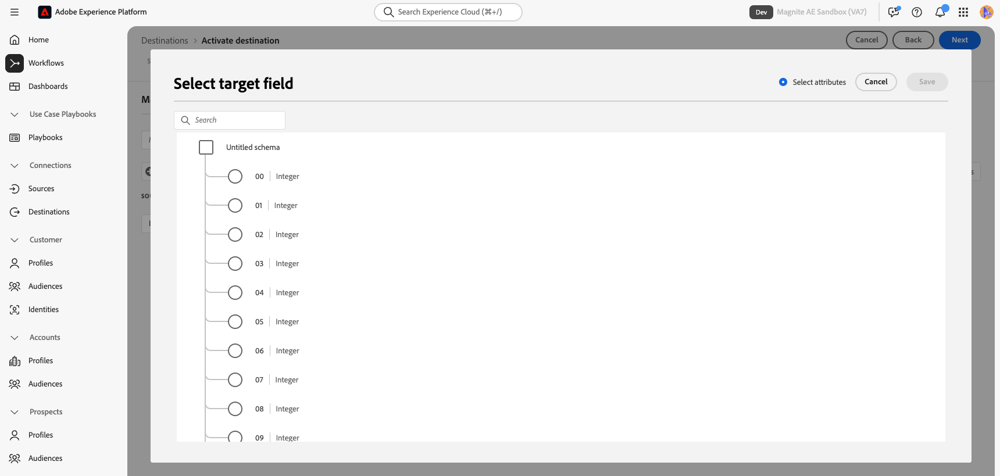

# Magnite Streaming: Batch Destination connection {#magnite-streaming-batch-destination}

This destination allows you to deliver Adobe CDP audiences to Magnite Streaming for advertising targeting and activation. Audiences activated via this destination are delivered daily in a batch. Post-processing, audiences are available for targeting deals created in Magnite Streaming.

Magnite Streaming also has another destination, called the Magnite Streaming: Real-Time destination. See [this doc](magnite-streaming.md) for more information about the Real-Time destination. This Real-Time destination is used to deliver the same audiences but in a real-time cadence. The data delivered via the Real-Time destination is only temporary and is meant to be replaced daily by the Batch destination. For this reason, this Batch destination is required in order to use the Real-Time destination.

## Overview {#overview}

The Magnite Streaming-Adobe Experience Platform CDP integration offers two destinations: a Batch destination and a Real-Time destination for activating, mapping, and exporting audiences for targeting and activation on the Magnite Streaming platform. This document describes the Magnite Streaming: Batch destination and provides sample use cases to help you better understand how to activate and export audiences to it.

If you are instead looking for the Magnite Streaming Real-Time destination, [look here](magnite-streaming.md).

>[!IMPORTANT]
>
>The destination connector and documentation page are created and maintained by the [!DNL Magnite] team. For any inquiries or update requests, please contact them directly at `adobe-tech@magnite.com`.

## Use cases {#use-cases}

To help you better understand how and when you should use the Magnite Streaming: Batch destination, here are sample use cases that Adobe Experience Platform customers can solve using this destination.

### Use case #1 {#use-case-1}

*You have activated an audience on the Magnite Streaming: Real-Time destination.*

*Any audience(s) activated via the Magnite Streaming: Real-Time destination must also use the Magnite Streaming: Batch destination, as the Batch delivery is meant to replace the Real-Time delivery to make it persistent within the Magnite Streaming platform.*

### Use case #2 {#use-case-2}

*You want to activate an audience in a batch/daily cadence to the Magnite Streaming platform.*

*Any audience(s) activated via the Magnite Streaming: Batch destination will be delivered in a batch/daily cadence and will then be targettable in the Magnite Streaming platform.*

## Prerequisites {#prerequisites}

To use the Magnite destinations in the Adobe Experience Platform, you must first have a Magnite Streaming account. If you have a [!DNL Magnite Streaming] account, please reach out to your [!DNL Magnite] account manager to be provided credentials to access [!DNL Magnite's] destinations. If you do not have a [!DNL Magnite Streaming] account, please reach out to adobe-tech@magnite.com

## Supported Identities {#supported-identities}

The Magnite Streaming: Batch destination can receive *any* identity sources from the Adobe CDP. Currently, this destination has three Target Identity fields for you to map to. Please note: *any* identity sources can map to any of the magnite_deviceId Target Identities:

| Target Identity | Description | Consideration |
|:--------------------------- |:------------------------------------------------------------------------------------------------ |:------------------------------------------------------------------------------------- |
| magnite_deviceId_GAID | Google Advertising ID | Select this Target Identity when your source identity is a GAID |
| magnite_deviceId_IDFA | Apple ID for Advertisers | Select this Target Identity when your source identity is an IDFA |
| magnite_deviceId_CUSTOM | Custom/user-defined ID | Select this Target Identity when your source identity is not a GAID or IDFA, or if it is a custom or user-defined ID |

{style="table-layout:auto"}

## Supported Audiences {#supported-audiences}

| Audience origin             | Supported | Description | 
|-----------------------------|----------|----------|
| [!DNL Segmentation Service] | ✓ | Audiences generated through the Experience Platform [Segmentation Service](../../../segmentation/home.md).|
| Custom uploads              | ✓ | Audiences [imported](../../../segmentation/ui/overview.md#import-audience) into Experience Platform from CSV files. |

{style="table-layout:auto"}

## Export Type and Frequency {#export-type-frequency}

| Item | Type | Notes | 
|-----------------------------|----------|----------|
| Export type | Audience export | You are exporting all members of an audience with the identifiers (name, phone number, or others) used in the Magnite Streaming: Batch destination. |
| Export frequency | Batch | Batch destinations export files to downstream platforms in increments of three, six, eight, twelve, or twenty-four hours. Read more about batch [file-based destinations](../../../destinations/destination-types#file-based). |

{style="table-layout:auto"}

## Connect to the destination {#connect}

Once your destination usage has been approved and Magnite Streaming has shared your credentials, please follow the below steps to authenticate, map, and share data.

### Authenticate to destination {#authenticate}

Locate the Magnite Streaming: Batch destination in the Adobe Experience catalog. Click the additional options button (\...) and then configure the destination connection/instance.

If you already have an existing account, you can locate it by changing the Account type option to "Existing account". Otherwise, you will create an account below:

To create a new account and authenticate it to the destination for the first time, fill in the required "S3 access key" and "S3 secret key" fields (provided to you via your account manager), and select **[!UICONTROL Connect to the destination]**

**Note:** Magnite Streaming's security policy requires a regular rotation of S3 keys. You should expect to have to update the account in the future with new S3 access and S3 secret keys. You only need to update the account itself - destinations using that account will automatically use the updated keys. Failure to upload the new keys will result in the data failing to send to this destination.

### Fill in destination details {#destination-details}

To configure details for the destination, fill in the required and optional fields below. An asterisk next to a field in the UI indicates that the field is required. You can then proceed by selecting **[!UICONTROL Next]**

*  **[!UICONTROL Name]**: A name by which you will recognize this destination connection/instance in the
  future.
*  **[!UICONTROL Description]**: A description that will help you identify this
  destination connection/instance in the future.
  *  **[!UICONTROL Name of your source partner]**: The name you would like to go by as a source in Magnite Streaming's platform

**Note:** If you plan to send multiple ID types (GAID, IDFA, etc.) using the Batch destination, a new destination connection/instance is required for each. Please contact your Magnite Account representative for more information.

On the next screen, titled "Governance Policy and Enforcement Actions (Optional)," you can optionally select any relevant data governance policies. "Data Export" is generally selected for the Magnite Streaming Batch destination.

Once done, or if you wish to skip this optional screen, select **[!UICONTROL Create]**

### Enable Alerts {#enable-alerts}

You can enable alerts to receive notifications on the status of the dataflow to your destination. Select an alert from the list to subscribe to receive notifications on the status of your dataflow. For more information on alerts, see the guide on [subscribing to destinations alerts using the UI](../../ui/alerts.md).

When you are finished providing details for your destination connection, select **[!UICONTROL Next]**.

### Activate segments to this destination {#activate}

>[!IMPORTANT]
> 
>* To activate data, you need the **[!UICONTROL View Destinations]**, **[!UICONTROL Activate Destinations]**, **[!UICONTROL View Profiles]**, and **[!UICONTROL View Segments]** [access control permissions](/help/access-control/home.md#permissions). Read the [access control overview](/help/access-control/ui/overview.md) or contact your product administrator to obtain the required permissions.
>* To export *identities*, you need the **[!UICONTROL View Identity Graph]** [access control permission](/help/access-control/home.md#permissions).   {width="100" zoomable="yes"}

Read [Activate audience data to batch profile export destinations](/help/destinations/ui/activate-batch-profile-destinations.md) for instructions on activating audience segments to this destination.

Once the destination connection/instance has been created, you will be shown the audience activation flow. The following process walks through how to activate audiences using the Magnite Streaming Batch destination:

#### Step 1: Select your new destination connection/instance

#### Step 2: Select any/all audiences you want to activate

select **[!UICONTROL Next]** to continue.

### Map attributes and identities {#map}

After selecting which audience(s) to activate, you will need to map your device attributes and/or identities. The following continues the steps above for how to map attributes/identities in the Magnite Streaming Batch destination:

#### Step 3: Map your source device ID to a magnite streaming device ID

In the "SOURCE FIELD", you can select any attribute or identity for your devices. In this example, we've selected a custom IdentityMap called "DeviceId"

In the "TARGET FIELD":
 See [Supported Identities](#supported-identities) for more information.
In this example, we've selected the TARGET FIELD: magnite_deviceId_CUSTOM, because our SOURCE FIELD was definied as a custom IdentityMap: DeviceID. 

**Note:** If you plan to send/map multiple ID types (GAID, IDFA, etc.) using the Batch destination, a new destination connection/instance is required for each. Please contact your Magnite Account representative for more information.

When you're done selecting your mapping, select **[!UICONTROL Next]**

On the following screen, you will have options to "Configure a filename and export schedule for each audience". 

You must now configure a Start date (mandatory), End date (optional), and a Mapping ID for each audience.

**Mapping ID Notes:**

- A Mapping ID should be provided when an audience has a pre-existing Segment ID previously known to Magnite Streaming.

- When configuring the filename, please include the Mapping ID via the Custom Text option to add it to an audience. The Mapping ID should be added as "{previous_filename}\_\[MAPPING_ID\]." If this audience is new to Magnite Streaming, and no Mapping ID is being provided, "NONE" should be entered into the "Custom Text" field. The new filename in this case should be "{previous_filename}\_\[NONE\]"

Once these configurations are applied, select **[!UICONTROL Next]**

#### Step 4: Review and confirm the Destination Activation configuration

In this step, confirm the Destination activation configuration and select **[!UICONTROL Finish]**

Congratulations, you are now configured to delivery Audiences to the Magnite Streaming Batch destination!

## Exported data / Validate data export {#exported-data}

Once your audiences have been uploaded, you may validate your audiences have been created and uploaded correctly.

- The Magnite Streaming Batch destination delivers S3 files to Magnite Streaming at a daily cadence. After delivery and ingestion, audiences/segments are expected to appear in Magnite Streaming, and can be applied to a deal. You can confirm this by looking-up the segment ID or segment name that was shared during the activation steps in the Adobe Experience Platform.

**Note:** Audiences activated/delivered to the Magnite Streaming Batch destination will *replace* the same audiences that were activated/delivered via the Magnite Streaming Real-Time destination. If you are looking-up a segment using the segment name, you may not find the segment in real-time, until the batch has been ingested and processed by the Magnite Streaming platform.

## Data usage and governance {#data-usage-governance}

All [!DNL Adobe Experience Platform] destinations are compliant with data usage policies when handling your data. For detailed information on how [!DNL Adobe Experience Platform] enforces data governance, read the [Data Governance overview](/help/data-governance/home.md).

## Additional resources {#additional-resources}

For additional help documentation, visit the [Magnite Help Center](https://help.magnite.com/help).
