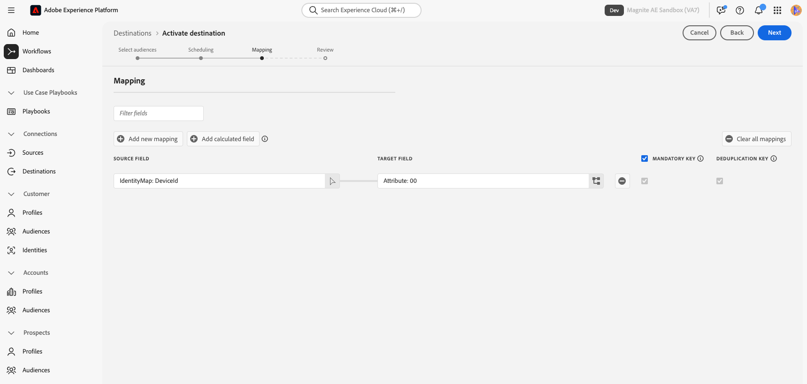

# Magnite: Batch destination {#magnite-batch}

## Overview {#overview}

This document describes the [!DNL Magnite: Batch] destination and provides sample use cases to help you better understand how to activate and export audiences to it.

>[!NOTE]
>
>The [!DNL Magnite] destinations can be used for ingestion into any [!DNL Magnite] platform: Streaming, DV+, SpringServe, etc.

Adobe Real-Time CDP audiences can be delivered to the [!DNL Magnite] platform in two ways - they can be delivered once per day, or they can be delivered in real-time:

1. If you only want and/or need to deliver audiences once per day, you can use the [!DNL Magnite: Batch] destination, which delivers audiences to [!DNL Magnite] via a daily S3 batch file delivery. These batch audiences are stored more persistently in the [!DNL Magnite] platform, unlike real-time audiences, which are only stored for a couple days.

2. However, if you want or need to deliver audiences more frequently, you will need to use the [Magnite: Real-Time destination](/help/destinations/catalog/advertising/magnite-streaming.md). When using the real-time destination, [!DNL Magnite] will receive audiences in real-time, but [!DNL Magnite] can only store real-time audiences temporarily in their platform, and they will be removed from the system within a couple days. For this reason, if you want to use the [!DNL Magnite: Real-Time] destination, you will *also* need to use the [!DNL Magnite: Batch] destination - each audience that you activate to the real-time destination, you also need to activate to the batch destination.

To recap: If you only want to deliver Adobe Real-Time CDP audiences once per day, you will use the [!DNL Magnite: Batch] destination only, and audiences will be delivered once per day. If you want to deliver Adobe Real-Time CDP audiences in real-time, you will use *both* the [!DNL Magnite: Batch] destination, and the[!DNL Magnite: Real-Time] destination. For more information, reach out to [!DNL Magnite].

Continue reading below for more information about the [!DNL Magnite: Batch] destination, how to connect to it, and how to activate Adobe Real-Time CDP audiences to it.
For more information about the Real-Time destination, See [this documentation page](magnite-streaming.md) instead.

>[!IMPORTANT]
>
>The destination connector and documentation page are created and maintained by the [!DNL Magnite] team. For any inquiries or update requests, please contact them directly at `adobe-tech@magnite.com`.

## Use cases {#use-cases}

To help you better understand how and when you should use the [!DNL Magnite: Batch] destination, here are sample use cases that [!DNL Adobe Experience Platform] customers can solve using this destination.

### Use case #1 {#use-case-1}

You have activated an audience on the [!DNL Magnite: Real-Time] destination.

Any audiences activated via the [!DNL Magnite: Real-Time] destination must also use the [!DNL Magnite: Batch] destination, as the batch delivery's data is meant to replace/persist the real-time delivery's data within the [!DNL Magnite] platform.

### Use case #2 {#use-case-2}

You want to activate an audience only in a batch/daily cadence to the [!DNL Magnite] platform.

Any audience(s) activated via the [!DNL Magnite: Batch] destination will be delivered in a batch/daily cadence and will then be available for targeting in the [!DNL Magnite] platform.

## Prerequisites {#prerequisites}

To use the [!DNL Magnite] destinations in [!DNL Adobe Experience Platform], you must first have a [!DNL Magnite] account. If you already have a [!DNL Magnite] account, please reach out to your [!DNL Magnite] account manager to be provided credentials to access [!DNL Magnite's] destinations. If you do not have a [!DNL Magnite] account, please reach out to adobe-tech@magnite.com

## Supported identities {#supported-identities}

The [!DNL Magnite: Real-Time] destination supports the activation of any attributes and/or identities stored in [!DNL Adobe Experience Platform], which will need to be mapped to a [!DNL Magnite] supported device type. The list of supported device types is managed by [!DNL Magnite], and may change and/or grow over time. The current list of supported device types will be available from a 'Select target field' popout window, during the Mapping step of Audience Activation (described below). Learn more about [identities](/help/identity-service/features/namespaces.md).

## Supported audiences {#supported-audiences}

| Audience origin             | Supported | Description | 
|-----------------------------|----------|----------|
| [!DNL Segmentation Service] | ✓ | Audiences generated through the [!DNL Adobe Experience Platform] [Segmentation Service](../../../segmentation/home.md).|
| Custom uploads              | ✓ | Audiences [imported](../../../segmentation/ui/audience-portal.md#import-audience) into [!DNL Adobe Experience Platform] from CSV files. |

{style="table-layout:auto"}

## Export type and frequency {#export-type-frequency}

| Item | Type | Notes | 
|-----------------------------|----------|----------|
| Export type | Audience export | You are exporting all members of an audience with the identifiers (name, phone number, or others) used in the [!DNL Magnite: Batch] destination. |
| Export frequency | Batch | Batch destinations export files to downstream platforms in increments of three, six, eight, twelve, or twenty-four hours. Read more about batch [file-based destinations](/help/destinations/destination-types.md). |

{style="table-layout:auto"}

## Connect to the destination {#connect}

Once your destination usage has been approved and [!DNL Magnite] has shared your credentials, please follow the below steps to authenticate, map, and share data.

### Authenticate to destination {#authenticate}

Locate the [!DNL Magnite: Batch] destination in the [!DNL Adobe Experience Platform] catalog. Click the additional options button (\...) and then configure the destination connection/instance.

If you already have an existing account, you can locate it by changing the Account type option to "Existing account". Otherwise, you will create an account below:

To create a new account, and authenticate it to the destination for the first time, fill in the required "S3 access key" and "S3 secret key" fields (provided to you via your account manager), and select **[!UICONTROL Connect to destination]**

>[!NOTE]
>
>[!DNL Magnite's] security policy requires a regular rotation of S3 keys. You should expect to update your account in the future with new S3 access and S3 secret keys. You only need to update the account itself - destinations using that account will automatically use the updated keys. Failure to upload the new keys will result in the data failing to send to this destination.

### Fill in destination details {#destination-details}

To configure details for the destination, fill in the required and optional fields below. An asterisk next to a field in the UI indicates that the field is required.

*  **[!UICONTROL Name]**: A name by which you will recognize this destination connection/instance in the
  future.
*  **[!UICONTROL Description]**: A description that will help you identify this
  destination connection/instance in the future.
*  **[!UICONTROL Your company name]**: Your customer/company name. Only supported [!DNL Magnite] clients are available for selection. 
  
>[!NOTE]
>
>The company name must be a string which matches the name of the Amazon S3 delivery bucket you have configured with [!DNL Magnite] and set up in the [authenticate to destination](#authenticate) step. The supported characters include 'a-z', 'A-Z', '0-9', '-'(dash), or '_'(underscore).

>[!NOTE]
>
>If you plan to map an Audience to multiple device types (GAID, IDFA, etc.) using the Batch destination, a new destination connection/instance is required for each mapping. Please contact your [!DNL Magnite] account representative for more information.

You can then proceed by selecting **[!UICONTROL Next]**

On the next screen, titled "Governance Policy and Enforcement Actions (Optional)", you can optionally select any relevant data governance policies. "Data Export" is generally selected for the [!DNL Magnite: Batch] destination.

Once selected, or if you wish to skip this optional screen, select **[!UICONTROL Create]**

### Enable alerts {#enable-alerts}

You can enable alerts to receive notifications on the status of the dataflow to your destination. Select an alert from the list to subscribe to receive notifications on the status of your dataflow. For more information on alerts, see the guide on [subscribing to destinations alerts using the UI](../../ui/alerts.md).

When you are finished providing details for your destination connection, select **[!UICONTROL Next]**.

### Activate segments to this destination {#activate}

>[!IMPORTANT]
> 
>* To activate data, you need the **[!UICONTROL View Destinations]**, **[!UICONTROL Activate Destinations]**, **[!UICONTROL View Profiles]**, and **[!UICONTROL View Segments]** [access control permissions](/help/access-control/home.md#permissions). Read the [access control overview](/help/access-control/ui/overview.md) or contact your product administrator to obtain the required permissions.
>* To export *identities*, you need the **[!UICONTROL View Identity Graph]** [access control permission](/help/access-control/home.md#permissions).   {width="100" zoomable="yes"}

Read [Activate audience data to batch profile export destinations](/help/destinations/ui/activate-batch-profile-destinations.md) for instructions on activating audience segments to this destination.

### Map attributes and identities {#map}

In the **[!UICONTROL Source field]**, you can select any attribute or identity for your devices. In this example, we've selected a custom IdentityMap called "DeviceId"

In the **[!UICONTROL Target field]**:
The next step is mapping Source Field identifiers to the [!DNL Magnite] Device Type identifier of your choice, located in the Target Field.

The current list of [!DNL Magnite] supported device types will be available via a 'Select target field' popout window, by clicking the Target Field's target attribute button.

In order to support a dynamic list of device types, the 'Select target field' popout window will provide a list of integers (from 00-50), each of which represents a specific device type in [!DNL Magnite]'s system. To understand which device type id in the list of integers corresponds to which [!DNL Magnite] device type, reach out to your [!DNL Magnite] account representative.

>[!NOTE]
>
>At the end of the list of integers, in the 'Select target field' popout window, there are also 3 magnite_deviceId_ (String) radio buttons. These 3 string options are deprecated, only exist for backwards compatibility, and should NOT be selected.

See [Supported Identities](#supported-identities) for more information.
In this example, we've selected the **[!UICONTROL Target field]**: Attribute: "00".

* You can add as many mappings as you want/need by selecting **[!UICONTROL Add new mapping]**.

>[!NOTE]
>
>If you plan to map an audience to multiple device types (GAID, IDFA, etc.) using the Batch destination, a new destination connection/instance is required for each mapping. Please contact your [!DNL Magnite] account representative for more information.

On the "Configure a filename and export schedule for each audience" screen, you must now configure a Start date (mandatory), End date (optional), and a Mapping ID (mandatory) for each audience.

>[!IMPORTANT]
>
> A Mapping ID or "NONE" is required for this destination.
>
> Provide a Mapping ID when your audience has a pre-existing Segment ID previously known to [!DNL Magnite]. Otherwise, enter "NONE" as the Mapping ID.
>
> When configuring the filename for each audience, please include the Mapping ID via the "Custom Text" field to add. The Mapping ID will be appended as: `{previous_filename}\_\[MAPPING_ID\].` If this audience is new to [!DNL Magnite], and you will not be providing a Mapping ID, "NONE" should be entered into the "Custom Text" field. The new filename in this case should be: `{previous_filename}\_\[NONE\]`. 
 

## Exported data / Validate data export {#exported-data}

Once your audiences have been uploaded, you may validate your audiences have been created and uploaded correctly.

* The [!DNL Magnite: Batch] destination delivers S3 files to [!DNL Magnite] at a daily cadence. After delivery and ingestion, audiences/segments are expected to appear in [!DNL Magnite], and can be applied to a deal. You can confirm this by looking-up the segment ID or segment name that was shared during the activation steps in the [!DNL Adobe Experience Platform].

>[!NOTE]
>
>Audiences activated/delivered to the [!DNL Magnite: Batch] destination will *replace* the same audiences that were activated/delivered via the [!DNL Magnite: Real-Time] destination. If you are looking-up a segment using the segment name, you may not find the segment in real-time, until the batch has been ingested and processed by the [!DNL Magnite] platform.

## Data usage and governance {#data-usage-governance}

All [!DNL Adobe Experience Platform] destinations are compliant with data usage policies when handling your data. For detailed information on how [!DNL Adobe Experience Platform] enforces data governance, read the [Data Governance overview](/help/data-governance/home.md).

## Additional resources {#additional-resources}

For additional help documentation, visit the [Magnite Help Center](https://help.magnite.com/help).
