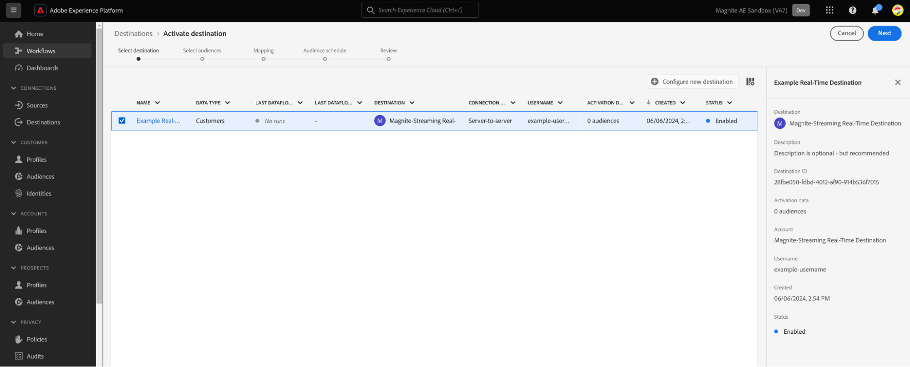
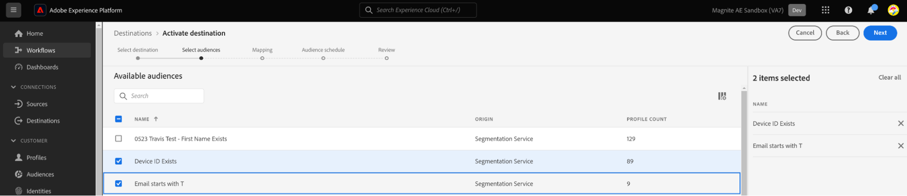

# Magnite Streaming: Real-Time & Daily Destinations

[Overview](#overview)

[Use Cases](#use-cases)

 &ensp;&ensp;[The Magnite-Streaming Daily Destination](#the-magnite-streaming-daily-destination)

&ensp;&ensp;[The Magnite-Streaming Real-Time Destination](#the-magnite-streaming-real-time-destination)

[Prerequisites](#prerequisites)

[Supported Identities](#supported-identities)

[Setting Up The
Destinations](#setting-up-the-destinations)

&ensp;&ensp;[Authenticate to destination](#authenticate-to-destination)

&ensp;&ensp;[Fill in destination details](#fill-in-destination-details)

&ensp;&ensp;[Activate audiences to this destination](#activate-audiences-to-the-destination)

&ensp;&ensp;&ensp;&ensp;[Step 1: Select your new Destination and click Next.](#step-1-select-your-new-destination-and-click-next)

&ensp;&ensp;&ensp;&ensp;[Step 2: Select any audiences you want to activate, then click Next.](#step-2-select-any-audiences-you-want-to-activate-then-click-next) 

&ensp;&ensp;&ensp;&ensp;[Step 3: The next step is mapping source identifiers to the Magnite device_id identifier.](#step-3-the-next-step-is-mapping-source-identifiers-to-the-magnite-device_id-identifier)

&ensp;&ensp;&ensp;&ensp;[Step 4: Confirm the Destination activation Configuration.](#step-4-confirm-the-destination-activation-configuration)

[Exported data / Validate data
export](#exported-data--validate-data-export)

## Overview

The Magnite-Adobe Experience Platform integration offers Magnite
Streaming clients Real-Time and Daily Destinations to map and export
audiences for targeting and activation on the Magnite Streaming
platform. The following provides sample use cases to help you better
understand how and when the destinations should be used, as well as
step-by-step instructions for destination configuration.

## Use Cases

Here are sample use cases to help you better understand how and when you
should use the Real-Time and/or Daily Magnite Streaming destinations.

### **The Magnite-Streaming Daily Destination**

This destination allows Magnite clients to deliver Adobe CDP audiences
in batch, at a daily cadence to Magnite Streaming to create segments
used for advertising targeting and activation. Post-processing, segments
are available for targeting deals created in Magnite.

### **The Magnite-Streaming Real-Time Destination**

This destination allows Magnite clients to deliver Adobe CDP audiences
in real time to Magnite Streaming for advertising targeting.
Post-processing, segments are available for targeting deals created in
Magnite. **Please note:**

- The real-time destination system will attempt to send the events with a p95 of \<10 mins after a Profile segmentation/Update event. This means that 95% of the time, profile segment updates will be delivered to Magnite Streaming in under 10 min. The actual receipt and processing of the events within Magnite Streaming depends on the shared data volume.

- Post-ingest, segments are expected to appear in Magnite Streaming within a few minutes and can be applied to a deal. The ad server may take up to an hour to acknowledge targeting updates.

- Audiences shared to Magnite Streaming using the real-time destination will also need to be shared using the Magnite Streaming Daily destination.

For more information on which destination is right for you, please
contact your Magnite Streaming account representative for more
information.

## Prerequisites

To use the Magnite destinations in the Adobe Experience Platform, users
must first have a Magnite Streaming account. If you have a Magnite
Streaming account, please reach out to your account manager to gain
access to the Magnite destinations.

## Supported Identities

Magnite Streaming destinations can receive the following identifier
sources from the Adobe CDP. Please note all of the following identity
sources can map to the Magnite device_id target identifier:

| Identity Source             | Description                                                                                      | Consideration                                                                         |
|:--------------------------- |:------------------------------------------------------------------------------------------------ |:------------------------------------------------------------------------------------- |
| TV Device IDs               | Identifiers for advertising across Over-the-top (OTT)/ Connected TV (CTV) devices and platforms. | These IDs may be referenced as a custom identity source for the user.                 |
| MAIDs                       | Google Advertising ID (GAID) or Apple ID for Advertisers (IDFA).                                 | These IDs are generally captured in the GAID and IDFA source namespaces for the user. |
| Publisher Provided User Ids | This is generally a first-party, cross-device identifier that is included in the ad request.     | This may be referenced as a custom identity source for the user.                      |

## Setting Up The Destinations

Once your destination usage has been approved and Magnite has shared
your credentials, please follow the below steps to authenticate, map,
and share data.

### **Authenticate to destination**

Locate the Magnite Streaming destinations in the Adobe Experience
catalog. Click the additional options button (\...) and then configure
the destination.

To authenticate to the destination, fill in the required fields and
select Connect to the destination.

If you have an existing account, you can locate it by changing the
Account type option to Existing account.

### **Fill in destination details**

To configure details for the destination, fill in the required and
optional fields below. An asterisk next to a field in the UI indicates
that the field is required. You can then proceed by clicking Next.

- **Name:** A name by which you will recognize this destination in the
  future.

- **Description:** A description that will help you identify this
  destination in the future.

**Note:** A new destination is required for each if you plan to send
multiple ID types using the daily, file-based destination. Please
contact your Magnite Account representative for more information.

You can optionally select any relevant data governance policies. Data
Export is generally used for the Magnite destinations.

Once done, click the Create button.

### 

### **Activate audiences to the destination**

Once the Destination has been created, you will be shown the audience
activation flow. The following walks through how to activate audiences
using the real-time destination. While similar steps are required for
the daily destination, differences between the two have been noted as
needed.

#### Step 1: Select your new Destination and click Next.

#### Step 2: Select any audiences you want to activate, then click Next.

#### Step 3: The next step is mapping source identifiers to the Magnite device_id identifier.

**Real-time Destination Notes**:

- You may have multiple source attributes/namespaces that could represent a Device ID, so map as many as you need.

- A new mapping can be added using the Add new mapping button.

**Daily Destination Note:**

- If you plan to send multiple ID types using the daily, file-based destination, you can only send one ID per-destination configuration. A new destination is required for each ID.

In this example using the real-time destination, we're mapping any rows
that contain a generic deviceId source identifier to the Magnite
device_id target field. When you\'re done, click Next.

You must now configure a Start date (mandatory), End date (optional),
and a Mapping ID for each audience.

**Mapping ID Notes:**

- The Mapping ID field should be used when an audience has a pre-existing Segment ID previously known to Magnite.

- **Real-Time Destination:** To add a Mapping ID to an audience, click each audience row individually and enter data in the right-hand column (see image above). If you do not want to add a Mapping ID, please enter NONE into the Mapping ID field. This is because the Mapping ID is a mandatory field within the Adobe system, despite technically being optional for this particular use case.

- **Daily Destination:** When configuring the filename, please include the Mapping ID via the Custom Text option to add it to an audience. The Mapping ID should be added as "\_\[MAGNITEID\]."

Once these configurations are applied, click Next.

#### Step 4: Confirm the Destination activation Configuration.

In this step, confirm the Destination activation configuration and click
Finish.

## Exported data / Validate data export

Once your audiences have been uploaded, you may validate your audiences
have been created and uploaded correctly using the following steps:

**Real-time Destination**

- The real-time destination system will attempt to send the events with a p95 of \<10 mins after a Profile segmentation/Update event. This means that 95% of the time, profile segment updates will be delivered to Magnite Streaming in under 10 min. The actual receipt and processing of the events within Magnite Streaming depends on the shared data volume.

- Post-ingest, segments are expected to appear in Magnite Streaming within a few minutes and can be applied to a deal. You can confirm this by looking up the segment ID that was shared during the activation steps in the Adobe Experience Platform.
  
  - **Note:** Audiences shared with Magnite Streaming using the  real-time destination will also need to be shared using the Magnite Streaming Daily destination. When configured correctly, segment names in the Magnite Streaming UI are updated to reflect those used in the Adobe Experience Platform post-daily update.

**Daily Destination**

- The daily destination delivers audience files to Magnite at a daily cadence. Post daily ingest, segments are expected to appear in Magnite Streaming and can be applied to a deal. You can confirm this by looking up the segment ID or segment name that was shared during the activation steps in the Adobe Experience Platform.
