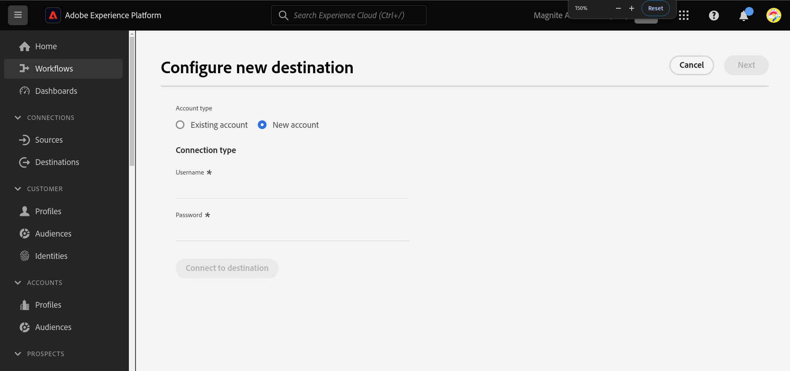
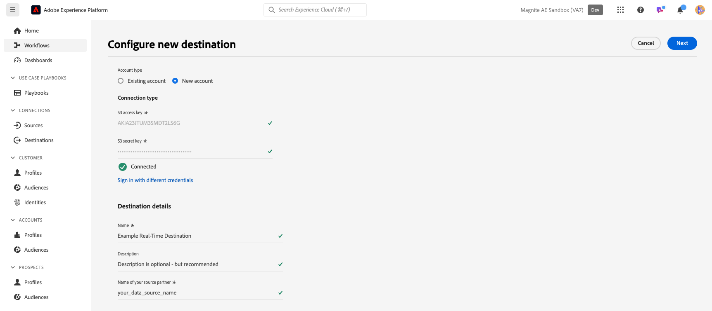
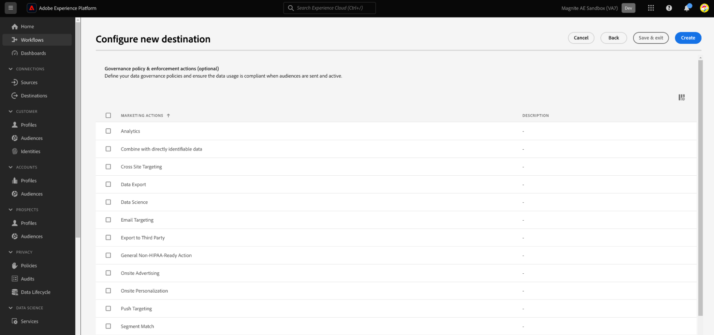
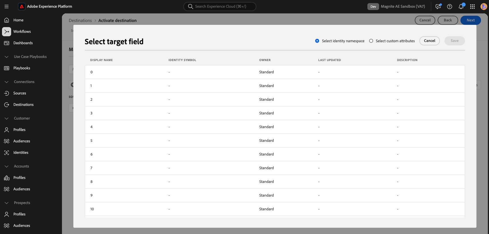
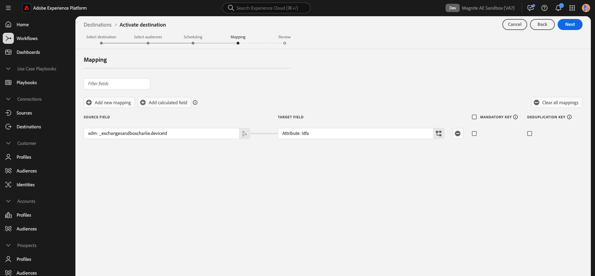
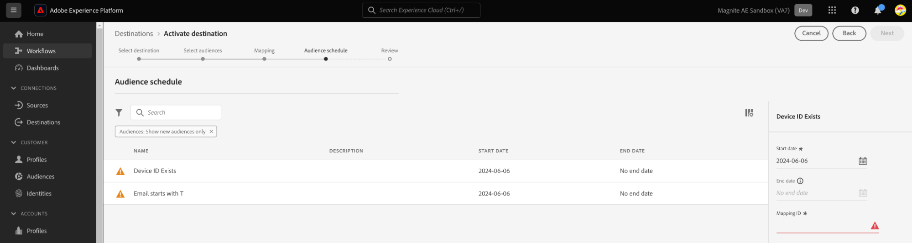
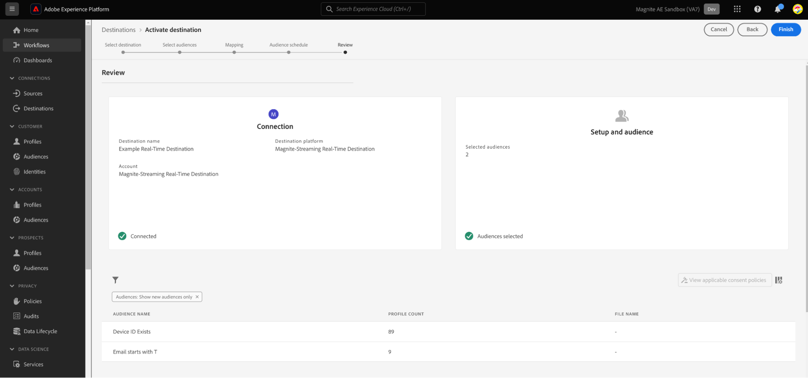

# Magnite: Real-Time destination {#magnite-real-time-destination}

## Overview {#overview}

The [!DNL Magnite: Real-Time] and the [Magnite: Batch](/help/destinations/catalog/advertising/magnite-batch.md) destinations in [!DNL Adobe Experience Platform] help you map and export audiences for targeting and activation on the [!DNL Magnite] platform.

>[!NOTE]
>
>The [!DNL Magnite] destinations can be used for ingestion into any [!DNL Magnite] platform: Streaming, DV+, SpringServe, etc.

Activating audiences to the [!DNL Magnite] platform is a two-step process which requires you to use both the [!DNL Magnite: Real-Time] destination and the [!DNL Magnite: Batch] destination.

To activate your audiences to [!DNL Magnite], you must:

* Activate the audiences on the [!DNL Magnite: Real-Time] destination, as shown in this page.
* Activate the same audience on the [!DNL Magnite: Batch] destination. The [!DNL Magnite: Batch] destination is a mandatory component. Failing to activate the audience on the [!DNL Magnite: Batch] destination will result in a failed integration, and your audiences will not be activated.

Note: When using the real-time destination, [!DNL Magnite] will receive audiences in real-time, but [!DNL Magnite] can only store real-time audiences temporarily in their platform, and they will be removed from the system within a couple days. For this reason, if you want to use the [!DNL Magnite: Real-Time] destination, you will *also* need to use the [!DNL Magnite: Batch] destination - each audience that you activate to the real-time destination, you also need to activate to the batch destination.

>[!IMPORTANT]
>
>The destination connector and documentation page are created and maintained by the [!DNL Magnite] team. For any inquiries or update requests, please contact them directly at `adobe-tech@magnite.com`.

## Use cases {#use-cases}

To help you better understand how and when you should use the [!DNL Magnite: Real-Time] destination, here is a sample use case that [!DNL Adobe Experience Platform] customers can solve by using this destination.

### Activation and targeting {#activation-and-targeting}

This integration with [!DNL Magnite] allows customers to pass their Real-Time CDP audiences from [!DNL Adobe Experience Platform] to [!DNL Magnite], and any [!DNL Magnite] platforms, for advertising targeting. Audiences may be selected within [!DNL Magnite] for positive targeting as well as negative targeting (suppression). 

## Prerequisites {#prerequisites}

To use the [!DNL Magnite] destinations in [!DNL Adobe Experience Platform], you must first have a [!DNL Magnite] account. If you already have a [!DNL Magnite] account, please reach out to your [!DNL Magnite] account manager to be provided credentials to access [!DNL Magnite's] destinations.
If you do not have a [!DNL Magnite] account, please reach out to adobe-tech@magnite.com

## Supported identities {#supported-identities}

The [!DNL Magnite: Real-Time] destination supports the activation of any attributes and/or identities stored in [!DNL Adobe Experience Platform], which will need to be mapped to a [!DNL Magnite] supported device type. The list of supported device types is managed by [!DNL Magnite], and may change and/or grow over time. The current list of supported device types will be available from the 'Select target field' popout window, during the Mapping step of Audience Activation (described below). Learn more about [identities](/help/identity-service/features/namespaces.md).

## Supported audiences {#supported-audiences}

This section describes which type of audiences you can export to this destination.

| Audience origin             | Supported | Description | 
|-----------------------------|----------|----------|
| [!DNL Segmentation Service] | ✓ | Audiences generated through the [!DNL Adobe Experience Platform] [Segmentation Service](../../../segmentation/home.md).|
| Custom uploads              | ✓ | Audiences [imported](../../../segmentation/ui/audience-portal.md#import-audience) into [!DNL Adobe Experience Platform] from CSV files. |

{style="table-layout:auto"}

## Export type and frequency {#export-type-frequency}

Refer to the table below for information about the destination export type and frequency.

| Item             | Type                            | Notes                                                                                                                                                                                                                                                                                                                              |
|------------------|---------------------------------|------------------------------------------------------------------------------------------------------------------------------------------------------------------------------------------------------------------------------------------------------------------------------------------------------------------------------------|
| Export type      | **[!UICONTROL Segment export]** | You are exporting all members of a segment (audience) with the identifiers (name, phone number, or others) used in the [!DNL Magnite: Real-Time] destination.                                                                                                                                                            |
| Export frequency | **[!UICONTROL Streaming]**      | Streaming destinations are "always on" API-based connections. As soon as a profile is updated in [!DNL Adobe Experience Platform] based on segment evaluation, the connector sends the update downstream to the destination platform. Read more about [streaming destinations](/help/destinations/destination-types.md#streaming-destinations). |

{style="table-layout:auto"}

## Connect to the destination {#connect}

>[!IMPORTANT]
>
>To connect to the destination, you need the **[!UICONTROL View destinations]** and **[!UICONTROL Manage destinations]** [access control permission](/help/access-control/home.md#permissions). Read the [access control overview](/help/access-control/ui/overview.md) or contact your product administrator to obtain the required permissions.

To connect to this destination, follow the steps described in the [destination configuration tutorial](../../ui/connect-destination.md). In the configure destination workflow, fill in the fields listed in the two sections below.

### Authenticate to destination {#authenticate}

To authenticate to the destination, fill in the required fields and select **[!UICONTROL Connect to destination]**.

* **[!UICONTROL Username]**: The username supplied to you by [!DNL Magnite].
* **[!UICONTROL Password]**: The password supplied to you by [!DNL Magnite].

### Fill in destination details {#destination-details}

To configure details for the destination, fill in the required and optional fields below. An asterisk next to a field in the UI indicates that the field is required.

*  **[!UICONTROL Name]**: A name by which you will recognize this destination in the future.
*  **[!UICONTROL Description]**: A description that will help you identify this destination in the future.
*  **[!UICONTROL Your company name]**: Your customer/company name. Only supported [!DNL Magnite] clients are available for selection.

>[!NOTE]
>
>The company name must be a string which matches the name of the Amazon S3 delivery bucket you have configured with [!DNL Magnite] and set up in the [authenticate to destination](#authenticate) step. The supported characters include 'a-z', 'A-Z', '0-9', '-'(dash), or '_'(underscore).

Once done, select the **[!UICONTROL Create]** button.

### Enable alerts {#enable-alerts}

You can enable alerts to receive notifications on the status of the dataflow to your destination. Select an alert from the list to subscribe to receive notifications on the status of your dataflow. For more information on alerts, see the guide on [subscribing to destinations alerts using the UI](../../ui/alerts.md).

When you are finished providing details for your destination connection, select **[!UICONTROL Next]**.

## Activate segments to this destination {#activate}

>[!IMPORTANT]
>
>* To activate data, you need the **[!UICONTROL View destinations]**, **[!UICONTROL Activate destinations]**, **[!UICONTROL View Profiles]**, and **[!UICONTROL View Segments]** [access control permissions](/help/access-control/home.md#permissions). Read the [access control overview](/help/access-control/ui/overview.md) or contact your product administrator to obtain the required permissions.
>* To export *identities*, you need the **[!UICONTROL View Identity Graph]** [access control permission](/help/access-control/home.md#permissions).   {width="100" zoomable="yes"}

Read [Activate profiles and segments to streaming segment export destinations](/help/destinations/ui/activate-segment-streaming-destinations.md) for instructions on activating audience segments to this destination.

Once the destination connection has been created, you can proceed to the audience activation flow. The following section walks through how to activate audiences using the Real-Time destination.

### Map attributes and identities {#map}

The next step is mapping Source Field identifiers to the [!DNL Magnite] Device Type identifier of your choice, located in the Target Field.

The current list of [!DNL Magnite] supported device types will be available via the 'Select target field' popout window, by clicking the Target Field's target attribute button.

In order to support a dynamic list of device types, the popout window will provide a list of integers (from 0-50), each of which represents a specific device type in [!DNL Magnite]'s system. To understand which device type id in the list of integers corresponds to which [!DNL Magnite] device type, reach out to your [!DNL Magnite] account representative. If you are still unsure, you should select 0 (zero).

>[!NOTE]
>
>At the end of the list of integers, in the 'Select target field' popout window, there are also 3 magnite_deviceId_ options. These 3 options are deprecated, only exist for backwards compatibility, and should NOT be selected.

This example using the Real-Time destination shows a row that contains a generic deviceId source identifier mapped to the [!DNL Magnite] device type with integer id: "1". When you are satisfied with the mappings, select [!UICONTROL Next].

* You can add as many mappings as you want/need by selecting **[!UICONTROL Add new mapping]**.

>[!NOTE]
>
>If you plan to map an audience to multiple device types (GAID, IDFA, etc.) using the Real-Time destination, a new destination connection/instance is required for each mapping. Please contact your [!DNL Magnite] account representative for more information.

Be sure to set Mapping IDs for all activated audiences, or set NONE if no Mapping ID is present.

You must now configure a Start date (mandatory), an End date (optional), and a Mapping ID for each audience.

**Mapping ID**

* Use the **[!UICONTROL Mapping ID]** field when an audience has a pre-existing Segment ID previously known to [!DNL Magnite].

* To add a **[!UICONTROL Mapping ID]** to an audience, select each audience row individually, and enter data in the right-hand column (see image above). If you do not want to add a Mapping ID, please enter NONE into the Mapping ID field. 

Select **[!UICONTROL Next]** and finalize the activation flow.

## Exported data / Validate data export {#exported-data}

Once your audiences have been uploaded, you may validate your audiences have been created and uploaded correctly using the following steps:

<!--

* In 95% of cases, audiences will be delivered to Magnite in under 10 minutes. The actual receipt and processing of the events within Magnite depends on the shared data volume.

-->

* Post-ingest, audiences are expected to appear in [!DNL Magnite] within a few minutes and can be applied to a deal. You can confirm this by looking up the segment ID that was shared during the activation steps in the [!DNL Adobe Experience Platform].

## Activate the same audiences through the [!DNL Magnite: Batch] destination

Audiences shared with [!DNL Magnite] using the  Real-Time destination will also need to be shared using the [!DNL Magnite: Batch] destination. When configured correctly, segment names in the [!DNL Magnite] UI are updated to reflect those used in the [!DNL Adobe Experience Platform] post-daily update.

Finally, if a Batch destination has not been configured for your integration, set it up now via the [!DNL Magnite: Batch] destination document.

## Data usage and governance {#data-usage-governance}

All [!DNL Adobe Experience Platform] destinations are compliant with data usage policies when handling your data. For detailed information on how [!DNL Adobe Experience Platform] enforces data governance, read the [Data Governance overview](/help/data-governance/home.md).

## Additional resources {#additional-resources}

For additional help documentation, visit the [Magnite Help Center](https://help.magnite.com/help).
