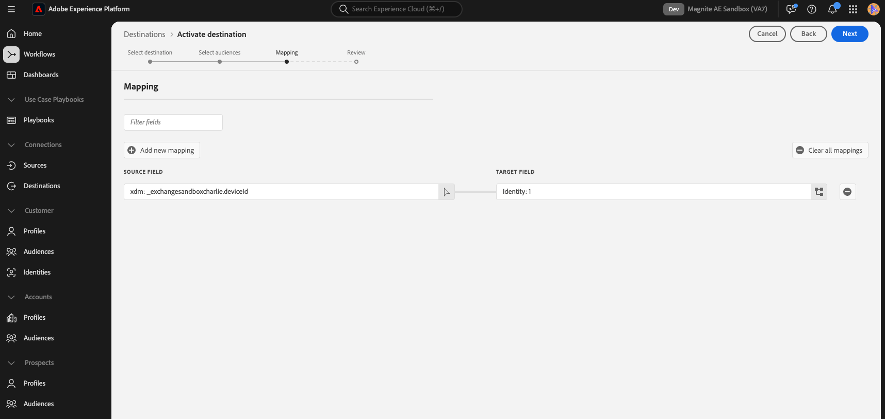

# Magnite Streaming: Real-Time Destination connection

## Overview {#overview}

The Magnite-Adobe Experience Platform integration offers Magnite Streaming clients Real-Time and Daily Destinations to map and export audiences for targeting and activation on the Magnite Streaming platform. The following document provides sample use cases to help you better understand how and when the Real time destination should be used, as well as step-by-step instructions for destination configuration for the Real-time endpoint.

Be advised that in order to properly integrate with the Magnite platform, the Magnite Batch destiniation should be used in addition to the Real-time Destination. Only setting up the Real-time Destiniation will result in a failed integration.  This document only covers the Real-time destination setup. Batch destination can be found [via this link](magnite-batch.md)

>[!IMPORTANT]
>
>The destination connector and documentation page are created and maintained by the [!DNL Magnite] team. For any inquiries or update requests, please contact them directly at `adobe-tech@magnite.com`.

## Use cases {#use-cases}

To help you better understand how and when you should use the [!DNL Magnite Streaming: Real-Time] destination, here is a sample use case that Adobe Experience Platform customers can solve by using this destination.

### Activation and targeting {#activation-and-targeting}

This integration with Magnite allows advertisers to pass advertiser CDP audiences from Adobe Experience Platform to Magnite to create advertiser audiences for advertising targeting. Audiences may be selected within Magnite for positive targeting, as well as negative targeting (suppression).

## Prerequisites {#prerequisites}

To use the Magnite destinations in the Adobe Experience Platform, you must first have a Magnite Streaming account. If you have a [!DNL Magnite Streaming] account, please reach out to your [!DNL Magnite] account manager to be provided credentials to access [!DNL Magnite's] destinations.
If you do not have a [!DNL Magnite Streaming] account, please reach out to adobe-tech@magnite.com

## Supported Identities

The Magnite Streaming: Real-Time Destination supports the activation of identities described in the table below. Learn more about [identities](/help/identity-service/namespaces.md).

| Target Identity   | Description                                                                                      | Considerations                                                                       |
|-------------------|--------------------------------------------------------------------------------------------------|--------------------------------------------------------------------------------------|
| device_id         | A unique identifier for a device. We accept any kind of device id, regardless of type.           | Device types we support include, but are not limited to: GAID, IDFA, email, etc.     | 

{style="table-layout:auto"}

## Supported audiences {#supported-audiences}

This section describes which type of audiences you can export to this destination.

| Audience origin             | Supported | Description | 
|-----------------------------|----------|----------|
| [!DNL Segmentation Service] | ✓ | Audiences generated through the Experience Platform [Segmentation Service](../../../segmentation/home.md).|
| Custom uploads              | ✓ | Audiences [imported](../../../segmentation/ui/overview.md#import-audience) into Experience Platform from CSV files. |

{style="table-layout:auto"}

## Export type and frequency {#export-type-frequency}

Refer to the table below for information about the destination export type and frequency.

| Item             | Type                            | Notes                                                                                                                                                                                                                                                                                                                              |
|------------------|---------------------------------|------------------------------------------------------------------------------------------------------------------------------------------------------------------------------------------------------------------------------------------------------------------------------------------------------------------------------------|
| Export type      | **[!UICONTROL Segment export]** | You are exporting all members of a segment (audience) with the identifiers (name, phone number, or others) used in the [!DNL Magnite Streaming: Real-Time] destination.                                                                                                                                                            |
| Export frequency | **[!UICONTROL Streaming]**      | Streaming destinations are "always on" API-based connections. As soon as a profile is updated in Experience Platform based on segment evaluation, the connector sends the update downstream to the destination platform. Read more about [streaming destinations](/help/destinations/destination-types.md#streaming-destinations). |

{style="table-layout:auto"}

## Connect to the destination {#connect}

>[!IMPORTANT]
>
>To connect to the destination, you need the **[!UICONTROL View Destinations]** and **[!UICONTROL Manage Destinations]** [access control permission](/help/access-control/home.md#permissions). Read the [access control overview](/help/access-control/ui/overview.md) or contact your product administrator to obtain the required permissions.

To connect to this destination, follow the steps described in the [destination configuration tutorial](../../ui/connect-destination.md). In the configure destination workflow, fill in the fields listed in the two sections below.

### Authenticate to destination {#authenticate}

Locate the Magnite Streaming destinations in the Adobe Experience catalog. Click the additional options button (\...) and then configure the destination.

To authenticate to the destination, fill in the required fields and select **[!UICONTROL Connect to destination]**.

If you have an existing account, you can locate it by changing the Account type option to Existing account.
* **[!UICONTROL Username]**: The username supplied to you by [!DNL Magnite].
* **[!UICONTROL Password]**: The password supplied to you by [!DNL Magnite].

### Fill in destination details {#destination-details}

To configure details for the destination, fill in the required and optional fields below. An asterisk next to a field in the UI indicates that the field is required.

*  **[!UICONTROL Name]**: A name by which you will recognize this destination in the future.
*  **[!UICONTROL Description]**: A description that will help you identify this destination in the future.
*  **[!UICONTROL Name of your source partner]**: Your customer/company name. Only supported partners will be available for selection.

You can optionally select any relevant data governance policies. Data Export is generally used for the Magnite destinations.

Once done, click the Create button.

### Enable alerts {#enable-alerts}

You can enable alerts to receive notifications on the status of the dataflow to your destination. Select an alert from the list to subscribe to receive notifications on the status of your dataflow. For more information on alerts, see the guide on [subscribing to destinations alerts using the UI](../../ui/alerts.md).

When you are finished providing details for your destination connection, select **[!UICONTROL Next]**.

## Activate segments to this destination {#activate}

>[!IMPORTANT]
>
>* To activate data, you need the **[!UICONTROL View Destinations]**, **[!UICONTROL Activate Destinations]**, **[!UICONTROL View Profiles]**, and **[!UICONTROL View Segments]** [access control permissions](/help/access-control/home.md#permissions). Read the [access control overview](/help/access-control/ui/overview.md) or contact your product administrator to obtain the required permissions.
>* To export *identities*, you need the **[!UICONTROL View Identity Graph]** [access control permission](/help/access-control/home.md#permissions).   {width="100" zoomable="yes"}

Read [Activate profiles and segments to streaming segment export destinations](/help/destinations/ui/activate-segment-streaming-destinations.md) for instructions on activating audience segments to this destination.

Once the Destination has been created, you will be shown the audience activation flow. The following walks through how to activate audiences using the real-time destination.

#### Step 1: Select your new Destination and click Next.

#### Step 2: Select any audiences you want to activate, then click Next.

### Map attributes and identities {#map}

The next step is mapping source identifiers to the Magnite device_id identifier.

**Real-time Destination Notes**:

- You may have multiple source attributes/namespaces that could represent a Device ID, so map as many as you need.

- A new mapping can be added using the Add new mapping button.

In this example using the real-time destination, we're mapping any rows
that contain a generic deviceId source identifier to the Magnite
device_id target field. When you\'re done, click Next.

You must now configure a Start date (mandatory), End date (optional),
and a Mapping ID for each audience.

**Mapping ID Notes:**

- The Mapping ID field should be used when an audience has a pre-existing Segment ID previously known to Magnite.

- To add a Mapping ID to an audience, click each audience row individually and enter data in the right-hand column (see image above). If you do not want to add a Mapping ID, please enter NONE into the Mapping ID field. This is because the Mapping ID is a mandatory field within the Adobe system, despite technically being optional for a customer.

Once these configurations are applied, click Next.

#### Confirm the Destination activation Configuration.

`

In this step, confirm the Destination activation configuration and click
Finish.

## Exported data / Validate data export {#exported-data}

Once your audiences have been uploaded, you may validate your audiences
have been created and uploaded correctly using the following steps:

- The real-time destination system will attempt to send the events with a p95 of \<10 mins after a Profile segmentation/Update event. This means that 95% of the time, profile segment updates will be delivered to Magnite Streaming in under 10 min. The actual receipt and processing of the events within Magnite Streaming depends on the shared data volume.

- Post-ingest, segments are expected to appear in Magnite Streaming within a few minutes and can be applied to a deal. You can confirm this by looking up the segment ID that was shared during the activation steps in the Adobe Experience Platform.

  - **Note:** Audiences shared with Magnite Streaming using the  real-time destination will also need to be shared using the Magnite Streaming Daily destination. When configured correctly, segment names in the Magnite Streaming UI are updated to reflect those used in the Adobe Experience Platform post-daily update.

Finally, if a Batch destination has not been configured for your integration, set it up now via [this document](magnite-batch.md)
