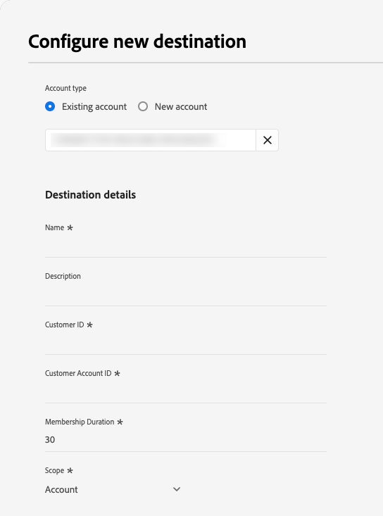

# [!DNL Microsoft Ads Customer Match] connection {#microsoft-ads-customer-match-destination}

## Overview {#overview}

Use the [!DNL Microsoft Ads Customer Match] destination to match customers by email address and reengage with them across the [!DNL Microsoft Advertising Network], including search and Audience ads. Link your [!DNL Microsoft Advertising] account to Real-Time CDP to automate customer match list creation and management directly from Experience Platform.

## Use cases {#use-cases}

To help you better understand how and when to use the [!DNL Microsoft Ads Customer Match] destination, here are sample use cases that Adobe Experience Platform customers can solve by using this feature.

### Use case #1

An e-commerce brand wants to reach existing customers through [!DNL Microsoft Search] and [!DNL Microsoft Audience Network] to personalize offers based on their past purchases and browsing history. The brand can ingest email addresses from their own CRM into Experience Platform, build audiences from their own offline data, and send these audiences to [!DNL Microsoft Ads Customer Match] to be used across search and audience ads, optimizing their advertising spending.

### Use case #2

A technology company launched a new product. To promote this new product, they are looking to drive awareness among customers who previously purchased related products. They upload email addresses from their CRM database into Experience Platform, using the email addresses as identifiers. Audiences are created based on customers who own related products. Those audiences get sent to [!DNL Microsoft Ads Customer Match], so the company can target current customers and similar customers across the [!DNL Microsoft Advertising Network].

## Supported identities {#supported-identities}

[!DNL Microsoft Ads Customer Match] supports the activation of identities described in the table below. Learn more about [identities](/help/identity-service/features/namespaces.md).

|Target Identity|Description|Considerations|
|---|---|---|
|`email`|Plain text email addresses|Only plain text email addresses are supported by the [!DNL Microsoft Ads Customer Match] connection. Experience Platform automatically hashes email addresses on export to match Microsoft's requirements.|

{style="table-layout:auto"}

## Supported audiences {#supported-audiences}

This section describes which types of audiences you can export to this destination.

| Audience origin | Supported | Description | 
|---------|----------|----------|
| [!DNL Segmentation Service] | Yes | Audiences generated through the Experience Platform [Segmentation Service](../../../segmentation/home.md).|
| All other audience origins | Yes | This category includes all audience origins outside of audiences generated through the [!DNL Segmentation Service]. Read about the [various audience origins](/help/segmentation/ui/audience-portal.md#customize). Some examples include: <ul><li> custom upload audiences [imported](../../../segmentation/ui/audience-portal.md#import-audience) into Experience Platform from CSV files,</li><li> look-alike audiences, </li><li> federated audiences, </li><li> audiences generated in other Experience Platform apps such as Adobe Journey Optimizer, </li><li> and more. </li></ul> |

{style="table-layout:auto"}

Supported audiences by audience data type:

| Audience data type | Supported | Description | Use cases |
|--------------------|-----------|-------------|-----------|
| [People audiences](/help/segmentation/types/people-audiences.md) | Yes | Based on customer profiles, allowing you to target specific groups of people for marketing campaigns. | Frequent buyers, cart abandoners |
| [Account audiences](/help/segmentation/types/account-audiences.md) | No | Target individuals within specific organizations for account-based marketing strategies. | B2B marketing |
| [Prospect audiences](/help/segmentation/types/prospect-audiences.md) | No | Target individuals who are not yet customers but share characteristics with your target audience. | Prospecting with third-party data |
| [Dataset exports](/help/catalog/datasets/overview.md) | No | Collections of structured data stored in the Adobe Experience Platform Data Lake. | Reporting, data science workflows |

{style="table-layout:auto"}

## Export type and frequency {#export-type-frequency}

Refer to the table below for information about the destination export type and frequency.

| Item | Type | Notes |
|---------|----------|---------|
| Export type | **[!UICONTROL Audience export]** | You are exporting all members of an audience with the identifiers (email addresses) used in the [!DNL Microsoft Ads Customer Match] destination.|
| Export frequency | **[!UICONTROL Streaming]** | Streaming destinations are "always on" API-based connections. As soon as a profile is updated in Experience Platform based on audience evaluation, the connector sends the update downstream to the destination platform. Read more about [streaming destinations](/help/destinations/destination-types.md#streaming-destinations).|

{style="table-layout:auto"}

## Prerequisites {#prerequisites}

To send audience data to [!DNL Microsoft Ads], you need to have an active [!DNL Microsoft Advertising] account. For details on creating an account, visit the [Microsoft Advertising documentation](https://help.ads.microsoft.com/#apex/ads/en/53090/0).

When configuring the destination, you must provide the following information:

* [!UICONTROL Customer ID]: your [!DNL Microsoft Ads] Customer ID (CID), in integer format. See the [Microsoft Advertising documentation](https://learn.microsoft.com/en-us/advertising/guides/get-started?view=bingads-13#get-ids) for instructions on how to find your Customer ID.
* [!UICONTROL Customer Account ID]: your [!DNL Microsoft Ads] Customer Account ID. See the [Microsoft Advertising documentation](https://learn.microsoft.com/en-us/advertising/guides/get-started?view=bingads-13#get-ids) for instructions on how to find your  Customer Account ID.

## Connect to the destination {#connect}

>[!IMPORTANT]
> 
>To connect to the destination, you need the **[!UICONTROL View Destinations]** and **[!UICONTROL Manage Destinations]** [access control permissions](/help/access-control/home.md#permissions). Read the [access control overview](/help/access-control/ui/overview.md) or contact your product administrator to obtain the required permissions.

To connect to this destination, follow the steps described in the [destination configuration tutorial](../../ui/connect-destination.md).

### Fill in destination details {#parameters}

>[!CONTEXTUALHELP]
>id="platform_destinations_microsoft_ads_cm_customer_id"
>title="Customer ID"
>abstract="Your Microsoft Advertising Customer ID, also known as the Manager account ID. This is the top-level identifier in Microsoft Advertising that can have multiple advertiser accounts (Customer Account IDs) under it."
>additional-url="https://learn.microsoft.com/en-us/advertising/guides/get-started?view=bingads-13#get-ids" text="Find your Customer ID"

>[!CONTEXTUALHELP]
>id="platform_destinations_microsoft_ads_cm_customer_account_id"
>title="Customer Account ID"
>abstract="Your Microsoft Advertising Customer Account ID, also known as the Advertiser account ID. This identifies a specific advertiser account under your Customer ID."
>additional-url="https://learn.microsoft.com/en-us/advertising/guides/get-started?view=bingads-13#get-ids" text="Find your Customer Account ID"

>[!CONTEXTUALHELP]
>id="platform_destinations_microsoft_ads_cm_membership_duration"
>title="Membership Duration"
>abstract="The number of days a user remains in the customer match list. Accepted values are between 1 and 390 days."

>[!CONTEXTUALHELP]
>id="platform_destinations_microsoft_ads_cm_list_availability"
>title="Customer Match List Availability"
>abstract="Select whether the customer match list is available to a single advertiser account or to all accounts under the manager account. Select Customer ID to make the list available across all advertiser accounts under your Customer ID. Select Customer Account ID to restrict the list to the specific Customer Account ID."
>additional-url="https://help.ads.microsoft.com/apex/index/3/en/56727" text="Learn more about audience list sharing in Microsoft Advertising"

While [setting up](../../ui/connect-destination.md) this destination, you must provide the following information:

* **[!UICONTROL Name]**: A name by which you will recognize this destination in the future.
* **[!UICONTROL Description]**: A description that will help you identify this destination in the future.
* **[!UICONTROL Customer ID]**: Your [!DNL Microsoft Ads] Customer ID (CID). See the [Microsoft Advertising documentation](https://learn.microsoft.com/en-us/advertising/guides/get-started?view=bingads-13#get-ids) for instructions on how to find your Customer ID.
* **[!UICONTROL Customer Account ID]**: Your [!DNL Microsoft Ads] Customer Account ID. See the [Microsoft Advertising documentation](https://learn.microsoft.com/en-us/advertising/guides/get-started?view=bingads-13#get-ids) for instructions on how to find your  Customer Account ID.
* **[!UICONTROL Membership Duration]**: The number of days a user remains in the customer match list. Accepted values are between 1 and 390 days.
* **[!UICONTROL Customer Match List Availability]**: Select the availability of the customer match list. In [!DNL Microsoft Advertising], a Customer ID can have multiple Customer Account IDs (advertiser accounts) under it. Select **[!UICONTROL Customer ID (all advertising accounts)]** to make the list available across all advertiser accounts under your Customer ID, or **[!UICONTROL Customer Account ID (single advertising account)]** to restrict the list to the specific Customer Account ID you provided above. See the [Microsoft Advertising documentation](https://help.ads.microsoft.com/apex/index/3/en/56727) for more details.

### Enable alerts {#enable-alerts}

You can enable alerts to receive notifications on the status of the dataflow to your destination. Select an alert from the list to subscribe to receive notifications on the status of your dataflow. For more information on alerts, see the guide on [subscribing to destinations alerts using the UI](../../ui/alerts.md).

When you are finished providing details for your destination connection, select **[!UICONTROL Next]**.

## Activate audiences to this destination {#activate}

>[!IMPORTANT]
> 
>* To activate data, you need the **[!UICONTROL View Destinations]**, **[!UICONTROL Activate Destinations]**, **[!UICONTROL View Profiles]**, and **[!UICONTROL View Segments]** [access control permissions](/help/access-control/home.md#permissions). Read the [access control overview](/help/access-control/ui/overview.md) or contact your product administrator to obtain the required permissions.
>* To export *identities* to destinations, you need the **[!UICONTROL View Identity Graph]** [access control permission](/help/access-control/home.md#permissions).   {width="100" zoomable="yes"}

See [Activate audience data to streaming audience export destinations](../../ui/activate-segment-streaming-destinations.md) for instructions on activating audiences to this destination.

### Mapping {#mapping}

In the **[!UICONTROL Mapping]** step, you must map the email identity from your source profiles to the target identity in [!DNL Microsoft Ads Customer Match].

* **Source field**: Select `IdentityMap: Email` as the source field to map email identities from your profiles. Alternatively, you can select an XDM attribute such as `personalEmail.address` as the source field.
* **Target field**: Select `Identity: email` as the target field.

>[!IMPORTANT]
>
>You must use unhashed (plain text) source fields. Do not use pre-hashed source identities such as `Emails (SHA256, lowercased)`. Experience Platform automatically hashes the email addresses on export to match Microsoft's requirements.

## Exported data {#exported-data}

To verify if data has been exported successfully to the [!DNL Microsoft Ads Customer Match] destination, check your [!DNL Microsoft Advertising] account. If activation was successful, audiences are populated in your account as customer match lists.

## Additional resources {#additional-resources}

Refer to the [Microsoft Advertising Help Center](https://help.ads.microsoft.com/) for additional information.
