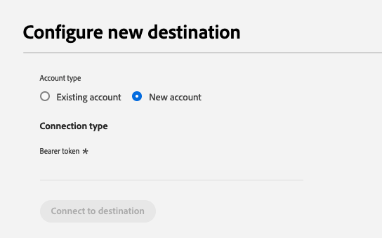
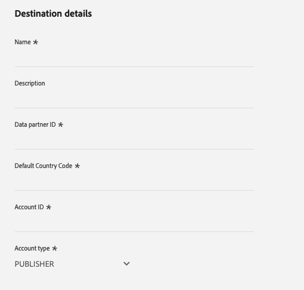
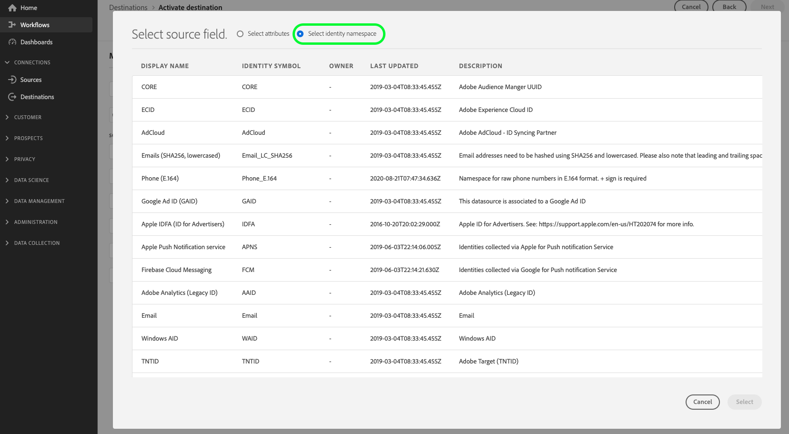

# PubMatic Connect destination {#pubmatic-connect}

## Overview {#overview}

Use [!DNL PubMatic Connect] to maximize customer value by delivering the programmatic digital marketing supply chain of the future. [!DNL PubMatic Connect] combines platform technology and dedicated service to enhance how inventory and data are packaged and transacted.

Use this destination to send audience data to the [!DNL PubMatic Connect] platform.

>[!IMPORTANT]
>
>The destination connector and documentation page are created and maintained by the [!DNL PubMatic] team. For any inquiries or update requests, contact them directly at `support@pubmatic.com`.

## Use cases {#use-cases}

To help you better understand how and when you should use the [!DNL PubMatic Connect] destination, here is a sample use case that Adobe Experience Platform customers can solve by using this destination.

### Targeting users on mobile, web, and CTV platforms {#targeting}

Publishers or data providers want to send audiences from Adobe Experience Platform to [!DNL PubMatic Connect] to target users on mobile, web, and CTV platforms, using a large range of identifiers.

## Prerequisites {#prerequisites}

Talk to your [!DNL PubMatic] Account Manager to make sure your account is configured correctly and supports onboarding of audience segments. They will also make sure you have all the relevant details to use this destination and to provide you with support during the setup.

## Supported identities {#supported-identities}

[!DNL PubMatic Connect] supports the activation of identities described in the table below. Learn more about [identities](/help/identity-service/features/namespaces.md).

| Target Identity | Description | Considerations |
| --------------- | ------ | --- |
| GAID            | Google Advertising ID    | Select the GAID target identity when your source identity is a GAID namespace.  |
| IDFA            | Apple ID for Advertisers | Select the IDFA target identity when your source identity is an IDFA namespace. |
| extern_id       | Custom user IDs          | Select this target identity when your source identity is a custom namespace.    |

{style="table-layout:auto"}

## Supported audiences {#supported-audiences}

This section describes which type of audiences you can export to this destination.

| Audience origin| Supported | Description|
| --- | --------- | ------ |
| [!DNL Segmentation Service] | ✓         | Audiences generated through the Experience Platform [Segmentation Service](../../../segmentation/home.md).          |
| Custom uploads              | ✓         | Audiences [imported](../../../segmentation/ui/overview.md#import-audience) into Experience Platform from CSV files. |

{style="table-layout:auto"}

## Export type and frequency {#export-type-frequency}

Refer to the table below for information about the destination export type and frequency.

| Item| Type  | Notes |
| --- | --- | --- |
| Export type      | **[!UICONTROL Segment export]** | You are exporting all members of a segment (audience) with the identifiers (name, phone number, or others) used in the PubMatic Connect destination. |
| Export frequency | **[!UICONTROL Streaming]**      | Streaming destinations are "always on" API-based connections. When a profile is updated in Experience Platform based on segment evaluation, the connector sends the update downstream to the destination platform. Read more about [streaming destinations](/help/destinations/destination-types.md#streaming-destinations). |

{style="table-layout:auto"}

## Connect to the destination {#connect}

>[!IMPORTANT]
>
> To connect to the destination, you need the **[!UICONTROL Manage Destinations]** [access control permission](/help/access-control/home.md#permissions). Read the [access control overview](/help/access-control/ui/overview.md) or contact your product administrator to obtain the required permissions.

To connect to this destination, follow the steps described in the [destination configuration tutorial](../../ui/connect-destination.md). In the destination configuration workflow, fill in the fields listed in the two sections below.

### Authenticate to destination {#authenticate}

To authenticate to the destination, fill in the required fields and select **[!UICONTROL Connect to destination]**.

- **[!UICONTROL Bearer token]**: Fill in the bearer token to authenticate to the destination.

### Fill in destination details {#destination-details}

To configure details for the destination, fill in the required and optional fields below. An asterisk next to a field in the UI indicates that the field is required.

- **[!UICONTROL Name]**: A name by which you will recognize this destination in the future.
- **[!UICONTROL Description]**: A description that will help you identify this destination in the future.
- **[!UICONTROL Data partner ID]**: The data partner ID set up in your [!DNL PubMatic] account for this integration.
- **[!UICONTROL Default country code]**: The default country code that should be applied to all identities if none is provided in the profile.
- **[!UICONTROL Account ID]**: Your [!DNL PubMatic Connect] account ID.
- **[!UICONTROL Account type]**: The account type of your [!DNL PubMatic] platform account. Talk to your [!DNL PubMatic] account manager if you have any questions on which to choose. The available options are:
    - [!UICONTROL PUBLISHER]
    - [!UICONTROL DEMAND_PARTNER]
    - [!UICONTROL BUYER]

### Enable alerts {#enable-alerts}

You can enable alerts to receive notifications on the status of the dataflow to your destination. Select an alert from the list to subscribe to receive notifications on the status of your dataflow. For more information on alerts, see the guide on [subscribing to destinations alerts using the UI](../../ui/alerts.md).

When you are finished providing details for your destination connection, select **[!UICONTROL Next]**.

## Activate segments to this destination {#activate}

>[!IMPORTANT]
>
> - To activate data, you need the **[!UICONTROL View Destinations]**, **[!UICONTROL Activate Destinations]**, **[!UICONTROL View Profiles]**, and **[!UICONTROL View Segments]** [access control permissions](/help/access-control/home.md#permissions). Read the [access control overview](/help/access-control/ui/overview.md) or contact your product administrator to obtain the required permissions.
>
> - To export _identities_, you need the **[!UICONTROL View Identity Graph]** [access control permission](/help/access-control/home.md#permissions).   {width="100" zoomable="yes"}

Read [Activate profiles and segments to streaming segment export destinations](/help/destinations/ui/activate-segment-streaming-destinations.md) for instructions on activating audience segments to this destination.

### Map attributes and identities {#map}

Selecting source fields:

- Select an identifier (usually namespaces like IDFA or a custom ID namespace).

Selecting target fields:

- Talk to your [!DNL PubMatic] Account Manager to get the information on which UID type will be correct during this step.
- Select the [!DNL PubMatic UID] type number that matches the identifier you selected in the first step.

## Exported data / Validate data export {#exported-data}

The [!DNL PubMatic] UI allows you to check if the data has been pushed correctly and that the segments are available. It can take up to 24 hours after data has been pushed for the [!DNL PubMatic] UI to be updated.

## Data usage and governance {#data-usage-governance}

All [!DNL Adobe Experience Platform] destinations are compliant with data usage policies when handling your data. For detailed information on how [!DNL Adobe Experience Platform] enforces data governance, read the [Data Governance overview](/help/data-governance/home.md).
