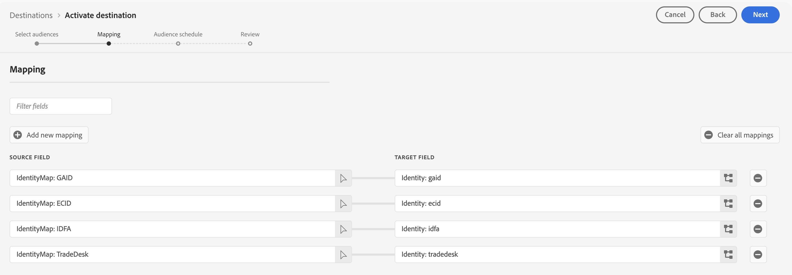

# [!DNL The Trade Desk] connection

## Overview {#overview}

Use this destination connector to send profile data to [!DNL The Trade Desk]. This connector sends data to the [!DNL The Trade Desk] first-party endpoint. The integration between Adobe Experience Platform and [!DNL The Trade Desk] does not support exporting data to the [!DNL The Trade Desk] third-party endpoint.

[!DNL The Trade Desk] is a self-service platform for ad buyers to execute retargeting and audience-targeted digital campaigns across display, video, and mobile inventory sources.

To send profile data to [!DNL The Trade Desk], you must first connect to the destination, as described in the following sections of this page.

## Use cases {#use-cases}

As a marketer, I want to be able to use audiences built off of [!DNL Trade Desk IDs] or device IDs to create retargeting or audience-targeted digital campaigns.

## Supported identities {#supported-identities}

[!DNL The Trade Desk] supports the activation of audiences based on the identities shown in the table below. Learn more about [identities](/help/identity-service/features/namespaces.md).

Below are the identities supported by [!DNL The Trade Desk] destination. These identities can be used to activate audiences to [!DNL The Trade Desk].

All identities in the table below are preconfigured and automatically mapped during activation. You do not need to manually configure these mappings in the activation workflow.

|Target identity|Description|Considerations|
|---|---|---|
|GAID|Google Advertising ID|Activated when a GAID is present on the profile.|
|IDFA|Apple ID for Advertisers|Activated when an IDFA is present on the profile.|
|ECID|Experience Cloud ID|A namespace that represents ECID. This namespace can also be referred to by the following aliases: "Adobe Marketing Cloud ID", "Adobe Experience Cloud ID", "Adobe Experience Platform ID". Read the following document on [ECID](/help/identity-service/features/ecid.md) for more information.|
|[!DNL Tradedesk]|[!DNL TDID] in the [!DNL The Trade Desk] platform|Activated when a profile has an ECID and an ECID-to-Trade Desk ID mapping exists in Experience Platform.|

{style="table-layout:auto"}

## Supported audiences {#supported-audiences}

This section describes which types of audiences you can export to this destination.

| Audience origin | Supported | Description | 
|---------|----------|----------|
| [!DNL Segmentation Service] | ✓ | Audiences generated through the Experience Platform [Segmentation Service](../../../segmentation/home.md).|
| Custom uploads | ✓ | Audiences [imported](../../../segmentation/ui/audience-portal.md#import-audience) into Experience Platform from CSV files. |

{style="table-layout:auto"}

## Export type and frequency {#export-type-frequency}

Refer to the table below for information about the destination export type and frequency.

| Item | Type | Notes |
|---------|----------|---------|
| Export type | **[!UICONTROL Audience export]** | You are exporting all members of an audience to the destination.|
| Export frequency | **[!UICONTROL Streaming]** | Streaming destinations are "always on" API-based connections. As soon as a profile is updated in Experience Platform based on audience evaluation, the connector sends the update downstream to the destination platform. Read more about [streaming destinations](/help/destinations/destination-types.md#streaming-destinations).|

{style="table-layout:auto"}

## Prerequisites {#prerequisites}

Prerequisites depend on which identity types you plan to use for audience activation:

**For mobile ID activation only**, there are no prerequisites. As long as you are collecting and managing IDs (GAID and/or IDFA) for your customers, you can start activating audiences to [!DNL The Trade Desk].

**For cookie-based targeting on [!DNL The Trade Desk]**, make sure that a mapping between ECID and [!DNL Trade Desk ID] is established. Complete the steps below to do so:

1. **Enable ID sync functionality**: If this is your first time setting up [!DNL The Trade Desk ID] activation and you have not enabled the [ID sync functionality](https://experienceleague.adobe.com/en/docs/id-service/using/id-service-api/methods/idsync) in Experience Cloud ID Service in the past (with Adobe Audience Manager or other applications), contact Adobe Consulting or Customer Care to enable ID syncs. 
   * If you have previously set up [!DNL The Trade Desk] integrations in Audience Manager, your existing ID syncs automatically carry over to Experience Platform.

2. **Instrument your web pages**: Implement code on your web pages to create mappings between [!DNL The Trade Desk ID] and Adobe ECID. This allows Experience Platform to associate Trade Desk IDs with your customer profiles.

3. **Verify ECID on profiles**: Confirm that ECID is present on the profiles you want to activate. [!DNL Trade Desk ID] activation requires profiles to have an ECID with a corresponding Trade Desk ID mapping.

## Connect to the destination {#connect}

>[!IMPORTANT]
> 
>To connect to the destination, you need the **[!UICONTROL View Destinations]** and **[!UICONTROL Manage Destinations]** [access control permissions](/help/access-control/home.md#permissions). Read the [access control overview](/help/access-control/ui/overview.md) or contact your product administrator to obtain the required permissions.

To connect to this destination, follow the steps described in the [destination configuration tutorial](../../ui/connect-destination.md).

### Connection parameters {#parameters}

While [setting up](../../ui/connect-destination.md) this destination, you must provide the following information:

* **[!UICONTROL Name]**: A name by which you will recognize this destination in the future.
* **[!UICONTROL Description]**: A description that will help you identify this destination in the future.
* **[!UICONTROL Account ID]**: Your [!DNL The Trade Desk] [!UICONTROL Account ID].
* **[!UICONTROL Server Location]**: Ask your [!DNL The Trade Desk] representative which regional server you should use. Below are the available regional servers that you can choose from:

  * **[!UICONTROL APAC]**
  * **[!UICONTROL China]**
  * **[!UICONTROL Tokyo]**
  * **[!UICONTROL UK/EU]**
  * **[!UICONTROL US East Coast]**
  * **[!UICONTROL US West Coast]**

### Enable alerts {#enable-alerts}

You can enable alerts to receive notifications on the status of the dataflow to your destination. Select an alert from the list to subscribe to receive notifications on the status of your dataflow. For more information on alerts, see the guide on [subscribing to destinations alerts using the UI](../../ui/alerts.md).

When you are finished providing details for your destination connection, select **[!UICONTROL Next]**.

## Activate audiences to this destination {#activate}

>[!IMPORTANT]
> 
>* To activate data, you need the **[!UICONTROL View Destinations]**, **[!UICONTROL Activate Destinations]**, **[!UICONTROL View Profiles]**, and **[!UICONTROL View Segments]** [access control permissions](/help/access-control/home.md#permissions). Read the [access control overview](/help/access-control/ui/overview.md) or contact your product administrator to obtain the required permissions.
>* To export *identities*, you need the **[!UICONTROL View Identity Graph]** [access control permission](/help/access-control/home.md#permissions).   {width="100" zoomable="yes"}

See [Activate audience data to streaming audience export destinations](../../ui/activate-segment-streaming-destinations.md) for instructions on activating audiences to this destination.

In the [Audience schedule](../../ui/activate-segment-streaming-destinations.md#scheduling) step, you must manually map your audiences to their corresponding ID or friendly name in the destination platform.

When mapping audiences, Adobe recommends that you use the Experience Platform audience name or a shorter form of it, for ease of use. However, the audience ID or name in your destination does not need to match the one in your Experience Platform account. Any value you insert in the mapping field will be reflected by the destination.

### Preconfigured mappings {#preconfigured-mappings}

>[!CONTEXTUALHELP]
>id="platform_destinations_required_mappings_ttd"
>title="Preconfigured mapping sets"
>abstract="We have preconfigured these four mapping sets for you. As you activate data to The Trade Desk, the profiles qualified for the activated audiences do not necessarily need to have all four identities present on the profiles, as this destination will work with any of the target identities shown here."

The following identity mappings are **preconfigured and automatically populated** for you in the audience activation workflow:

* GAID (Google Advertising ID)
* IDFA (Apple ID for Advertisers)
* ECID (Experience Cloud ID)
* [!DNL The Trade Desk ID]

These mappings are grayed out and read-only. You do not need to configure anything in this step. Select **[!UICONTROL Next]** to continue.

Experience Platform automatically checks each profile that belongs to audiences mapped in the activation workflow for all supported identity types and then activates the profile using any identities that are present.

### Identity requirements by activation type

**Mobile ID activation (GAID/IDFA):** Profiles with just GAID or IDFA are sufficient for activation. No additional identities or prerequisites are required.

**Cookie-based targeting ([!DNL Trade Desk ID]):** Requires both:

* ECID present on the profile
* An ID sync mapping between the [!DNL Trade Desk ID] and ECID (configured as described in the [prerequisites](#prerequisites) section)

**Multiple IDs behavior:** If a profile contains multiple supported identities, the profile will be split and each identity will be activated separately to [!DNL The Trade Desk]. This ensures maximum reach and flexibility in your audience activation.

### Activation examples

* **Mobile ID profiles:** Profiles with GAID and/or IDFA are activated using their respective advertising IDs. If a profile contains both GAID and IDFA, it will be split into two separate activations
* **Cookie-based profile:** A profile with ECID and a corresponding [!DNL Trade Desk ID] mapping will be activated using the Trade Desk ID for cookie-based targeting
* **ECID-only profile:** A profile with only ECID and no [!DNL Trade Desk ID] mapping will **not be exported**. ECID alone is insufficient for activation.

## Exported data {#exported-data}

To verify if data has been exported successfully to the [!DNL The Trade Desk] destination, check your [!DNL The Trade Desk] account. If activation was successful, audiences are populated in your account.
