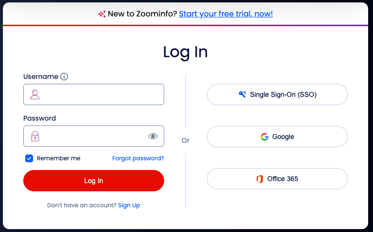

# ZoomInfo Account Audiences connection {#zoominfo-account-audiences}

>[!AVAILABILITY]
>
>The functionality to activate account audiences to the ZoomInfo Account Audiences destination is available for companies purchasing the [Business-to-Business](/help/rtcdp/overview.md#rtcdp-b2b) edition of Real-Time Customer Data Platform.

Activate profiles for your [!DNL ZoomInfo MarketingOS] campaigns for audience targeting, personalization, and suppression, based on [account audiences](/help/segmentation/types/account-audiences.md).

## Overview {#overview}

<!-- TODO: Confirm overview text with ZoomInfo / PM team -->

[!DNL ZoomInfo] is a B2B data and intelligence platform that provides firmographic, technographic, and intent data for account-based marketing. This integration enables Adobe Real-Time CDP B2B Edition customers to activate account audiences to [!DNL ZoomInfo MarketingOS] for downstream account-based marketing workflows.

[!DNL ZoomInfo] ingests account audiences from Experience Platform, resolves accounts using company domain and firmographic attributes, and enriches matched accounts with firmographic, technographic, and intent signals. The enriched accounts are made available in [!DNL ZoomInfo] for use cases such as account prioritization, audience segmentation, and paid media activation across supported advertising and marketing channels.

## Use cases {#use-cases}

To help you better understand how and when you should use the [!DNL ZoomInfo Account Audiences] destination, here are sample use cases that Adobe Experience Platform customers can solve by using this destination.

### Account-based activation to paid media {#paid-media-activation}

As a B2B marketer, you can send account audiences from the B2B CDP through [!DNL ZoomInfo] to downstream DSPs and ad platforms for account-based programmatic advertising.

Through [!DNL ZoomInfo]'s integration with DSPs, you can ingest account audiences, associate accounts with relevant individuals based on role, job function, and seniority, and activate audiences to downstream ad platforms via [!DNL ZoomInfo] media integrations. This ensures your ad spend is focused on high-value accounts and relevant buying groups.

### Account enrichment and prioritization {#enrichment-prioritization}

As a B2B marketer, you can send account audiences to [!DNL ZoomInfo] for firmographic, technographic, and intent enrichment. [!DNL ZoomInfo] enriches matched accounts and returns enrichment attributes to downstream systems, enabling more accurate segmentation, ranking, and sales alignment based on account fit and buying readiness.

## Prerequisites {#prerequisites}

To export account audiences to [!DNL ZoomInfo], you need the following:

1. A [!DNL ZoomInfo MarketingOS] account. <!-- TODO: Confirm if there's a specific sign-up link or request form -->
2. A valid [!DNL ZoomInfo] account with OAuth 2.0 credentials configured for authentication with Adobe Experience Platform.

## Supported audiences {#supported-audiences}

This section describes which type of audiences you can export to this destination.

| Audience origin | Supported | Description | 
|---------|----------|----------|
| [!DNL Segmentation Service] | Yes | Audiences generated through the Experience Platform [Segmentation Service](../../../segmentation/home.md).|
| All other audience origins | Yes | This category includes all audience origins outside of audiences generated through the [!DNL Segmentation Service]. Read about the [various audience origins](/help/segmentation/ui/audience-portal.md#customize). Some examples include: <ul><li> custom upload audiences [imported](../../../segmentation/ui/audience-portal.md#import-audience) into Experience Platform from CSV files,</li><li> look-alike audiences, </li><li> federated audiences, </li><li> audiences generated in other Experience Platform apps such as Adobe Journey Optimizer, </li><li> and more. </li></ul> |

{style="table-layout:auto"}

Supported audiences by audience data type:

| Audience data type | Supported | Description | Use cases |
|--------------------|-----------|-------------|-----------|
| [People audiences](/help/segmentation/types/people-audiences.md) | No | Based on customer profiles, allowing you to target specific groups of people for marketing campaigns. | Frequent buyers, cart abandoners |
| [Account audiences](/help/segmentation/types/account-audiences.md) | Yes | Target individuals within specific organizations for account-based marketing strategies. | B2B marketing |
| [Prospect audiences](/help/segmentation/types/prospect-audiences.md) | No | Target individuals who are not yet customers but share characteristics with your target audience. | Prospecting with third-party data |
| [Dataset exports](/help/catalog/datasets/overview.md) | No | Collections of structured data stored in the Adobe Experience Platform Data Lake. | Reporting, data science workflows |

{style="table-layout:auto"}

## Supported identities {#supported-identities}

[!DNL ZoomInfo Account Audiences] supports the mapping of the target identities described in the table below. Learn more about [identities](/help/identity-service/features/namespaces.md).

| Target Identity | Description |
|---|---|
| `accountName` | The name of the account. |
| `accountSite` | The website of the account. |
| `primaryId` | The primary identifier for the account. |

{style="table-layout:auto"}

## Export type and frequency {#export-type-and-frequency} 

Refer to the table below for information about the destination export type and frequency.

| Item | Type | Notes |
|---------|----------|---------|
| Export type | **[!UICONTROL Audience export]** | You are exporting all members of an audience with the identifiers (name, phone number, or others) used in the [!DNL ZoomInfo Account Audiences] destination.|
| Export frequency | **[!UICONTROL Streaming]** | Streaming destinations are "always on" API-based connections. As soon as a profile is updated in Experience Platform based on audience evaluation, the connector sends the update downstream to the destination platform. Read more about [streaming destinations](/help/destinations/destination-types.md#streaming-destinations).|

{style="table-layout:auto"}

## Connect to the destination {#connect}

>[!IMPORTANT]
> 
>To connect to the destination, you need the **[!UICONTROL View Destinations]** and **[!UICONTROL Manage Destinations]** [access control permission](/help/access-control/home.md#permissions). Read the [access control overview](/help/access-control/ui/overview.md) or contact your product administrator to obtain the required permissions.

To connect to this destination, follow the steps described in the [destination configuration tutorial](../../ui/connect-destination.md). In the configure destination workflow, fill in the fields listed in the two sections below.

### Authenticate to destination {#authenticate}

To authenticate to the destination, fill in the required fields and select **[!UICONTROL Connect to destination]**.

* **[!UICONTROL Account name]**: Enter a name that will help you easily identify this destination account in the future. This is especially useful if you have multiple connections to the same destination.
* **[!UICONTROL Description]** (optional): Add any additional details that will help you or your team distinguish between accounts, such as the purpose of the connection or relevant business context.

After selecting **[!UICONTROL Connect to destination]**, you are redirected to the [!DNL ZoomInfo] login page. Log in with your [!DNL ZoomInfo] credentials.

After successful authentication, [!DNL ZoomInfo] redirects you back to Experience Platform and the connection is created automatically. You do not need to enter or manage credentials manually, as the integration uses OAuth 2.0 with PKCE to securely handle authentication. Experience Platform automatically refreshes the access token when needed.

### Fill in destination details {#destination-details}

To configure details for the destination, fill in the required and optional fields below. An asterisk next to a field in the UI indicates that the field is required.

* **[!UICONTROL Name]**: A name by which you will recognize this destination in the future.
* **[!UICONTROL Description]**: A description that will help you identify this destination in the future.

Now you're ready to activate your audiences within [!DNL ZoomInfo].

## Activate audiences to this destination {#activate}

>[!IMPORTANT]
> 
>* To activate data, you need the **[!UICONTROL View Destinations]**, **[!UICONTROL Activate Destinations]**, **[!UICONTROL View Profiles]**, and **[!UICONTROL View Segments]** [access control permissions](/help/access-control/home.md#permissions). Read the [access control overview](/help/access-control/ui/overview.md) or contact your product administrator to obtain the required permissions.
>* To export *identities*, you need the **[!UICONTROL View Identity Graph]** [access control permission](/help/access-control/home.md#permissions).   {width="100" zoomable="yes"}

Read [Activate account audiences](/help/destinations/ui/activate-account-audiences.md) for instructions on activating account audiences to this destination.

### Mandatory mappings {#mandatory-mappings}

When activating audiences to the [!DNL ZoomInfo Account Audiences] destination, you must configure one of the following mandatory mapping pairs. Use either pair depending on which attribute has data in your account profiles. [!DNL ZoomInfo] uses the domain or website attribute to match accounts.

**Option 1: Account name and email domain**

| Source field | Target field | Description |
|--------------|--------------|-------------|
| `xdm: accountName` | `xdm: accountName` | The name of the account. |
| `xdm: accountOrganization.domain` | `xdm: accountEmailDomain` | The email domain of the account organization. |

**Option 2: Account website and primary identifier**

| Source field | Target field | Description |
|--------------|--------------|-------------|
| `xdm: accountOrganization.website` | `xdm: accountWebsite` | The website of the account organization. |
| `xdm: accountKey.sourceKey` | `Identity: primaryId` | The primary identifier for the account. |

<!-- TODO: Add screenshot of mapping step -->

## Audience sync behavior {#sync-behavior}

After the initial audience activation, subsequent updates to the audience in Experience Platform are incrementally synced to [!DNL ZoomInfo]. The following behaviors apply:

* **Account added to the audience**: When an account profile meets the audience qualification criteria, the account is automatically added to the corresponding audience list in [!DNL ZoomInfo].
* **Account removed or no longer qualifies**: When an account no longer qualifies for the audience or is removed from the audience in Experience Platform, it is removed from the corresponding audience in [!DNL ZoomInfo]. The account record itself is not deleted in [!DNL ZoomInfo]; only the audience membership is updated.
* **Account or profile deleted**: When an account or profile is deleted from Experience Platform and that account no longer qualifies for the audience, it is removed from the corresponding audience in [!DNL ZoomInfo].

### Audience deletion and disconnect behavior {#deletion-disconnect}

When an account audience that has been activated to [!DNL ZoomInfo] is deleted in Experience Platform, the corresponding audience in [!DNL ZoomInfo] is moved to an "Archived" state. The archived audience is no longer available for activation or targeting in [!DNL ZoomInfo], but remains visible for historical reference and reporting. No further membership updates (additions or removals) are sent to [!DNL ZoomInfo] for the archived audience.

## Data usage and governance {#data-usage-governance}

All [!DNL Adobe Experience Platform] destinations are compliant with data usage policies when handling your data. For detailed information on how [!DNL Adobe Experience Platform] enforces data governance, read the [Data Governance overview](/help/data-governance/home.md).

## Additional resources {#additional-resources}

<!-- TODO: Add link to ZoomInfo MarketingOS documentation -->
