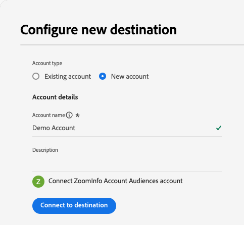
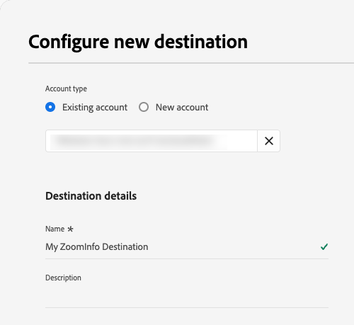
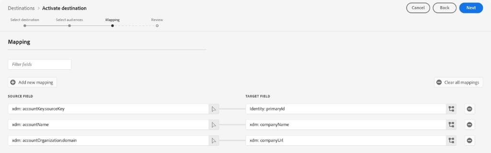
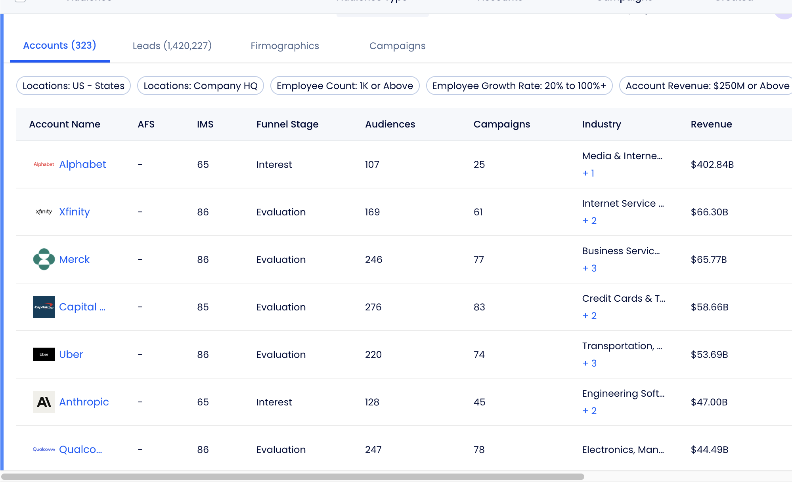

# [!DNL ZoomInfo Account Audiences] connection {#zoominfo-account-audiences}

Activate [account audiences](/help/segmentation/types/account-audiences.md) to [!DNL ZoomInfo MarketingOS] for account enrichment, prioritization, and paid media activation.

>[!AVAILABILITY]
>
>Your organization must purchase [!DNL Adobe Real-Time CDP B2B Edition] to activate account audiences to this destination. Learn about the [Business-to-Business edition](/help/rtcdp/overview.md#rtcdp-b2b).

## [!DNL ZoomInfo] destination {#zoominfo-destination}

[!DNL ZoomInfo] provides firmographic, technographic, and intent data for account based marketing. Use this destination to activate account audiences from [!DNL Adobe Real-Time CDP B2B Edition].

[!DNL ZoomInfo] resolves accounts by using company domains and firmographic attributes. It then enriches matched accounts with data and intent signals.

Use the enriched accounts for prioritization, audience segmentation, and paid media activation across supported channels.

## Use cases {#use-cases}

The following use cases show how you can activate account audiences to [!DNL ZoomInfo MarketingOS].

### Paid media activation {#paid-media-activation}

Send account audiences through [!DNL ZoomInfo] to demand side platforms (DSPs) and advertising platforms.

[!DNL ZoomInfo] associates accounts with people based on role, job function, and seniority. You can then focus advertising spend on relevant accounts and buying groups.

### Account prioritization {#account-prioritization}

Send account audiences to [!DNL ZoomInfo] for firmographic, technographic, and intent enrichment.

Use the enriched attributes to improve segmentation, ranking, and sales alignment. The attributes can indicate account fit and buying readiness.

## Prerequisites {#prerequisites}

Before you connect to [!DNL ZoomInfo], confirm that you have:

* An active [!DNL ZoomInfo MarketingOS] account that you can authorize for use with [!DNL Adobe Experience Platform].
* The external APIs add-on enabled on your [!DNL ZoomInfo] account. Contact [!DNL ZoomInfo] to enable and purchase this add-on.
* At least one [!DNL ZoomInfo] user with admin access. Use this access to create an application in the [!DNL ZoomInfo] developer portal for [!DNL Adobe Experience Platform].

### Create an application in the ZoomInfo developer portal {#create-application}

In the [!DNL ZoomInfo] developer portal, create a standard application for [!DNL Adobe Experience Platform] and select the **Authorization Code Flow (PKCE)** authentication method. For instructions, see [Standard App creation](https://docs.zoominfo.com/docs/standard-app) in the [!DNL ZoomInfo] documentation.

Select the **[!UICONTROL Company]** scope for the application. You do not need to select scopes for content, intent, news, or scoops data.

Add the following sign in redirect URIs to the application.

```
https://platform.adobe.io/data/core/activation/oauth/api/v1/callback
https://platform-va7.adobe.io/data/core/activation/oauth/api/v1/callback
https://platform-nld2.adobe.io/data/core/activation/oauth/api/v1/callback
https://platform-aus5.adobe.io/data/core/activation/oauth/api/v1/callback
https://platform-can2.adobe.io/data/core/activation/oauth/api/v1/callback
https://platform-gbr9.adobe.io/data/core/activation/oauth/api/v1/callback
```

## Supported audiences {#supported-audiences}

Review the audience origins and data types that you can export to this destination.

| Audience origin | Supported | Description |
|---|---|---|
| [!DNL Segmentation Service] | Yes | Audiences generated through [Segmentation Service](/help/segmentation/home.md). |
| Other audience origins | Yes | Audiences created outside [!DNL Segmentation Service]. Supported audience data type restrictions still apply. Learn about [audience origins](/help/segmentation/ui/audience-portal.md#customize). |

{style="table-layout:auto"}

The destination supports the following audience data types.

| Audience data type | Supported | Description | Use cases |
|---|---|---|---|
| [People audiences](/help/segmentation/types/people-audiences.md) | No | Audiences based on customer profiles. | Customer marketing |
| [Account audiences](/help/segmentation/types/account-audiences.md) | Yes | Audiences based on profiles that represent organizations. | Business to business marketing |
| [Prospect audiences](/help/segmentation/types/prospect-audiences.md) | No | Audiences of people who are not yet customers. | Prospecting |
| [Dataset exports](/help/catalog/datasets/overview.md) | No | Structured data stored in the [!DNL Adobe Experience Platform] Data Lake. | Reporting and data science |

{style="table-layout:auto"}

## Supported identities {#supported-identities}

[!DNL ZoomInfo Account Audiences] requires the following target identity. Learn about [identity namespaces](/help/identity-service/features/namespaces.md).

| Target identity | Description |
|---|---|
| `primaryId` | The primary identifier for the account. |

{style="table-layout:auto"}

## Export type and frequency {#export-type-and-frequency}

Review how and when this destination exports account audience data.

| Item | Type | Notes |
|---|---|---|
| Export type | **[!UICONTROL Audience export]** | Exports qualifying accounts with the mapped company attributes and primary account ID. |
| Export frequency | **[!UICONTROL Streaming]** | Exports updates when account audience membership changes in [!DNL Adobe Experience Platform]. Learn about [streaming destinations](/help/destinations/destination-types.md#streaming-destinations). |

{style="table-layout:auto"}

## Connect to the destination {#connect}

Follow the [destination configuration tutorial](/help/destinations/ui/connect-destination.md) to connect to this destination. Complete the authentication and destination detail fields described in this section.

>[!IMPORTANT]
>
>You need the **[!UICONTROL View Destinations]** and **[!UICONTROL Manage Destinations]** access control permissions. Review the [access control permissions](/help/access-control/home.md#permissions), or contact your product administrator.

### Authenticate to the destination {#authenticate}

Enter the account details, and then select **[!UICONTROL Connect to destination]**.



* **[!UICONTROL Account name]**: Enter a name that identifies this destination account.
* **[!UICONTROL Description]**: Enter details that help your team identify the account. This field is optional.

[!DNL ZoomInfo] then prompts you to sign in and authorize the connection. After authorization, [!DNL ZoomInfo] redirects you to [!DNL Adobe Experience Platform].

The OAuth 2.0 Authorization Code flow with PKCE handles authentication. You do not enter or manage client secrets in [!DNL Adobe Experience Platform].

[!DNL Adobe Experience Platform] stores the access and refresh tokens and refreshes the access token when needed.

### Enter destination details {#destination-details}

Enter a name and an optional description for the destination. An asterisk in the interface identifies a required field.



* **[!UICONTROL Name]**: Enter a name that identifies this destination.
* **[!UICONTROL Description]**: Enter details that help you identify this destination. This field is optional.

You can now activate account audiences to [!DNL ZoomInfo].

## Activate account audiences {#activate}

Follow the [account audience activation guide](/help/destinations/ui/activate-account-audiences.md) to activate account audiences to this destination.

>[!IMPORTANT]
>
>You need the **[!UICONTROL View Destinations]**, **[!UICONTROL Activate Destinations]**, **[!UICONTROL View Profiles]**, and **[!UICONTROL View Segments]** access control permissions. To export identities, you also need the **[!UICONTROL View Identity Graph]** permission. Review the [access control permissions](/help/access-control/home.md#permissions), or contact your product administrator.

### Configure mandatory mappings {#mandatory-mappings}

Configure all mappings in the following table. You cannot complete activation until you configure each mapping.

| Source field | Target field | Type | Description |
|---|---|---|---|
| `xdm:accountName` | `xdm:companyName` | XDM attribute | The account company name. |
| `xdm:accountOrganization.domain` or `xdm:accountOrganization.website` | `xdm:companyUrl` | XDM attribute | The company URL. [!DNL ZoomInfo] uses this value to match accounts. |
| `xdm:accountKey.sourceKey` | `Identity: primaryId` | Identity | The primary identifier for the account. |

{style="table-layout:auto"}



Map the field that contains data for your accounts, either `xdm:accountOrganization.domain` or `xdm:accountOrganization.website`. Confirm which field your organization populates before you select it. If you map a field with no data, [!DNL ZoomInfo] cannot match the account.

## Audience sync behavior {#sync-behavior}

After initial activation, [!DNL Adobe Experience Platform] streams account audience membership updates to [!DNL ZoomInfo].

>[!NOTE]
>
>[!DNL ZoomInfo] processes and matches accounts in blocks. Matching can take up to 24 hours to complete. During this time, the account count for the audience updates incrementally in [!DNL ZoomInfo].

[!DNL ZoomInfo] matches accounts using its own matching logic, based on the company name and company URL that you map. [!DNL Adobe Experience Platform] does not have visibility into which accounts matched or why an account did not match. Contact [!DNL ZoomInfo] for questions about match rates or unmatched accounts.



### Account additions {#account-additions}

When an account qualifies for the audience, [!DNL Adobe Experience Platform] adds it to the corresponding [!DNL ZoomInfo] audience.

### Account removals {#account-removals}

[!DNL Adobe Experience Platform] removes an account when it no longer qualifies for the audience. This change removes only the audience membership in [!DNL ZoomInfo].

Deleting an account or profile also removes its membership when the account no longer qualifies.

### Audience deletion {#audience-deletion}

Deleting an activated account audience in [!DNL Adobe Experience Platform] archives the corresponding audience in [!DNL ZoomInfo].

The archived audience remains available for historical reference and reporting. You cannot use it for activation or targeting.

[!DNL Adobe Experience Platform] does not send further membership updates for the archived audience.

## Data usage and governance {#data-usage-governance}

[!DNL Adobe Experience Platform] applies data usage policies when destinations process your data. Learn about [data governance](/help/data-governance/home.md).
