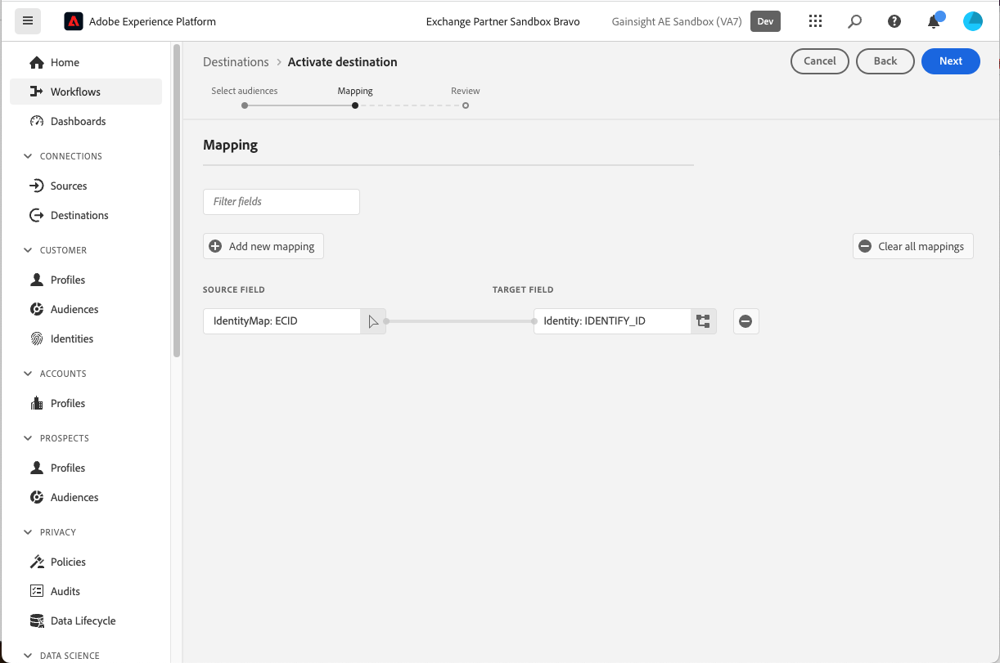

# Gainsight PX connection {#gainsight-px}

## Overview {#overview}

[[!DNL Gainsight PX]](https://www.gainsight.com/product-experience/) is a product experience platform that enables product teams to understand how users use their products, collect feedback, and create in-app engagements like product walkthroughs to drive user onboarding and product adoption.

>[!IMPORTANT]
>
>The destination connector and documentation page are created and maintained by the *Gainsight PX* team. For any inquiries or update requests, contact them directly at *`pxsupport@gainsight.com`*.
 
## Use cases {#use-cases}

To help you better understand how and when you should use the *Gainsight PX* destination, here are sample use cases that Adobe Experience Platform customers can solve by using this destination.

### Targeting In-App Engagements {#targeting-in-app-engagements}

A SaaS company wants to engage their customers via an in-application guide constructed on Gainsight PX. An audience to receive this engagement has been built on Adobe Experience Platform. The Gainsight PX destination receives the audience and makes it available within the Gainsight PX environment.

## Prerequisites {#prerequisites}

* Contact the [!DNL Gainsight] support team and request the activation of external segment features for your subscription.
* Generate an OAuth Secret value for your PX subscription, using the **[!UICONTROL Generate New Secret]** button at the bottom of the [Company Details page](https://app.aptrinsic.com/settings/subscription)

## Supported identities {#supported-identities}

Gainsight PX supports the activation of identities described in the table below. Learn more about [identities](../../../identity-service/features/namespaces.md).

| Target Identity | Description  | 
|---|----|
| IdentifyID | Common user identifier that uniquely identifies a user in Gainsight PX and Adobe Experience Platform |

{style="table-layout:auto"}

## Supported audiences {#supported-audiences}

This section describes which type of audience you can export to this destination.

| Audience origin | Supported | Description | 
|---|---|---|
| [!DNL Segmentation Service] | ✓ | Audiences generated through the Experience Platform [Segmentation Service](../../../segmentation/home.md).|
| Custom uploads | X | Audiences [imported](../../../segmentation/ui/overview.md#import-audience) into Experience Platform from CSV files. |

{style="table-layout:auto"}

## Export type and frequency {#export-type-frequency}

Refer to the table below for information about the destination export type and frequency.

| Item | Type | Notes  |
|---|---|---|
| Export type | **[!UICONTROL Segment export]** |You are exporting all members of an audience with the identifiers (name, phone number, or others) used in the [!DNL Gainsight PX] destination.|
| Export frequency | **[!UICONTROL Streaming]** | Streaming destinations are "always on" API-based connections. When a profile is updated in Experience Platform based on audience evaluation, the connector sends the update downstream to the destination platform. Read more about [streaming destinations](/help/destinations/destination-types.md#streaming-destinations). |

{style="table-layout:auto"}

## Connect to the destination {#connect}

>[!IMPORTANT]
>
>To connect to the destination, you need the **[!UICONTROL Manage Destinations]** [access control permission](/help/access-control/home.md#permissions). Read the [access control overview](/help/access-control/ui/overview.md) or contact your product administrator to obtain the required permissions.

To connect to this destination, follow the steps described in the [destination configuration tutorial](../../ui/connect-destination.md). In the destination configuration workflow, fill in the fields listed in the two sections below.

### Authenticate to destination {#authenticate}

To authenticate to the destination, fill in the required fields and select **[!UICONTROL Connect to destination]**.

* **[!UICONTROL Password]**: The password used to log in to [[!DNL Gainsight PX]](https://app.aptrinsic.com)
* **[!UICONTROL Client ID]**: The Gainsight PX subscription ID on the [Company Details page](https://app.aptrinsic.com/settings/subscription)
* **[!UICONTROL Client secret]**: The OAuth secret generated at the bottom of the [Company Details page](https://app.aptrinsic.com/settings/subscription) in the [!DNL Gainsight PX] UI.
* **[!UICONTROL Username]**: The email used to log in to the [[!DNL Gainsight PX]](https://app.aptrinsic.com) UI

### Fill in destination details {#destination-details}

To configure details for the destination, fill in the required and optional fields below. An asterisk next to a field in the UI indicates that the field is required.

* **[!UICONTROL Name]**: A name by which you will recognize this destination in the future.
* **[!UICONTROL Description]**: A description that will help you identify this destination in the future.

When you are finished providing details for your destination connection, select **[!UICONTROL Next]**.

## Activate segments to this destination {#activate}

>[!IMPORTANT]
>
>* To activate data, you need the **[!UICONTROL Manage Destinations]**, **[!UICONTROL Activate Destinations]**, **[!UICONTROL View Profiles]**, and **[!UICONTROL View Segments]** [access control permissions](/help/access-control/home.md#permissions). Read the [access control overview](/help/access-control/ui/overview.md) or contact your product administrator to obtain the required permissions.
>* To export *identities*, you need the **[!UICONTROL View Identity Graph]** [access control permission](/help/access-control/home.md#permissions).   {width="100" zoomable="yes"}

Read [Activate profiles and segments to streaming segment export destinations](/help/destinations/ui/activate-segment-streaming-destinations.md) for instructions on activating audience segments to this destination.

### Map identities {#map}

This destination supports the mapping of profile attributes and identity namespaces. The target mapping must always be the **[!UICONTROL IDENTIFY_ID]** identity namespace.

See the examples below to better understand how to configure mapping.

#### Map a profile attribute {#map-profile-attribute}

In the example shown below, the source field is an XDM profile attribute which gets mapped to the IDENTIFY_ID target namespace.

#### Map an identity namespace {#map-identity-namespace}

In the example shown below, the source field is an identity namespace (**[!UICONTROL ECID]**) which gets mapped to the **[!UICONTROL IDENTIFY_ID]** target namespace.

## Exported data / Validate data export {#exported-data}

Segmentation data is streamed from the Experience Platform to Gainsight PX.

Segment metadata is visible in the Segments screen within the [!DNL Gainsight PX] UI.

  

Segment membership information is visible on the Segments tab of the Audience Explorer screen of the [!DNL Gainsight PX] UI.

## Data usage and governance {#data-usage-governance}

All [!DNL Adobe Experience Platform] destinations are compliant with data usage policies when handling your data. For detailed information on how [!DNL Adobe Experience Platform] enforces data governance, read the [Data Governance overview](/help/data-governance/home.md).
