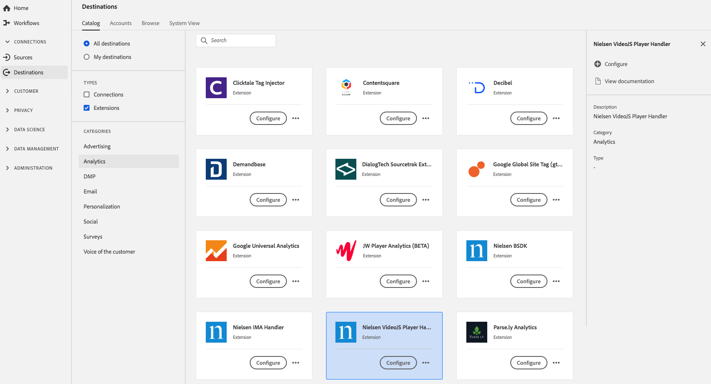

# [!DNL Nielsen VideoJS Player Handler] extension {#nielsen-vjs-extension}

## Overview {#overview}

[!DNL Nielsen Digital SDK] tag extension offers audience measurement via the following digital measurement products:

DCR: A measurement solution that provides daily measurement of non-linear digital content, including content with ads will enable a comprehensive view of digital content audience consumption across Desktop, Mobile, Tablet and Connected Devices.

DTVR: This accounts for linear TV viewing occurring on desktop and mobile devices for participating programming sources. This is the first solution to receive accreditation from the MRC for its contribution to TV audience measurement for programming viewed on computers and mobile devices.

[!DNL Nielsen VideoJS Player Handler] is an analytics extension in [!DNL Adobe Experience Platform]. For more information about the extension functionality, see the extension page on [Adobe Exchange](https://exchange.adobe.com/experiencecloud.details.101361.nielsen-digital-sdk-extension.html).

This destination is a tag extension. For more information about how tag extensions work in Experience Platform, see the [tag extensions overview](../launch-extensions/overview.md).

## Prerequisites {#prerequisites}

This extension is available in the [!DNL Destinations] catalog for all customers who have purchased Experience Platform.

To use this extension, you need access to tags in [!DNL Adobe Experience Platform]. Tags are offered to [!DNL Adobe CX Enterprise] customers as an included, value-add feature. Contact your organization administrator to get access to tags and ask them to grant you the **[!UICONTROL manage_properties]** permission so you can install extensions.

## Install extension {#install-extension}

To install the [!DNL Nielsen VideoJS Player Handler] extension:

In the [Experience Platform interface](https://platform.adobe.com/), go to **[!UICONTROL Destinations]** > **[!UICONTROL Catalog]**.

Select the extension from the catalog or use the search bar.

Select the destination, then select **[!UICONTROL Configure]** in the right rail. If the **[!UICONTROL Configure]** control is grayed out, you are missing the **[!UICONTROL manage_properties]** permission. See [Prerequisites](#prerequisites).

Select the property in which you want to install the extension. You also have the option of creating a new property. A property is a collection of rules, data elements, configured extensions, environments, and libraries. Learn about properties in the [Properties page section](../../../tags/ui/administration/companies-and-properties.md#properties-page) of in the tags documentation.

The workflow walks you through the steps to complete the installation. 

For information about the extension configuration options and installation support, see the [Nielsen Digital SDK page on Adobe Exchange](https://exchange.adobe.com/experiencecloud.details.101361.nielsen-digital-sdk-extension.html).

You can also install the extension directly in the [Data Collection UI](https://experience.adobe.com/#/data-collection/). For more information, see the section on [adding a new extension](../../../tags/ui/managing-resources/extensions/overview.md#add-a-new-extension) in the tags documentation.

## How to use the extension {#how-to-use}

Once you have installed the extension, you can start setting up rules.

You can set up rules for your installed extensions to send event data to the extension destination only in certain situations. For more information about setting up rules for your extensions, see the [tags documentation](../../../tags/ui/managing-resources/rules.md).

## Configure, upgrade, and delete extension {#configure-upgrade-delete}

You can configure, upgrade, and delete extensions in the Data Collection UI.

>[!TIP]
>
>If the extension is already installed on one of your properties, the Experience Platform UI still displays **[!UICONTROL Install]** for the extension. Kick off the installation workflow as described in [Install extension](#install-extension) to configure or delete your extension.

To upgrade your extension, see the guide on the [extension upgrade process](../../../tags/ui/managing-resources/extensions/extension-upgrade.md) in the tags documentation.
