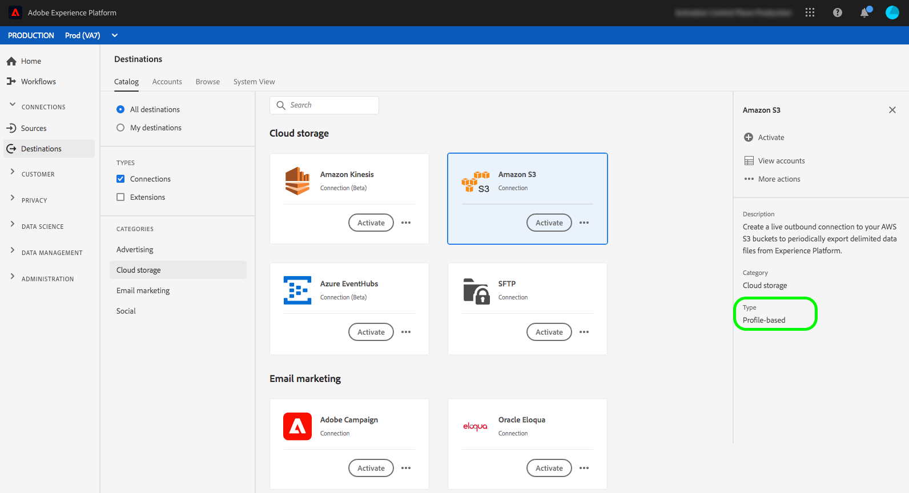
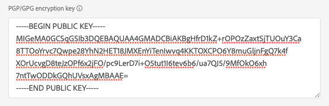

# [!DNL Amazon S3] connection {#s3-connection}

## Destination changelog {#changelog}

>[!IMPORTANT]
>
>With the beta release of the export datasets functionality and the improved file export functionality, you may now be seeing two [!DNL Amazon S3] cards in the destinations catalog.
>* If you are already exporting files to the **[!UICONTROL Amazon S3]** destination: Please create new dataflows to the new **[!UICONTROL Amazon S3 beta]** destination.
>* If you have not yet created any dataflows to the **[!UICONTROL Amazon S3]** destination, please use the new **[!UICONTROL Amazon S3 beta]** card to export files to **[!UICONTROL Amazon S3]**.

Improvements in the new [!DNL Amazon S3] destination card include:

* Dataset exports support.
* Additional file naming options.
* Ability to set custom file headers in your exported files.
* Ability to customize the formatting of exported CSV data files.

## Overview {#overview}

Create a live outbound connection to your [!DNL Amazon Web Services] (AWS) S3 storage to periodically export data files from Adobe Experience Platform into your own S3 buckets.

## Export type and frequency {#export-type-frequency}

Refer to the table below for information about the destination export type and frequency.

| Item | Type | Notes |
---------|----------|---------|
| Export type | **[!UICONTROL Profile-based]** | You are exporting all members of a segment, together with the desired schema fields (for example: email address, phone number, last name), as chosen in the select profile attributes screen of the [destination activation workflow](../../ui/activate-batch-profile-destinations.md#select-attributes).|
| Export frequency | **[!UICONTROL Batch]** | Batch destinations export files to downstream platforms in increments of three, six, eight, twelve, or twenty-four hours. Read more about [batch file-based destinations](/help/destinations/destination-types.md#file-based).|

{style="table-layout:auto"}

## Connect to the destination {#connect}

>[!IMPORTANT]
> 
>To connect to the destination, you need the **[!UICONTROL Manage Destinations]** [access control permission](/help/access-control/home.md#permissions). Read the [access control overview](/help/access-control/ui/overview.md) or contact your product administrator to obtain the required permissions.

To connect to this destination, follow the steps described in the [destination configuration tutorial](../../ui/connect-destination.md). In the destination configuration workflow, fill in the fields listed in the two sections below.

### Authenticate to destination {#authenticate}

>[!CONTEXTUALHELP]
>id="platform_destinations_connect_s3_rsa"
>title="RSA public key"
>abstract="Optionally, you can attach your RSA-formatted public key to add encryption to your exported files. Your public key must be written as a [!DNL Base64-encoded] string. View an example of a correctly formatted key in the documentation link below."

To authenticate to the destination, fill in the required fields and select **[!UICONTROL Connect to destination]**.

* **[!DNL Amazon S3] access key** and **[!DNL Amazon S3] secret key**: In [!DNL Amazon S3], generate an `access key - secret access key` pair to grant Platform access to your [!DNL Amazon S3] account. Learn more in the [Amazon Web Services documentation](https://docs.aws.amazon.com/IAM/latest/UserGuide/id_credentials_access-keys.html).
* **[!UICONTROL Encryption key]**: Optionally, you can attach your RSA-formatted public key to add encryption to your exported files. Your public key must be written as a [!DNL Base64-encoded] string. View an example of a correctly formatted, base64-encoded key in the documentation link below. The middle part is shortened for brevity.

### Fill in destination details {#destination-details}

>[!CONTEXTUALHELP]
>id="platform_destinations_connect_s3_bucket"
>title="Bucket name"
>abstract="Must be between 3 and 63 characters long. Must begin and end with a letter or number. Must contain only lowercase letters, numbers, or hyphens ( - ). Must not be formatted as an IP address (for example, 192.100.1.1)."

>[!CONTEXTUALHELP]
>id="platform_destinations_connect_s3_folderpath"
>title="Folder path"
>abstract="Must contain only characters A-Z, a-z, 0-9 and can include the following special characters: `/!-_.'()"^[]+$%.*"`. To create a folder per segment file, insert the macro `/%SEGMENT_NAME%` or `/%SEGMENT_ID%` or `/%SEGMENT_NAME%/%SEGMENT_ID%` into the text field. Macros can only be inserted at the end of the folder path. View macro examples in the documentation."
>additional-url="https://experienceleague.adobe.com/docs/experience-platform/destinations/catalog/cloud-storage/overview.html#use-macros" text="Use macros to create a folder in your storage location"

To configure details for the destination, fill in the required and optional fields below. An asterisk next to a field in the UI indicates that the field is required.

* **[!UICONTROL Name]**: enter a name that will help you identify this destination.
* **[!UICONTROL Description]**: enter a description of this destination.
* **[!UICONTROL Bucket name]**: enter the name of the [!DNL Amazon S3] bucket to be used by this destination.
* **[!UICONTROL Folder path]**: enter the path to the destination folder that will host the exported files.

>[!TIP]
>
>In the connect destination workflow, you can create a custom folder in your Amazon S3 storage per exported segment file. Read [Use macros to create a folder in your storage location](overview.md#use-macros) for instructions.

### Enable alerts {#enable-alerts}

You can enable alerts to receive notifications on the status of the dataflow to your destination. Select an alert from the list to subscribe to receive notifications on the status of your dataflow. For more information on alerts, see the guide on [subscribing to destinations alerts using the UI](../../ui/alerts.md).

When you are finished providing details for your destination connection, select **[!UICONTROL Next]**.

### Required [!DNL Amazon S3] permissions {#required-s3-permission}

To successfully connect and export data to your [!DNL Amazon S3] storage location, create an Identity and Access Management (IAM) user for [!DNL Platform] in [!DNL Amazon S3] and assign permissions for the following actions:

* `s3:DeleteObject`
* `s3:GetBucketLocation`
* `s3:GetObject`
* `s3:ListBucket`
* `s3:PutObject`
* `s3:ListMultipartUploadParts`

<!--

Commenting out this note, as write permissions are assigned through the s3:PutObject permission.

>[!IMPORTANT]
>
>Platform needs `write` permissions on the bucket object where the export files will be delivered.

-->

## Activate segments to this destination {#activate}

>[!IMPORTANT]
> 
>To activate data, you need the **[!UICONTROL Manage Destinations]**, **[!UICONTROL Activate Destinations]**, **[!UICONTROL View Profiles]**, and **[!UICONTROL View Segments]** [access control permissions](/help/access-control/home.md#permissions). Read the [access control overview](/help/access-control/ui/overview.md) or contact your product administrator to obtain the required permissions.

See [Activate audience data to batch profile export destinations](../../ui/activate-batch-profile-destinations.md) for instructions on activating audience segments to this destination.

## (Beta) Export datasets {#export-datasets}

This destination supports dataset exports. For complete information on how to set up dataset exports, read the [export datasets tutorial](/help/destinations/ui/export-datasets.md).

## Exported data {#exported-data}

For [!DNL Amazon S3] destinations, [!DNL Platform] creates a data file in the storage location that you provided. For more information about the files, see [Activate audience data to batch profile export destinations](../../ui/activate-batch-profile-destinations.md) in the segment activation tutorial.
