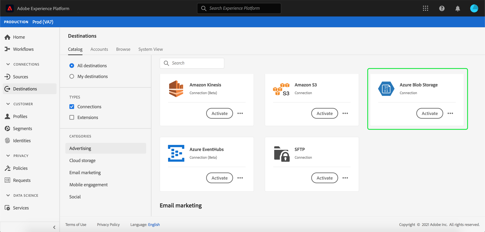
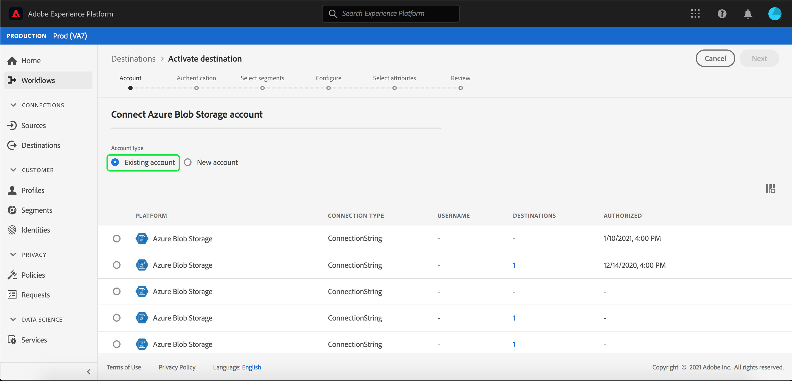
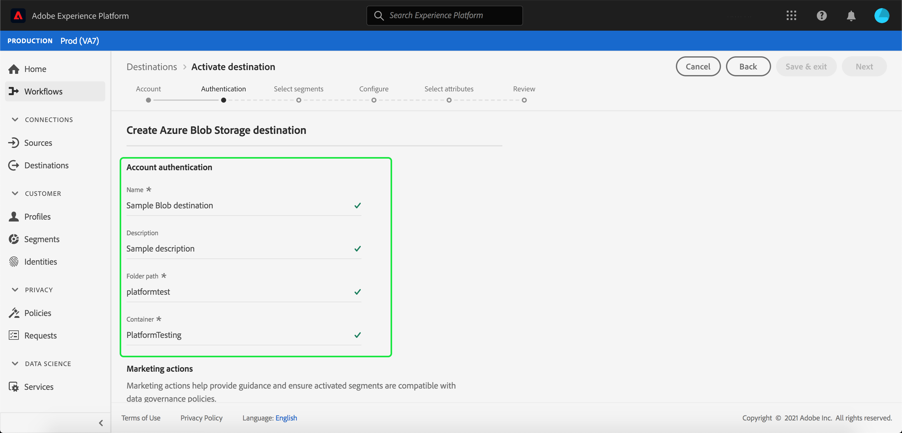

# [!DNL Azure Blob] connection

[!DNL Azure Blob] (hereinafter referred to as "[!DNL Blob]") is Microsoft's object storage solution for the cloud. This tutorial provides steps for creating a [!DNL Blob] destination using the [!DNL Platform] user interface.

## Getting started

This tutorial requires a working understanding of the following components of Adobe Experience Platform:

-   [[!DNL Experience Data Model (XDM)] System](../../../xdm/home.md): The standardized framework by which Experience Platform organizes customer experience data.
    -   [Basics of schema composition](../../../xdm/schema/composition.md): Learn about the basic building blocks of XDM schemas, including key principles and best practices in schema composition.
    -   [Schema Editor tutorial](../../../xdm/tutorials/create-schema-ui.md): Learn how to create custom schemas using the Schema Editor UI.
-   [[!DNL Real-time Customer Profile]](../../../profile/home.md): Provides a unified, real-time consumer profile based on aggregated data from multiple sources.

If you already have a valid Blob destination, you may skip the remainder of this document and proceed to the tutorial on [activating segments to your destination](../../ui/activate-destinations.md).

### Supported file formats

[!DNL Experience Platform] supports the following file format to be exported to [!DNL Blob]:

-   Delimiter-separated values (DSV): Support for DSV formatted data files is currently limited to comma-separated values. Support for general DSV files will be provided in the future. For more information about supported files, please read the cloud storage section in the tutorial on [activating destinations](../../ui/activate-destinations.md#esp-and-cloud-storage).

## Connect your Blob account {#connect-destination}

Log in to [Adobe Experience Platform](https://platform.adobe.com) and then select **[!UICONTROL Destinations]** from the left navigation bar to access the **[!UICONTROL Destinations]** workspace. The **[!UICONTROL Catalog]** screen displays a variety of destinations for which you can create an account with.

You can select the appropriate category from the catalog on the left-hand side of your screen. Alternatively, you can find the specific destination you wish to work with using the search option.

Under the **[!UICONTROL Cloud Storage]** category, select **[!UICONTROL Azure Blob Storage]**, followed by **[!UICONTROL Configure]**.

>[!NOTE]
>
>If a connection with this destination already exists, you can see an **[!UICONTROL Activate]** button on the destination card. For more information about the difference between **[!UICONTROL Activate]** and **[!UICONTROL Configure]**, refer to the [Catalog](../../ui/destinations-workspace.md#catalog) section of the destination workspace documentation.   

The **[!UICONTROL Connect to Azure Blob Storage]** page appears. On this page, you can either use new credentials or existing credentials.

### New account {#new-account}

If you are using new credentials, select **[!UICONTROL New account]**. On the input form that appears, provide the connection string. The connection string is required to access data in your Blob storage. The [!DNL Blob] connection string pattern starts with: `DefaultEndpointsProtocol=https;AccountName={ACCOUNT_NAME};AccountKey={ACCOUNT_KEY}`. 

For more information about configuring your [!DNL Blob] connection string, see [Configure a connection string for an Azure storage account](https://docs.microsoft.com/en-us/azure/storage/common/storage-configure-connection-string#configure-a-connection-string-for-an-azure-storage-account) in the Microsoft documentation.

Optionally, you can attach your RSA-formatted public key to add encryption to your exported files. Note that this public key **must** be written as a Base64 encoded string. 

### Existing account

To connect an existing account, select the [!DNL Blob] account you want to connect with, then select **Next** to proceed.

## Authentication {#authentication}

The **Authentication** page appears. On the input form that appears, provide a name, an optional description, the folder path, and the container for your files. 

In this step, you can also select any **[!UICONTROL Marketing actions]** that should apply to this destination. Marketing actions indicate the intent for which data will be exported to the destination. You can select from Adobe-defined marketing actions or you can create your own marketing action. For more information about marketing actions, see the [Data usage policies overview](../../../data-governance/policies/overview.md).

When finished, select **[!UICONTROL Create destination]**.

## Next steps {#activate-segments}

By following this tutorial, you have established a connection to your [!DNL Blob] account. You can now continue on to the next tutorial and [activate segments to your destination](../../ui/activate-destinations.md).
