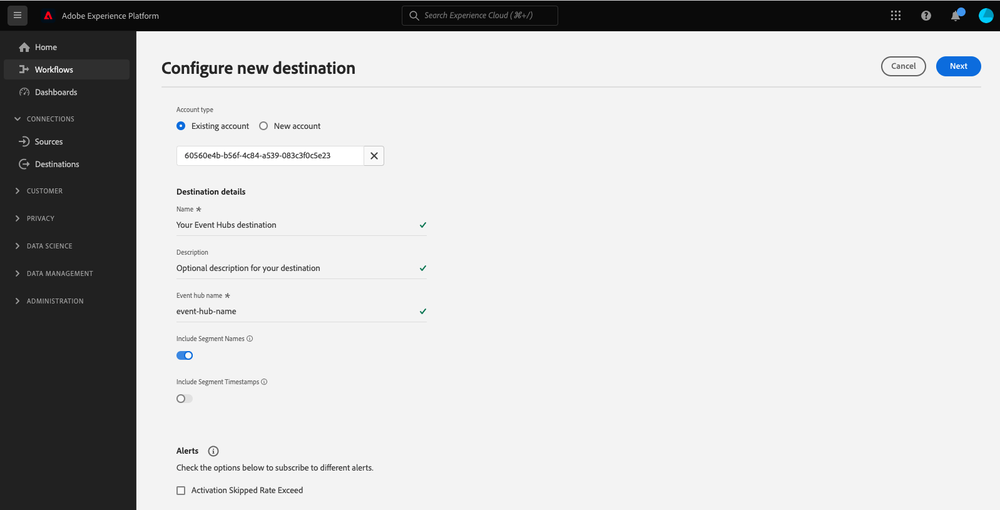

# [!DNL Azure Event Hubs] connection

## Overview {#overview}

>[!IMPORTANT]
>
> This destination is available only to [Adobe Real-Time Customer Data Platform Ultimate](https://helpx.adobe.com/legal/product-descriptions/real-time-customer-data-platform.html) customers.

[!DNL Azure Event Hubs] is a big data streaming platform and event ingestion service. It can receive and process millions of events per second. Data sent to an event hub can be transformed and stored by using any real-time analytics provider or batching/storage adapters.

You can create a real-time outbound connection to your [!DNL Azure Event Hubs] storage to stream data from Adobe Experience Platform.

* For more information about [!DNL Azure Event Hubs], see the [Microsoft documentation](https://docs.microsoft.com/en-us/azure/event-hubs/event-hubs-about).
* To connect to [!DNL Azure Event Hubs] programmatically, see the [Streaming destinations API tutorial](../../api/streaming-destinations.md).
* To connect to [!DNL Azure Event Hubs] using the Platform user interface, see the sections below.


## Use Cases {#use-cases}

By using streaming destinations such as [!DNL Azure Event Hubs], you can easily feed high-value segmentation events and associated profile attributes into your systems of choice.

For example, a prospect downloaded a white-paper which qualifies them into a "high-propensity to convert" segment. By mapping the audience that the prospect falls in to the [!DNL Azure Event Hubs] destination, you would receive this event in [!DNL Azure Event Hubs]. There, you can employ a do-it-yourself approach and describe business logic on top of the event, as you think would work best with your enterprise IT systems.

## Supported audiences {#supported-audiences}

This section describes which types of audiences you can export to this destination.

| Audience origin | Supported | Description | 
---------|----------|----------|
| [!DNL Segmentation Service] | ✓ | Audiences generated through the Experience Platform [Segmentation Service](../../../segmentation/home.md).|
| Custom uploads | ✓ | Audiences [imported](../../../segmentation/ui/overview.md#import-audience) into Experience Platform from CSV files. |

{style="table-layout:auto"}

## Export type and frequency {#export-type-frequency}

Refer to the table below for information about the destination export type and frequency.

| Item | Type | Notes |
---------|----------|---------|
| Export type | **[!UICONTROL Profile-based]** | You are exporting all members of a segment, together with the desired schema fields (for example: email address, phone number, last name), as chosen in the select profile attributes screen of the [destination activation workflow](../../ui/activate-batch-profile-destinations.md#select-attributes).|
| Export frequency | **[!UICONTROL Streaming]** | Streaming destinations are "always on" API-based connections. As soon as a profile is updated in Experience Platform based on audience evaluation, the connector sends the update downstream to the destination platform. Read more about [streaming destinations](/help/destinations/destination-types.md#streaming-destinations).|

{style="table-layout:auto"}

## IP address allowlist {#ip-address-allowlist}

To meet customers' security and compliance requirements, Experience Platform provides a list of static IPs that you can allowlist for the [!DNL Azure Event Hubs] destination. Refer to [IP address allow list for streaming destinations](/help/destinations/catalog/streaming/ip-address-allow-list.md) for the complete list of IPs to allowlist.

## Connect to the destination {#connect}

>[!IMPORTANT]
> 
>To connect to the destination, you need the **[!UICONTROL View Destinations]** and **[!UICONTROL Manage Destinations]** [access control permissions](/help/access-control/home.md#permissions). Read the [access control overview](/help/access-control/ui/overview.md) or contact your product administrator to obtain the required permissions.

To connect to this destination, follow the steps described in the [destination configuration tutorial](../../ui/connect-destination.md). When connecting to this destination, you must provide the following information:

### Authentication information {#authentication-information}

#### Standard authentication {#standard-authentication}


If you select the **[!UICONTROL Standard authentication]** type to connect to your HTTP endpoint, input the fields below and select **[!UICONTROL Connect to destination]**:

* **[!UICONTROL SAS Key Name]**: The name of the authorization rule, which is also known as the SAS key name.
* **[!UICONTROL SAS Key]**: The primary key of the Event Hubs namespace. The `sasPolicy` that the `sasKey` corresponds to must have **manage** rights configured in order for the Event Hubs list to be populated. Learn about authenticating to [!DNL Azure Event Hubs] with SAS keys in the [Microsoft documentation](https://docs.microsoft.com/en-us/azure/event-hubs/authenticate-shared-access-signature).
* **[!UICONTROL Namespace]**: Fill in your [!DNL Azure Event Hubs] namespace. Learn about [!DNL Azure Event Hubs] namespaces in the [Microsoft documentation](https://docs.microsoft.com/en-us/azure/event-hubs/event-hubs-create#create-an-event-hubs-namespace).

#### Shared Access Signature (SAS) authentication {#sas-authentication}


If you select the **[!UICONTROL Standard authentication]** type to connect to your HTTP endpoint, input the fields below and select **[!UICONTROL Connect to destination]**:

* **[!UICONTROL SAS Key Name]**: The name of the authorization rule, which is also known as the SAS key name.
* **[!UICONTROL SAS Key]**: The primary key of the Event Hubs namespace. The `sasPolicy` that the `sasKey` corresponds to must have **manage** rights configured in order for the Event Hubs list to be populated. Learn about authenticating to [!DNL Azure Event Hubs] with SAS keys in the [Microsoft documentation](https://docs.microsoft.com/en-us/azure/event-hubs/authenticate-shared-access-signature).
* **[!UICONTROL Namespace]**: Fill in your [!DNL Azure Event Hubs] namespace. Learn about [!DNL Azure Event Hubs] namespaces in the [Microsoft documentation](https://docs.microsoft.com/en-us/azure/event-hubs/event-hubs-create#create-an-event-hubs-namespace).
* **[!UICONTROL Event Hub Name]**: Fill in your [!DNL Azure Event Hub] name . Learn about [!DNL Azure Event Hubs] names in the [Microsoft documentation](https://learn.microsoft.com/en-us/azure/event-hubs/event-hubs-create#create-an-event-hub).

### Fill in destination details {#destination-details}

>[!CONTEXTUALHELP]
>id="platform_destinations_connect_eventhubs_includesegmentnames"
>title="Include Segment Names"
>abstract="Toggle if you want the data export to include the names of the audiences you are exporting. View the documentation for a data export example with this option selected."

>[!CONTEXTUALHELP]
>id="platform_destinations_connect_eventhubs_includesegmenttimestamps"
>title="Include Segment Timestamps"
>abstract="Toggle if you want the data export to include the UNIX timestamp when the audiences were created and updated, as well as the UNIX timestamp when the audiences were mapped to the destination for activation. View the documentation for a data export example with this option selected."

To configure details for the destination, fill in the required and optional fields below. An asterisk next to a field in the UI indicates that the field is required.



* **[!UICONTROL Name]**: Fill in a name for the connection to [!DNL Azure Event Hubs].
* **[!UICONTROL Description]**: Provide a description of the connection.  Examples: "Premium tier customers", "Customers interested in kitesurfing".
* **[!UICONTROL eventHubName]**: Provide a name for the stream to your [!DNL Azure Event Hubs] destination.
* **[!UICONTROL Include Segment Names]**: Toggle if you want the data export to include the names of the audiences you are exporting. For an example of a data export with this option selected, refer to the [Exported data](#exported-data) section further below.
* **[!UICONTROL Include Segment Timestamps]**: Toggle if you want the data export to include the UNIX timestamp when the audiences were created and updated, as well as the UNIX timestamp when the audiences were mapped to the destination for activation. For an example of a data export with this option selected, refer to the [Exported data](#exported-data) section further below.

### Enable alerts {#enable-alerts}

You can enable alerts to receive notifications on the status of the dataflow to your destination. Select an alert from the list to subscribe to receive notifications on the status of your dataflow. For more information on alerts, see the guide on [subscribing to destinations alerts using the UI](../../ui/alerts.md).

When you are finished providing details for your destination connection, select **[!UICONTROL Next]**.

## Activate audiences to this destination {#activate}

>[!IMPORTANT]
> 
>* To activate data, you need the **[!UICONTROL View Destinations]**, **[!UICONTROL Activate Destinations]**, **[!UICONTROL View Profiles]**, and **[!UICONTROL View Segments]** [access control permissions](/help/access-control/home.md#permissions). Read the [access control overview](/help/access-control/ui/overview.md) or contact your product administrator to obtain the required permissions.
>* [Consent policy evaluation](/help/data-governance/enforcement/auto-enforcement.md#consent-policy-evaluation) is currently not supported in exports to the Azure Event Hubs destination. [Read more](/help/destinations/ui/activate-streaming-profile-destinations.md#consent-policy-evaluation).

See [Activate audience data to streaming profile export destinations](../../ui/activate-streaming-profile-destinations.md) for instructions on activating audiences to this destination.

## Profile export behavior {#profile-export-behavior}

Experience Platform optimizes the profile export behavior to your [!DNL Azure Event Hubs] destination, to only export data to your destination when relevant updates to a profile have occurred following audience qualification or other significant events. Profiles are exported to your destination in the following situations:

* The profile update was determined by a change in audience membership for at least one of the audiences mapped to the destination. For example, the profile has qualified for one of the audiences mapped to the destination or has exited one of the audiences mapped to the destination.
* The profile update was determined by a change in the [identity map](/help/xdm/field-groups/profile/identitymap.md). For example, a profile who had already qualified for one of the audiences mapped to the destination has been added a new identity in the identity map attribute.
* The profile update was determined by a change in attributes for at least one of the attributes mapped to the destination. For example, one of the attributes mapped to the destination in the mapping step is added to a profile.

In all the cases described above, only the profiles where relevant updates have occurred are exported to your destination. For example, if an audience mapped to the destination flow has a hundred members, and five new profiles qualify for the segment, the export to your destination is incremental and only includes the five new profiles.

Note that the all the mapped attributes are exported for a profile, no matter where the changes lie. So, in the example above all the mapped attributes for those five new profiles will be exported even if the attributes themselves haven't changed.

### What determines a data export and what is included in the export {#what-determines-export-what-is-included}

Regarding the data that is exported for a given profile, it is important to understand the two different concepts of *what determines a data export to your [!DNL Azure Event Hubs] destination* and *which data is included in the export*.

|What determines a destination export | What is included in the destination export |
|---------|----------|
|<ul><li>Mapped attributes and audiences serve as the cue for a destination export. This means that if any mapped audiences change states (from `null` to `realized` or from `realized` to `exiting`) or any mapped attributes are updated, a destination export would be kicked off.</li><li>Since identities cannot currently be mapped to [!DNL Azure Event Hubs] destinations, changes in any identity on a given profile also determine destination exports.</li><li>A change for an attribute is defined as any update on the attribute, whether or not it is the same value. This means that an overwrite on an attribute is considered a change even if the value itself has not changed.</li></ul> | <ul><li>The `segmentMembership` object includes the audience mapped in the activation dataflow, for which the status of the profile has changed following a qualification or audience exit event. Note that other unmapped audiences for which the profile qualified for can be part of the destination export, if these audiences belong to the same [merge policy](/help/profile/merge-policies/overview.md) as the audience mapped in the activation dataflow. </li><li>All identities in the `identityMap` object are included as well (Experience Platform currently does not support identity mapping in the [!DNL Azure Event Hubs] destination).</li><li>Only the mapped attributes are included in the destination export.</li></ul> |

{style="table-layout:fixed"}

For example, consider this dataflow to an [!DNL Azure Event Hubs] destination where three audiences are selected in the dataflow, and four attributes are mapped to the destination.  


A profile export to the destination can be determined by a profile qualifying for or exiting one of the *three mapped segments*. However, in the data export, in the `segmentMembership` object (see [Exported Data](#exported-data) section below), other unmapped audiences might appear, if that particular profile is a member of them and if these share the same merge policy as the audience that triggered the export. If a profile qualifies for the **Customer with DeLorean Cars** audience but is also a member of the **Watched "Back to the Future"** movie and **Science fiction fans** segments, then these other two audiences will also be present in the `segmentMembership` object of the data export, even though these are not mapped in the dataflow, if these share the same merge policy with the **Customer with DeLorean Cars** segment.

From a profile attributes point of view, any changes to the four attributes mapped above will determine a destination export and any of the four mapped attributes present on the profile will be present in the data export.

## Historical data backfill {#historical-data-backfill}

When you add a new audience to an existing destination, or when you create a new destination and map audiences to it, Experience Platform exports historical audience qualification data to the destination. Profiles which qualified for the audience *before* the audience was added to the destination are exported to the destination within approximately one hour.

## Exported data {#exported-data}

Your exported [!DNL Experience Platform] data lands in your [!DNL Azure Event Hubs] destination in JSON format. For example, the export below contains a profile that has qualified for a certain segment, is a member of another two segments, and exited another segment. The export also includes the profile attribute first name, last name, date of birth, and personal email address. The identities for this profile are ECID and email.

```json
{
  "person": {
    "birthDate": "YYYY-MM-DD",
    "name": {
      "firstName": "John",
      "lastName": "Doe"
    }
  },
  "personalEmail": {
    "address": "john.doe@acme.com"
  },
  "segmentMembership": {
   "ups":{
      "7841ba61-23c1-4bb3-a495-00d3g5fe1e93":{
         "lastQualificationTime":"2022-01-11T21:24:39Z",
         "status":"exited"
      },
      "59bd2fkd-3c48-4b18-bf56-4f5c5e6967ae":{
         "lastQualificationTime":"2022-01-02T23:37:33Z",
         "status":"realized"
      },
      "947c1c46-008d-40b0-92ec-3af86eaf41c1":{
         "lastQualificationTime":"2021-08-25T23:37:33Z",
         "status":"realized"
      },
      "5114d758-ce71-43ba-b53e-e2a91d67b67f":{
         "lastQualificationTime":"2022-01-11T23:37:33Z",
         "status":"realized"
      }
   }
},
  "identityMap": {
    "ecid": [
      {
        "id": "14575006536349286404619648085736425115"
      },
      {
        "id": "66478888669296734530114754794777368480"
      }
    ],
    "email_lc_sha256": [
      {
        "id": "655332b5fa2aea4498bf7a290cff017cb4"
      },
      {
        "id": "66baf76ef9de8b42df8903f00e0e3dc0b7"
      }
    ]
  }
}

```

Below are further examples of exported data, depending on the UI settings you select in the connect destination flow for the **[!UICONTROL Include Segment Names]** and **[!UICONTROL Include Segment Timestamps]** options:

+++ The data export sample below includes audience names in the `segmentMembership` section

```json
"segmentMembership": {
        "ups": {
          "5b998cb9-9488-4ec3-8d95-fa8338ced490": {
            "lastQualificationTime": "2019-04-15T02:41:50+0000",
            "status": "realized",
            "createdAt": 1648553325000,
            "updatedAt": 1648553330000,
            "mappingCreatedAt": 1649856570000,
            "mappingUpdatedAt": 1649856570000,
            "name": "First name equals John"
          }
        }
      }
```

+++

+++ The data export sample below includes audience timestamps in the `segmentMembership` section

```json
"segmentMembership": {
        "ups": {
          "5b998cb9-9488-4ec3-8d95-fa8338ced490": {
            "lastQualificationTime": "2019-04-15T02:41:50+0000",
            "status": "realized",
            "createdAt": 1648553325000,
            "updatedAt": 1648553330000,
            "mappingCreatedAt": 1649856570000,
            "mappingUpdatedAt": 1649856570000,
          }
        }
      }
```

+++

## Limits and retry policy {#limits-retry-policy}

In 95 percent of the time, Experience Platform attempts to offer a throughput latency of less than 10 minutes for successfully sent messages with a rate of less than 10 thousand requests per second for each dataflow to an HTTP destination.

In case of failed requests to your HTTP API destination, Experience Platform stores the failed requests and retries twice to send the requests to your endpoint.

>[!MORELIKETHIS]
>
>* [Connect to Azure Event Hubs and activate data using the Flow Service API](../../api/streaming-destinations.md)
>* [AWS Kinesis destination](./amazon-kinesis.md)
>* [Destination types and categories](../../destination-types.md)
