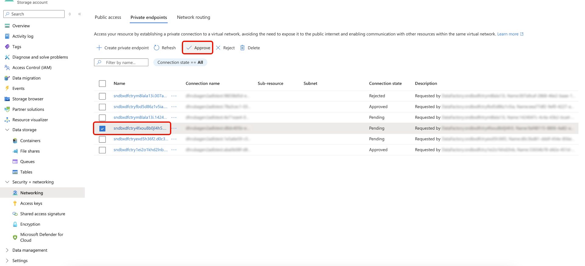

# Private Link for [!DNL Azure] destinations

[!DNL Azure] [Private Link](https://azure.microsoft.com/en-us/products/private-link) lets you route data exports from [!DNL Adobe Experience Platform] to your [!DNL Azure] resources over private IP addresses on the [!DNL Microsoft Azure] backbone, instead of over the public internet. Your activation data never traverses public infrastructure.

[!DNL Adobe] creates and manages a Private Endpoint in an Adobe-owned virtual network (VNet) that points to your [!DNL Azure] resource. When [!DNL Azure] brokers the connection request, you approve it from your [!DNL Azure] portal. After approval, all activation traffic for that resource routes through the private endpoint.

>[!IMPORTANT]
>
>[!DNL Azure] Private Link for destinations has no self-service UI. To request setup, contact your Adobe account manager. Allow up to five business days for [!DNL Adobe] to provision the endpoint after you submit your request.

## Supported destinations {#supported-destinations}

[!DNL Azure] Private Link is supported for the following destinations:

* [Azure Blob Storage](./azure-blob.md)
* [Azure Data Lake Storage Gen2](./adls-gen2.md)
* [Azure Event Hubs](./azure-event-hubs.md)

## Prerequisites {#prerequisites}

[!DNL Azure] Private Link for destinations requires one of the following entitlements:

* [Adobe Healthcare Shield](https://www.adobe.com/trust/compliance/hipaa-ready.html)
* Adobe Privacy & Security Shield

## How [!DNL Azure] Private Link works {#how-it-works}

[!DNL Adobe Experience Platform] maintains a dedicated Private Connectivity Hub VNet. When you request Private Link setup, [!DNL Adobe] provisions a Private Endpoint in this VNet that targets your [!DNL Azure] resource. [!DNL Azure] then brokers a pending approval request to you.

After you approve the request in your [!DNL Azure] portal, all existing and new destination dataflows for that resource route through the private endpoint over the [!DNL Microsoft Azure] backbone.

The private routing is transparent to your existing destination configuration in [!DNL Experience Platform]. You do not need to update hostnames, credentials, or any other destination settings after the Private Endpoint is approved.

If you disable Private Link, traffic is automatically routed through the public internet. Existing dataflows continue without interruption.

## Guardrails {#guardrails}

The following limits apply to [!DNL Azure] Private Link for destinations.

| Guardrail | Limit |
|-----------|-------|
| Production sandbox endpoints | Maximum of 10 endpoints per organization, across all Azure destination types ([!DNL Azure Blob Storage], [!DNL Azure Data Lake Storage Gen2], and [!DNL Azure Event Hubs]) |
| Development sandbox endpoints | Maximum of 1 endpoint per organization |

## Request Private Link setup {#request-setup}

There is currently no UI that allows you to set up Private Link connections for destinations in a self-service mode. Contact your Adobe account manager to request Private Link configuration and provide the following information, depending on the destination that you are setting up the private link connection for.

### [!DNL Azure Event Hubs] {#request-setup-event-hubs}

* [!DNL Azure] [Resource ID](https://learn.microsoft.com/en-us/azure/communication-services/quickstarts/voice-video-calling/get-resource-id) of your [!DNL Event Hubs] namespace
* The [fully qualified domain name (FQDN)](https://learn.microsoft.com/en-us/azure/event-hubs/event-hubs-get-connection-string) of your [!DNL Event Hubs] namespace (for example, `<namespace>.servicebus.windows.net`)
* [!DNL Azure] region (align with your [!DNL Experience Platform] data region for best performance)

>[!TIP]
>
>If you already have a Private Endpoint for [!DNL Azure Event Hubs] set up for an [!DNL Experience Platform] source, that endpoint can also be used for destinations. You do not need to provision a separate endpoint. See [Private Link support for sources](/help/sources/tutorials/ui/private-link.md) for more information.

### [!DNL Azure Blob Storage] {#request-setup-blob}

* [!DNL Azure] [Resource ID](https://learn.microsoft.com/en-us/azure/communication-services/quickstarts/voice-video-calling/get-resource-id) of your storage account
* The [fully qualified domain name (FQDN)](https://learn.microsoft.com/en-us/azure/storage/common/storage-account-overview#standard-endpoints) of your storage account (for example, `<account>.blob.core.windows.net`)
* Whether you need a Blob endpoint, a DFS endpoint, or both
* [!DNL Azure] region (align with your [!DNL Experience Platform] data region for best performance)

### [!DNL Azure Data Lake Storage Gen2] {#request-setup-adls}

* [!DNL Azure] [Resource ID](https://learn.microsoft.com/en-us/azure/communication-services/quickstarts/voice-video-calling/get-resource-id) of your storage account
* The [fully qualified domain name (FQDN)](https://learn.microsoft.com/en-us/azure/storage/common/storage-account-overview#standard-endpoints) of your storage account (for example, `<account>.dfs.core.windows.net`)
* Whether you need a Blob endpoint, a DFS endpoint, or both
* [!DNL Azure] region (align with your [!DNL Experience Platform] data region for best performance)

[!DNL Adobe] creates the Private Endpoint and notifies you when the approval request is available in your [!DNL Azure] portal.

## Approve the Private Endpoint {#approve-private-endpoint}

After [!DNL Adobe] creates the Private Endpoint, a pending approval request appears in your [!DNL Azure] portal. To approve it:

1. In your [!DNL Azure] portal, go to the resource you shared with [!DNL Adobe]: your [!DNL Event Hubs] namespace, [!DNL Blob Storage] account, or [!DNL Data Lake Storage Gen2] account.
1. In the left navigation, select **[!UICONTROL Security + networking]**, then select **[!UICONTROL Networking]**.
1. Select **[!UICONTROL Private endpoints]** to see a list of private endpoints associated with your account and their current connection states.
1. Locate the pending connection from [!DNL Adobe] and select **[!UICONTROL Approve]**.

Within minutes, all existing and new destination dataflows for that resource route over the private endpoint.

If you select **[!UICONTROL Reject]** instead, data continues to flow over the public internet.

## Best practices {#best-practices}

Follow these recommendations to get the most out of [!DNL Azure] Private Link for destinations.

* Do not create a dedicated VNet or open your network to [!DNL Adobe]. The Private Endpoint lives entirely in Adobe's VNet.
* Align your [!DNL Azure] resource region with your [!DNL Experience Platform] data region for best performance.
* After the Private Endpoint is active, disable public network access to your [!DNL Azure] resource for full security benefit.

## Limitations {#limitations}

Be aware of the following constraints before requesting [!DNL Azure] Private Link setup.

* Private Link is available for [!DNL Azure] destinations only. [!DNL AWS] and Google Cloud Platform destinations are not supported yet.
* Configuration requires [!DNL Adobe] engineering involvement. Self-service provisioning is not currently available.

## [!DNL Azure] resource deletion {#resource-deletion}

When you delete the resource, the Private Endpoint becomes orphaned. An orphaned endpoint has a **Disconnected** status, cannot deliver data, and continues to incur charges on Adobe's infrastructure. Contact [!DNL Adobe] before deleting any [!DNL Azure] resource that has an active Private Endpoint.

>[!WARNING]
>
>Do not delete an [!DNL Azure] resource that has an active Private Endpoint without first notifying [!DNL Adobe].

## Adobe internal instructions: activate Private Link for a customer {#internal-activation}

+++Adobe teams only. Expand for activation instructions.

To activate Private Link for a customer, clone Jira ticket PLATIR-64767 and populate it with the customer details collected by the account manager.

Required fields vary by destination type. Collect the following from the customer before cloning the ticket.

**[!DNL Azure Event Hubs]**

* [!DNL Azure] Resource ID of the [!DNL Event Hubs] namespace
* Namespace FQDN (for example, `<namespace>.servicebus.windows.net`)
* [!DNL Azure] region
* IMS Org ID

**[!DNL Azure Blob Storage]**

* [!DNL Azure] Resource ID of the storage account
* Storage account FQDN (for example, `<account>.blob.core.windows.net`)
* Whether a Blob endpoint, a DFS endpoint, or both are needed
* [!DNL Azure] region
* IMS Org ID

**[!DNL Azure Data Lake Storage Gen2]**

* [!DNL Azure] Resource ID of the storage account
* Storage account FQDN (for example, `<account>.dfs.core.windows.net`)
* Whether a Blob endpoint, a DFS endpoint, or both are needed
* [!DNL Azure] region
* IMS Org ID

After provisioning, notify the customer that the Private Endpoint approval request is available in their [!DNL Azure] portal.

+++
