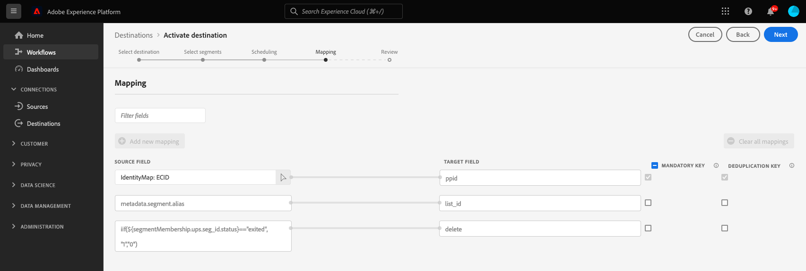

# (Beta) Data Landing Zone Source destination

## Overview {#overview}

>[!IMPORTANT]
>
>This destination is currently in Beta and is only available to a limited number of customers. To request access to the [!DNL Data Landing Zone] connection, contact your Adobe representative and provide your [!DNL IMS Organization ID].

[!DNL Data Landing Zone] is an [!DNL Azure Blob] storage interface provisioned by Adobe Experience Platform, granting you to access a secure, cloud-based file storage facility to bring files into Platform. You have access to one [!DNL Data Landing Zone] container per sandbox, and the total data volume across all containers is limited to the total data provided with your Platform Products and Services license. All customers of Platform and its application services such as [!DNL Customer Journey Analytics], [!DNL Journey Orchestration], [!DNL Intelligent Services], and [!DNL Real-time Customer Data Platform] are provisioned with one [!DNL Data Landing Zone] container per sandbox. You can read and write file(s) to your container through [!DNL Azure Storage Explorer] or your command-line interface.

[!DNL Data Landing Zone] supports SAS-based authentication and its data is protected with standard [!DNL Azure Blob] storage security mechanisms at rest and in transit. SAS-based authentication allows you to securely access your [!DNL Data Landing Zone] container through a public internet connection. There are no network changes required for you to access your [!DNL Data Landing Zone] container, which means you do not need to configure any allow lists or cross-region setups for your network. Platform enforces a strict seven-day time-to-live (TTL) on all files uploaded to a [!DNL Data Landing Zone] container. All files are deleted after seven days.

## Supported identities {#supported-identities}

[!DNL This integration] supports the activation of identities described in the table below.

|Target Identity|Description|Considerations|
|---|---|---|
|PPID|[!DNL Publisher provided ID]|Select this target identity to send audiences to [!DNL Google Ad Manager 360]|

{style="table-layout:auto"}

## Export type and frequency {#export-type-frequency}

Refer to the table below for information about the destination export type and frequency.

| Item | Type | Notes |
---------|----------|---------|
| Export type | **[!UICONTROL Profile-based]** | You are exporting all members of a segment, together with the applicable schema fields (for example your PPID), as chosen in the select profile attributes screen of the [destination activation workflow](/help/destinations/ui/activate-batch-profile-destinations.md#select-attributes).|
| Export frequency | **[!UICONTROL Batch]** | Batch destinations export files to downstream platforms in increments of three, six, eight, twelve, or twenty-four hours. Read more about [batch file-based destinations](/help/destinations/destination-types.md#file-based).|

{style="table-layout:auto"}

## Prerequisites {#prerequisites}

### Allow-listing {#allow-listing}

>[!NOTE]
>
>The allow list is mandatory before setting up your first [!DNL Google Ad Manager] destination in Platform. Please ensure the allow list process described below has been completed by [!DNL Google] before creating a destination.

>[!IMPORTANT]
>
>Google has simplified the process to connect external audience management platforms to Google Ad Manager 360. You can now go through the process to link to Google Ad Manager 360 in a self-service manner. Read [Segments from data management platforms](https://support.google.com/admanager/answer/3289669?hl=en) in the Google documentation. You should have the IDs listed below at hand.

* **Account ID**: Adobe's account ID with Google. Account ID: 87933855.
* **Customer ID**: Adobe's customer account ID with Google. Customer ID: 89690775.
* **Network code**: This is your [!DNL Google Ad Manager] network identifier, found under **[!UICONTROL Admin > Global settings]** in the Google interface, as well as in the URL.
* **Audience Link ID**: This is a specific identifier associated with your [!DNL Google Ad Manager] network (not your [!DNL Network code]), also found under **[!UICONTROL Admin > Global settings]** in the Google interface.
* Your account type. DFP by Google or AdX buyer.

## Connect to the destination {#connect}

>[!IMPORTANT]
> 
>To connect to the destination, you need the **[!UICONTROL Manage Destinations]** [access control permission](/help/access-control/home.md#permissions). Read the [access control overview](/help/access-control/ui/overview.md) or contact your product administrator to obtain the required permissions.

To connect to this destination, follow the steps described in the [destination configuration tutorial](https://experienceleague.adobe.com/docs/experience-platform/destinations/ui/connect-destination.html). In the destination configuration workflow, fill in the fields listed in the two sections below.

### Authenticate to destination {#authenticate}

To authenticate to the destination, fill in the required fields and select **[!UICONTROL Connect to destination]**.

* **[!UICONTROL Access key ID]**: A 61-character, alphanumeric string used to authenticate your [!DNL Google Cloud Storage] account to Platform.
* **[!UICONTROL Secret access key]**: A 40-character, base-64-encoded string used to authenticate your [!DNL Google Cloud Storage] account to Platform.

For more information about these values, see the [Google Cloud Storage HMAC keys](https://cloud.google.com/storage/docs/authentication/hmackeys#overview) guide. For steps on how to generate your own access key ID and secret access key, refer to the [[!DNL Google Cloud Storage] source overview](/help/sources/connectors/cloud-storage/google-cloud-storage.md).

### Fill in destination details {#destination-details}

To configure details for the destination, fill in the required and optional fields below. An asterisk next to a field in the UI indicates that the field is required.

*  **[!UICONTROL Name]**: Fill in the preferred name for this destination.
*  **[!UICONTROL Description]**: Optional. For example, you can mention which campaign you are using this destination for.
* **[!UICONTROL Bucket name]**: Enter the name of the [!DNL Google Cloud Storage] bucket to be used by this destination.
* **[!UICONTROL Folder path]**: Enter the path to the destination folder that will host the exported files.
*  **[!UICONTROL Account ID]**: Fill in your Audience Link ID with [!DNL Google].
*  **[!UICONTROL Account Type]**: Select an option, depending on your account with Google:
   * Use `DFP by Google` for [!DNL DoubleClick] for Publishers
   * Use `AdX buyer` for [!DNL Google AdX]

### Enable alerts {#enable-alerts}

You can enable alerts to receive notifications on the status of the dataflow to your destination. Select an alert from the list to subscribe to receive notifications on the status of your dataflow. For more information on alerts, see the guide on [subscribing to destinations alerts using the UI](../../ui/alerts.md).

When you are finished providing details for your destination connection, select **[!UICONTROL Next]**.

## Activate segments to this destination {#activate}

>[!IMPORTANT]
> 
>To activate data, you need the **[!UICONTROL Manage Destinations]**, **[!UICONTROL Activate Destinations]**, **[!UICONTROL View Profiles]**, and **[!UICONTROL View Segments]** [access control permissions](/help/access-control/home.md#permissions). Read the [access control overview](/help/access-control/ui/overview.md) or contact your product administrator to obtain the required permissions.

See [Activate audience data to batch profile export destinations](../../ui/activate-batch-profile-destinations.md) for instructions on activating audience segments to this destination.

In the identity mapping step, you can see the following pre-populated mappings:

|Pre-populated mapping | Description |
|---------|----------|
| `ECID` -> `ppid` | This is the only user-editable pre-populated mapping. You can select any of your attributes or identity namespaces from Platform and map them to `ppid`. |
| `metadata.segment.alias` -> `list_id` | Maps Experience Platform segment names to segment IDs in the Google platform. |
| `iif(${segmentMembership.ups.seg_id.status}=="exited", "1","0")` -> `delete` | Tells the Google platform when to remove disqualified users from segments. |

These mappings are required by [!DNL Google Ad Manager 360] and are automatically created by Adobe Experience Platform for all [!DNL Google Ad Manager 360] connections.

## Exported data {#exported-data}

To verify if data has been exported successfully, check your [!DNL Google Cloud Storage] bucket and make sure the exported files contain the expected profile populations.
