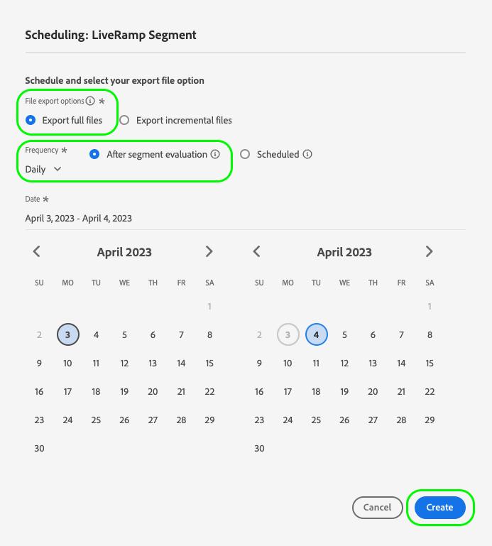
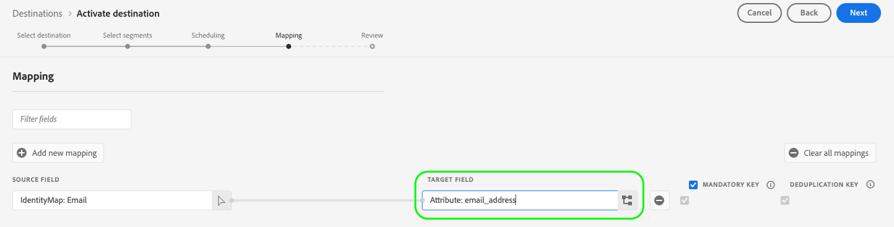

# (Alpha) [!DNL LiveRamp SFTP] connection {#liveramp-destination}

The LiveRamp connection helps you onboard audiences from Adobe Real-Time Customer Data Platform to [!DNL LiveRamp Connect].

>[!IMPORTANT]
>
>This destination connection is currently in alpha stage and only available to a limited selection of customers. The functionality and documentation are subject to change.

## Use cases {#use-cases}

To help you better understand how and when you should use the [!DNL LiveRamp SFTP] destination, here is a sample use case that Adobe Experience Platform customers can solve by using this destination.

As a marketer, I want to send audiences from Adobe Experience Platform to onboard identities into [!DNL LiveRamp Connect] so that I can target users on [!DNL CTV] platforms, using the [!DNL Ramp ID] identifier. 

## Prerequisites {#prerequisites}

This connection is built using [LiveRamp's SFTP](https://docs.liveramp.com/connect/en/upload-a-file-via-liveramp-s-sftp.html).

Before you can send data from Experience Platform to [!DNL LiveRamp SFTP], you need your [!DNL LiveRamp] credentials. Please reach out to your [!DNL LiveRamp] representative to obtain your credentials, if you don't already have them.

## Supported identities {#supported-identities}

*Add information in this section about the identities supported by your destination. We have prefilled the table with some standard values. Delete the values that don't apply to your destination and any values that are not prefilled.*

*YourDestination* supports the activation of identities described in the table below. Learn more about [identities](/help/identity-service/namespaces.md).

|Target Identity|Description|Considerations|
|---|---|---|
|GAID|Google Advertising ID|Select the GAID target identity when your source identity is a GAID namespace.|
|IDFA|Apple ID for Advertisers|Select the IDFA target identity when your source identity is an IDFA namespace.|
|ECID|Experience Cloud ID|A namespace that represents ECID. This namespace can also be referred to by the following aliases: "Adobe Marketing Cloud ID", "Adobe Experience Cloud ID", "Adobe Experience Platform ID". Read the following document on [ECID](/help/identity-service/ecid.md) for more information.|
|phone_sha256|Phone numbers hashed with the SHA256 algorithm|Both plain text and SHA256 hashed phone numbers are supported by Adobe Experience Platform. When your source field contains unhashed attributes, check the **[!UICONTROL Apply transformation]** option, to have [!DNL Platform] automatically hash the data on activation.|
|email_lc_sha256|Email addresses hashed with the SHA256 algorithm|Both plain text and SHA256 hashed email addresses are supported by Adobe Experience Platform. When your source field contains unhashed attributes, check the **[!UICONTROL Apply transformation]** option, to have [!DNL Platform] automatically hash the data on activation.|
|extern_id|Custom user IDs|Select this target identity when your source identity is a custom namespace.|

{style="table-layout:auto"}

## Export type and frequency {#export-type-frequency}

*In the table, keep only the lines that correspond to your destination. You should have one line for Export type and one line for Export frequency. Delete the values that don't apply to your destination.*

Refer to the table below for information about the destination export type and frequency.

| Item | Type | Notes |
---------|----------|---------|
| Export type | **[!UICONTROL Segment export]** | You are exporting all members of a segment (audience) with the identifiers (name, phone number, or others) used in the [!DNL LiveRamp SFTP] destination.|
| Export frequency | **[!UICONTROL Batch]** | Batch destinations export files to downstream platforms in increments of three, six, eight, twelve, or twenty-four hours. Read more about [batch file-based destinations](/help/destinations/destination-types.md#file-based).|

{style="table-layout:auto"}

## Connect to the destination {#connect}

>[!IMPORTANT]
> 
>To connect to the destination, you need the **[!UICONTROL Manage Destinations]** [access control permission](/help/access-control/home.md#permissions). Read the [access control overview](/help/access-control/ui/overview.md) or contact your product administrator to obtain the required permissions.

To connect to this destination, follow the steps described in the [destination configuration tutorial](../../ui/connect-destination.md). In the configure destination workflow, fill in the fields listed in the two sections below.

### Authenticate to destination {#authenticate}

To authenticate to the destination, fill in the required fields and select **[!UICONTROL Connect to destination]**.

**Basic authentication** {#basic-authentication}


* **[!UICONTROL Host]**: The address of the [!DNL LiveRamp SFTP] storage location. For the [!DNL LiveRamp SFTP] destination, use `files.liveramp.com`.
* **[!UICONTROL Username]**: The username for your [!DNL LiveRamp SFTP] storage location.
* **[!UICONTROL Password]**: The password for your [!DNL LiveRamp SFTP] storage location.
* **[!UICONTROL Encryption key]** (Optional): Your RSA-formatted public encryption key.

    * See the [!DNL LiveRamp] [encryption documentation](https://docs.liveramp.com/connect/en/encrypting-files-for-uploading.html#downloading-the-current-encryption-key) to obtain [!DNL LiveRamp]'s public encryption key.
    * If you provide an encryption key, you must also specify the **[!UICONTROL Subkey ID]**.

* **[!UICONTROL Subkey ID]**: The subkey used for encryption, based on the [!DNL LiveRamp] public encryption key. See the [!DNL LiveRamp] [encryption documentation](https://docs.liveramp.com/connect/en/encrypting-files-for-uploading.html#downloading-the-current-encryption-key) to learn how to obtain [!DNL LiveRamp]'s the subkey ID.

**SFTP with SSH key authentication** {#sftp-ssh-authentication}

* **[!UICONTROL Domain]**: The domain or IP address of the [!DNL LiveRamp SFTP] storage location. For the [!DNL LiveRamp SFTP] destination, use `files.liveramp.com`.
* **[!UICONTROL Port]**: The port used by your SFTP storage location.
* **[!UICONTROL Username]**: The username for your [!DNL LiveRamp SFTP] storage location.
* **[!UICONTROL SSH Key]**: The private [!DNL SSH] key used to log in to your [!DNL LiveRamp SFTP] storage location. The private key must be formatted as a [!DNL Base64]-encoded string and must not be password protected.

  * To connect your [!DNL SSH] key to the [!DNL LiveRamp SFTP] server, you must submit a ticket through [!DNL LiveRamp]'s technical support portal, and provide your public key. See more information inte [LiveRamp documentation](https://docs.liveramp.com/connect/en/upload-a-file-via-liveramp-s-sftp.html#upload-with-an-sftp-client).


### Fill in destination details {#destination-details}

To configure details for the destination, fill in the required and optional fields below. An asterisk next to a field in the UI indicates that the field is required.


*  **[!UICONTROL Name]**: A name by which you will recognize this destination in the future.
*  **[!UICONTROL Description]**: A description that will help you identify this destination in the future.
*  **[!UICONTROL Account ID]**: Your *YourDestination* account ID.

### Enable alerts {#enable-alerts}

You can enable alerts to receive notifications on the status of the dataflow to your destination. Select an alert from the list to subscribe to receive notifications on the status of your dataflow. For more information on alerts, read the guide on [subscribing to destinations alerts using the UI](../../ui/alerts.md).

When you are finished providing details for your destination connection, select **[!UICONTROL Next]**.

## Activate segments to this destination {#activate}

>[!IMPORTANT]
> 
>To activate data, you need the **[!UICONTROL Manage Destinations]**, **[!UICONTROL Activate Destinations]**, **[!UICONTROL View Profiles]**, and **[!UICONTROL View Segments]** [access control permissions](/help/access-control/home.md#permissions). Read the [access control overview](/help/access-control/ui/overview.md) or contact your product administrator to obtain the required permissions.

Read [Activate audience data to batch profile export destinations](/help/destinations/ui/activate-batch-profile-destinations.md) for instructions on activating audience segments to this destination.

### Scheduling {#scheduling}

In the [!UICONTROL Scheduling] step, create an export schedule for each segment, with the following settings:

* **[!UICONTROL File export options]**: [!UICONTROL Export full files]. [Incremental file exports](../../ui/activate-batch-profile-destinations.md#export-incremental-files) are currently not supported.
* **[!UICONTROL Frequency]**: [!UICONTROL Daily]
* Set the export time to **[!UICONTROL After segment evaluation]**. Scheduled segment exports and [on-demand file exports](../../ui/export-file-now.md) are currently not supported.



The exported file name is currently not user-configurable. All files exported to the [!DNL LiveRamp SFTP] destination are automatically named based on the following template:

`%ORGANIZATION_NAME%_%DESTINATION%_%DESTINATION_INSTANCE_ID%_%DATETIME%`


An exported file for an organization named [!DNL Luma], could look similar to this: `Luma_LiveRamp_52137231-4a99-442d-804c-39a09ddd005d_20230330_153857.csv`

### Map attributes and identities {#map}

In the **[!UICONTROL Mapping]** step, you can select which attributes and identities you want to export for your profiles.

You can change the CSV column headers in the exported file to any friendly name that you want.


1. In the [!UICONTROL Mapping] step, select [!UICONTROL Add new mapping]. You will see a new mapping row on the screen.

    

2. In the **[!UICONTROL Select source field]** window, choose the **[!UICONTROL Select attributes]** category and select the XDM attribute that you want to map, or choose the **[!UICONTROL Select identity namespace]** category and select an identity to map to your destination.
    
    

3. In the **[!UICONTROL Select target field]** window, enter the attribute name that you want to map the selected source field to. The attribute name defined here will reflect in the exported CSV file as a column header.

    
    
    You can also input the attribute name by typing it directly into the **[!UICONTROL Target field]**.
    
    

Once you've added all your desired mappings, select **[!UICONTROL Next]** and finish the activation workflow.

## Exported data / Validate data export {#exported-data}

Your data is exported to the [!DNL LiveRamp SFTP] storage location that you configured, as CSV files.

When exporting files to the [!DNL LiveRamp SFTP] destination, Platform generates one CSV file for each [merge policy ID](../../../profile/merge-policies/overview.md).

For example, let's consider the following segments:

* Segment A (Merge policy 1)
* Segment B (Merge policy 2)
* Segment C (Merge policy 1)
* Segment D (Merge policy 1)

Platform will export two CSV files to [!DNL LiveRamp SFTP]:

* One CSV file containing segments A, C, and D;
* One CSV file containing segment B.

Exported CSV files contain the selected attributes and the corresponding segment status, on separate columns, with the segment ID as a column header. If a profile does not qualify for a segment, the null value is used as a status.

For instance, an exported CSV file with one `email` attribute and 3 segments could look like this:

```csv
email,aa2e3d98-974b-4f8b-9507-59f65b6442df,45d4e762-6e57-4f2f-a3e0-2d1893bcdd7f,7729e537-4e42-418e-be3b-dce5e47aaa1e
abc117@testemailabc.com,active,,
abc111@testemailabc.com,,,active
abc102@testemailabc.com,,,active
abc116@testemailabc.com,active,,
abc107@testemailabc.com,active,active,active
abc101@testemailabc.com,active,active,
```

>[!NOTE]
>
>The **[!UICONTROL Identities activated]** and **[!UICONTROL Profiles received]** metrics are displayed as a destination-level metric, not as a segment-level metric.


## Data usage and governance {#data-usage-governance}

All [!DNL Adobe Experience Platform] destinations are compliant with data usage policies when handling your data. For detailed information on how [!DNL Adobe Experience Platform] enforces data governance, read the [Data Governance overview](/help/data-governance/home.md).

## Additional resources {#additional-resources}

For more details on how to configure your LiveRamp SFTP storage, see the [official documentation](https://docs.liveramp.com/connect/en/upload-a-file-via-liveramp-s-sftp.html).
