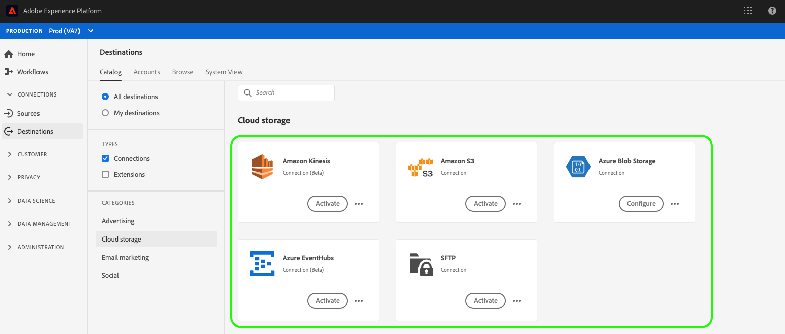
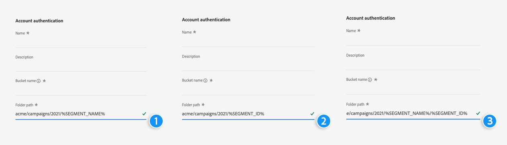

# Cloud storage destinations overview {#cloud-storage-destinations}

## Overview {#overview}

Adobe Experience Platform can deliver your audiences as data files to your cloud storage locations. This enables you to send audiences and their profile attributes to your internal systems, via CSV files for [!DNL Amazon S3], [!DNL Azure Blob], [!DNL Azure Data Lake Storage Gen2], [!DNL Data Landing Zone], [!DNL Google Cloud Storage], and SFTP. For [!DNL Amazon Kinesis] and [!DNL Azure Event Hubs] destinations, data is streamed out of Experience Platform in [!DNL JSON] format.

## Supported cloud storage destinations {#supported-destinations}

Adobe Experience Platform supports data exports to the following cloud storage destinations:

* [Amazon Kinesis connection](amazon-kinesis.md)
* [Amazon S3 connection](amazon-s3.md)
* [Azure Blob connection](azure-blob.md)
* [Azure Data Lake Storage Gen2](adls-gen2.md)
* [Azure Event Hubs connection](azure-event-hubs.md)
* [Data Landing Zone](data-landing-zone.md)
* [Google Cloud Storage](google-cloud-storage.md)
* [SFTP connection](sftp.md)

## Connect to a new cloud storage destination {#connect-destination}

To send audiences to cloud storage destinations for your campaigns, Platform must first connect to the destination. See the [destination creation tutorial](../../ui/connect-destination.md) for detailed information on setting up a new destination.

## Use macros to create a folder in your storage location {#use-macros}

>[!NOTE]
>
> The functionality described in this section is currently available for [Amazon S3](amazon-s3.md) destinations only.

To create a custom folder per audience file in your storage location, you can use macros in the folder path input field. Insert the macros at the end of the input field, as shown below.

  

The examples below reference a sample audience `Luxury Audience` with ID `25768be6-ebd5-45cc-8913-12fb3f348615`.

**Macro 1: `%SEGMENT_NAME%`**

Input: `acme/campaigns/2021/%SEGMENT_NAME%`
Folder path in your storage location: `acme/campaigns/2021/Luxury Audience`

**Macro 2: `%SEGMENT_ID%`**

Input: `acme/campaigns/2021/%SEGMENT_ID%`
Folder path in your storage location: `acme/campaigns/2021/25768be6-ebd5-45cc-8913-12fb3f348615`

**Macro 3: `%SEGMENT_NAME%/%SEGMENT_ID%`**

Input: `acme/campaigns/2021/%SEGMENT_NAME%/%SEGMENT_ID%`
Folder path in your storage location: `acme/campaigns/2021/Luxury Audience/25768be6-ebd5-45cc-8913-12fb3f348615`

## Data export type {#export-type}

Cloud storage destinations support the following export types: 
* **Profile-based export**. This means that you are exporting details about the individuals in the audience. These details are needed for personalization and can include attributes, events, audience memberships, and more.
* **Dataset export**. This functionality allows you to export entire datasets to cloud storage destinations. [Read more](/help/destinations/ui/export-datasets.md) about the functionality. 

## Next steps {#next-steps}

After selecting which one of the [supported cloud destinations](#supported-destinations) you would like to use, read the [connect to destinations tutorial](/help/destinations/ui/connect-destination.md) to learn how to establish a connection to the destination. Then, read the activation tutorial to file-based destinations to learn how to start [exporting](/help/destinations/ui/activate-batch-profile-destinations.md) data to your cloud storage destination.
