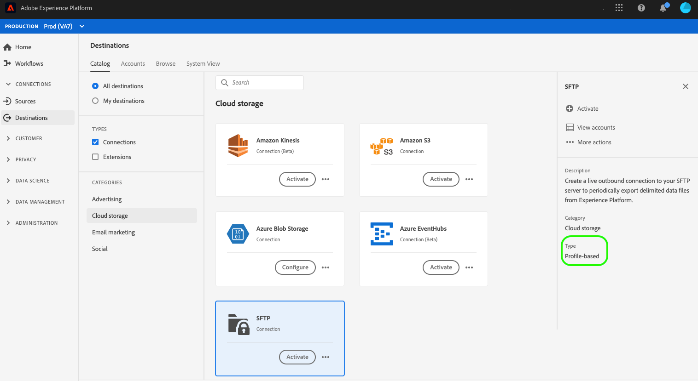
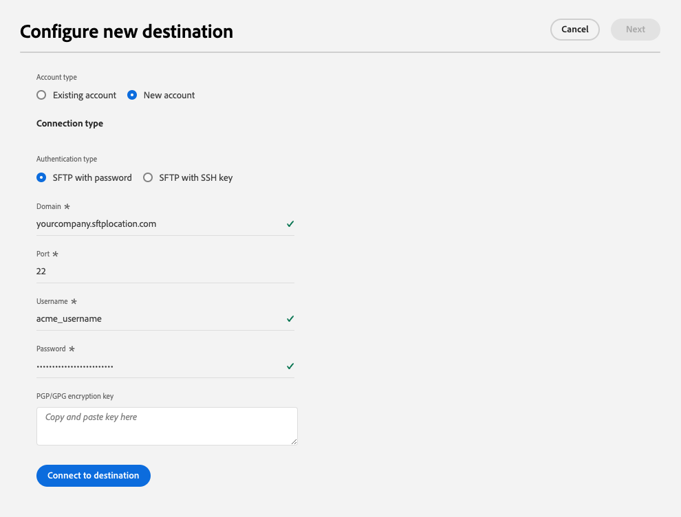
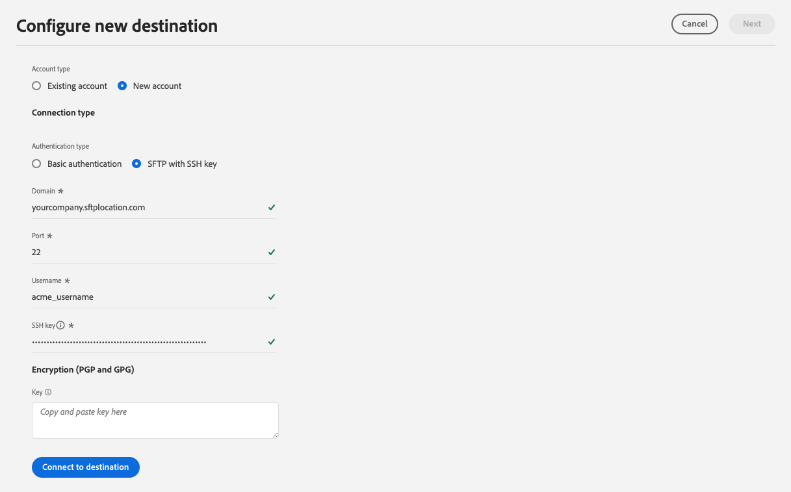
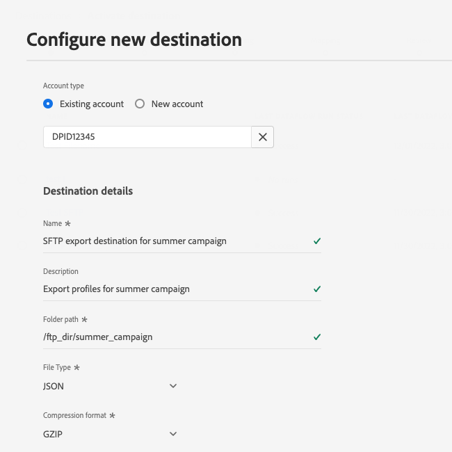

# SFTP connection

## Destination changelog {#changelog}

With the July 2023 Experience Platform release, the SFTP destination provides new functionality, as listed below:

* [Dataset export support](/help/destinations/ui/export-datasets.md).
* Additional [file naming options](/help/destinations/ui/activate-batch-profile-destinations.md#scheduling).
* Ability to set custom file headers in your exported files via the [improved mapping step](/help/destinations/ui/activate-batch-profile-destinations.md#mapping).
* [Ability to customize the formatting of exported CSV data files](/help/destinations/ui/batch-destinations-file-formatting-options.md).

## Overview {#overview}

Create a live outbound connection to your SFTP server to periodically export delimited data files from Adobe Experience Platform.

>[!IMPORTANT]
>
> While Experience Platform supports data exports to SFTP servers, the recommended cloud storage locations to export data are [!DNL Amazon S3] and [!DNL Azure Blob].

## Connect to SFTP through API or UI {#connect-api-or-ui}

* To connect to your SFTP storage location using the Platform user interface, read the sections [Connect to the destination](#connect) and [Activate audiences to this destination](#activate) below.
* To connect to your SFTP storage location programmatically, read the [Activate audiences to file-based destinations by using the Flow Service API tutorial](../../api/activate-segments-file-based-destinations.md).

## Supported audiences {#supported-audiences}

This section describes which types of audiences you can export to this destination.

| Audience origin | Supported | Description | 
---------|----------|----------|
| [!DNL Segmentation Service] | ✓ | Audiences generated through the Experience Platform [Segmentation Service](../../../segmentation/home.md).|
| Custom uploads | ✓ | Audiences [imported](../../../segmentation/ui/overview.md#import-audience) into Experience Platform from CSV files. |

{style="table-layout:auto"}

## Export type and frequency {#export-type-frequency}

Refer to the table below for information about the destination export type and frequency.

| Item | Type | Notes |
---------|----------|---------|
| Export type | **[!UICONTROL Profile-based]** | You are exporting all members of a segment, together with the desired schema fields (for example: email address, phone number, last name), as chosen in the select profile attributes screen of the [destination activation workflow](../../ui/activate-batch-profile-destinations.md#select-attributes).|
| Export frequency | **[!UICONTROL Batch]** | Batch destinations export files to downstream platforms in increments of three, six, eight, twelve, or twenty-four hours. Read more about [batch file-based destinations](/help/destinations/destination-types.md#file-based).|

{style="table-layout:auto"}

## Connect to the destination {#connect}

>[!IMPORTANT]
> 
>To connect to the destination, you need the **[!UICONTROL View Destinations]** and **[!UICONTROL Manage Destinations]** [access control permissions](/help/access-control/home.md#permissions). Read the [access control overview](/help/access-control/ui/overview.md) or contact your product administrator to obtain the required permissions.

To connect to this destination, follow the steps described in the [destination configuration tutorial](../../ui/connect-destination.md). In the configure destination workflow, fill in the fields listed in the two sections below.

### Authentication information {#authentication-information}

>[!CONTEXTUALHELP]
>id="platform_destinations_connect_sftp_rsa"
>title="RSA public key"
>abstract="Optionally, you can attach your RSA-formatted public key to add encryption to your exported files. View an example of a correctly formatted key in the documentation link below."

>[!CONTEXTUALHELP]
>id="platform_destinations_connect_sftp_ssh"
>title="Private SSH key"
>abstract="The private SSH key must be an RSA-formatted, Base64-encoded string, and must not be password-protected."

If you select the **[!UICONTROL SFTP with password]** authentication type to connect to your SFTP location:

* **[!UICONTROL Domain]**: The address of your SFTP storage location;
* **[!UICONTROL Username]**: The username to log into your SFTP storage location;
* **[!UICONTROL Port]**: The port used by your SFTP storage location;
* **[!UICONTROL Password]**: The password to log into your SFTP storage location.
* **[!UICONTROL Encryption key]**: Optionally, you can attach your RSA-formatted public key to add encryption to your exported files. View an example of a correctly formatted encryption key in the image below.

  

If you select the **[!UICONTROL SFTP with SSH key]** authentication type to connect to your SFTP location:

* **[!UICONTROL Domain]**: Fill in the IP address or the domain name of your SFTP account
* **[!UICONTROL Port]**: The port used by your SFTP storage location;
* **[!UICONTROL Username]**: The username to log into your SFTP storage location;
* **[!UICONTROL SSH Key]**: The private SSH key used to log into your SFTP storage location. The private key must be an RSA-formatted, Base64-encoded string, and must not be password-protected.
* **[!UICONTROL Encryption key]**: Optionally, you can attach your RSA-formatted public key to add encryption to your exported files. View an example of a correctly formatted encryption key in the image below.

    
    
### Destination details {#destination-details}

After establishing the authentication connection to the SFTP location, provide the following information for the destination:

* **[!UICONTROL Name]**: Enter a name that helps you identify this destination in the Experience Platform user interface;
* **[!UICONTROL Description]**: Enter a description for this destination;
* **[!UICONTROL Folder path]**: Enter the path to the folder in your SFTP location where the files will be exported.
* **[!UICONTROL File type]**: Select the format Experience Platform should use for the exported files. When selecting the [!UICONTROL CSV] option, you can also [configure the file formatting options](../../ui/batch-destinations-file-formatting-options.md).
* **[!UICONTROL Compression format]**: Select the compression type that Experience Platform should use for the exported files.
* **[!UICONTROL Include manifest file]**: Toggle this option on if you'd like the exports to include a manifest JSON file that contains information about the export location, export size, and more. The manifest is named using the format `manifest-<<destinationId>>-<<dataflowRunId>>.json`. View a [sample manifest file](/help/destinations/assets/common/manifest-d0420d72-756c-4159-9e7f-7d3e2f8b501e-0ac8f3c0-29bd-40aa-82c1-f1b7e0657b19.json). The manifest file includes the following fields:
  * `flowRunId`: The [dataflow run](/help/dataflows/ui/monitor-destinations.md#dataflow-runs-for-batch-destinations) which generated the exported file. 
  * `scheduledTime`: The time in UTC when the file was exported. 
  * `exportResults.sinkPath`: The path in your storage location where the exported file is deposited. 
  * `exportResults.name`: The name of the exported file.
  * `size`: The size of the exported file, in bytes.

## Activate audiences to this destination {#activate}

>[!IMPORTANT]
> 
>* To activate data, you need the **[!UICONTROL View Destinations]**, **[!UICONTROL Activate Destinations]**, **[!UICONTROL View Profiles]**, and **[!UICONTROL View Segments]** [access control permissions](/help/access-control/home.md#permissions). Read the [access control overview](/help/access-control/ui/overview.md) or contact your product administrator to obtain the required permissions.
>* To export *identities*, you need the **[!UICONTROL View Identity Graph]** [access control permission](/help/access-control/home.md#permissions).   {width="100" zoomable="yes"}

See [Activate audience data to batch profile export destinations](../../ui/activate-batch-profile-destinations.md) for instructions on activating audiences to this destination.

## Export datasets {#export-datasets}

This destination supports dataset exports. For complete information on how to set up dataset exports, read the tutorials: 

* How to [export datasets using the Platform user interface](/help/destinations/ui/export-datasets.md). 
* How to [export datasets programmatically using the Flow Service API](/help/destinations/api/export-datasets.md).

## Exported data {#exported-data}

For [!DNL SFTP] destinations, Platform creates a `.csv` file in the storage location that you provided. For more information about the files, see [Activate audience data to batch profile export destinations](../../ui/activate-batch-profile-destinations.md) in the audience activation tutorial.

## IP address allowlist {#ip-address-allow-list}

Refer to [IP address allowlist for SFTP destinations](ip-address-allow-list.md) if you need to add Adobe IPs to an allowlist.
