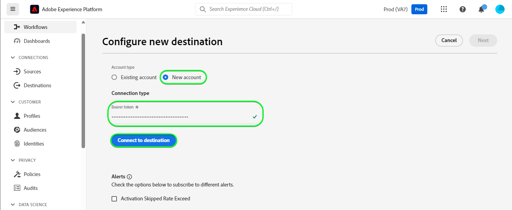
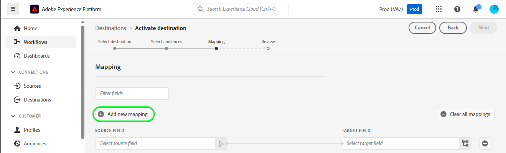
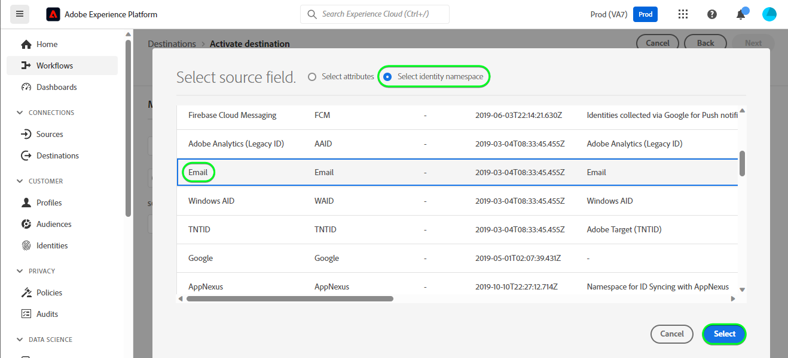
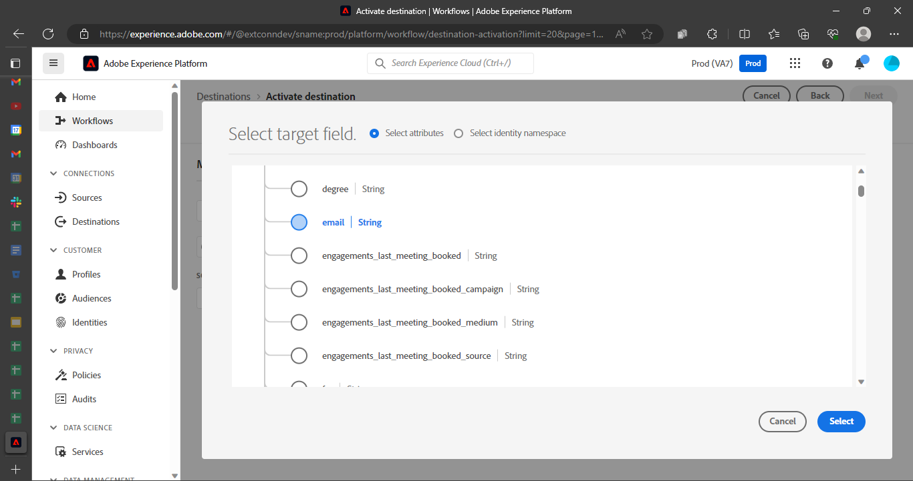
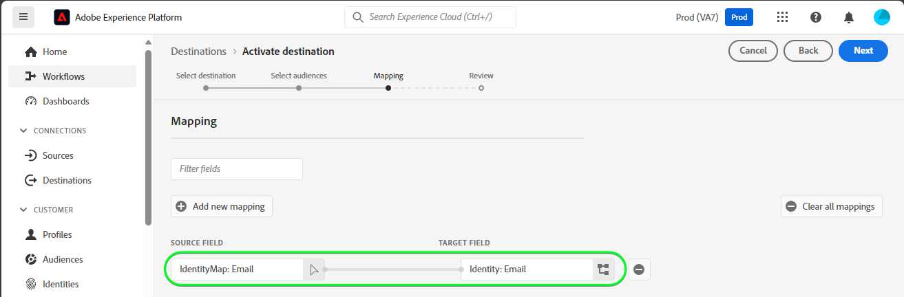
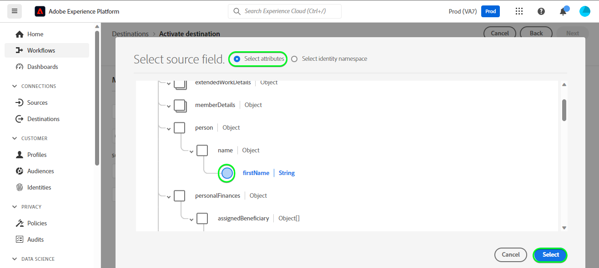
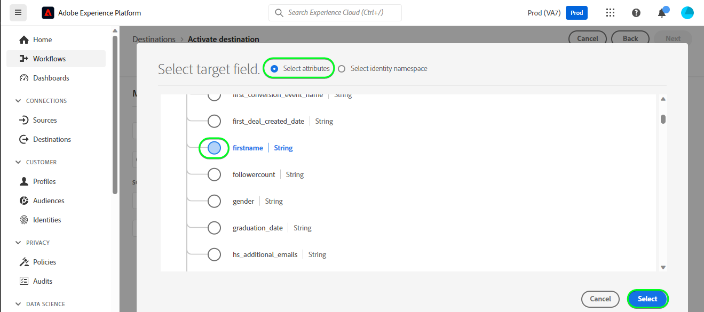
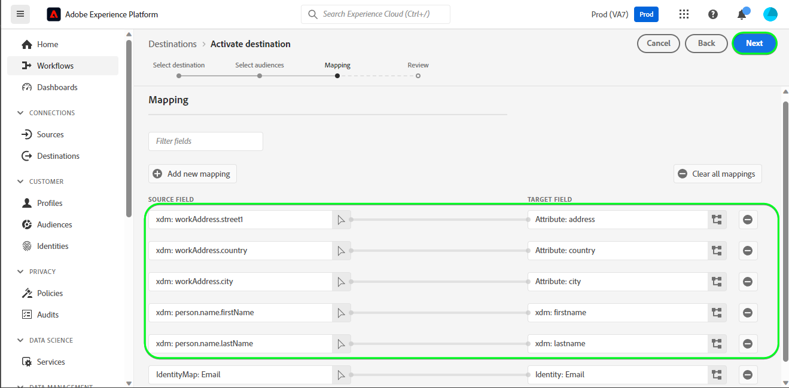
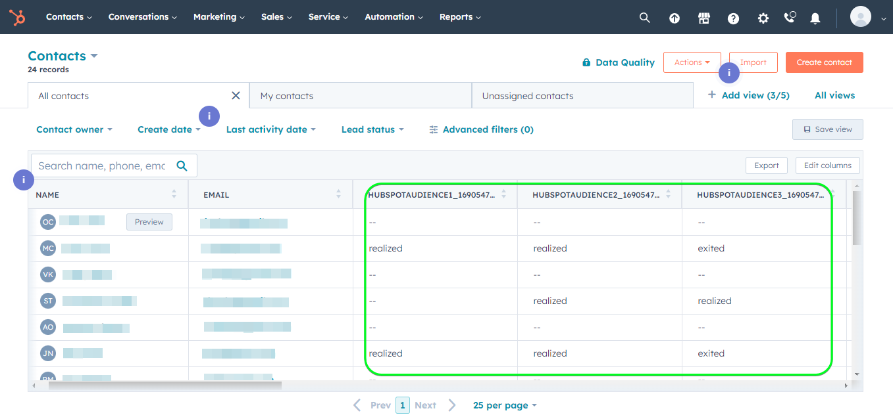
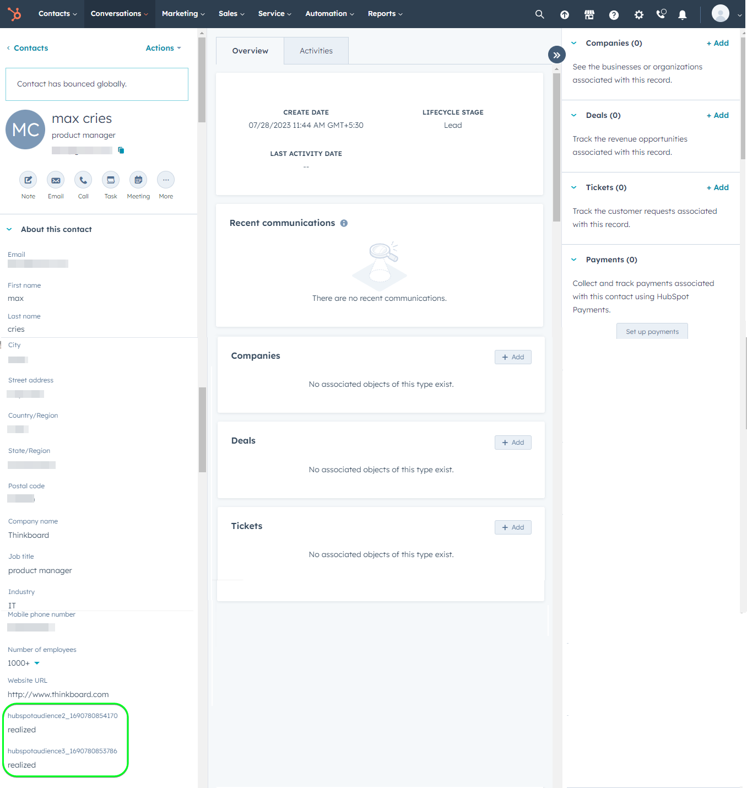

# [!DNL HubSpot] connection

[[!DNL HubSpot]](https://www.hubspot.com) is a CRM platform with all the software, integrations, and resources you need to connect marketing, sales, content management, and customer service. It allows you to connect your data, teams, and customers on one CRM platform.

This [!DNL Adobe Experience Platform] [destination](/help/destinations/home.md) leverages the [[!DNL HubSpot] Contacts API](https://developers.hubspot.com/docs/api/crm/contacts), to update contacts within [!DNL HubSpot] from an existing Experience Platform audience after activation.

Instructions to authenticate to your [!DNL HubSpot] instance are further below, in the [Authenticate to destination](#authenticate) section.

## Use cases {#use-cases}

To help you better understand how and when you should use the [!DNL HubSpot] destination, here is a sample use case that Adobe Experience Platform customers can solve by using this destination.

[!DNL HubSpot] contacts store information about the individuals that interact with your business. Your team uses the contacts that exist in [!DNL HubSpot] to build the Experience Platform audiences. After sending these audiences to [!DNL HubSpot], their information is updated and each contact is assigned a property with its value as the audience name that indicates which audience the contact belongs to.

## Prerequisites {#prerequisites}

Refer to the sections below for any prerequisites that you need to set up in Experience Platform and [!DNL HubSpot] and for information that you must gather before working with the [!DNL HubSpot] destination.

### Experience Platform prerequisites {#prerequisites-in-experience-platform}

Before activating data to the [!DNL HubSpot] destination, you must have a [schema](/help/xdm/schema/composition.md), a [dataset](https://experienceleague.adobe.com/docs/platform-learn/tutorials/data-ingestion/create-datasets-and-ingest-data.html), and [audiences](https://experienceleague.adobe.com/docs/platform-learn/tutorials/audiences/create-audiences.html) created in [!DNL Experience Platform].

Refer to Experience Platform documentation for [Audience Membership Details schema field group](/help/xdm/field-groups/profile/segmentation.md) if you need guidance on audience statuses.

### Prerequisites for the [!DNL HubSpot] destination {#prerequisites-destination}

Note the following prerequisites in order to export data from Platform to your [!DNL HubSpot] account:

#### You must have a [!DNL HubSpot] account {#prerequisites-account}

In order to export data from Platform to your [!DNL Hubspot] account you need to have a [!DNL HubSpot] account. If you do not have one already, visit the [Set up your HubSpot account](https://knowledge.hubspot.com/get-started/set-up-your-account) page and follow the guidance to register and create your account.

#### Gather the [!DNL HubSpot] private app access token {#gather-credentials}

You need your [!DNL HubSpot] `Access token` to allow the [!DNL HubSpot] destination to make API calls through your [!DNL HubSpot] private app within your [!DNL HubSpot] account. The `Access token` serves as the `Bearer token` when you [authenticate the destination](#authenticate).

If you do not have a private app, follow the documentation to [Create a private app in [!DNL HubSpot]](https://developers.hubspot.com/docs/api/private-apps).

>[!IMPORTANT]
>
> The private app should be assigned the scopes below:
> `crm.objects.contacts.write`, `crm.objects.contacts.read`
> `crm.schemas.contacts.write`, `crm.schemas.contacts.read`

| Credential | Description | Example |
| --- | --- | --- |
| `Bearer token` | The `Access token` of your [!DNL HubSpot] private app.  To obtain your [!DNL HubSpot] `Access token` follow the [!DNL HubSpot] documentation to [make API calls with your app's access token](https://developers.hubspot.com/docs/api/private-apps#make-api-calls-with-your-app-s-access-token). | `pat-na1-11223344-abcde-12345-9876-1234a1b23456` |

## Guardrails {#guardrails}

[!DNL HubSpot] private apps are subject to [Rate Limits](https://developers.hubspot.com/docs/api/usage-details). The number of calls your private app can make is based on your [!DNL HubSpot] account subscription and whether you've purchased the API add-on. Additionally also refer to the [Other Limits](https://developers.hubspot.com/docs/api/usage-details#other-limits).

## Supported identities {#supported-identities}

[!DNL HubSpot] supports update of identities described in the table below. Learn more about [identities](/help/identity-service/features/namespaces.md).

|Target Identity|Example|Description|Considerations|
|---|---|---|---|
| `email` | `test@test.com` | Email address of the contact.| Mandatory |

## Supported audiences {#supported-audiences}

This section describes all the audiences that you can export to this destination.

This destination supports the activation of all audiences generated through the Experience Platform [Segmentation Service](../../../segmentation/home.md).

This destination also supports the activation of the audiences described in the table below.

| Audience type | Description | 
---------|----------|
| Custom uploads | Audiences [imported](../../../segmentation/ui/overview.md#import-audience) into Experience Platform from CSV files. |

{style="table-layout:auto"}

## Export type and frequency {#export-type-frequency}

Refer to the table below for information about the destination export type and frequency.

| Item | Type | Notes |
---------|----------|---------|
| Export type | **[!UICONTROL Profile-based]** | <ul><li>You are exporting all members of an audience, together with the desired schema fields *(for example: email address, phone number, last name)*, according to your field mapping.</li><li> Additionally, a new property is created in [!DNL HubSpot] using the audience name and its value is with the corresponding audience status from Platform, for each of the selected audiences.</li></ul> |
| Export frequency | **[!UICONTROL Streaming]** | <ul><li>Streaming destinations are "always on" API-based connections. As soon as a profile is updated in Experience Platform based on audience evaluation, the connector sends the update downstream to the destination platform. Read more about [streaming destinations](/help/destinations/destination-types.md#streaming-destinations).</li></ul>|

{style="table-layout:auto"}

## Connect to the destination {#connect}

>[!IMPORTANT]
>
>To connect to the destination, you need the **[!UICONTROL View Destinations]** and **[!UICONTROL Manage Destinations]** [access control permissions](/help/access-control/home.md#permissions). Read the [access control overview](/help/access-control/ui/overview.md) or contact your product administrator to obtain the required permissions.

To connect to this destination, follow the steps described in the [destination configuration tutorial](../../ui/connect-destination.md). In the configure destination workflow, fill in the fields listed in the two sections below.

Within **[!UICONTROL Destinations]** > **[!UICONTROL Catalog]** search for [!DNL HubSpot]. Alternatively you can locate it under the **[!UICONTROL CRM]** category.

### Authenticate to destination {#authenticate}

Fill in the required fields below. Refer to the [Gather the [!DNL HubSpot] private app access token](#gather-credentials) section for any guidance.
* **[!UICONTROL Bearer token]**: The access token for your [!DNL HubSpot] private app.

To authenticate to the destination, select **[!UICONTROL Connect to destination]**.

If the details provided are valid, the UI displays a **[!UICONTROL Connected]** status with a green check mark. You can then proceed to the next step.

### Fill in destination details {#destination-details}

To configure details for the destination, fill in the required and optional fields below. An asterisk next to a field in the UI indicates that the field is required.

* **[!UICONTROL Name]**: A name by which you will recognize this destination in the future.
* **[!UICONTROL Description]**: A description that will help you identify this destination in the future.

### Enable alerts {#enable-alerts}

You can enable alerts to receive notifications on the status of the dataflow to your destination. Select an alert from the list to subscribe to receive notifications on the status of your dataflow. For more information on alerts, see the guide on [subscribing to destinations alerts using the UI](../../ui/alerts.md).

When you are finished providing details for your destination connection, select **[!UICONTROL Next]**.

## Activate audiences to this destination {#activate}

>[!IMPORTANT]
>
>To activate data, you need the **[!UICONTROL View Destinations]**, **[!UICONTROL Activate Destinations]**, **[!UICONTROL View Profiles]**, and **[!UICONTROL View Segments]** [access control permissions](/help/access-control/home.md#permissions). Read the [access control overview](/help/access-control/ui/overview.md) or contact your product administrator to obtain the required permissions.

Read [Activate profiles and audiences to streaming audience export destinations](/help/destinations/ui/activate-segment-streaming-destinations.md) for instructions on activating audiences to this destination.

### Map attributes and identities {#map}

To correctly send your audience data from Adobe Experience Platform to the [!DNL HubSpot] destination, you must go through the field mapping step. Mapping consists of creating a link between your Experience Data Model (XDM) schema fields in your Platform account and their corresponding equivalents from the target destination.

To correctly map your XDM fields to the [!DNL HubSpot] destination fields, follow the steps below:

#### Mapping the `Email` identity

The `Email` identity is a mandatory mapping for this destination. Follow the steps below to map it:
1. In the **[!UICONTROL Mapping]** step, select **[!UICONTROL Add new mapping]**. You can now see a new mapping row on the screen.

1. In the **[!UICONTROL Select source field]** window, choose the **[!UICONTROL Select identity namespace]** and select an identity.

1. In the **[!UICONTROL Select target field]** window, choose the **[!UICONTROL Select attributes]** and select `email`.

| Source Field | Target Field | Mandatory |
| --- | --- | --- |
| `IdentityMap: Email` | `Identity: email` | Yes |

An example with the identity mapping is shown below:

#### Mapping **optional** attributes

To add any other attributes you want to update between your XDM profile schema and your [!DNL HubSpot] account repeat the steps below:
1. In the **[!UICONTROL Mapping]** step, select **[!UICONTROL Add new mapping]**. You can now see a new mapping row on the screen.

1. In the **[!UICONTROL Select source field]** window, choose the **[!UICONTROL Select attributes]** category and select the XDM attribute.

1. In the **[!UICONTROL Select target field]** window, choose **[!UICONTROL Select attributes]** category and select from the list of attributes which are automatically populated from your [!DNL HubSpot] account. The destination uses the [[!DNL HubSpot] Properties](https://developers.hubspot.com/docs/api/crm/properties) API to retrieve this information. Both [!DNL HubSpot] [default properties](https://knowledge.hubspot.com/contacts/hubspots-default-contact-properties) and any custom properties are retrieved for selection as target fields.

  
A few available mappings between your XDM profile schema and [!DNL Hubspot] are shown below:

| Source Field | Target Field |
| --- | --- |
| `xdm: person.name.firstName` | `Attribute: firstname` |
| `xdm: person.name.lastName` | `Attribute: lastname` |
| `xdm: workAddress.street1` | `Attribute: address` |
| `xdm: workAddress.city` | `Attribute: city` |
| `xdm: workAddress.country` | `Attribute: country` |

An example using these attributes mappings is shown below:

When you are finished providing the mappings for your destination connection, select **[!UICONTROL Next]**.

## Validate data export {#exported-data}

To validate that you have correctly set up the destination, follow the steps below:

1. Log in to the [!DNL HubSpot] website, then navigate to the **[!UICONTROL Contacts]** page to check the audience statuses. This list can be configured to display columns for the custom properties created with the audience name with their value being the audience statuses.

1. You can alternatively drill down into an individual **[!UICONTROL Person]** page and navigate to the properties displaying the audience name and audience statuses.

## Data usage and governance {#data-usage-governance}

All [!DNL Adobe Experience Platform] destinations are compliant with data usage policies when handling your data. For detailed information on how [!DNL Adobe Experience Platform] enforces data governance, see the [Data Governance overview](/help/data-governance/home.md).

## Additional resources {#additional-resources}

Additional useful information from the [!DNL HubSpot] documentation is below:
* [Authentication methods on HubSpot](https://developers.hubspot.com/docs/api/intro-to-auth)
* [!DNL HubSpot] API references for the [Contacts](https://developers.hubspot.com/docs/api/crm/contacts) and [Properties](https://developers.hubspot.com/docs/api/crm/properties) APIs.

### Changelog

This section captures the functionality and significant documentation updates made to this destination connector.

+++ View changelog

|Release month|Update type|Description|
|---|---|---|
|September 2023| Initial release |Initial destination release and documentation publish. |

{style="table-layout:auto"}

+++
