# [!DNL Microsoft Dynamics 365] connection

## Overview {#overview}

[[!DNL Microsoft Dynamics 365]](https://dynamics.microsoft.com/en-us/) is a cloud-based business application platform that combines Enterprise Resource Planning (ERP) and Customer Relationship Management (CRM) along with productivity applications and AI tools, to bring end-to-end smoother and more controlled operations, better growth potential and reduced costs.

This [!DNL Adobe Experience Platform] [destination](/help/destinations/home.md) leverages the [[!DNL Contact Entity Reference API]](https://docs.microsoft.com/en-us/dynamics365/customerengagement/on-premises/developer/entities/contact?view=op-9-1), which allows you to update identities within a segment into [!DNL Dynamics 365].

[!DNL Dynamics 365] uses OAuth 2 with Authorization Grant as the authentication mechanism to communicate with the [!DNL Contact Entity Reference API]. Instructions to authenticate to your [!DNL Dynamics 365] instance are further below, in the [Authenticate to destination](#authenticate) section.

## Use cases {#use-cases}

As a marketer, you can deliver personalized experiences to your users, based on attributes from their Adobe Experience Platform profiles. You can build segments from your offline data and send these segments to [!DNL Dynamics 365], to display in the users' feeds as soon as segments and profiles are updated in Adobe Experience Platform.

## Prerequisites {#prerequisites}

### Experience Platform prerequisites {#prerequisites-in-experience-platform}

Before activating data to the [!DNL Dynamics 365] destination, you must have a [schema](/help/xdm/schema/composition.md), a [dataset](https://experienceleague.adobe.com/docs/platform-learn/tutorials/data-ingestion/create-datasets-and-ingest-data.html?lang=en), and [segments](https://experienceleague.adobe.com/docs/platform-learn/tutorials/segments/create-segments.html?lang=en) created in [!DNL Experience Platform].

Refer to Adobe's documentation for [Segment Membership Details schema field group](/help/xdm/field-groups/profile/segmentation.md) if you need guidance on segment statuses.

### [!DNL Microsoft Dynamics 365] prerequisites {#prerequisites-destination}

Note the following prerequisites in [!DNL Dynamics 365], in order to export data from Platform to your [!DNL Dynamics 365] account:

#### You need to have a [!DNL Microsoft Dynamics 365] account {#prerequisites-account}

Go to the [!DNL Dynamics 365] [trial](https://dynamics.microsoft.com/en-us/dynamics-365-free-trial/) page to register and create an account, if you do not have one already.

#### Create field within [!DNL Dynamics 365] {#prerequisites-custom-field}

Create the custom field of type `Simple` with field data type as `Single Line of Text` which Experience Platform will use to update the segment status within [!DNL Dynamics 365].
Refer to the [!DNL Dynamics 365] documentation to [create a field (attribute)](https://docs.microsoft.com/en-us/dynamics365/customerengagement/on-premises/customize/create-edit-fields?view=op-9-1) if you need additional guidance.

An example setup within [!DNL Dynamics 365] is shown below:
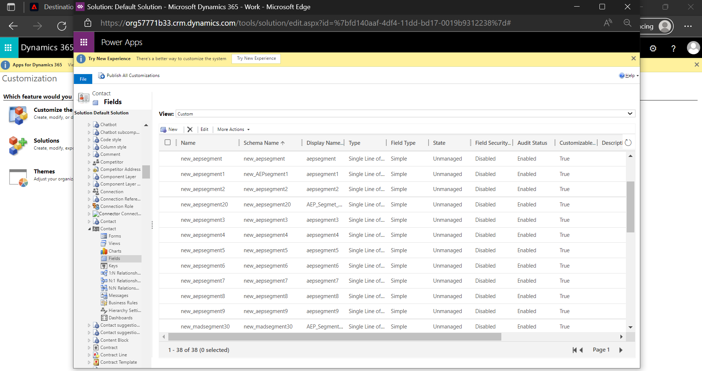

#### Register an application and application user within Azure Active Directory {#prerequisites-app-user}

To enable [!DNL Dynamics 365] to access resources you will need to log in with your [!DNL Azure Account] to [[!DNL Azure Active Directory]](https://docs.microsoft.com/en-us/azure/active-directory/develop/howto-create-service-principal-portal#register-an-application-with-azure-ad-and-create-a-service-principal) and create the following:
* An [!DNL Azure Active Directory] application
* A Service principal
* An application secret

You will also need to [create an application user](https://docs.microsoft.com/en-us/power-platform/admin/manage-application-users#create-an-application-user) in [!DNL Azure Active Directory] and associate it with the newly created application.

#### Gather [!DNL Dynamics 365] credentials {#gather-credentials}

Note down the items below before you authenticate to the [!DNL Dynamics 365] CRM destination:

| Credential | Description | Example |
| --- | --- | --- |
| `Client ID` | The [!DNL Dynamics 365] Client ID for your [!DNL Azure Active Directory] application. Refer to the [[!DNL Dynamics 365] documentation](https://docs.microsoft.com/en-us/azure/active-directory/develop/howto-create-service-principal-portal#get-tenant-and-app-id-values-for-signing-in) for guidance. | `ababbaba-abab-baba-acac-acacacacacac` |
| `Client Secret` | The [!DNL Dynamics 365] Client Secret for your [!DNL Azure Active Directory] application. You would be using option #2 within the [[!DNL Dynamics 365] documentation](https://docs.microsoft.com/en-us/azure/active-directory/develop/howto-create-service-principal-portal#authentication-two-options). | `abcde~abcdefghijklmnopqrstuvwxyz12345678` for guidance.|
| `Tenant ID` | The [!DNL Dynamics 365] Tenant ID for your [!DNL Azure Active Directory] application. Refer to the [[!DNL Dynamics 365] documentation](https://docs.microsoft.com/en-us/azure/active-directory/develop/howto-create-service-principal-portal#get-tenant-and-app-id-values-for-signing-in) for guidance.  | `1234567-aaaa-12ab-ba21-1234567890` |
| `Environment URL` | Refer to the [[!DNL Dynamics 365] documentation](https://docs.microsoft.com/en-us/dynamics365/customerengagement/on-premises/developer/org-service/discover-url-organization-organization-service?view=op-9-1) for guidance.| If your [!DNL Dynamics 365] domain is as below, you need the highlighted value.  *`org57771b33`.crm.dynamics.com* |

## Guardrails {#guardrails}

The [Requests limits and allocations](https://docs.microsoft.com/en-us/power-platform/admin/api-request-limits-allocations) page details the [!DNL Dynamics 365] API limits associated with your [!DNL Dynamics 365] license. You need to ensure that your data and payload are within these constraints.

## Supported identities {#supported-identities}

[!DNL Dynamics 365] supports update of identities described in the table below. Learn more about [identities](/help/identity-service/namespaces.md).

|Target Identity|Example|Description|Considerations|
|---|---|---|---|
| `contactId` | 7eb682f1-ca75-e511-80d4-00155d2a68d1 | Unique identifier for a contact.| **Mandatory**. Refer to the [[!DNL Dynamics 365] documentation](https://docs.microsoft.com/en-us/dynamics365/customerengagement/on-premises/developer/entities/contact?view=op-9-1) for further details. |

## Export type and frequency {#export-type-frequency}

Refer to the table below for information about the destination export type and frequency.

| Item | Type | Notes |
---------|----------|---------|
| Export type | **[!UICONTROL Profile-based]** | <ul><li>You are exporting all members of a segment, together with the desired schema fields *(for example: email address, phone number, last name)*, according to your field mapping.</li><li> Each segment status in [!DNL Dynamics 365] gets updated with the corresponding segment status from Platform, based on the **[!UICONTROL Mapping ID]** value provided during the [segment scheduling](#schedule-segment-export-example) step.</li></ul> |
| Export frequency | **[!UICONTROL Streaming]** | <ul><li>Streaming destinations are "always on" API-based connections. As soon as a profile is updated in Experience Platform based on segment evaluation, the connector sends the update downstream to the destination platform. Read more about [streaming destinations](/help/destinations/destination-types.md#streaming-destinations).</li></ul>|

{style="table-layout:auto"}

## Connect to the destination {#connect}

>[!IMPORTANT]
>
>To connect to the destination, you need the **[!UICONTROL Manage Destinations]** [access control permission](/help/access-control/home.md#permissions). Read the [access control overview](/help/access-control/ui/overview.md) or contact your product administrator to obtain the required permissions.

To connect to this destination, follow the steps described in the [destination configuration tutorial](../../ui/connect-destination.md). In the configure destination workflow, fill in the fields listed in the two sections below.

Within **[!UICONTROL Destinations]** > **[!UICONTROL Catalog]** search for [!DNL Dynamics 365]. Alternatively you can locate it under the **[!UICONTROL CRM]** category.

### Authenticate to destination {#authenticate}

To authenticate to the destination, select **[!UICONTROL Connect to destination]**.
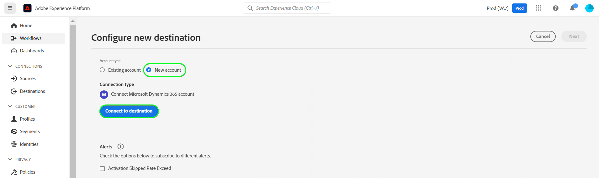

Fill in the required fields below. Refer to the [Gather Dynamics 365 credentials](#gather-credentials) section for any guidance.
* **[!UICONTROL Client ID]**: The [!DNL Dynamics 365] Client ID for your [!DNL Azure Active Directory] application.
* **[!UICONTROL Tenant ID]**: The [!DNL Dynamics 365] Tenant ID for your [!DNL Azure Active Directory] application. 
* **[!UICONTROL Client Secret]**: The [!DNL Dynamics 365] Client Secret for your [!DNL Azure Active Directory] application.
* **[!UICONTROL Environment URL]**: Your [!DNL Dynamics 365] Environment URL.

If the details provided are valid, the UI displays a **[!UICONTROL Connected]** status with a green check mark. You can then proceed to the next step.

### Fill in destination details {#destination-details}

To configure details for the destination, fill in the required and optional fields below. An asterisk next to a field in the UI indicates that the field is required.
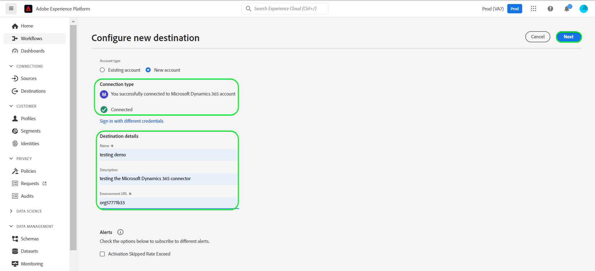

* **[!UICONTROL Name]**: A name by which you will recognize this destination in the future.
* **[!UICONTROL Description]**: A description that will help you identify this destination in the future.

### Enable alerts {#enable-alerts}

You can enable alerts to receive notifications on the status of the dataflow to your destination. Select an alert from the list to subscribe to receive notifications on the status of your dataflow. For more information on alerts, see the guide on [subscribing to destinations alerts using the UI](../../ui/alerts.md).

When you are finished providing details for your destination connection, select **[!UICONTROL Next]**.

## Activate segments to this destination {#activate}

>[!IMPORTANT]
>
>To activate data, you need the **[!UICONTROL Manage Destinations]**, **[!UICONTROL Activate Destinations]**, **[!UICONTROL View Profiles]**, and **[!UICONTROL View Segments]** [access control permissions](/help/access-control/home.md#permissions). Read the [access control overview](/help/access-control/ui/overview.md) or contact your product administrator to obtain the required permissions.

Read [Activate profiles and segments to streaming segment export destinations](/help/destinations/ui/activate-segment-streaming-destinations.md) for instructions on activating audience segments to this destination.

### Mapping considerations and example {#mapping-considerations-example}

To correctly send your audience data from Adobe Experience Platform to the [!DNL Dynamics 365] destination, you need to go through the field mapping step. Mapping consists of creating a link between your Experience Data Model (XDM) schema fields in your Platform account and their corresponding equivalents from the target destination. To correctly map your XDM fields to the [!DNL Dynamics 365] destination fields, follow these steps:

1. In the **[!UICONTROL Mapping]** step, select **[!UICONTROL Add new mapping]**. You will see a new mapping row on the screen.
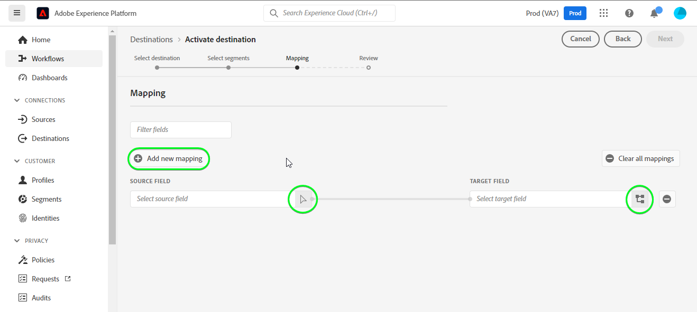

1. In the **[!UICONTROL Select source field]** window, choose the **[!UICONTROL Select identity namespace]** category and select `contactId`.
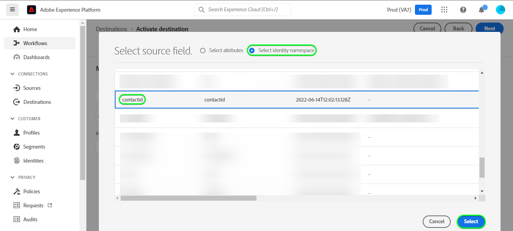

1. In the **[!UICONTROL Select target field]** window, select the type of target field that you want to map your source field to.
    * **[!UICONTROL Select identity namespace]**: select this option to map your source field to an identity namespace from the list.
    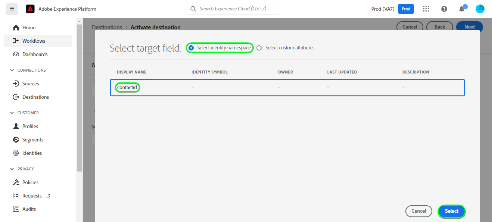

    * Add the following mapping between your XDM profile schema and your [!DNL Dynamics 365] instance:
        |XDM Profile Schema|[!DNL Dynamics 365] Instance| Mandatory|
        |---|---|---|
        |`contactId`|`contactId`| Yes |

    * **[!UICONTROL Select custom attributes]**: select this option to map your source field to a custom attribute that you define in the **[!UICONTROL Attribute name]** field. Refer to [[!DNL Dynamics 365] documentation](https://docs.microsoft.com/en-us/dynamics365/customerengagement/on-premises/developer/entities/contact?view=op-9-1#entity-properties) for a comprehensive list of supported attributes.
    

        >[!IMPORTANT]
        >
        >If you have a date or timestamp source field which is mapped to a [!DNL Dynamics 365] [date or timestamp](https://docs.microsoft.com/en-us/power-apps/developer/data-platform/webapi/reference/timestampdatemapping?view=dataverse-latest) target field, ensure that the mapped value being is not empty. If the value passed is empty you will encounter a *`Bad request reported while pushing events to the destination. Please contact the administrator and try again.`* error message and the data will not be updated. This is a [!DNL Dynamics 365] limitation.

    * For instance, depending on the values you want to update, add the following mapping between your XDM profile schema and your [!DNL Dynamics 365] instance:
        |XDM Profile Schema|[!DNL Dynamics 365] Instance|
        |---|---|
        |`person.name.firstName`|`FirstName`|
        |`person.name.lastName`|`LastName`|
        |`personalEmail.address`|`Email`|

    * An example using these mappings is shown below:
    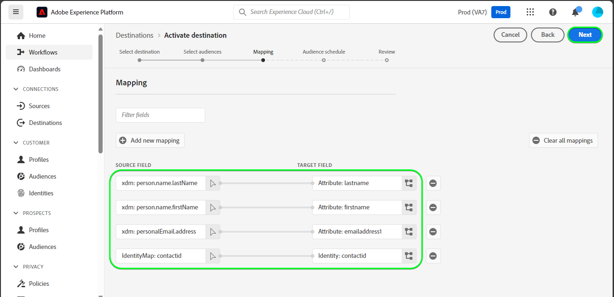

### Schedule segment export and example {#schedule-segment-export-example}

In the [[!UICONTROL Schedule segment export]](/help/destinations/ui/activate-segment-streaming-destinations.md#scheduling) step of the activation workflow, you must manually map Platform segments to the custom field attribute in [!DNL Dynamics 365].

To do this, select each segment, then enter the corresponding custom field attribute from [!DNL Dynamics 365] in the **[!UICONTROL Mapping ID]** field.

>[!IMPORTANT]
>
>The value used for the **[!UICONTROL Mapping ID]** should exactly match the name of the custom field attribute created within [!DNL Dynamics 365]. See [[!DNL Dynamics 365] documentation](https://docs.microsoft.com/en-us/dynamics365/customerengagement/on-premises/customize/create-edit-fields?view=op-9-1) if you need guidance on finding your custom field attributes.

An example is shown below:
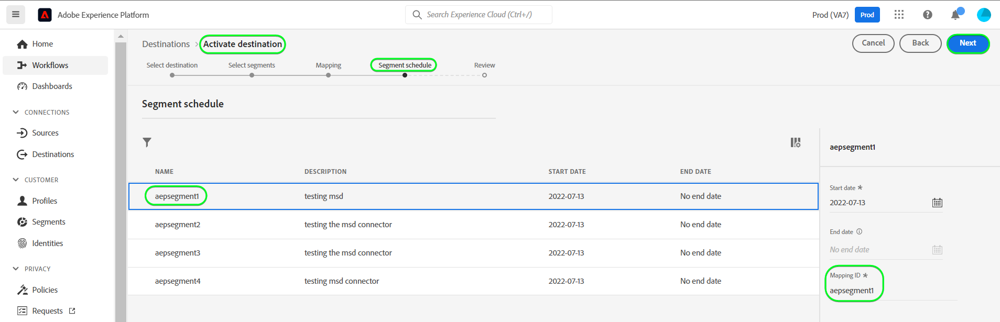

## Validate data export {#exported-data}

To validate that you have correctly set up the destination, follow the steps below:

1. Select **[!UICONTROL Destinations]** > **[!UICONTROL Browse]** to navigate to the list of destinations.
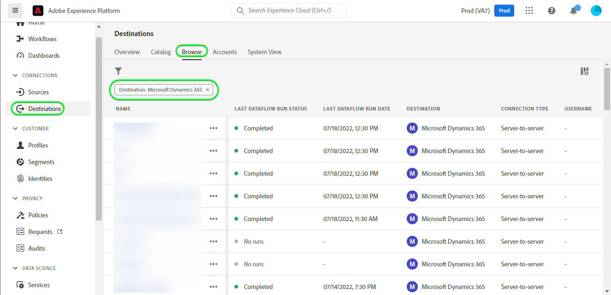

1. Select the destination and validate that the status is **[!UICONTROL enabled]**.
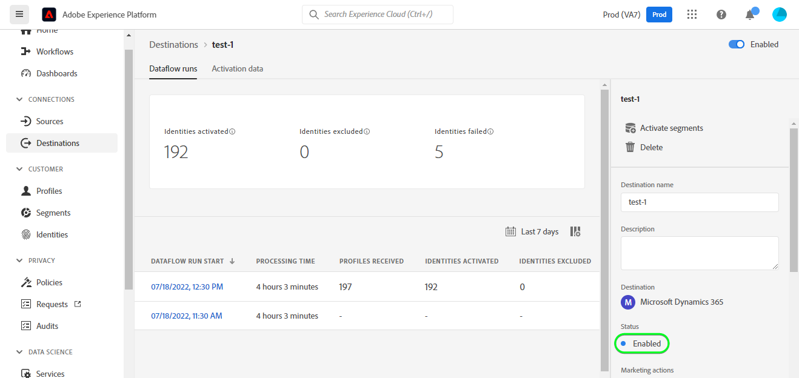

1. Switch to the **[!DNL Activation data]** tab, then select a segment name.
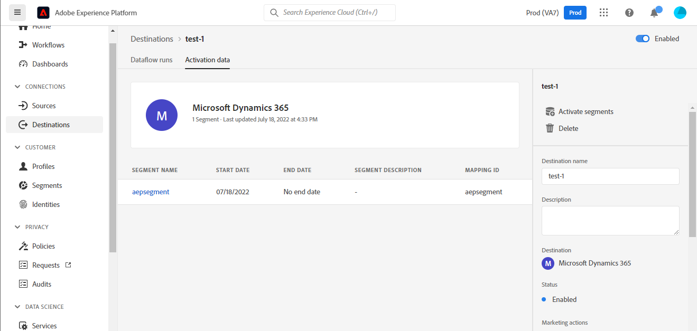

1. Monitor the segment summary and ensure that the count of profiles corresponds to the count created within the segment.
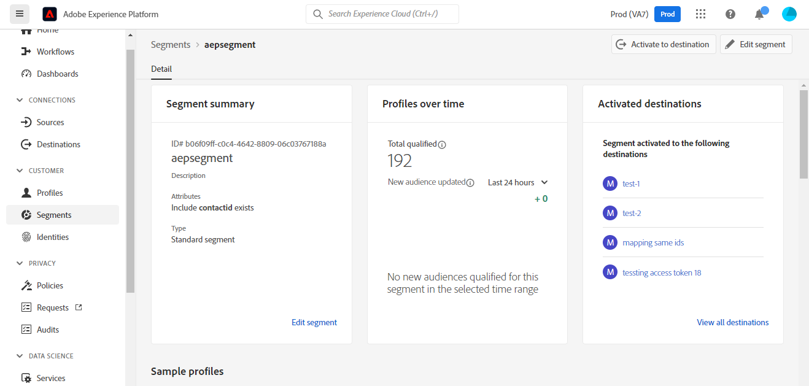

1. Log in to the [!DNL Dynamics 365] website, then navigate to the [!DNL Customers] > [!DNL Contacts] page and check if the profiles from the segment have been added. You can see that each segment status in [!DNL Dynamics 365] was updated with the corresponding segment status from Platform, based on the **[!UICONTROL Mapping ID]** value provided during the [segment scheduling](#schedule-segment-export-example) step.
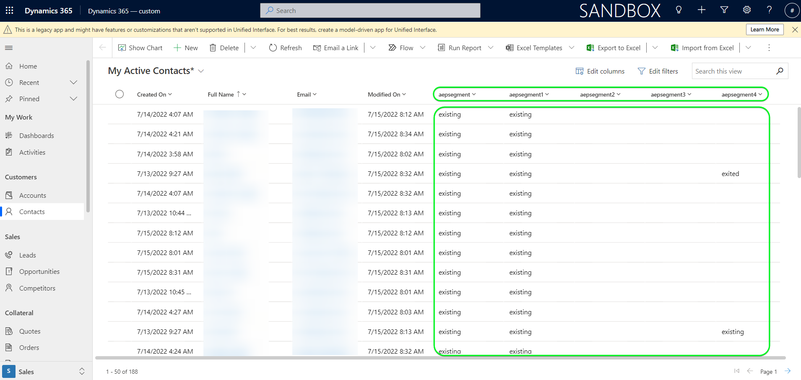

## Data usage and governance {#data-usage-governance}

All [!DNL Adobe Experience Platform] destinations are compliant with data usage policies when handling your data. For detailed information on how [!DNL Adobe Experience Platform] enforces data governance, see the [Data Governance overview](/help/data-governance/home.md).

## Errors and troubleshooting {#errors-and-troubleshooting}

### Unknown errors encountered while pushing events to destination {#unknown-errors}

When checking a dataflow run, if you obtain the following error message: `Bad request reported while pushing events to the destination. Please contact the administrator and try again.`

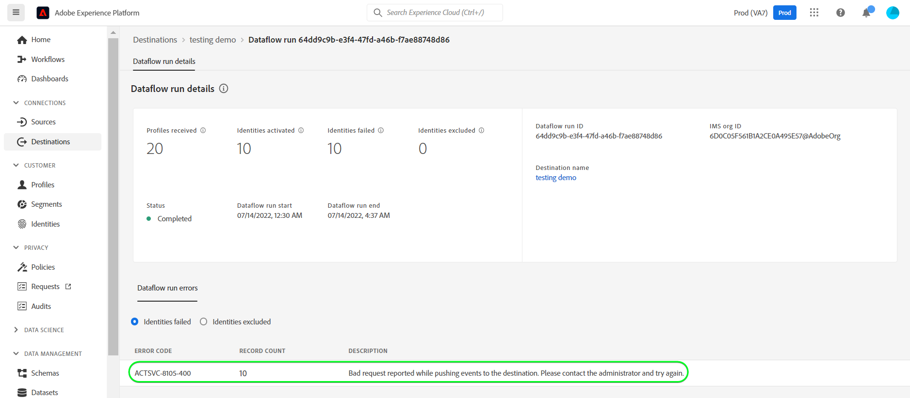

To fix this error, verify that the **[!UICONTROL Mapping ID]** you provided in [!DNL Dynamics 365] for your Platform segment is valid and exists within [!DNL Dynamics 365].

## Additional resources {#additional-resources}

Additional useful information from the [[!DNL Dynamics 365] documentation](https://docs.microsoft.com/en-us/dynamics365/) is below:
* [IOrganizationService.Update(Entity) Method](https://docs.microsoft.com/en-us/dotnet/api/microsoft.xrm.sdk.iorganizationservice.update?view=dataverse-sdk-latest)
* [Update and delete table rows using the Web API](https://docs.microsoft.com/en-us/power-apps/developer/data-platform/webapi/update-delete-entities-using-web-api#basic-update)
