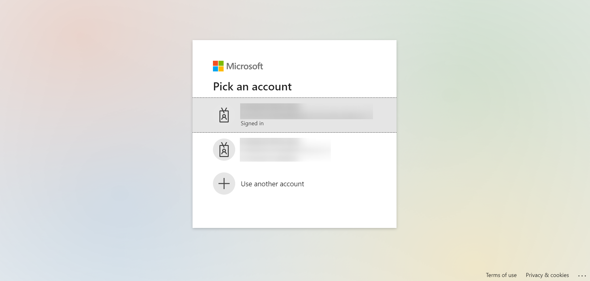
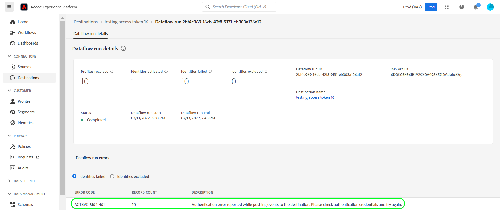

# [!DNL Microsoft Dynamics 365] connection

## Overview {#overview}

[Microsoft Dynamics 365](https://dynamics.microsoft.com/en-us/) is a cloud-based business application platform that combines Enterprise Resource Planning (ERP) and Customer Relationship Management (CRM) along with productivity applications and AI tools, to bring end-to-end smoother and more controlled operations, better growth potential and reduced costs.

This [!DNL Adobe Experience Platform] [destination](/help/destinations/home.md) leverages the [Contact Entity Reference API](https://docs.microsoft.com/en-us/dynamics365/customerengagement/on-premises/developer/entities/contact?view=op-9-1), which allows you to update identities within a segment into Dynamics 365.

Dynamics 365 uses OAuth 2 with Authorization Grant as the authentication mechanism to communicate with the Contact Entity Reference API. Instructions to authenticate to your Dynamics 365 instance are further below, in the [Authenticate to destination](#authenticate) section.

## Use cases {#use-cases}

As a marketer, you can deliver personalized experiences to your users, based on attributes from their Adobe Experience Platform profiles. You can build segments from your offline data and send these segments to Dynamics 365, to display in the users’ feeds as soon as segments and profiles are updated in Adobe Experience Platform.

## Prerequisites {#prerequisites}

### Prerequisites in Experience Platform {#prerequisites-in-experience-platform}

Before activating data to the Microsoft Dynamics 365 destination, you must have a [schema](https://experienceleague.adobe.com/docs/experience-platform/xdm/schema/composition.html), a [dataset](https://experienceleague.adobe.com/docs/platform-learn/tutorials/data-ingestion/create-datasets-and-ingest-data.html?lang=en), and [segments](https://experienceleague.adobe.com/docs/platform-learn/tutorials/segments/create-segments.html?lang=en) created in [!DNL Experience Platform].

### Prerequisites in Microsoft Dynamics 365 {#prerequisites-destination}

Note the following prerequisites in Microsoft Dynamics 365, in order to export data from Platform to your Dynamics 365 account:

#### You need to have a Microsoft Dynamics 365 account {#prerequisites-account}

Go to the Dynamics 365 [trial](https://dynamics.microsoft.com/en-us/dynamics-365-free-trial/) page to register and create an account, if you do not have one already.

#### Create field within Dynamics 365 {#prerequisites-custom-field}

Create the custom field of type `Simple` with field data type as `Single Line of Text` which Experience Platform will use to update the segment status within Dynamics 365.
Refer to the Dynamics 365 documentation to [create a field (attribute)](https://docs.microsoft.com/en-us/dynamics365/customerengagement/on-premises/customize/create-edit-fields?view=op-9-1) if you need additional guidance.

An example setup within Dynamics 365 is shown below:

Refer to Adobe's documentation for [Segment Membership Details schema field group](https://experienceleague.adobe.com/docs/experience-platform/xdm/field-groups/profile/segmentation.html?lang=en) if you need guidance on segment statuses.

#### Gather Dynamics 365 credentials {#gather-credentials}

Note down the items below before you authenticate to the Microsoft Dynamics 365 CRM destination:

| Credential | Description | Example |
| --- | --- | --- |
| Username | Your Dynamics 365 account username | - |
| Password | Your Dynamics 365 account password | - |
| Environment URL | See [Dynamics 365 documentation](https://docs.microsoft.com/en-us/dynamics365/customerengagement/on-premises/developer/org-service/discover-url-organization-organization-service?view=op-9-1) for additional guidance. | *org57771b33.crm.dynamics.com* |

## Supported identities {#supported-identities}

Microsoft Dynamics 365 supports update of identities described in the table below. Learn more about [identities](/help/identity-service/namespaces.md).

|Target Identity|Description|Considerations|
|---|---|---|
| contactId |Custom Microsoft Dynamics 365 identifier that supports mapping of any identity.|Mandatory. You can send any [identity](../../../identity-service/namespaces.md) to the [!DNL Microsoft Dynamics 365] destination, as long as you map it to the `contactId`. |

## Export type and frequency {#export-type-frequency}

Refer to the table below for information about the destination export type and frequency.

| Item | Type | Notes |
---------|----------|---------|
| Export type | **[!UICONTROL Profile-based]** | <ul><li>You are exporting all members of a segment, together with the desired schema fields *(for example: email address, phone number, last name)*, according to your field mapping.</li><li> Platform segment statuses are exported to [!DNL Dynamics 365] by specifying their corresponding custom field attribute in [!DNL Dynamics 365], within the **[!UICONTROL Activate Destination]** > **[!UICONTROL Schedule segment export]** > **[!UICONTROL Mapping ID]** field.</li></ul> |
| Export frequency | **[!UICONTROL Streaming]** | <ul><li>Streaming destinations are "always on" API-based connections. As soon as a profile is updated in Experience Platform based on segment evaluation, the connector sends the update downstream to the destination platform. Read more about [streaming destinations](/help/destinations/destination-types.md#streaming-destinations).</li></ul>|

{style="table-layout:auto"}

## Connect to the destination {#connect}

> [!IMPORTANT]
> 
> To connect to the destination, you need the **[!UICONTROL Manage Destinations]** [access control permission](/help/access-control/home.md#permissions). Read the [access control overview](/help/access-control/ui/overview.md) or contact your product administrator to obtain the required permissions.

To connect to this destination, follow the steps described in the [destination configuration tutorial](../../ui/connect-destination.md). In the configure destination workflow, fill in the fields listed in the two sections below.

### Authenticate to destination {#authenticate}

To authenticate to the destination, select **[!UICONTROL Connect to destination]**.

You will be shown the Dynamics 365 login page. Select your account if you are already signed-in or login with your credentials.

*  **[!UICONTROL Password]**: Your Dynamics 365 account password.
*  **[!UICONTROL Username]**: Your Dynamics 365 account username.

If the details provided are valid, the UI displays a **Connected** status with a green check mark, you can then proceed to the next step.

### Fill in destination details {#destination-details}

To configure details for the destination, fill in the required and optional fields below. An asterisk next to a field in the UI indicates that the field is required.

*  **[!UICONTROL Name]**: A name by which you will recognize this destination in the future.
*  **[!UICONTROL Description]**: A description that will help you identify this destination in the future.
*  **[!UICONTROL Environment URL]**: Your Dynamics 365 Environment URL.

### Enable alerts {#enable-alerts}

You can enable alerts to receive notifications on the status of the dataflow to your destination. Select an alert from the list to subscribe to receive notifications on the status of your dataflow. For more information on alerts, see the guide on [subscribing to destinations alerts using the UI](../../ui/alerts.md).

When you are finished providing details for your destination connection, select **[!UICONTROL Next]**.

## Activate segments to this destination {#activate}

> [!IMPORTANT]
> 
> To activate data, you need the **[!UICONTROL Manage Destinations]**, **[!UICONTROL Activate Destinations]**, **[!UICONTROL View Profiles]**, and **[!UICONTROL View Segments]** [access control permissions](/help/access-control/home.md#permissions). Read the [access control overview](/help/access-control/ui/overview.md) or contact your product administrator to obtain the required permissions.

Read [Activate profiles and segments to streaming segment export destinations](../../ui/activate/activate-segment-streaming-destinations.md) for instructions on activating audience segments to this destination.

### Mapping considerations and example {#mapping-considerations-example}

To correctly send your audience data from Adobe Experience Platform to the Microsoft Dynamics 365 destination, you need to go through the field mapping step. Mapping consists of creating a link between your Experience Data Model (XDM) schema fields in your Platform account and their corresponding equivalents from the target destination. To correctly map your XDM fields to the Microsoft Dynamics 365 destination fields, follow these steps:

1. In the Mapping step, click **[!UICONTROL Add new mapping]**, you will see a new mapping row on the screen.

1. In the select source field window, when selecting the source field choose the **[!UICONTROL Select identity namespace]** category and add the mappings desired.

1. In the select target field window, select the target field and choose the **[!UICONTROL Select identity namespace]** category and add the mappings desired.

1. For custom attributes, in the select target field window, select the target field and choose the **[!UICONTROL Select custom attributes]** category, Next provide the desired target attribute name and add the mappings desired.

1. For instance, you could add the following mapping between your XDM profile schema and your [!DNL Dynamics 365] instance:

    ||XDM Profile Schema|[!DNL Dynamics 365] Instance| Mandatory|
    |---|---|---|---|
    |Attributes|<ul><li><code>person.name.firstName</code></li><li><code>person.name.lastName</code></li><li><code>personalEmail.address</code></li></ul>|<ul><li><code>FirstName</code></li><li><code>LastName</code></li><li><code>Email</code></li></ul>|
    |Identities|<ul><li><code>contactId</code></li></ul>|<ul><li><code>contactId</code></li></ul>|Yes|

1. An example using these mappings is shown below:

> [!NOTE]
>
> When mapping to a Dynamics 365 [date or timestamp](https://docs.microsoft.com/en-us/power-apps/developer/data-platform/webapi/reference/timestampdatemapping?view=dataverse-latest), the corresponding attribute value in the dataset should not be empty else during execution, else you will encounter [errors](#unknown-errors).

### Schedule segment export and example {#schedule-segment-export-example}

When performing the [Schedule segment export](../../ui/activate/activate-segment-streaming-destinations.html?lang=en#scheduling) step you must manually map Platform segments to the custom field attribute in Dynamics 365.

To do this, select each segment, then enter the corresponding custom field attribute from Dynamics 365 in the **[!UICONTROL Mapping ID]** field.

> [!IMPORTANT]
>
> The value used for the Mapping ID should exactly match the name of the custom field attribute created within Dynamics 365.

An example is shown below:

## Validate data export {#exported-data}

To validate that you have correctly set up the destination, follow the steps below:

1. Select **[!UICONTROL Destinations]** > **[!UICONTROL Browse]** to navigate to the list of destinations.

1. Select the destination and validate that the status is **[!UICONTROL enabled]**.

1. Switch to the **[!DNL Activation data]** tab, then select a segment name.

1. Monitor the segment summary and ensure that the count of profiles corresponds to the count created within the segment.

1. Login to the Dynamics 365 website, then navigate to the **[!DNL Apps]** > **[!DNL Contacts]** page and check if the profiles from the segment have been added. You will also notice the segment status from Experience Platform has been updated against the corresponding custom field attribute that was provided in the **Mapping ID** field during the **[!UICONTROL Activate destination]** > **[!UICONTROL Schedule segment export]** step.

## Data usage and governance {#data-usage-governance}

All [!DNL Adobe Experience Platform] destinations are compliant with data usage policies when handling your data. For detailed information on how [!DNL Adobe Experience Platform] enforces data governance, see the [Data Governance overview](/help/data-governance/home.md).

## Errors and troubleshooting {#errors-and-troubleshooting}

### Authentication errors encountered while pushing events to destination {#auth-errors}
During execution the Dynamics 365 access token might become invalid, in such scenarios you will obtain the error message below, To resolve re-authenticate and reattempt the execution.

### Unknown errors encountered while pushing events to destination {#unknown-errors}
When checking a dataflow run, if you see the error message below, verify that the Mapping ID that you provided in [!DNL Dynamics 365] for your Platform segment is valid and exists within [!DNL Dynamics 365].

## Additional resources {#additional-resources}

Additional useful information from the [Dynamics 365 documentation](https://docs.microsoft.com/en-us/dynamics365/) is below:
* [IOrganizationService.Update(Entity) Method](https://docs.microsoft.com/en-us/dotnet/api/microsoft.xrm.sdk.iorganizationservice.update?view=dataverse-sdk-latest)
* [Update and delete table rows using the Web API](https://docs.microsoft.com/en-us/power-apps/developer/data-platform/webapi/update-delete-entities-using-web-api#basic-update])