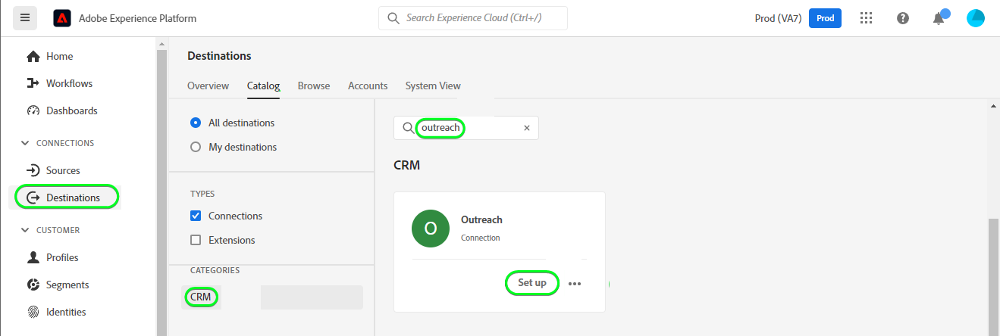

# [!DNL Outreach] connection

## Overview {#overview}

[Outreach](https://www.outreach.io/) is a Sales Execution Platform with the most B2B buyer-seller interaction data in the world and significant investments in proprietary AI technologies to translate sales data into intelligence, Outreach helps revenue organizations automate sales engagement and act on revenue intelligence to improve their efficiency, predictability, and growth.

This [!DNL Adobe Experience Platform] [destination](/help/destinations/home.md) leverages the [Outreach Update Resource API](https://api.outreach.io/api/v2/docs#update-an-existing-resource), which allows you to update identities within a segment corresponding to prospects in Outreach.

Outreach uses OAuth 2 with Authorization Grant as the authentication mechanism to communicate with the Outreach Update Resource API. Instructions to authenticate to your Outreach instance are further below, in the [Authenticate to destination](#authenticate) section.

## Use cases {#use-cases}

As a marketer, you can deliver personalized experiences to your prospects, based on attributes from their Adobe Experience Platform profiles. You can build segments from your offline data and send these segments to Outreach, to display in the prospects’ feeds as soon as segments and profiles are updated in Adobe Experience Platform.

## Prerequisites {#prerequisites}

### Prerequisites in Experience Platform {#prerequisites-in-experience-platform}

Before activating data to the Outreach destination, you must have a [schema](https://experienceleague.adobe.com/docs/experience-platform/xdm/schema/composition.html), a [dataset](https://experienceleague.adobe.com/docs/platform-learn/tutorials/data-ingestion/create-datasets-and-ingest-data.html?lang=en), and [segments](https://experienceleague.adobe.com/docs/platform-learn/tutorials/segments/create-segments.html?lang=en) created in [!DNL Experience Platform].

### Prerequisites in Outreach {#prerequisites-destination}

Note the following prerequisites in Outreach, in order to export data from Platform to your Outreach account:

#### You need to have an Outreach account {#prerequisites-account}

Go to the Outreach [sign in](https://accounts.outreach.io/users/sign_in) page to register and create an account, if you do not have one already. Also see support [page](https://support.outreach.io/hc/en-us/articles/207238607-Claim-Your-Outreach-Account).

Refer to Adobe's documentation for [Segment Membership Details schema field group](https://experienceleague.adobe.com/docs/experience-platform/xdm/field-groups/profile/segmentation.html?lang=en) if you need guidance on segment statuses.

#### Gather Outreach credentials {#gather-credentials}

Note down the items below before you authenticate to the Outreach CRM destination:

| Credential | Description |
| --- | --- | --- |
| Email | Your Outreach account email |
| Password | Your Outreach account password |

#### Setup custom field labels

Outreach supports custom fields for [prospects](https://support.outreach.io/hc/en-us/articles/360001557554-Outreach-Prospect-Profile-Overview). Refer to [How To add a custom field in Outreach](https://support.outreach.io/hc/en-us/articles/219124908-How-To-Add-a-Custom-Field-in-Outreach) for additional guidance. For ease of identification it is recommended to manually update the label's to their corresponding segment names instead of keeping the defaults. For example as below:

Outreach settings page for prospects displaying custom fields.

Outreach settings page for prospects displaying custom fields with *user-friendly* labels matching to the segment names. You can view the segment status on the prospect page against these labels.

> [!NOTE]
>
> When updating prospects the label names are not used they are for ease of identification only.

## Supported identities {#supported-identities}

Outreach supports update of identities described in the table below. Learn more about [identities](/help/identity-service/namespaces.md).

|Target Identity|Description|Considerations|
|---|---|---|
| OutreachId |Custom Outreach identifier that supports mapping of any identity.|Mandatory. You can send any [identity](../../../identity-service/namespaces.md) to the [!DNL Outreach] destination, as long as you map it to the `OutreachId`. |

## Export type and frequency {#export-type-frequency}

Refer to the table below for information about the destination export type and frequency.

| Item | Type | Notes |
---------|----------|---------|
| Export type | **[!UICONTROL Profile-based]** | <ul><li>You are exporting all members of a segment, together with the desired schema fields *(for example: email address, phone number, last name)*, according to your field mapping.</li><li> Platform segment statuses are exported to [!DNL Outreach] by specifying their corresponding custom field attribute in [!DNL Outreach], within the **[!UICONTROL Activate Destination]** > **[!UICONTROL Schedule segment export]** > **[!UICONTROL Mapping ID]** field.</li></ul> |
| Export frequency | **[!UICONTROL Streaming]** | <ul><li>Streaming destinations are "always on" API-based connections. As soon as a profile is updated in Experience Platform based on segment evaluation, the connector sends the update downstream to the destination platform. Read more about [streaming destinations](/help/destinations/destination-types.md#streaming-destinations).</li></ul>|

{style="table-layout:auto"}

## Connect to the destination {#connect}

> [!IMPORTANT]
> 
> To connect to the destination, you need the **[!UICONTROL Manage Destinations]** [access control permission](/help/access-control/home.md#permissions). Read the [access control overview](/help/access-control/ui/overview.md) or contact your product administrator to obtain the required permissions.

To connect to this destination, follow the steps described in the [destination configuration tutorial](../../ui/connect-destination.md). In the configure destination workflow, fill in the fields listed in the two sections below.

### Authenticate to destination {#authenticate}

To authenticate to the destination, select **[!UICONTROL Connect to destination]**.

You will be shown the Outreach login page. Provide your email.

Next provide your password.

*  **[!UICONTROL Username]**: Your Outreach account email.
*  **[!UICONTROL Password]**: Your Outreach account password.

If the details provided are valid, the UI displays a **Connected** status with a green check mark, you can then proceed to the next step.

### Fill in destination details {#destination-details}

To configure details for the destination, fill in the required and optional fields below. An asterisk next to a field in the UI indicates that the field is required.

*  **[!UICONTROL Name]**: A name by which you will recognize this destination in the future.
*  **[!UICONTROL Description]**: A description that will help you identify this destination in the future.

### Enable alerts {#enable-alerts}

You can enable alerts to receive notifications on the status of the dataflow to your destination. Select an alert from the list to subscribe to receive notifications on the status of your dataflow. For more information on alerts, see the guide on [subscribing to destinations alerts using the UI](../../ui/alerts.md).

When you are finished providing details for your destination connection, select **[!UICONTROL Next]**.

## Activate segments to this destination {#activate}

> [!IMPORTANT]
> 
> To activate data, you need the **[!UICONTROL Manage Destinations]**, **[!UICONTROL Activate Destinations]**, **[!UICONTROL View Profiles]**, and **[!UICONTROL View Segments]** [access control permissions](/help/access-control/home.md#permissions). Read the [access control overview](/help/access-control/ui/overview.md) or contact your product administrator to obtain the required permissions.

Read [Activate profiles and segments to streaming segment export destinations](../../ui/activate/activate-segment-streaming-destinations.md) for instructions on activating audience segments to this destination.

### Mapping considerations and example {#mapping-considerations-example}

To correctly send your audience data from Adobe Experience Platform to the Outreach destination, you need to go through the field mapping step. Mapping consists of creating a link between your Experience Data Model (XDM) schema fields in your Platform account and their corresponding equivalents from the target destination. To correctly map your XDM fields to the Outreach destination fields, follow these steps:

1. In the Mapping step, click **[!UICONTROL Add new mapping]**, you will see a new mapping row on the screen.

1. In the select source field window, when selecting the source field choose the **[!UICONTROL Select identity namespace]** category and add the mappings desired.

1. In the select target field window, select the target field and choose the **[!UICONTROL Select identity namespace]** category and add the mappings desired.

1. For custom attributes, in the select target field window, select the target field and choose the **[!UICONTROL Select custom attributes]** category, Next provide the desired target attribute name and add the mappings desired.

1. For instance, you could add the following mapping between your XDM profile schema and your [!DNL Outreach] instance:

    ||XDM Profile Schema|[!DNL Outreach] Instance| Mandatory|
    |---|---|---|---|
    |Attributes|<ul><li><code>person.name.firstName</code></li><li><code>person.name.lastName</code></li></ul>|<ul><li><code>firstName</code></li><li><code>lastName</code></li></ul>|
    |Identities|<ul><li><code>Oid</code></li></ul>|<ul><li><code>OutreachId</code></li></ul>|Yes|

1. An example using these mappings is shown below:

Refer to [Outreach prospect documentation](https://api.outreach.io/api/v2/docs#prospect) for a comprehensive list of supported attributes.

### Schedule segment export and example {#schedule-segment-export-example}

When performing the [Schedule segment export](../../ui/activate/activate-segment-streaming-destinations.html?lang=en#scheduling) step you must manually map Platform segments to the custom field attribute in Outreach.

To do this, select each segment, then enter the corresponding numeric value which corresponds to the *custom`N`* attribute from Outreach in the **[!UICONTROL Mapping ID]** field.

> [!IMPORTANT]
>
> The numeric value *(`N`)* used within the Mapping ID should match the custom attribute key suffixed with the numeric value i.e. *custom`N`* within Outreach. A maximum of custom1 ... custom150 fields are supported within Outreach. Refer to [Outreach prospect documentation](https://api.outreach.io/api/v2/docs#prospect) for details.

An example is shown below:

## Validate data export {#exported-data}

To validate that you have correctly set up the destination, follow the steps below:

1. Select **[!UICONTROL Destinations]** > **[!UICONTROL Browse]** to navigate to the list of destinations.

1. Select the destination and validate that the status is **[!UICONTROL enabled]**.

1. Switch to the **[!DNL Activation data]** tab, then select a segment name.

1. Monitor the segment summary and ensure that the count of profiles corresponds to the count created within the segment.

1. Login to the Outreach website, then navigate to the **[!DNL Apps]** > **[!DNL Contacts]** page and check if the profiles from the segment have been added. You will also notice the segment status from Experience Platform has been updated against the corresponding custom field attribute *(identified through the friendly label name)* that was provided in the **Mapping ID** field during the **[!UICONTROL Activate destination]** > **[!UICONTROL Schedule segment export]** step.

## Data usage and governance {#data-usage-governance}

All [!DNL Adobe Experience Platform] destinations are compliant with data usage policies when handling your data. For detailed information on how [!DNL Adobe Experience Platform] enforces data governance, see the [Data Governance overview](/help/data-governance/home.md).

## Errors and troubleshooting {#errors-and-troubleshooting}

### Unknown errors encountered while pushing events to destination {#unknown-errors}
When checking a dataflow run, if you see the error message below, verify that the Mapping ID that you have used is valid within [!DNL Outreach] for your Platform segment.

## Additional resources {#additional-resources}

The [Outreach documentation](https://api.outreach.io/api/v2/docs/) has details on [Error Responses](https://api.outreach.io/api/v2/docs#error-responses) which you can use to debug any issues.

### Limits

The Outreach API is rate-limited on a per-user basis, with a fixed limit of 10,000 requests per one-hour period. If you encounter this limit you will encounter a `429` response with a message similar to *`You have exceeded your permitted rate limit of 10,000; please try again at 2017-01-01T00:00:00.`*

Refer to the [Outreach documentation](https://api.outreach.io/api/v2/docs#:~:text=%3A00%22%20%7D%5D%20%7D-,Rate%20Limiting,requests%20per%20one%2Dhour%20period1) for additional details.
