# [!DNL Outreach] connection

## Overview {#overview}

[[!DNL Outreach]](https://www.outreach.io/) is a Sales Execution Platform with the most B2B buyer-seller interaction data in the world and significant investments in proprietary AI technologies to translate sales data into intelligence. [!DNL Outreach] helps organizations automate sales engagement and act on revenue intelligence to improve their efficiency, predictability, and growth.

This [!DNL Adobe Experience Platform] [destination](/help/destinations/home.md) leverages the [Outreach Update Resource API](https://api.outreach.io/api/v2/docs#update-an-existing-resource), which allows you to update identities within a segment corresponding to prospects in [!DNL Outreach].

[!DNL Outreach] uses OAuth 2 with Authorization Grant as the authentication mechanism to communicate with the [!DNL Outreach] [!DNL Update Resource API]. Instructions to authenticate to your [!DNL Outreach] instance are further below, within [Authenticate to destination](#authenticate) section.

## Use cases {#use-cases}

As a marketer, you can deliver personalized experiences to your prospects, based on attributes from their Adobe Experience Platform profiles. You can build segments from your offline data and send these segments to [!DNL Outreach], to display in the prospects’ feeds as soon as segments and profiles are updated in Adobe Experience Platform.

## Prerequisites {#prerequisites}

### Experience Platform prerequisites {#prerequisites-in-experience-platform}

Before activating data to the [!DNL Outreach] destination, you must have a [schema](/help/xdm/schema/composition.md), a [dataset](https://experienceleague.adobe.com/docs/platform-learn/tutorials/data-ingestion/create-datasets-and-ingest-data.html?lang=en), and [segments](https://experienceleague.adobe.com/docs/platform-learn/tutorials/segments/create-segments.html?lang=en) created in [!DNL Experience Platform].

Refer to Adobe's documentation for [Segment Membership Details schema field group](/help/xdm/field-groups/profile/segmentation.md) if you need guidance on segment statuses.

### Outreach prerequisites {#prerequisites-destination}

Note the following prerequisites in [!DNL Outreach], in order to export data from Platform to your [!DNL Outreach] account:

#### You need to have an Outreach account {#prerequisites-account}

Go to the [!DNL Outreach] [sign in](https://accounts.outreach.io/users/sign_in) page to register and create an account, if you do not have one already. Also see the [!DNL Outreach] support [page](https://support.outreach.io/hc/en-us/articles/207238607-Claim-Your-Outreach-Account) for more details.

Note down the items below before you authenticate to the [!DNL Outreach] CRM destination:

| Credential | Description |
|---|---|
| Email | Your [!DNL Outreach] account email |
| Password | Your [!DNL Outreach] account password |

#### Set up custom field labels {#prerequisites-custom-fields}

[!DNL Outreach] supports custom fields for [prospects](https://support.outreach.io/hc/en-us/articles/360001557554-Outreach-Prospect-Profile-Overview). Refer to [How To add a custom field in Outreach](https://support.outreach.io/hc/en-us/articles/219124908-How-To-Add-a-Custom-Field-in-Outreach) for additional guidance. For ease of identification it is recommended to manually update the labels to their corresponding segment names instead of keeping the defaults. For example as below:

[!DNL Outreach] settings page for prospects displaying custom fields.
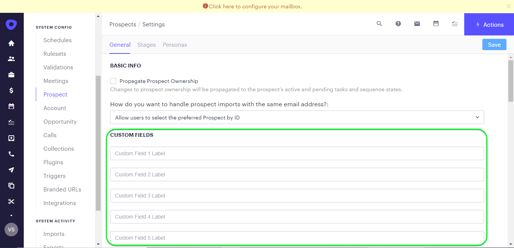

[!DNL Outreach] settings page for prospects displaying custom fields with *user-friendly* labels matching to the segment names. You can view the segment status on the prospect page against these labels.
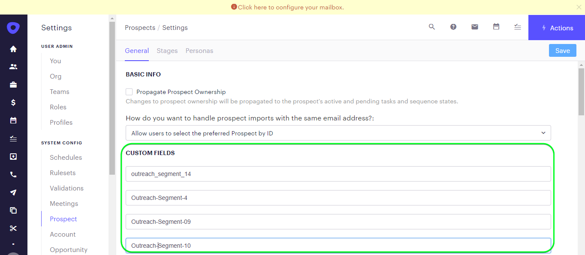

>[!NOTE]
>
> Label names are for ease of identification only. They are not used when updating prospects.

## Guardrails

The [!DNL Outreach] API has a rate limit of 10,000 requests per hour per user. If you reach this limit you will receive a `429` response with the following message: `You have exceeded your permitted rate limit of 10,000; please try again at 2017-01-01T00:00:00.`.

If you received this message, you must update your segment export schedule to conform to the rate threshold.

Refer to the [[!DNL Outreach] documentation](https://api.outreach.io/api/v2/docs#rate-limiting) for additional details.

## Supported identities {#supported-identities}

[!DNL Outreach] supports update of identities described in the table below. Learn more about [identities](/help/identity-service/namespaces.md).

|Target identity|Description|Considerations|
|---|---|---|
| `OutreachId` | <ul><li>[!DNL Outreach] identifier. This is a numeric value corresponding to the prospect profile.</li><li>The ID must match the ID within the [!DNL Outreach] URL for the prospect being updated.</li><li>Refer to the [[!DNL Outreach] documentation](https://api.outreach.io/api/v2/docs#update-an-existing-resource) for further details.</li></ul>|Mandatory |

## Export type and frequency {#export-type-frequency}

Refer to the table below for information about the destination export type and frequency.

| Item | Type | Notes |
---------|----------|---------|
| Export type | **[!UICONTROL Profile-based]** | <ul><li> You are exporting all members of a segment, together with the desired schema fields *(for example: email address, phone number, last name)*, according to your field mapping.</li><li> Each segment status in [!DNL Outreach] gets updated with the corresponding segment status from Platform, based on the [!UICONTROL Mapping ID] value provided during the [segment scheduling](#schedule-segment-export-example) step.</li></ul> |
| Export frequency | **[!UICONTROL Streaming]** | <ul><li> Streaming destinations are "always on" API-based connections. As soon as a profile is updated in Experience Platform based on segment evaluation, the connector sends the update downstream to the destination platform. Read more about [streaming destinations](/help/destinations/destination-types.md#streaming-destinations).</li></ul>|

{style="table-layout:auto"}

## Connect to the destination {#connect}

>[!IMPORTANT]
> 
> To connect to the destination, you need the **[!UICONTROL Manage Destinations]** [access control permission](/help/access-control/home.md#permissions). Read the [access control overview](/help/access-control/ui/overview.md) or contact your product administrator to obtain the required permissions.

To connect to this destination, follow the steps described in the [destination configuration tutorial](../../ui/connect-destination.md). In the configure destination workflow, fill in the fields listed in the two sections below.

Within **[!UICONTROL Destinations]** > **[!UICONTROL Catalog]** search for [!DNL Outreach]. Alternatively you can locate it under the CRM category.

### Authenticate to destination {#authenticate}

To authenticate to the destination, select **[!UICONTROL Connect to destination]**.

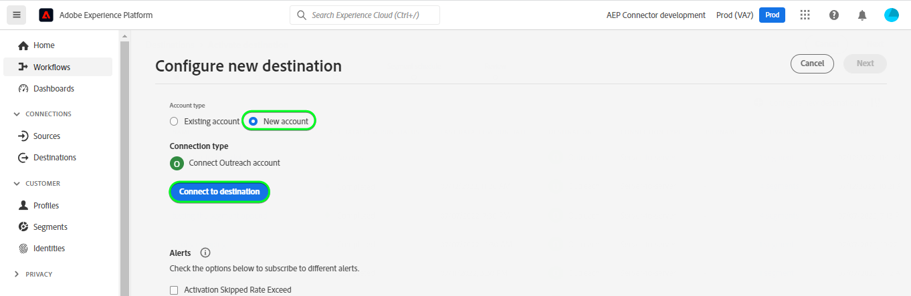

You will be shown the [!DNL Outreach] login page. Provide your email.

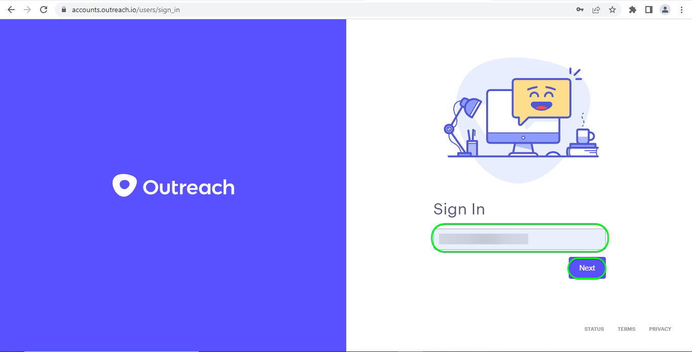

Next provide your password.

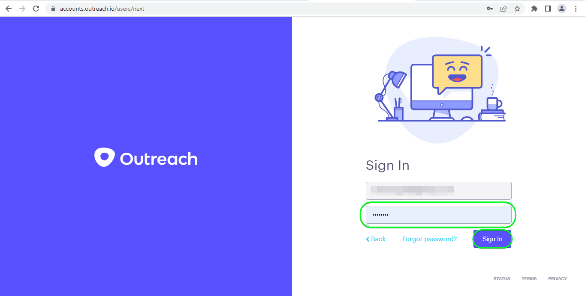

*  **[!UICONTROL Username]**: Your [!DNL Outreach] account email.
*  **[!UICONTROL Password]**: Your [!DNL Outreach] account password.

If the details provided are valid, the UI displays a **Connected** status with a green check mark. You can then proceed to the next step.

### Fill in destination details {#destination-details}

To configure details for the destination, fill in the required and optional fields below. An asterisk next to a field in the UI indicates that the field is required.

*  **[!UICONTROL Name]**: A name by which you will recognize this destination in the future.
*  **[!UICONTROL Description]**: A description that will help you identify this destination in the future.

### Enable alerts {#enable-alerts}

You can enable alerts to receive notifications on the status of the dataflow to your destination. Select an alert from the list to subscribe to receive notifications on the status of your dataflow. For more information on alerts, see the guide on [subscribing to destinations alerts using the UI](../../ui/alerts.md).

When you are finished providing details for your destination connection, select **[!UICONTROL Next]**.

## Activate segments to this destination {#activate}

>[!IMPORTANT]
> 
> To activate data, you need the **[!UICONTROL Manage Destinations]**, **[!UICONTROL Activate Destinations]**, **[!UICONTROL View Profiles]**, and **[!UICONTROL View Segments]** [access control permissions](/help/access-control/home.md#permissions). Read the [access control overview](/help/access-control/ui/overview.md) or contact your product administrator to obtain the required permissions.

Read [Activate profiles and segments to streaming segment export destinations](../../ui/activate-segment-streaming-destinations.md) for instructions on activating audience segments to this destination.

### Mapping considerations and example {#mapping-considerations-example}

To correctly send your audience data from Adobe Experience Platform to the [!DNL Outreach] destination, you need to go through the field mapping step. Mapping consists of creating a link between your Experience Data Model (XDM) schema fields in your Platform account and their corresponding equivalents from the target destination. To correctly map your XDM fields to the [!DNL Outreach] destination fields, follow these steps:

1. In the [!UICONTROL Mapping] step, click **[!UICONTROL Add new mapping]**. You will see a new mapping row on the screen.

1. In the [!UICONTROL Select source field] window, choose the **[!UICONTROL Select identity namespace]** category and add the desired mappings.
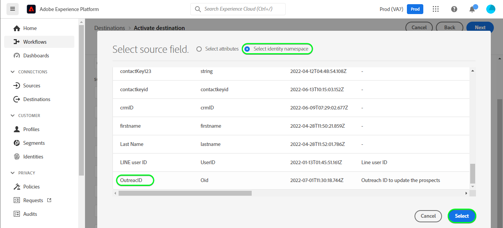

1. In the [!UICONTROL Select target field] window, select the type of target field that you want to map your source field to.
    * **[!UICONTROL Select identity namespace]**: select this option to map your source field to an identity namespace from the list.
    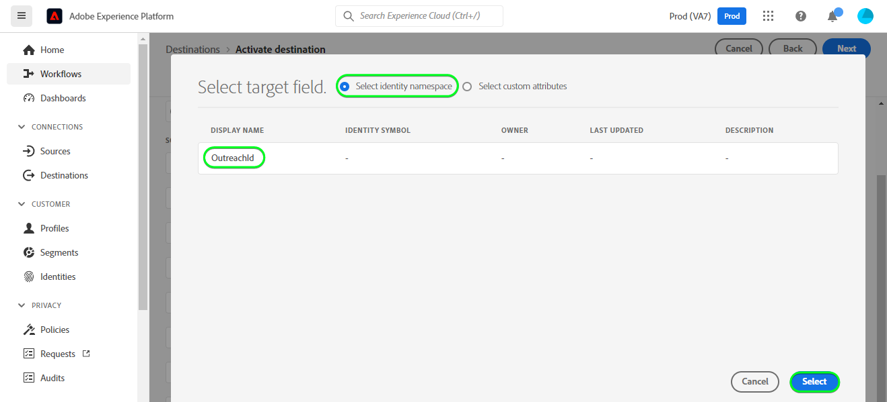

    * Add the following mapping between your XDM profile schema and your [!DNL Outreach] instance:
        |XDM Profile Schema|[!DNL Outreach] Instance| Mandatory|
        |---|---|---|
        |`Oid`|`OutreachId`| Yes |

    * **[!UICONTROL Select custom attributes]**: select this option to map your source field to a custom attribute that you define in the [!UICONTROL Attribute name] field. Refer to [[!DNL Outreach] prospect documentation](https://api.outreach.io/api/v2/docs#prospect) for a comprehensive list of supported attributes.
    

    * For instance, depending on the values you want to update, add the following mapping between your XDM profile schema and your [!DNL Outreach] instance:
        |XDM Profile Schema|[!DNL Outreach] Instance|
        |---|---|
        |`person.name.firstName`|`firstName`|
        |`person.name.lastName`|`lastName`|

    * An example using these mappings is shown below:
    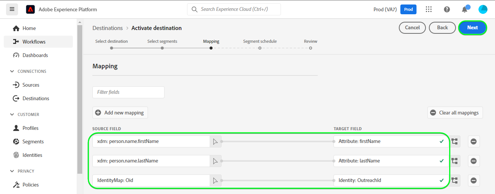

### Schedule segment export and example {#schedule-segment-export-example}

* When performing the [Schedule segment export](../../ui/activate-segment-streaming-destinations.md) step you must manually map Platform segments to the custom field attribute in [!DNL Outreach].

* To do this, select each segment, then enter the corresponding numeric value which corresponds to the *Custom Field `N` Label* field from [!DNL Outreach] in the **[!UICONTROL Mapping ID]** field.
    
    >[!IMPORTANT]
    >
    > * The numeric value *(`N`)* used within the [!UICONTROL Mapping ID] should match the custom attribute key suffixed with the numeric value within [!DNL Outreach]. Example: *Custom Field `N` Label*.
    > * You only need to specify the numeric value, not the whole custom field label.
    > * [!DNL Outreach] supports a maximum of 150 custom label fields.
    > * Refer to [[!DNL Outreach] prospect documentation](https://api.outreach.io/api/v2/docs#prospect) for details.

    * For example:
    
        |[!DNL Outreach] Field|Platform Mapping ID|
        |---|---|
        | Custom Field `4` Label | `4` |

        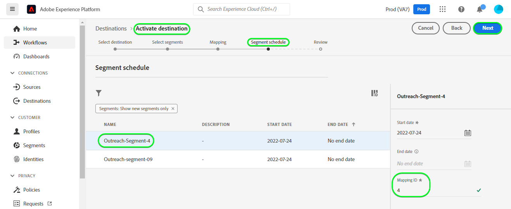

## Validate data export {#exported-data}

To validate that you have correctly set up the destination, follow the steps below:

1. Select **[!UICONTROL Destinations]** > **[!UICONTROL Browse]** to navigate to the list of destinations.
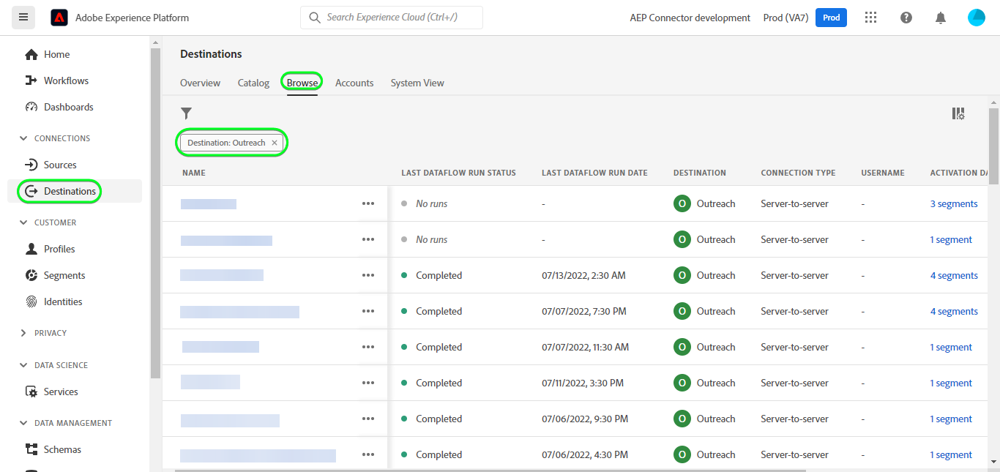

1. Select the destination and validate that the status is **[!UICONTROL enabled]**.
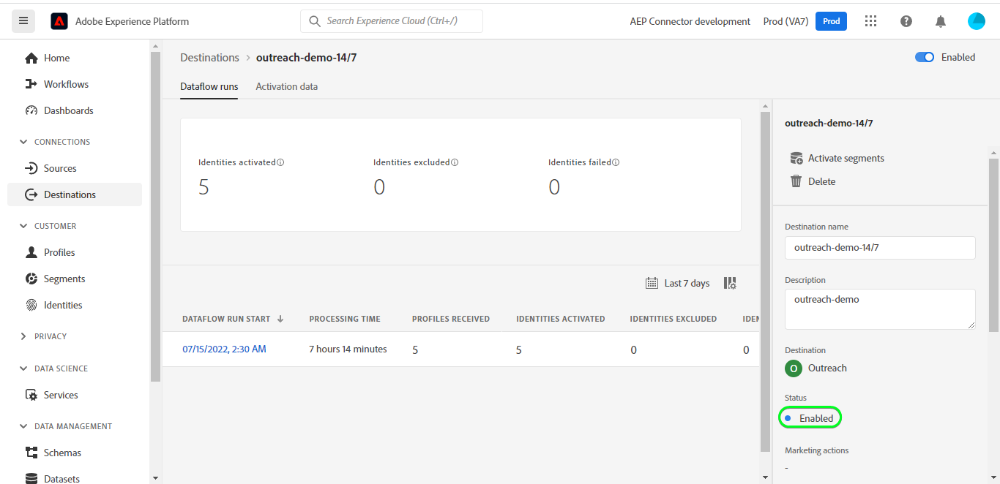

1. Switch to the **[!DNL Activation data]** tab, then select a segment name.
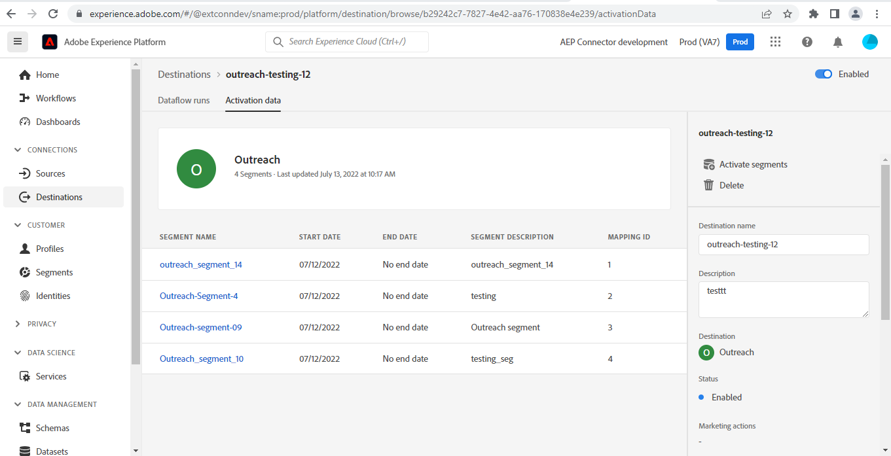

1. Monitor the segment summary and ensure that the count of profiles corresponds to the count created within the segment.
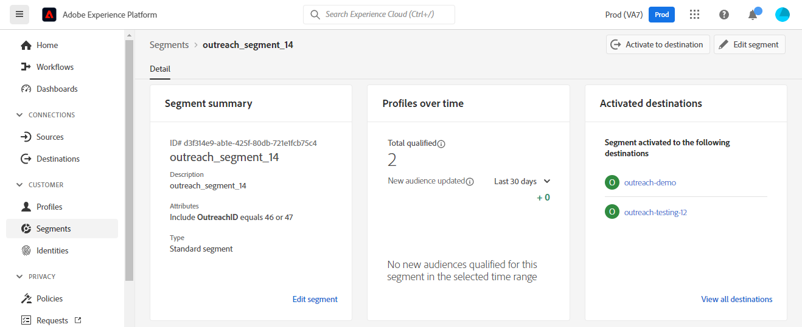

1. Log in to the [!DNL Outreach] website, then navigate to the [!DNL Apps] > [!DNL Contacts] page and check if the profiles from the segment have been added. You can see that each segment status in [!DNL Outreach] was updated with the corresponding segment status from Platform, based on the [!UICONTROL Mapping ID] value provided during the [segment scheduling](#schedule-segment-export-example) step.

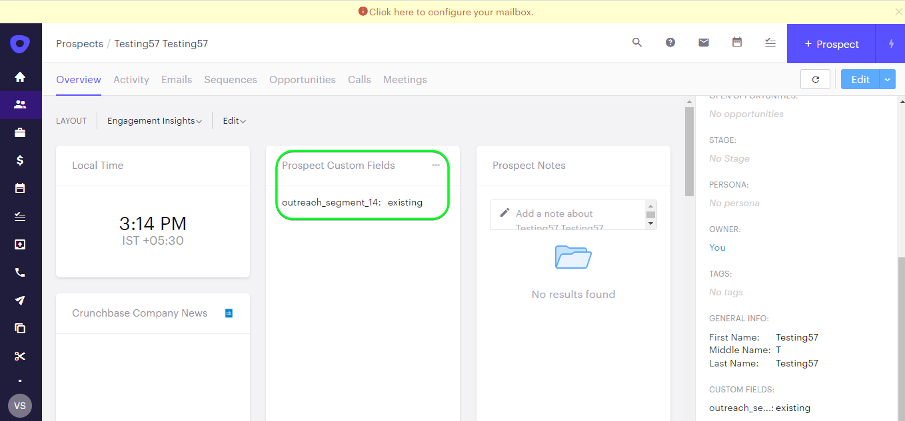

## Data usage and governance {#data-usage-governance}

All [!DNL Adobe Experience Platform] destinations are compliant with data usage policies when handling your data. For detailed information on how [!DNL Adobe Experience Platform] enforces data governance, see the [Data Governance overview](/help/data-governance/home.md).

## Errors and troubleshooting {#errors-and-troubleshooting}

When checking a dataflow run, you might see the following error message: `Bad request reported while pushing events to the destination. Please contact the administrator and try again.`

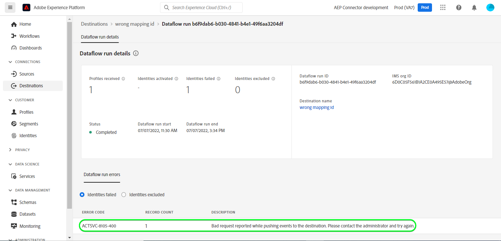

To fix this error, verify that the [!UICONTROL Mapping ID] you provided in Platform for your [!DNL Outreach] segment is valid and exists in [!DNL Outreach].

## Additional resources {#additional-resources}

The [[!DNL Outreach] documentation](https://api.outreach.io/api/v2/docs/) has details on [Error Responses](https://api.outreach.io/api/v2/docs#error-responses) which you can use to debug any issues.
