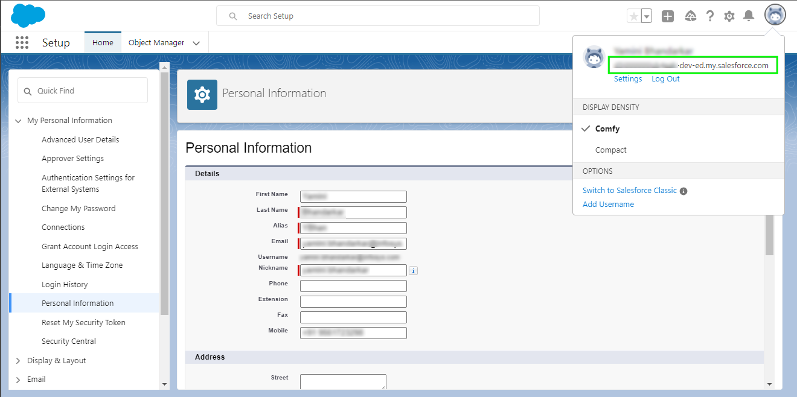
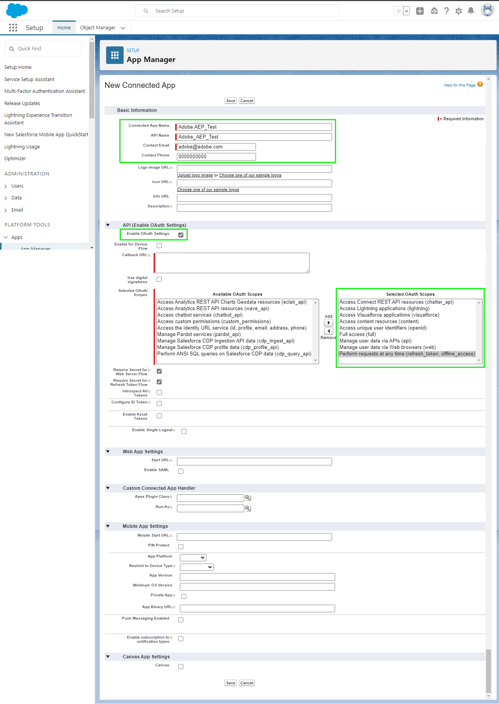
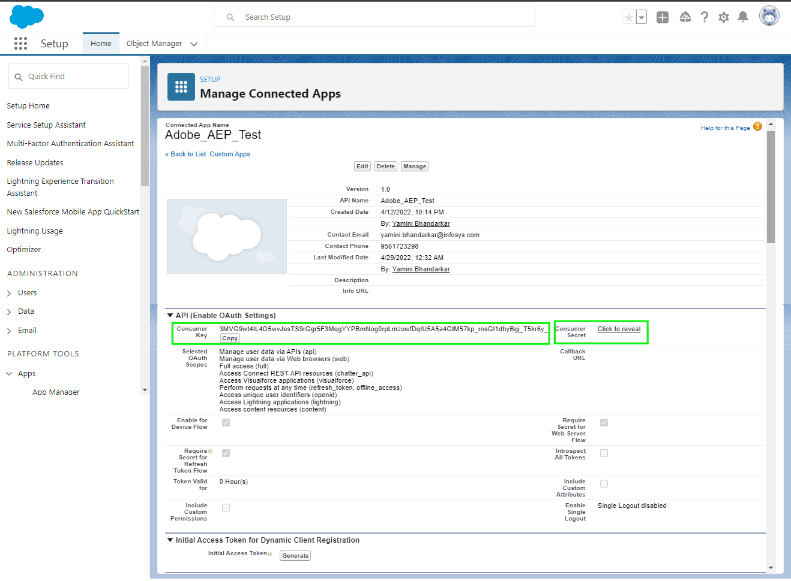

# [!DNL Salesforce CRM] connection

## Overview {#overview}

[Salesforce CRM](https://www.salesforce.com/) is a popular Customer Relationship Management (CRM) platform.

This [!DNL Adobe Experience Platform] [destination](/help/destinations/home.md) leverages the [Salesforce REST API](https://developer.salesforce.com/docs/atlas.en-us.api_rest.meta/api_rest/dome_composite_upsert_example.htm?q=contacts), which allows you to add Accounts and create Contacts after activating them within a new Salesforce segment for your business needs.

Salesforce CRM uses [OAuth 2 with Password Grant](https://experienceleague.adobe.com/docs/experience-platform/destinations/destination-sdk/functionality/authentication/oauth2-authentication.html?lang=en) as an authentication mechanism to communicate with the Salesforce REST API.

## Use cases {#use-cases}

To help you better understand how and when you should use the Salesforce CRM destination, here are sample use cases that Adobe Experience Platform customers can solve by using this destination.

### Use case #1

Add customer contacts within an account to track their engagement journey.

### Use case #2

Send a list email broadcast to customer contacts within an account.

## Prerequisites {#prerequisites}

The following items are required before you start configuring the destination.

1. You need to have a Salesforce account.
    * Go to the Salesforce [trial](https://www.salesforce.com/in/form/signup/freetrial-sales/) page to register and create a Salesforce account, if you do not have one already.
1. After logging in to the Salesforce portal, you will need to create a connected app within Salesforce.
    * This allows [!DNL Experience Platform] to communicate with Salesforce CRM. 
    * Navigate to the **[!DNL PLATFORM TOOLS]** > **[!DNL Apps]** > **[!DNL App Manager]** page. 
    * Then select **[New Connected App]** button *(on the top right)*. 
    * Fill the required details and finally select the **[!UICONTROL Save]** button.
    * Refer to the [Salesforce documentation](https://help.salesforce.com/s/articleView?id=sf.connected_app_create.htm&language=en_US&r=https%3A%2F%2Fhelp.salesforce.com%2F&type=5) if you need additional guidance.
1. After selecting **[!UICONTROL Save]**, the **[!UICONTROL Consumer Key]** and **[!UICONTROL Consumer Secret]** will be generated.

>[!IMPORTANT]
>
> * Ensure you select **[!UICONTROL Enable OAuth Settings]**.
> * Select these scopes: chatter_api, lightning, visualforce, content, openid, full, api, web, refresh_token, offline_access.

Before activating data to the Salesforce CRM destination, you must have a [schema](https://experienceleague.adobe.com/docs/experience-platform/xdm/schema/composition.html), a [dataset](https://experienceleague.adobe.com/docs/platform-learn/tutorials/data-ingestion/create-datasets-and-ingest-data.html?lang=en), and [segments](https://experienceleague.adobe.com/docs/platform-learn/tutorials/segments/create-segments.html?lang=en) created in [!DNL Experience Platform].

## Supported identities {#supported-identities}

Salesforce CRM supports the activation of identities described in the table below. Learn more about [identities](/help/identity-service/namespaces.md).

|Target Identity|Description|Considerations|
|---|---|---|
|email |Email address|Note both plain text and SHA256 hashed email addresses are supported by [!DNL Adobe Experience Platform]. If the Experience platform source field contains unhashed attributes, check the **[!UICONTROL Apply transformation]** option, to have [!DNL Platform] automatically hash the data on activation.   Note that **Salesforce CRM** does not support hashed email addresses, hence only plain text data without transformation is sent to the destination.|

## Export type and frequency {#export-type-frequency}

Refer to the table below for information about the destination export type and frequency.

| Item | Type | Notes |
---------|----------|---------|
| Export type | **[!UICONTROL Profile-based]** | You are exporting all members of a segment, together with the desired schema fields (for example: email address, phone number, last name), as chosen in the select profile attributes screen of the [destination activation workflow](/help/destinations/ui/activate-batch-profile-destinations.md#select-attributes).|
| Export frequency | **[!UICONTROL Streaming]** | Streaming destinations are "always on" API-based connections. As soon as a profile is updated in Experience Platform based on segment evaluation, the connector sends the update downstream to the destination platform. Read more about [streaming destinations](/help/destinations/destination-types.md#streaming-destinations).|

{style="table-layout:auto"}

## Connect to the destination {#connect}

>[!IMPORTANT]
> 
>To connect to the destination, you need the **[!UICONTROL Manage Destinations]** [access control permission](/help/access-control/home.md#permissions). Read the [access control overview](/help/access-control/ui/overview.md) or contact your product administrator to obtain the required permissions.

To connect to this destination, follow the steps described in the [destination configuration tutorial](https://experienceleague.adobe.com/docs/experience-platform/destinations/ui/connect-destination.html). In the configure destination workflow, fill in the fields listed in the two sections below.

* Within the [!DNL Experience Platform], navigate to **Destinations**. 
* Select the **Catalog** tab and search for *Salesforce CRM*, or select *CRM* within **Categories**. 
* Then select **[!UICONTROL Set up]**. After you have established a connection to the destination, the UI label changes to **[!UICONTROL Activate Segments]**.

### Authenticate to destination {#authenticate}

To authenticate to the destination, fill in the required fields and select **[!UICONTROL Connect to destination]**.

1. Next, you are shown a wizard which assists you in configuring the Salesforce CRM destination. Create the new destination by selecting **[!UICONTROL Configure new destination]** and fill in the details below and select **[!UICONTROL Connect to destination]**.

*  **[!UICONTROL Password]**: Your Salesforce account password.
*  **[!UICONTROL Client ID]**: Consumer Key generated during the [prerequisites](#prerequisites) step.
*  **[!UICONTROL Client Secret]**: Consumer Secret generated during the [prerequisites](#prerequisites) step.
*  **[!UICONTROL Username]**: Your Salesforce account username.

1. If the details provided are valid, the UI displays a **Connected** status with a green check mark, you can then proceed to the next step.

### Fill in destination details {#destination-details}

To configure details for the destination, fill in the required fields and select **[!UICONTROL Next]**.

*  **[!UICONTROL Name]**: A name by which you will recognize this destination in the future.
*  **[!UICONTROL Description]**: A description that will help you identify this destination in the future.
*  **[!UICONTROL Custom Domain]**: Your Salesforce domain as shown within [prerequisites](#prerequisites).

## Activate segments to this destination {#activate}

>[!IMPORTANT]
> 
>To activate data, you need the **[!UICONTROL Manage Destinations]**, **[!UICONTROL Activate Destinations]**, **[!UICONTROL View Profiles]**, and **[!UICONTROL View Segments]** [access control permissions](/help/access-control/home.md#permissions). Read the [access control overview](/help/access-control/ui/overview.md) or contact your product administrator to obtain the required permissions.

Read [Activate profiles and segments to streaming segment export destinations](../../ui/activate/activate-segment-streaming-destinations.md) for instructions on activating audience segments to this destination.

The list of attribute mappings that can be set up for the [Salesforce REST API](https://developer.salesforce.com/docs/atlas.en-us.api_rest.meta/api_rest/dome_composite_upsert_example.htm?q=contacts) is given below.

| Source Field | Target Field |
|---|---|
| xdm: workAddress.state | Identity: MailingState |
| xdm: workAddress.country | Identity: MailingCountry |
| xdm: mobilePhone.number | Identity: MobilePhone |
| xdm: person.name.firstName | Identity: FirstName |
| xdm: workAddress.postalCode | Identity: MailingPostalCode |
| xdm: workAddress.city | Identity: MailingCity |
| xdm: person.name.lastName | Identity: LastName |
| IdentityMap: Email | Identity: salesforceEmailID |

## Exported data / Validate data export {#exported-data}

To validate that you have correctly set up the destination, follow the steps below:

1. Select **[!UICONTROL Destinations]** > **[!UICONTROL Browse]** to navigate to the list of destinations.

1. Select the destination and validate that the status is **[!UICONTROL enabled]**.

1. Switch to the **[!DNL Activation data]** tab, then select a segment name.

1. Monitor the segment summary and ensure that the count of profiles corresponds to the count created within the segment.

1. Login to the Salesforce website then navigate to the **[!DNL Apps]** > **[!DNL Contacts]** page and check if the profiles from the segment have been added.

## Data usage and governance {#data-usage-governance}

All [!DNL Adobe Experience Platform] destinations are compliant with data usage policies when handling your data. For detailed information on how [!DNL Adobe Experience Platform] enforces data governance, see the [Data Governance overview](/help/data-governance/home.md).

## Additional resources {#additional-resources}

Additional useful information from the [Salesforce developer portal](https://developer.salesforce.com/) is below:
* [Create a Record](https://developer.salesforce.com/docs/atlas.en-us.api_rest.meta/api_rest/dome_sobject_create.htm)
* [Custom Recommendation Audiences](https://developer.salesforce.com/docs/atlas.en-us.236.0.chatterapi.meta/chatterapi/connect_resources_recommendation_audiences_list.htm)
* [Using Composite Resources](https://developer.salesforce.com/docs/atlas.en-us.api_rest.meta/api_rest/using_composite_resources.htm?q=composite)
* [Quick Start](https://developer.salesforce.com/docs/atlas.en-us.api_rest.meta/api_rest/quickstart.htm)