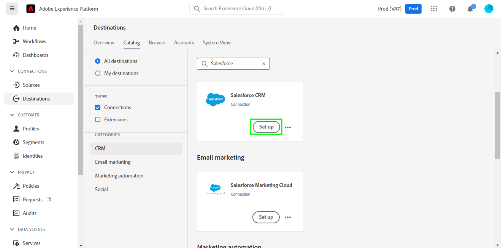
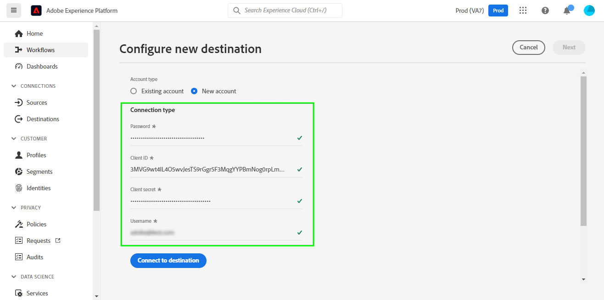
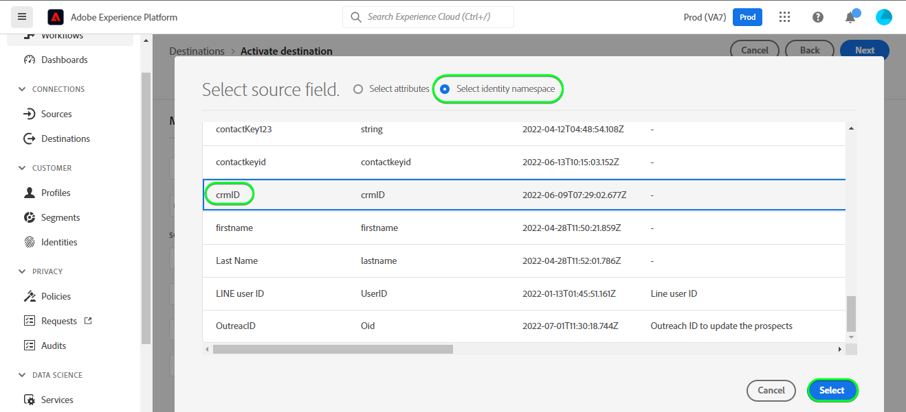
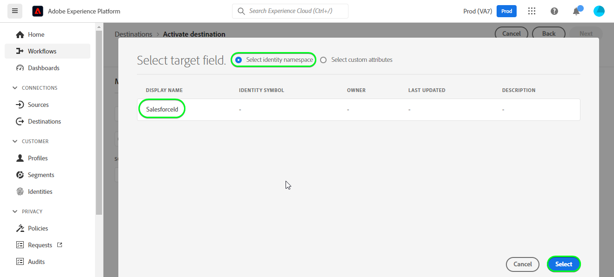
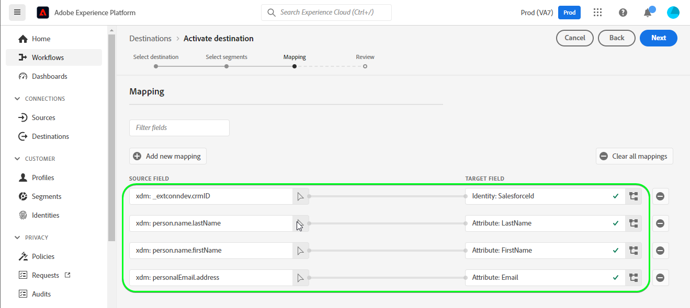

# [!DNL Salesforce CRM] connection

## Overview {#overview}

[Salesforce CRM](https://www.salesforce.com/) is a popular Customer Relationship Management (CRM) platform.

This [!DNL Adobe Experience Platform] [destination](/help/destinations/home.md) leverages the [Salesforce REST API](https://developer.salesforce.com/docs/atlas.en-us.api_rest.meta/api_rest/dome_composite_upsert_example.htm?q=contacts), which allows you to update identities within a segment into Salesforce CRM.

## Destination specifics {#specifics}

Note the following details that are specific to the [!DNL Salesforce CRM] destination:

* [!DNL Adobe Experience Platform] segment status is exported to [!DNL Salesforce CRM] using a custom field attribute. You need to create this custom field attribute in [!DNL Salesforce] first, before you export data from Experience Platform. Instructions are further below, in the [Prerequisites](#prerequisites) section.

* Salesforce CRM uses OAuth 2 with Password Grant as an authentication mechanism to communicate with the Salesforce REST API. Instructions to authenticate to your Salesforce CRM instance are further below, in the [Authenticate to destination](#authenticate) section.

## Use cases {#use-cases}

As a marketer, you can deliver personalized experiences to your users, based on attributes from their Adobe Experience Platform profiles. You can build segments from your offline data and send these segments to Salesforce CRM, to display in my users’ feeds as soon as segments and profiles are updated in Adobe Experience Platform.

## Prerequisites {#prerequisites}

Before activating data to the Salesforce CRM destination, you must have a [schema](https://experienceleague.adobe.com/docs/experience-platform/xdm/schema/composition.html), a [dataset](https://experienceleague.adobe.com/docs/platform-learn/tutorials/data-ingestion/create-datasets-and-ingest-data.html?lang=en), and [segments](https://experienceleague.adobe.com/docs/platform-learn/tutorials/segments/create-segments.html?lang=en) created in [!DNL Experience Platform].

Note the following prerequisites in Salesforce, in order to export data from Platform to your Salesforce account:

1. You need to have a Salesforce account.
    * Go to the Salesforce [trial](https://www.salesforce.com/in/form/signup/freetrial-sales/) page to register and create a Salesforce account, if you do not have one already.
1. Next, you need to configure a [connected app](https://help.salesforce.com/s/articleView?id=sf.connected_app_create.htm&language=en_US&r=https%3A%2F%2Fhelp.salesforce.com%2F&type=5) within your Salesforce account, if you do not have one already. 
    * Within the connected app ensure that [OAuth Settings](https://help.salesforce.com/s/articleView?id=connected_app_create_api_integration.htm&type=5&language=en_US) is enabled.
    * Also ensure that the [scopes](https://help.salesforce.com/s/articleView?id=connected_app_create_api_integration.htm&type=5&language=en_US) mentioned below are selected.
        * ``chatter_api``
        * ``lightning``
        * ``visualforce``
        * ``content``
        * ``openid``
        * ``full``
        * ``api``
        * ``web``
        * ``refresh_token``
        * ``offline_access``
1. Create the custom field of type `Text Area Long` which Experience Platform will use to update the segment status within Salesforce CRM. 
    * Refer to the Salesforce documentation to [create custom fields](https://help.salesforce.com/s/articleView?id=sf.adding_fields.htm&type=5) if you need additional guidance. 
        > [!IMPORTANT]
        >
        > Ensure there are no whitespace characters in the name, instead use the underscore i.e. the `_` character as a separator.

        > [!NOTE]
        >
        > * Objects in Salesforce are restricted to 25 External fields, see [Custom Field Attributes](https://help.salesforce.com/s/articleView?id=sf.custom_field_attributes.htm&type=5).
        > * This restriction implies you will only be able to have at a maximum 25 Experience Platform segment memberships active at any time. 
        > * If you have reached the custom field attribute limit you will have to remove the custom field attribute from Salesforce which you used to store the segment status against older segments within Experience Platform.

    * Refer to Adobe's documentation for [Segment Membership Details schema field group](https://experienceleague.adobe.com/docs/experience-platform/xdm/field-groups/profile/segmentation.html?lang=en) if you need guidance on segment statuses.

1. Note down the items below before you authenticate to the Salesforce CRM destination.
    * Note down your [Salesforce domain prefix](https://help.salesforce.com/s/articleView?id=sf.domain_name_setting_login_policy.htm&type=5). For example if your domain is *`d5i000000isb4eak-dev-ed`.my.salesforce.com*, you need the highlighted value.
    * Copy the *Consumer Key* and *Consumer Secret* from the connected app.
        * Refer to the [Salesforce documentation](https://help.salesforce.com/s/articleView?id=sf.connected_app_rotate_consumer_details.htm&type=5) if you need additional guidance.

## Supported identities {#supported-identities}

Salesforce CRM supports update of identities described in the table below. Learn more about [identities](/help/identity-service/namespaces.md).

|Target Identity|Description|Considerations|
|---|---|---|
| SalesforceId |Custom Salesforce CRM identifier that supports mapping of any identity.|Mandatory, You can send any [identity](../../../identity-service/namespaces.md) to the [!DNL Salesforce CRM] destination, as long as you map it to the `SalesforceId`. |

## Export type and frequency {#export-type-frequency}

Refer to the table below for information about the destination export type and frequency.

| Item | Type | Notes |
---------|----------|---------|
| Export type | **[!UICONTROL Profile-based]** | <ul><li>You are exporting all members of a segment, together with the desired schema fields *(for example: email address, phone number, last name)*, according to your field mapping.</li><li> Platform segment statuses are exported to [!DNL Salesforce CRM] by specifying their corresponding custom field attribute in [!DNL Salesforce CRM] in the **[!UICONTROL Activate Destination]** > **[!UICONTROL Schedule segment export]** > **[!UICONTROL Mapping ID]** field.</li></ul> |
| Export frequency | **[!UICONTROL Streaming]** | <ul><li>Streaming destinations are "always on" API-based connections. As soon as a profile is updated in Experience Platform based on segment evaluation, the connector sends the update downstream to the destination platform. Read more about [streaming destinations](/help/destinations/destination-types.md#streaming-destinations).</li></ul>|

{style="table-layout:auto"}

## Connect to the destination {#connect}

>[!IMPORTANT]
> 
>To connect to the destination, you need the **[!UICONTROL Manage Destinations]** [access control permission](/help/access-control/home.md#permissions). Read the [access control overview](/help/access-control/ui/overview.md) or contact your product administrator to obtain the required permissions.

To connect to this destination, follow the steps described in the [destination configuration tutorial](https://experienceleague.adobe.com/docs/experience-platform/destinations/ui/connect-destination.html). In the configure destination workflow, fill in the fields listed in the two sections below.

### Authenticate to destination {#authenticate}

To authenticate to the destination, fill in the required fields and select **[!UICONTROL Connect to destination]**.

*  **[!UICONTROL Password]**: Your Salesforce account password.
*  **[!UICONTROL Client ID]**: Your Salesforce connected app Consumer Key.
*  **[!UICONTROL Client Secret]**: Your Salesforce connected app Consumer Secret.
*  **[!UICONTROL Username]**: Your Salesforce account username.

If the details provided are valid, the UI displays a **Connected** status with a green check mark, you can then proceed to the next step.

### Fill in destination details {#destination-details}

To configure details for the destination, fill in the required fields and select **[!UICONTROL Next]**.

*  **[!UICONTROL Name]**: A name by which you will recognize this destination in the future.
*  **[!UICONTROL Description]**: A description that will help you identify this destination in the future.
*  **[!UICONTROL Custom Domain]**: Your Salesforce domain.

## Activate segments to this destination {#activate}

>[!IMPORTANT]
> 
>To activate data, you need the **[!UICONTROL Manage Destinations]**, **[!UICONTROL Activate Destinations]**, **[!UICONTROL View Profiles]**, and **[!UICONTROL View Segments]** [access control permissions](/help/access-control/home.md#permissions). Read the [access control overview](/help/access-control/ui/overview.md) or contact your product administrator to obtain the required permissions.

Read [Activate profiles and segments to streaming segment export destinations](../../ui/activate/activate-segment-streaming-destinations.md) for instructions on activating audience segments to this destination.

### Mapping considerations and example {#mapping-considerations-example}

To correctly send your audience data from Adobe Experience Platform to the Salesforce CRM destination, you need to go through the field mapping step. Mapping consists of creating a link between your Experience Data Model (XDM) schema fields in your Platform account and their corresponding equivalents from the target destination. To correctly map your XDM fields to the Salesforce CRM destination fields, follow these steps:

1. In the Mapping step, click **[!UICONTROL Add new mapping]**, you will see a new mapping row on the screen.

1. In the select source field window, when selecting the source field choose the **[!UICONTROL Select attributes]** category and add the mappings desired.

1. In the select target field window, select the target field and choose the **[!UICONTROL Select identity namespace]** category and add the mappings desired.

1. For custom attributes, in the select target field window, select the target field and choose the **[!UICONTROL Select custom attributes]** category, Next provide the desired target attribute name and add the mappings desired.

1. For instance, you could add the following mapping between your XDM profile schema and your [!DNL Salesforce CRM] instance:

    ||XDM Profile Schema|[!DNL Salesforce CRM] Instance| Mandatory|
    |---|---|---|---|
    |Attributes|<ul><li><code>person.name.firstName</code></li><li><code>person.name.lastName</code></li><li><code>personalEmail.address</code></li></ul>|<ul><li><code>FirstName</code></li><li><code>LastName</code></li><li><code>Email</code></li></ul>|
    |Identities|<ul><li><code>crmID</code></li></ul>|<ul><li><code>SalesforceId</code></li></ul>|Yes|

1. An example using these mappings is shown below:

### Schedule segment export and example {#schedule-segment-export-example}

* When performing the [Schedule segment export](../../ui/activate/activate-segment-streaming-destinations.html?lang=en#scheduling) step you will need to manually map Platform segments to the custom field attribute in Salesforce.
* To do this, select each segment, then enter the corresponding custom field attribute from Salesforce in the **[!UICONTROL Mapping ID]** field.

    > [!IMPORTANT]
    >
    > * The value used for the Mapping ID should exactly match the name of the custom field attribute created within Salesforce.
    > * Ensure that the name of the custom field attribute you have created in Salesforce doesn't use the whitespace character.

* An example is shown below:

## Validate data export {#exported-data}

To validate that you have correctly set up the destination, follow the steps below:

1. Select **[!UICONTROL Destinations]** > **[!UICONTROL Browse]** to navigate to the list of destinations.

1. Select the destination and validate that the status is **[!UICONTROL enabled]**.

1. Switch to the **[!DNL Activation data]** tab, then select a segment name.

1. Monitor the segment summary and ensure that the count of profiles corresponds to the count created within the segment.

1. Login to the Salesforce website, then navigate to the **[!DNL Apps]** > **[!DNL Contacts]** page and check if the profiles from the segment have been added.

1. Click a contact and check if the fields are updated. You will notice the segment status from Experience Platform has been updated against the corresponding custom field attribute that was provided in the **Mapping ID** field during the **[!UICONTROL Activate destination]** > **[!UICONTROL Schedule segment export]** step.

## Data usage and governance {#data-usage-governance}

All [!DNL Adobe Experience Platform] destinations are compliant with data usage policies when handling your data. For detailed information on how [!DNL Adobe Experience Platform] enforces data governance, see the [Data Governance overview](/help/data-governance/home.md).

## Additional resources {#additional-resources}

Additional useful information from the [Salesforce developer portal](https://developer.salesforce.com/) is below:
* [Create a Record](https://developer.salesforce.com/docs/atlas.en-us.api_rest.meta/api_rest/dome_sobject_create.htm)
* [Custom Recommendation Audiences](https://developer.salesforce.com/docs/atlas.en-us.236.0.chatterapi.meta/chatterapi/connect_resources_recommendation_audiences_list.htm)
* [Using Composite Resources](https://developer.salesforce.com/docs/atlas.en-us.api_rest.meta/api_rest/using_composite_resources.htm?q=composite)
* [Quick Start](https://developer.salesforce.com/docs/atlas.en-us.api_rest.meta/api_rest/quickstart.htm)

When checking a dataflow run, if you obtain the below error message; Check that the Mapping ID you provided against your Platform segment is valid and exists within [!DNL Salesforce CRM].
